# DeerMind Concept Design v0.7

> **中文名称**：呦鹿智伴 / DeerMind 概念产品设计  
> **版本**：v0.7.0  
> **版本主题**：Unified Learner–Evidence–Decision Framework  
> **文档性质**：概念产品设计  
> **状态**：阶段性框架冻结  
> **更新时间**：2026-09-15

---

## 文档定位

本文件回答的是：

> **DeerMind 是什么、为什么存在，以及它依据什么基本理论理解学习者并做出学习决策。**

本文件负责定义：

- 产品存在理由与长期目标；
- 产品价值与机制边界；
- Learner Model 的顶层结构；
- DeerMind 如何形成对学习者的认识；
- DeerMind 如何据此决定是否行动以及如何行动；
- AI 支架如何逐步转化为学习者自身能力；
- DeerMind 与学生、家长、教师和学校的关系；
- 如何评价这套理论是否成立。

本文件不展开已经形成独立理论体系的专题。

当前已独立：

> **《DeerMind Knowledge Model v0.1》**

Knowledge 的详细定义、Domain Semantic Ontology、Learning Knowledge Model、Learning Dynamics Model、Curriculum Projection、Knowledge Construct 粒度原则及可行性验证，以该文档为单一事实来源（Single Source of Truth）。

本文件采用七个一级理论模块：

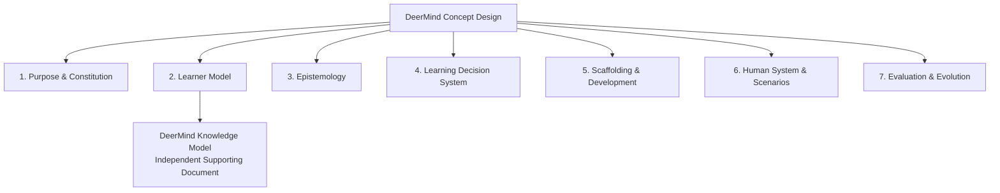

新增概念默认必须归属于现有七个模块。只有当一个问题域形成独立理论结构、无法自然归位时，才考虑调整顶层框架或形成新的 Supporting Theory Document。

---

## 1. Purpose & Constitution

### 1.1 AI 时代的教育问题

AI 正在快速降低：

- 信息获取成本；
- 答案生成成本；
- 解释成本；
- 标准认知任务的完成成本；
- 个性化辅导的边际成本。

因此，未来教育面对的核心问题不再只是：

> 孩子能不能得到答案？

而越来越是：

> **孩子虽然获得了答案，但本应由自己完成的认知过程是否真正发生？**

DeerMind 当前坚持：

> **Answer ≠ Understanding**

> **Understanding ≠ Capability**

> **Immediate Success ≠ Stable Learning**

AI 越强，教育产品越不能把“AI 完成得更好”误认为“孩子学得更好”。

---

### 1.2 DeerMind 的终极目标

DeerMind 的目标不是：

- 让孩子更快得到答案；
- 做更多题；
- 学习更长时间；
- 获得更高产品活跃度；
- 用 AI 替代教师或学校。

其长期目标是帮助孩子逐渐成为：

> **拥有自己的知识体系，能够理解和解决问题，能够判断自己的认知状态，并能够持续学习的独立学习者。**

当前核心成长维度包括：

- **Knowledge**：形成可调用的知识结构；
- **Capability**：能够在真实任务中组织和使用知识；
- **Metacognition**：能够观察并调节自己的认知过程；
- **Transfer**：能够跨表面情境使用已有认知结构；
- **Learning Agency**：逐渐承担自己的学习判断与决策。

---

### 1.3 产品定位

DeerMind 定位为：

> **Personal AI Learning Expert**

它不是：

- 搜题工具；
- AI 答案生成器；
- 自动刷题系统；
- 第二套学校课程；
- 家长遥控孩子学习的控制系统；
- 教师替代品；
- 以陪伴时长为目标的 AI 角色产品。

它位于：

> **正式教育系统与学习者个人认知过程之间。**

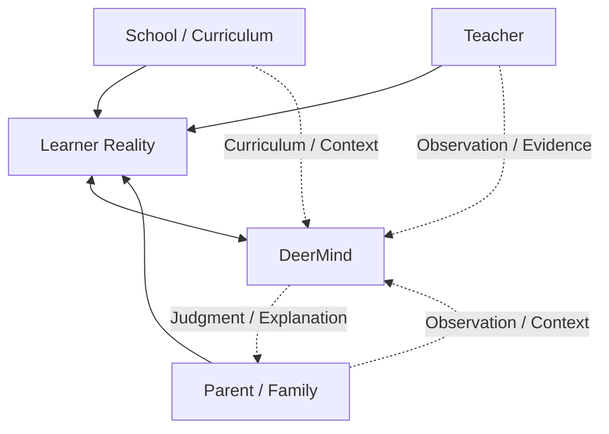

学校主要决定正式课程、教学要求和评价边界。

教师承担系统教学、人类观察和真实教育关系。

家庭承担支持、环境、监护和现实约束。

DeerMind 重点帮助孩子回答：

- 我现在究竟是什么状态？
- 我为什么卡住？
- 我真正缺的是什么？
- 下一步最值得做什么？
- 我是否真的学会？
- 什么时候已经够了？
- 我是否越来越能够自己完成这些判断？

---

### 1.4 Product Constitution

#### 1.4.1 Cognitive Ownership

> **认知过程的所有权属于孩子。**

AI 可以提供：

- 支架；
- 提示；
- 解释；
- 反馈；
- 判断建议。

但不能因为 AI 能完成任务，就替代孩子本应完成的认知活动。

---

#### 1.4.2 Evidence, not Command

学生、家长、教师和学校可以提供：

- Intent；
- Context；
- Observation；
- Evidence。

但这些输入不直接修改 DeerMind 的内部学习判断。

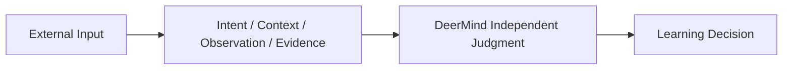

---

#### 1.4.3 Epistemic Authority ≠ External Authority

DeerMind 可以对：

- 学习状态；
- 当前学习价值；
- 是否需要额外练习；
- 哪种支持更合适；

形成独立专业判断。

但学校和家庭仍然拥有合理的现实治理权。

例如：

> DeerMind 可以判断“继续做五道同类题的额外学习价值已经很低”，但无权因此宣布学校正式作业失效。

---

#### 1.4.4 Attention Belongs to the Learner

DeerMind 不天然拥有孩子的：

- 每日固定时间；
- 持续注意力；
- 主动打扰权。

所有主动行为必须能够回答：

> **为什么现在值得占用孩子的注意力？**

---

#### 1.4.5 Meaningful Use

DeerMind 不追求：

> 使用越多越成功。

也不追求：

> 使用越少越成功。

它追求：

> **高价值使用。**

---

#### 1.4.6 Reduce Meaningless Cost, Preserve Productive Effort

减负不等于消灭困难。

DeerMind 应减少：

- 机械重复；
- 错误方向上的持续努力；
- 已掌握内容的重复证明；
- 不必要的验证；
- AI 替代孩子思考。

但保留：

> **对理解、能力形成和迁移真正有价值的认知努力。**

---

#### 1.4.7 Unknown Is Valid

当证据不足时：

> **UNKNOWN 优于伪精确。**

DeerMind 不应为了表现“智能”，强行形成确定结论。

---

#### 1.4.8 Disconfirmation

形成 Hypothesis 以后，DeerMind 不只寻找支持它的证据，还必须考虑：

> **什么 Evidence 能够推翻当前判断？**

专业性不仅表现为：

> 能形成判断。

也表现为：

> 能修正自己的判断。

---

#### 1.4.9 Child Data & Dignity

长期理解儿童不能成为无限收集数据和永久贴标签的理由。

DeerMind 应遵守：

- Data Minimization；
- Purpose Limitation；
- Correction；
- Revocation of Inference；
- Retention Discipline；
- No Permanent Negative Labeling。

系统维护的是：

> Evidence、Hypothesis、Belief 和 Uncertainty。

而不是：

> 对儿童人格的永久定义。

---

## 2. Learner Model

### 2.1 Learner Reality

DeerMind 真正希望理解的是：

> **学习者本身。**

当前将长期 Learner Reality 暂时抽象为三个核心 Construct：

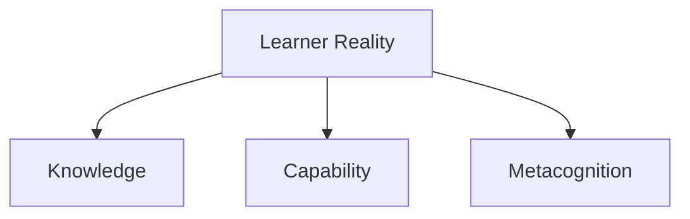

它们分别回答：

- **Knowledge**：学习者拥有什么认知资源？
- **Capability**：学习者能否在一类真实任务中组织和使用这些资源？
- **Metacognition**：学习者能否观察并调节自己的认知过程？

三个 Construct 的边界仍需继续深化，但它们目前构成 DeerMind Learner Ontology 的主干。

---

### 2.2 Knowledge

Knowledge 当前工作定义为：

> **学习者内部形成的、关于某一领域事实、概念、关系、规则、过程、条件与表征的认知结构，并能够参与理解、推理、判断和行动。**

Knowledge 不等于：

- 教材章节；
- Curriculum Knowledge Point；
- 被教师教过；
- AI 已经解释过；
- 一次答对；
- 正确率；
- 一个 Mastery 百分比。

DeerMind 明确区分：

> **Curriculum Model**

与：

> **Learner Knowledge Model**

不同出版社、不同教材可以通过 Curriculum Projection 映射到课程无关的 Knowledge Model。

详细定义见：

> **《DeerMind Knowledge Model v0.1》**

该文档负责：

- Domain Semantic Ontology；
- Learning Knowledge Model；
- Learning Dynamics Model；
- Curriculum Projection；
- Knowledge Construct / Facet；
- KC 粒度方法；
- Learner State Interface；
- Knowledge Architecture Feasibility。

Concept Design 不重复维护这些细节。

---

### 2.3 Capability

Capability 当前工作定义为：

> **学习者在一类有意义的任务与条件下，能够组织和调用已有知识及认知操作，较稳定地完成某类认知活动的能力倾向。**

Knowledge 与 Capability 不是同一件事。

例如：

> 知道“比例必须相对于一个 Reference Whole”

属于 Knowledge。

而：

> 在陌生应用题中正确识别 Reference Whole、建立数量关系并完成求解

开始进入 Capability。

Capability 关注的不只是：

> “知道什么”。

还包括：

- 问题表征；
- 知识调用；
- 推理；
- 策略选择；
- 规划；
- 错误恢复；
- 在变化情境中的稳定执行。

Capability 的系统定义将在后续专题研究中继续完善。

---

### 2.4 Metacognition

Metacognition 当前定义为：

> **学习者对自身认知过程进行监测，并依据这种监测调节认知行为的能力。**

包含两类核心活动。

#### Monitoring

例如：

- 我是否真的理解？
- 我的答案可靠吗？
- 我哪里不确定？
- 我是否需要帮助？

#### Control

例如：

- 是否继续？
- 是否换方法？
- 是否检查？
- 是否寻求帮助？
- 是否可以停止？

Metacognition 不是：

- 学习态度；
- 性格；
- 聪明程度；
- 表达能力；
- 简单的“会反思”。

DeerMind 无法直接读取 Metacognition，只能通过行为 Evidence 进行有限推断。

---

### 2.5 Learner State 与 Session Condition

长期 Learner Reality 与当前 Session Condition 必须分离。

例如：

- 疲劳；
- 当前情绪；
- 时间压力；
- 当前意愿；
- 刚刚是否获得提示；

属于当前 Context，而不是长期能力。

其中：

> **Cognitive Willingness**

当前更适合作为：

> 学习者在此时此刻愿意投入多少认知努力的 Session State，

而不是人格化的“学习动力”。

---

## 3. Epistemology

### 3.1 DeerMind 如何认识学习者

Learner Reality 无法被直接读取。

DeerMind 实际经过的是：

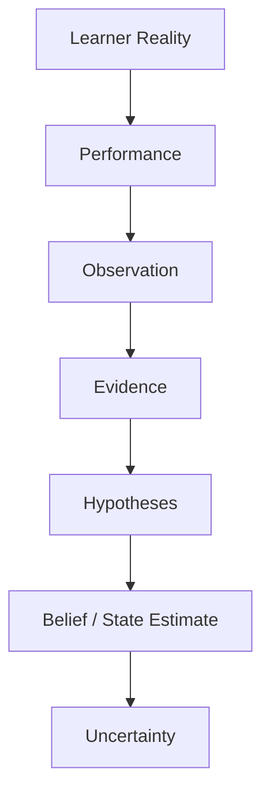

因此必须严格区分：

- Reality；
- Performance；
- Observation；
- Evidence；
- Inference；
- Belief。

---

### 3.2 Performance and Context

一次 Performance 由多个因素共同决定：

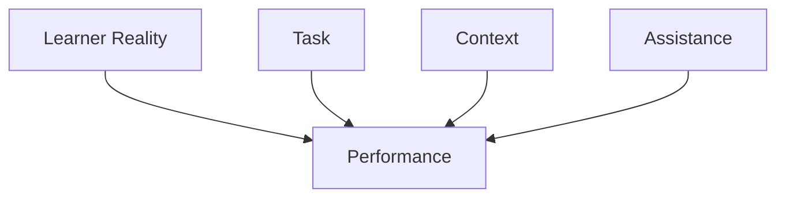

因此：

> 做错一次 ≠ 不会。

> 做对一次 ≠ 已掌握。

> Assisted Success ≠ Independent Capability。

Performance 是观察窗口，不是 Learner State 本身。

---

### 3.3 Observation and Evidence

Observation 回答：

> 实际发生了什么？

Evidence 回答：

> 这次 Observation 对某个学习判断意味着什么？

Evidence 必须带有产生条件，包括：

- Source；
- Assistance Condition；
- Task Condition；
- Delay；
- Novelty；
- Reliability；
- External Help Known / Unknown。

重要区分包括：

- Independent Performance；
- Assisted Performance；
- Prompted Performance；
- Immediate Post-learning Performance；
- Delayed Independent Performance；
- Transfer Performance。

---

### 3.4 Observability Boundary

核心原则：

> **Learner Model 的复杂度不得超过真实可观测能力。**

正确顺序是：

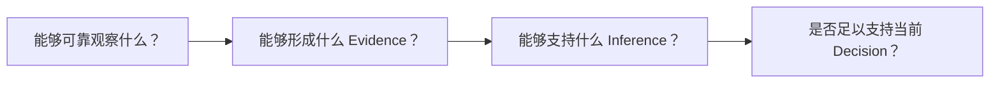

而不是：

> 先建立复杂的学习者模型，再寻找数字把它填满。

---

### 3.5 Hypotheses and Uncertainty

同一个行为可能有多个解释。

例如一道应用题错误可能来自：

- Knowledge Gap；
- Capability Gap；
- 语言理解问题；
- 问题表征错误；
- 计算错误；
- 疲劳；
- Attention Failure；
- 偶然错误。

因此 DeerMind 应允许：

> **Competing Hypotheses。**

Uncertainty 不是系统缺陷，而是对现实复杂性的正确表达。

---

### 3.6 Evidence Gap

DeerMind 不追求：

> 收集尽可能多的数据。

而是问：

> **当前这个重要 Decision 还缺哪一条真正有价值的 Evidence？**

Evidence Gap 是：

> 对当前判断仍具有决策价值的信息缺口。

---

### 3.7 Active Observation

当 Evidence 不足、同时当前 Decision 具有足够价值时，DeerMind 可以主动寻求高信息量 Observation。

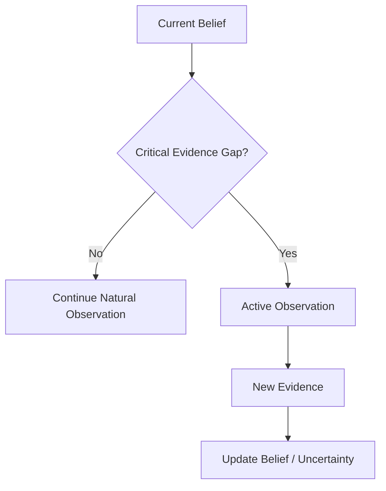

目标不是：

> 全面监控孩子。

而是：

> **以最低 Attention Cost 获取足够支持当前 Decision 的信息。**

---

## 4. Learning Decision System

### 4.1 Decision 的两个基本问题

DeerMind 认识学习者不是最终目的。

最终必须转化为：

> **Learning Decision。**

任何行动首先拆成两个问题：

1. **现在是否值得行动？**
2. **如果值得，最值得采取什么行动？**

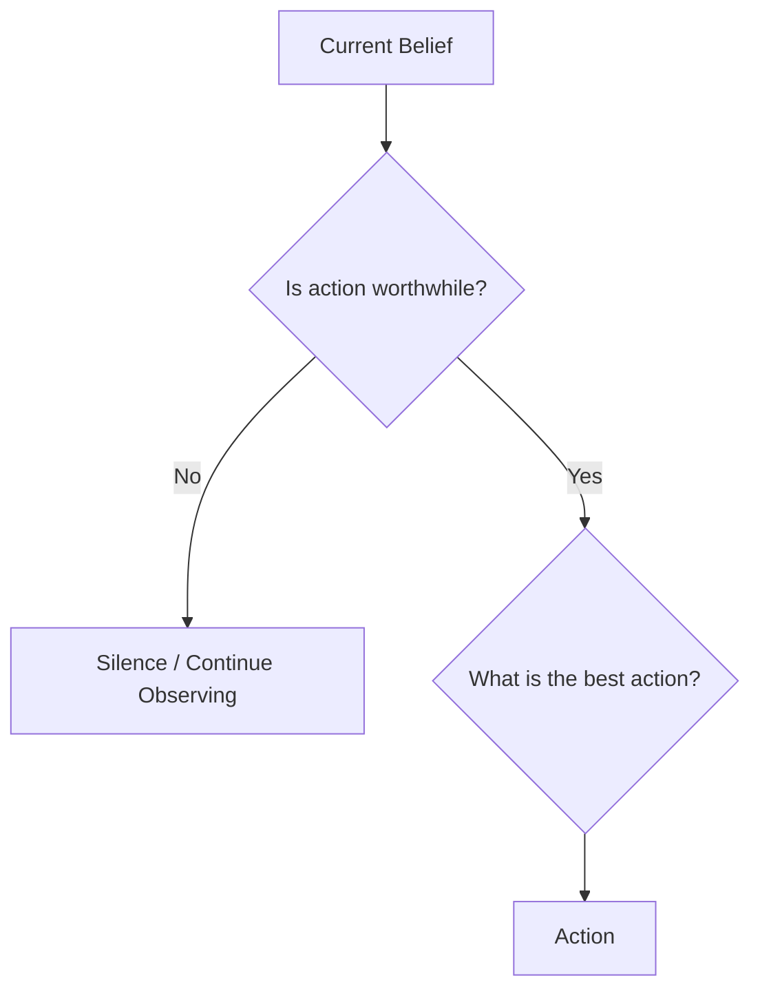

---

### 4.2 Decision Inputs

Decision 至少需要综合：

- Learner Belief；
- Uncertainty；
- Learning Goal；
- Task Context；
- Cognitive Willingness；
- Current Assistance；
- Evidence Gap；
- Attention Cost；
- External Obligations；
- Long-term Independence Goal。

---

### 4.3 Interaction Value

Interaction Value 是：

> **价值原则，而不是当前要求直接计算的数学公式。**

概念上考虑：

**收益：**

- Learning Gain；
- Information Gain；
- Capability Gain；
- Independence Gain。

**成本：**

- Time Cost；
- Attention Cost；
- Friction Cost；
- Dependency Risk；
- Interference Cost。

原则是：

> **任何复杂度和任何干预都必须证明自己的额外价值。**

---

### 4.4 Cognitive Willingness

孩子并不总处于相同学习状态。

DeerMind 应：

> **适配认知意愿，而不是操纵认知意愿。**

可能的原则：

- 高意愿：允许更深入探索；
- 中等意愿：降低进入门槛；
- 低意愿：只解决当前关键障碍；
- 明确拒绝：停止纠缠。

目标不是提高 Engagement，而是让：

> 当前认知投入与学习价值相匹配。

---

### 4.5 Proactive Policy

DeerMind 不能永远被动等待。

但主动介入不能来自：

- DAU；
- 活跃度；
- 沉默时间；
- 产品使用时长。

合理的主动原因可能包括：

- 高价值 Evidence Gap；
- False Mastery Risk；
- 重要遗忘风险；
- 长期未解决的重要问题；
- 自然出现的验证机会；
- 值得学习者知道的真实成长。

主动行为本质上应是：

> **高价值认知邀请。**

而不是：

> 制造学习任务。

---

### 4.6 Action Space

DeerMind 当前概念动作包括：

- Silence；
- Observe；
- Ask；
- Hint；
- Explain；
- Verify；
- Review；
- Practice；
- Learn；
- Reflect；
- End。

这些不是独立产品模块，而是 Decision Policy 可以调用的认知动作。

---

### 4.7 Stop

Stop 至少有三个层级。

#### Task Stop

当前任务继续进行已经没有明显新增价值。

#### Intervention Stop

孩子已经能够自己继续，不再需要 AI 支架。

#### Domain Fade-out

某个能力域已经形成较稳定独立能力，DeerMind 长期降低介入。

同时始终区分：

> **Need to Learn ≠ Want to Learn。**

系统判断“无需继续补救”，不等于禁止孩子继续主动探索。

---

## 5. Scaffolding & Development

### 5.1 DeerMind 的帮助是什么

DeerMind 提供的不是：

> Answer Replacement。

而是：

> **Cognitive Scaffolding。**

其目标不是让孩子永远在 AI 帮助下表现更好，而是让：

> 原本由外部支架承担的认知工作逐渐转化为孩子自己的能力。

---

### 5.2 Scaffolding Principles

好的支架应该：

- 恰好足够；
- 尽可能保留孩子自己的认知工作；
- 随能力形成逐渐减少；
- 原则上能够撤除。

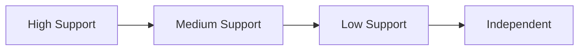

---

### 5.3 Assistance 不是固定 Learner Trait

Assistance Dependency 不应与 Knowledge、Capability、Metacognition 平级成为固定人格属性。

它更接近：

> **Learner × Task × Capability × Assistance Condition**

之间的关系。

例如：

- 完整讲解后成功；
- 多次提示后成功；
- 一次提示后成功；
- 无提示成功；

可以作为能力成长的重要 Evidence。

---

### 5.4 Capability Internalization

长期目标可以理解为：

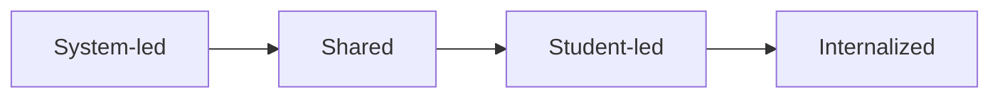

#### System-led

DeerMind 更多承担：

- Assess；
- Decide；
- Verify。

#### Shared

孩子开始提出自己的判断，DeerMind 负责校准。

#### Student-led

孩子主要完成判断和选择，DeerMind 退到观察与必要纠偏。

#### Internalized

相关学习管理能力已经成为孩子自己的能力。

---

### 5.5 Fade-out

Fade-out 不意味着：

> DeerMind 永久从孩子生活中消失。

而意味着：

> **在已经成熟的能力域中减少支架。**

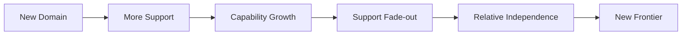

真正应该下降的是：

> 同一能力域上的 Assistance Dependency。

---

## 6. Human System & Scenarios

### 6.1 Human System

DeerMind 不是孤立存在的学习系统。

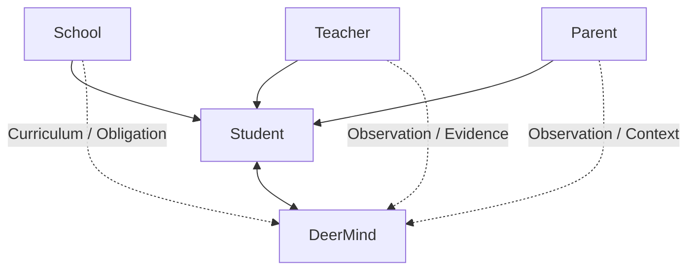

---

### 6.2 Student

学生是 DeerMind 的核心服务对象。

学生可以提供：

- Intent；
- Question；
- Performance；
- Self-report。

但学生说：

> “我会了。”

不直接修改 Learner State。

学生说：

> “直接告诉我答案。”

也不自动成为 Policy Command。

这些输入必须进入 DeerMind 的判断链。

---

### 6.3 Parent

家长不是 DeerMind 的 Learning Operator。

家长主要拥有：

- **Observe**：了解孩子当前状态；
- **Inform**：提供家庭中的观察；
- **Understand**：理解 DeerMind 为什么形成某个判断；
- **Support**：了解自己应该怎样支持；
- **Request Reassessment**：要求 DeerMind重新检查某项判断。

Request Reassessment 不等于：

> Override State。

---

### 6.4 Teacher

教师是：

> **High-value External Evidence Source。**

教师提供：

- 课堂观察；
- 课程上下文；
- 教学专业判断；
- 学校表现；
- 学习反馈。

但教师不是 DeerMind 的：

> Absolute Ground Truth。

当教师判断与 DeerMind 当前 Belief 冲突时，更合理的做法是：

> 形成 Competing Hypotheses 并继续寻找更强 Evidence。

---

### 6.5 School

学校代表：

- 正式课程；
- 作业；
- 教学进度；
- 考试；
- 现实教育要求。

DeerMind 应理解这些 Context，但不重新创建一套平行学校系统。

---

### 6.6 Student Scenarios

当前学生主要意图归纳为七类：

1. **Solve**：解决当前问题；
2. **Understand**：理解为什么；
3. **Assess**：判断自己是否真的会；
4. **Review**：决定什么值得复习；
5. **Learn**：主动学习新内容；
6. **Decide**：决定下一步；
7. **Reflect**：理解自己的学习过程。

这些不是七个独立系统。

它们共享同一个：

> **Learner → Evidence → Belief → Decision → Support**

框架。

可以进一步分为：

| 层级 | 场景 | 核心问题 |
|---|---|---|
| 当前问题 | Solve / Understand | 眼前问题是什么、为什么 |
| 学习管理 | Assess / Review / Decide | 我是什么状态、下一步做什么 |
| 主动成长 | Learn / Reflect | 我怎样主动学习并越来越了解自己 |

---

## 7. Evaluation & Evolution

### 7.1 Evaluation Principle

DeerMind 不首先使用：

- 使用时长；
- 对话次数；
- DAU；
- 消息量；

衡量产品成功。

真正需要评价的是：

> **孩子是否学得更好、判断更准、越来越独立，同时 DeerMind 是否以合理代价做出了更好的学习决策。**

---

### 7.2 Learning Quality

关注：

- Independent Performance；
- Delayed Independent Performance；
- Transfer；
- Stable Learning；
- Recurrent Failure；
- False Mastery。

最重要的问题始终是：

> **没有 DeerMind 当前支架时，孩子还能不能做到？**

---

### 7.3 Epistemic Quality

DeerMind 不只需要判断正确，还需要：

> 正确地知道自己的确定程度。

关注：

- Calibration；
- False Certainty；
- Contradictory Evidence Handling；
- Hypothesis Revision；
- Unknown Accuracy。

---

### 7.4 Decision Quality

关注 DeerMind 是否真正做出了更值得的动作：

- False Intervention；
- False Stop；
- Unnecessary Practice；
- Low-value Proactive Intervention；
- Evidence Efficiency；
- Attention Efficiency。

---

### 7.5 Independence Growth

长期重点观察：

- Assistance 是否减少；
- 自我恢复能力是否增强；
- Self-assessment 是否更准确；
- 是否越来越能够自行选择策略；
- 是否越来越能够自己判断何时需要帮助、验证和停止。

---

### 7.6 Burden

必须评价 DeerMind 自身是否变成新的负担：

- 额外学习时间；
- 无意义验证；
- 主动提醒数量；
- 数据采集成本；
- 家长管理成本；
- 对学习节奏的干扰。

---

### 7.7 Causal Attribution

必须区分：

> 孩子发生了变化。

和：

> DeerMind 导致了变化。

学习变化还可能来自：

- 学校；
- 教师；
- 家长；
- 自主练习；
- 其他工具；
- 自然发展。

DeerMind 不能自动把所有正向变化归因给自己。

---

### 7.8 Supporting Theory Documents

Concept Design 是顶层主文档。

当某一理论问题达到足够复杂度时，可以形成 Supporting Theory Document。

当前已有：

> **DeerMind Knowledge Model v0.1**

负责：

- Knowledge Theory；
- Domain Semantic Ontology；
- Learning Knowledge Model；
- Learning Dynamics；
- Curriculum Projection；
- Knowledge Construct Granularity；
- Learner State Interface；
- Feasibility & Validation。

Capability、Metacognition、Evidence 等是否独立成文，根据后续理论复杂度决定，不预先制造文档碎片。

---

### 7.9 当前未决核心问题

当前 Concept Design 层的主要未决问题包括：

#### Capability

- 到底是什么；
- 与 Knowledge 的边界是什么；
- 如何形成；
- 如何评估；
- 是否需要独立理论文档。

#### Metacognition

- Monitoring 与 Control 的精确定义；
- 怎样观察；
- 如何避免语言表达能力污染判断。

#### Cognitive Willingness

- 如何理解 Session-level cognitive readiness；
- 如何适配而不操纵。

#### Proactive Policy

- 什么情况下 DeerMind 有资格主动占用注意力；
- 主动行为怎样避免成为 Engagement Optimization。

#### Causal Attribution

- 如何区分 Learner Change 与 DeerMind Treatment Effect。

---

### 7.10 Unified Framework

当前 DeerMind 的整体逻辑收敛为：

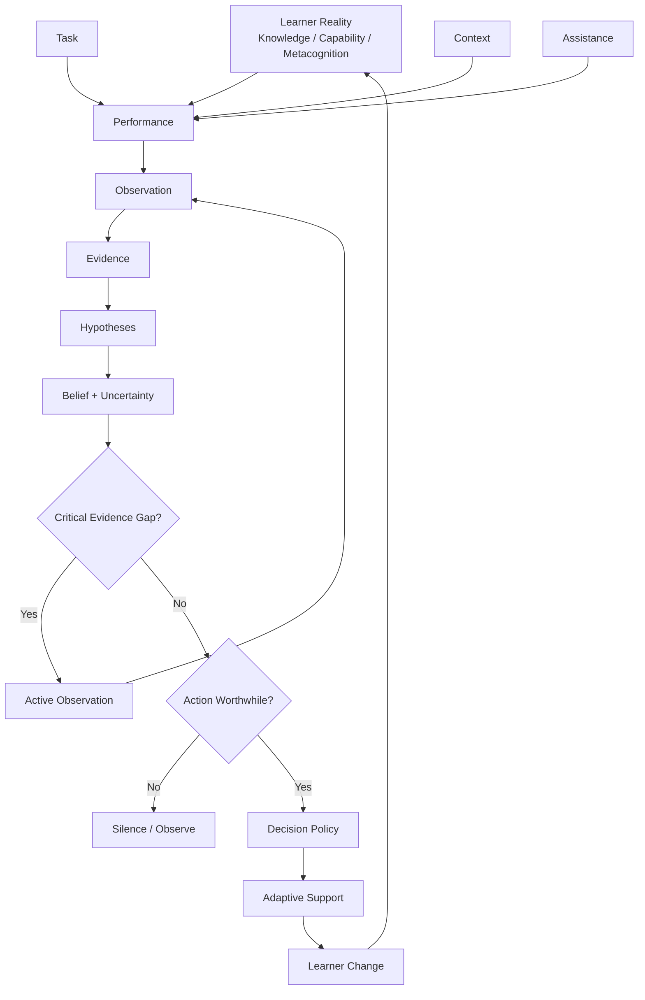

---

### 7.11 Version Evolution

#### v0.4 — Evidence-driven Learning Decision Engine

核心问题：

> 为什么判断会了？下一步做什么？什么时候停？

#### v0.5 — Personal AI Learning Expert + Continuous Learner Model

核心问题：

> DeerMind 最终希望帮助孩子成为怎样的学习者？

#### v0.6 — Observability-bounded Personal AI Learning Expert

核心问题：

> DeerMind 凭什么认为自己理解孩子，以及它有资格判断到什么程度？

#### v0.7 — Unified Learner–Evidence–Decision Framework

核心问题：

> **DeerMind 对学习者是什么、自己如何认识学习者，以及如何依据这种认识行动，是否拥有一套统一、自洽、可修正的理论框架？**

从 v0.7 开始，复杂基础理论不再无限扩张主文档，而通过 Supporting Theory Documents 独立演进。

---

### 7.12 Final Definition

DeerMind 当前定义为：

> **一个拥有稳定教育价值内核，在真实可观测性边界内持续形成对学习者 Knowledge、Capability 与 Metacognition 的可修正认识，并据此决定何时沉默、何时观察、何时提供可撤除认知支架，最终帮助孩子逐渐形成独立学习能力的 Personal AI Learning Expert。**

它最终追求的不是：

> AI 越来越替孩子完成学习。

而是：

> **DeerMind 越来越准确地知道什么时候应该帮助、应该怎样帮助；与此同时，孩子越来越能够把原本由 DeerMind 承担的 Assess、Decide、Verify 与 Reflect 转化为自己的能力。**

---

## 阶段性结论

v0.7 的核心不是增加更多概念，而是形成一个可持续扩展的顶层框架：

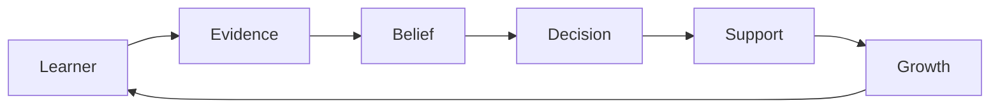

以后任何新增理论都需要回答：

> 它属于这个体系中的哪一层？

如果无法自然归位：

1. 先检查新概念本身是否真的必要；
2. 再检查现有框架是否需要调整；
3. 最后才考虑增加新的顶层模块。

目标不是建立越来越庞大的概念体系，而是建立：

> **足够稳定、足够清晰、能够容纳深化讨论并知道何时应该停止扩张的产品理论框架。**
