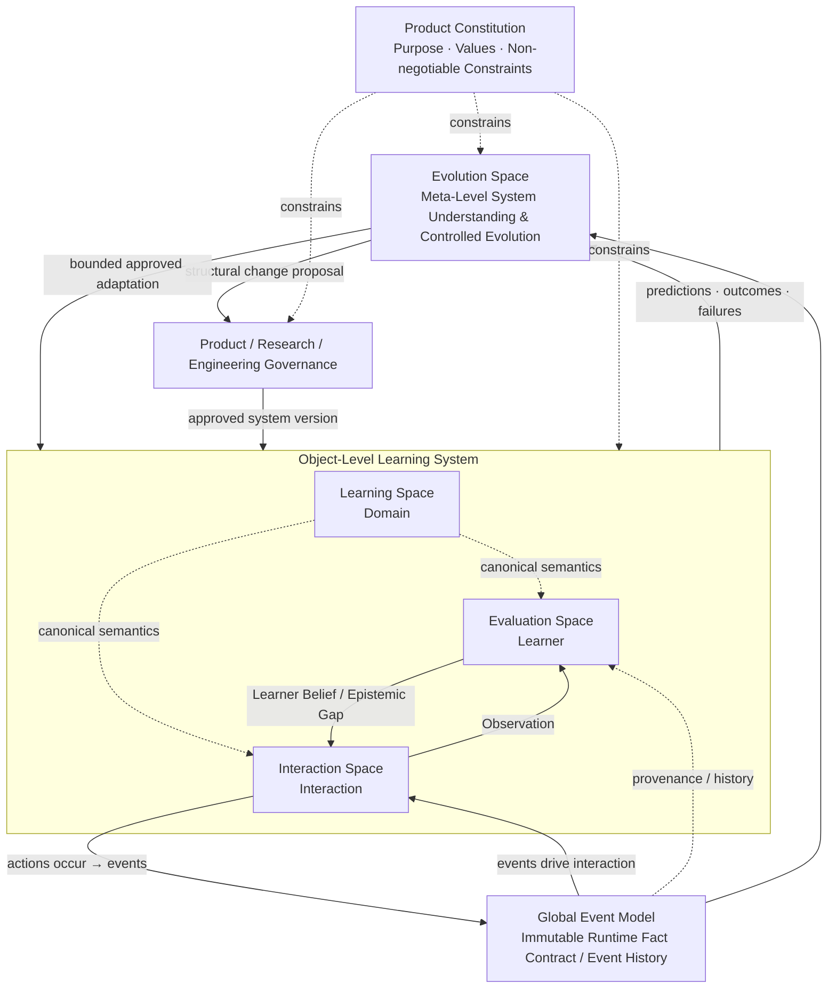
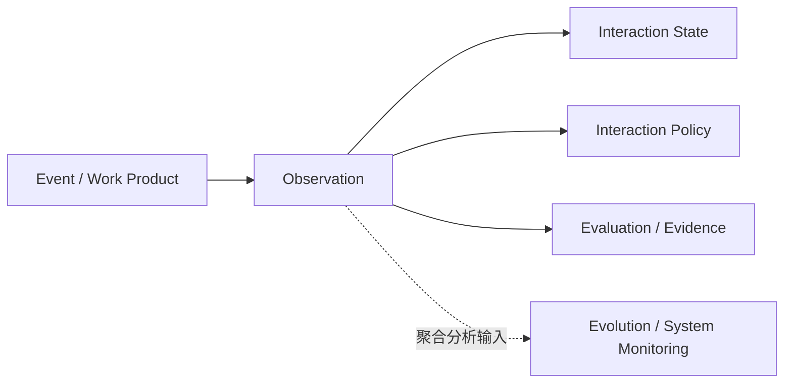

# DeerMind Concept Architecture v0.5

> **中文名称**：DeerMind 概念架构  
> **版本**：v0.5  
> **文档性质**：顶层概念架构 / Architecture Baseline  
> **状态**：Architecture Baseline（经四 Space 第一轮设计、Evolution 回写与跨 Space 全局一致性审计更新）  
> **更新时间**：2026-09-26
> **v0.5 说明**：本版不改变四 Space 顶层结构；主要吸收端到端压力测试结论，补充 Observation 的跨 Space 共享语义、跨版本解释边界、干预暴露链、外部输入分层，以及上游派生语义失效后的下游重评估责任。

---

## 1. 文档目的

本文件定义 DeerMind 的顶层概念架构。它不负责描述具体产品界面、软件模块、数据库、模型训练、Prompt、服务部署或工程实现，而负责回答更上位的问题：

> **DeerMind 作为一个长期运行的 AI Learning Expert，最少需要维护哪些彼此正交的语义空间，才能理解学习领域、理解学习者、理解并参与当前学习交互，并持续检验和改进自身？**

本文件是在《DeerMind Concept Design v0.7》与《DeerMind Learning Space Design v0.2》基础上的架构重构，并持续接受 Evaluation Space Design、Interaction Space Design 与 Evolution Space Design 的反向修订。重构目标不是保留历史模块名称，而是从系统闭环、语义所有权、可证伪性与最小充分复杂度出发，找到稳定的顶层结构。

v0.5 当前采用四个一级 Space：

\[
\boxed{
LearningSpace
+
EvaluationSpace
+
InteractionSpace
+
EvolutionSpace
}
\]

其中前三个构成 DeerMind 的 Object-Level Learning System：

\[
\boxed{
LearningSystem
=
LearningSpace
+
EvaluationSpace
+
InteractionSpace
}
\]

第四个 Evolution Space 构成 Meta-Level System Evolution responsibility。

此外，DeerMind 增加一个全局可见的 **Global Event Model**，定义不可变运行事实的语义契约，并通过 Event History 保存已经发生的事实。Global Event Model 不是第五个 Space，因为它不拥有独立 belief、policy 或 domain world。

因此顶层结构可以压缩为：

\[
\boxed{
DeerMind
=
ProductConstitution
+
GlobalEventModel
+
LearningSystem
+
EvolutionSystem
}
\]

Product Constitution 不是 Space，而是所有 Space 必须遵守的横切约束；Governance 不是 Space，而是系统变化的权限边界。

## 2. 第一性原理：DeerMind 必须解决的四类问题

如果不继承任何历史模块划分，DeerMind 至少必须持续回答四类不可约问题。

### 2.1 学习世界是什么

DeerMind 必须知道：

- 学习领域中有哪些稳定的 Task；
- 一个 Task 可以通过哪些 Solution Strategy 被解决；
- 哪些可学习、可复用的 Knowledge 支撑这些解决过程；
- 这些结构如何形成稳定、可引用、可版本化的 canonical domain semantics。

这类问题属于 **Learning Space**。

### 2.2 我们现在应该怎样认识这个 learner

DeerMind 不能直接读取 learner 的真实认知状态，只能基于 Interaction Space 已形成的 Observation，进一步建立 claim-relative Evidence，并综合历史 Evidence 形成可修正 Learner Belief。

Evaluation Space 必须回答：

- 哪些 learner claim 可以被合法维护；
- 某个 Observation 对某个 Claim 意味着什么；
- Evidence 是支持、反驳、区分还是无信息；
- Evidence 之间是否相关、冲突或已经过时；
- 当前对 learner 应维持什么 Belief；
- uncertainty 来自 evidence scarcity、conflict、currentness 还是 model mismatch；
- 新 Evidence 应如何修正已有 Belief。

这类问题属于 **Evaluation Space**。

### 2.3 当前交互中正在发生什么，下一步应该发生什么

DeerMind 必须理解当前 interaction，并基于 Learning Space、Learner Belief、当前 Observation、Goal 与 Action Situation 决定是否以及如何行动。

Interaction Space 必须回答：

- Event 在当前 interaction 中意味着什么；
- 当前 performance / interaction 可以形成哪些 Observation；
- 当前 interaction 正在解决什么目标、处于什么状态；
- 是否值得行动；
- 哪一种 Action 最有价值；
- 如何控制支架强度；
- 何时等待、沉默、停止或 fade out；
- 如何响应 learner / parent 输入；
- 如何在 attention、burden、information value 与 learning value 之间权衡。

这类问题属于 **Interaction Space**。

### 2.4 我们自己的模型仍然成立吗

一个长期运行的 DeerMind 不能只在固定模型下适应 learner，还必须能够发现自己的模型、假设与策略何时失效。系统必须回答：

- Learning Space 的 canonical distinctions 是否仍然具有现实解释力；
- Interaction Observation Model 是否持续正确理解 performance；
- Evaluation 的 evidence/inference 是否 calibrated；
- Interaction Policy 是否真正改善长期独立学习；
- 哪些 failure 可能来自系统自身模型；
- 什么修改值得形成假设；
- 如何验证、实验、回滚或升级；
- 哪些变化可自动执行，哪些必须进入治理。

这类问题属于 **Evolution Space**。

因此，四个 Space 分别面向四种不同对象：

\[
\boxed{
Domain,\ Learner,\ Interaction,\ System
}
\]

Global Event Model 面向的是跨这些对象共享的 runtime factual substrate，而不是第五种需要独立 belief/policy 的 semantic world。

## 3. 顶层架构

DeerMind 的顶层是“两层四 Space + Global Event Model”。

Object-Level Learning System 不再只有一条单循环，而是两个耦合反馈回路。

### 3.1 Fast Interaction Loop

\[
\boxed{
Event
\rightarrow
Interaction
\rightarrow
Observation
\rightarrow
Interaction
\rightarrow
Action
\rightarrow
Event
}
\]

该回路支持不必先更新长期 Learner State 的即时教学与交互，例如识别某一步 arithmetic mismatch 后给出局部反馈。

### 3.2 Learner Evaluation Loop

\[
\boxed{
Observation
\rightarrow
Evaluation
\rightarrow
LearnerBelief
\rightarrow
Interaction
}
\]

更完整地：

\[
Observation
\rightarrow
Evidence
\rightarrow
Inference
\rightarrow
LearnerBelief
\rightarrow
Interaction
\]

Interaction Space 使用 Learner Belief，但不能直接修改它。

Learning Space 为 Observation、Evidence、Learner Belief 与 Interaction Action 提供共同 canonical domain grounding。

### 3.3 Observation 的跨 Space 传播

Observation 的生成责任属于 Interaction Space，但它不是 Interaction Space 的私有结果。

\[
\boxed{
ObservationGeneration\in InteractionSpace
}
\]

同时：

\[
\boxed{
ObservationConsumption\ is\ CrossSpace
}
\]

Observation 形成后可以被：

- Interaction State Model 用于重建当前运行状态；
- Interaction Policy 用于当前决策；
- Evaluation Space 用于形成 claim-relative Evidence；
- Evolution Space 作为系统监测与分析的输入之一。

但必须保持：

\[
\boxed{
Observation\neq LearnerBelief\neq PolicyDecision\neq SystemIssue
}
\]

Observation 是 Object-Level 的共享派生语义契约，而不是新的事实源。事实依据仍然是 Event / Event-grounded artifact。

### 3.4 Meta-Level Evolution Loop

Evolution Space 形成面向 DeerMind 自身模型、语义与策略的第二层反馈闭环。

当前经过 Evolution Space Design v0.1 压力测试后，Meta-Level 收敛为：

\[
\boxed{
SystemAssessment
\rightarrow
SystemIssue
\rightarrow
Hypothesis
\rightarrow
Validation
\rightarrow
ValidationEvidence
\rightarrow
SystemAssessment
}
\]

其中：

- **System Assessment Model**：持续 Monitor / Detect / Analyze / Assess，判断系统哪里可能存在问题以及证据是否足够；
- **Hypothesis Model**：解释问题、维护竞争假设、形成可检验预期，并在必要时提出 Revision Candidate；
- **Validation Model**：设计和执行验证，形成 Validation Evidence，并把证据重新送回 System Assessment。

Evolution Space 同时支持问题驱动与理论驱动两类启动路径：

\[
Reality
\rightarrow
SystemAssessment
\rightarrow
SystemIssue
\rightarrow
Hypothesis
\]

以及：

\[
External/InternalTheory
\rightarrow
Hypothesis
\rightarrow
Validation
\rightarrow
SystemAssessment
\]

正式系统变化进入受治理演化闭环：

\[
ValidatedChangeProposal
\rightarrow
Human/Governance
\rightarrow
ApprovedChange
\rightarrow
PostDeploymentValidation
\rightarrow
SystemAssessment
\]

Evolution 检验的不只是 learner outcome，还包括 Learning Space、Observation Model、Evidence Model、Inference Model、Interaction State semantics、Action semantics 与 Interaction Policy 自身是否持续有效。
## 4. 架构设计原则

### 4.1 Complexity Must Earn Its Keep

任何一级 Space、Model、canonical entity、relationship 或长期状态都必须证明自己具有独立价值。

一个概念仅仅“重要”并不足以成为一级 Space。只有当它拥有无法被其他 Space 自然吸收的稳定语义对象、状态或职责时，才有资格进入顶层架构。

这条原则直接导致：

- Decision 不成为独立 Space，而属于 Interaction Space 的 Interaction Policy；
- Learner Model 不成为独立 Space，而属于 Evaluation Space 的 Learner State Model；
- Observation 不作为 Evaluation 私有过程，而由 Interaction Space 的 Observation Model产生；
- Epistemology 不成为独立顶层模块，而主要体现在 Evaluation Space；
- Scaffolding 不成为一级模块，而属于 Interaction action semantics / policy；
- Human System 拆为 Actor、Action、Authority、Provenance 与 External Constraint；
- System Validation 提升为 Evolution Space 的 validation foundation；
- Event 不成为 Space，而由 Global Event Model 定义全局事实契约。

### 4.2 Space > Model > Entity / Relation > Runtime Instance

`Space` 表示稳定的问题域与语义职责边界，而不是单一模型。

例如：

\[
LearningSpace
\supset
TaskModel + SolutionModel + KnowledgeModel
\]

当前：

\[
EvaluationSpace
\supset
LearnerStateModel + EvidenceModel + InferenceModel
\]

而：

\[
InteractionSpace
\supset
ObservationModel + InteractionState + ActionModel + InteractionPolicy
\]

因此：

\[
\boxed{
ModelSeparation
\neq
SpaceSeparation
}
\]

### 4.3 Conceptual Space ≠ Software Module

本架构描述 conceptual semantic architecture，而不是未来软件服务边界。

一个 Space 可以在工程实现中被拆成多个服务；多个内部 Model 也可能共享基础设施。Concept Architecture 不预先规定微服务、数据库、消息队列、AI 模型或部署拓扑。

### 4.4 Global Event Model Is a Contract, Not a Space

Event 记录“已经发生了什么”，但它不形成独立 belief、policy 或 canonical learning world。

\[
\boxed{
Event = ImmutableRuntimeFactContract
}
\]

Global Event Model 定义 Event semantics；Event History 保存已经发生的 Event instances。

\[
\boxed{
GlobalEventModel
\neq
EventHistory
}
\]

它们都不是第五个 Space。

### 4.5 Context Is Relational

Context 不建立为独立 Space，也不成为一个万能 canonical container。

当前 Action Situation 可以由多个来源共同形成：

\[
Context_t =
f(
LearnerBelief,
Observation,
CurrentTask,
Goal,
EventHistory,
Time,
Environment,
ExternalConstraints
)
\]

其中：

- Learner Belief 来自 Evaluation；
- Observation 由 Interaction Space 形成；
- Task 来自 Learning Space；
- Goal、willingness、fatigue、available time 等主要属于 Interaction runtime semantics；
- 历史事实由 Global Event Model / Event History 保留。

因此：

\[
\boxed{
Context\ is\ relational,\ not\ owned
}
\]

### 4.6 Constitution Constrains Optimization

DeerMind 的 Product Constitution 不参与普通模型优化。Evolution Space 可以改进系统，但不能通过优化指标把 Constitution 本身优化掉。

\[
\boxed{
Evolution\ operates\ under\ Constitution
}
\]

而不是：

\[
Evolution\ optimizes\ Constitution
\]

## 5. Learning Space

### 5.1 定义

Learning Space 是 DeerMind 对“什么可以被学习、理解与解决”的 canonical representation。

它的核心目标不是复制教材目录，也不是维护 learner state，而是建立一个稳定领域语义坐标，使 Evaluation、Interaction 与 Evolution 可以引用同一组 Task、Solution 与 Knowledge objects。

当前核心结构为：

\[
\boxed{
LearningSpace = TaskModel + SolutionModel + KnowledgeModel
}
\]

详细定义以《DeerMind Learning Space Design v0.2》为基线。

### 5.2 Semantic Ownership

Learning Space 拥有：

- Task Family / Task Instance 的 canonical semantics；
- Solution Strategy；
- Solution Task Topology；
- TaskNode；
- Knowledge Component（KC）；
- Direct / Organization Knowledge Grounding；
- 必要的 domain-level empirical overlays；
- canonical identity、version 与 evolution history。

Learning Space 不拥有：

- 某个 learner 是否掌握某 KC；
- 某次 behavior 是否构成 Evidence；
- 当前应该采取什么 Action；
- 当前系统模型是否仍然 valid。

### 5.3 关键边界

Learning Space 定义 domain semantics，但 learner-specific belief 属于 Evaluation Space。

例如：

\[
KC \in LearningSpace
\]

而：

\[
KCBelief(Learner,KC) \in EvaluationSpace
\]

同理：

\[
TaskFamily \in LearningSpace
\]

而：

\[
TaskProficiencyBelief(Learner,TaskFamily) \in EvaluationSpace
\]

Learning Space 不应因某个 learner 的当前状态而改变 canonical semantics；当大量现实证据表明 canonical model 自身失效时，由 Evolution Space形成系统级 validation evidence 与 change proposal，推动受控修订。

---

## 6. Evaluation Space

### 6.1 定义

Evaluation Space 是 DeerMind 关于 learner 当前学习状态的可修正认识，以及从 Observation 形成 Evidence、综合 Evidence 并维护 Learner Belief 的语义空间。

它回答：

> **Based on what has been observed, what should DeerMind believe about this learner, and why?**

当前核心链为：

\[
\boxed{
Observation
\rightarrow
Evidence
\rightarrow
Inference
\rightarrow
LearnerBelief
}
\]

Observation 不再由 Evaluation Space 生成，而来自 Interaction Space。

### 6.2 当前核心模型

经过 Evaluation Space Design v0.2 的多轮压力测试，当前结构收敛为：

\[
\boxed{
EvaluationSpace
=
LearnerStateModel
+
EvidenceModel
+
InferenceModel
}
\]

三个 Model 分别回答：

1. **Learner State Model**：What may DeerMind believe about the learner?
2. **Evidence Model**：What does this Observation mean for this Claim?
3. **Inference Model**：Given all relevant Evidence, what should DeerMind believe now?

当前不再保留独立 Observation Model 于 Evaluation Space。

### 6.3 Learner State Core

当前 canonical Learner State Core 只包含：

\[
\boxed{
TaskProficiencyBeliefs
+
KCBeliefs
}
\]

Capability、Metacognition、Motivation、Fatigue、Assistance Dependency 等均不作为第三类 canonical learner-state primitive。

Belief 本身是 evidence-grounded epistemic position，而不是 learner truth 或 mastery score。

概念上：

\[
Belief_t(C)
=
(
Assessment,
EpistemicUncertainty,
EpistemicStatus,
EvidenceBasis
)
\]

### 6.4 Single-Writer Principle

Learner Belief 只能被 Evaluation Space 更新：

\[
\boxed{
Only\ EvaluationSpace\ may\ revise\ LearnerBelief
}
\]

Learner 自我报告、Parent 评论、DeerMind Action、学校结果等不能直接覆盖 learner state。

这落实：

> **Evidence, not Command.**

### 6.5 Condition Defaults to Evidence

Independent / Assisted / Delayed / Transfer 等默认作为 Evidence semantics，而不是把 Learner Belief 分裂为大量 condition-specific states。

\[
\boxed{
Condition\ defaults\ to\ Evidence,
unless\ it\ changes\ Claim\ semantics
}
\]

### 6.6 Evaluation Does Not Decide Action

Evaluation 可以输出：

- Learner Belief；
- uncertainty；
- epistemic status；
- decision-relevant InferenceHypotheses；
- Epistemic Gap。

但它不能直接决定：

> “现在应该再出一道题 / 给一个 Hint / 停止学习。”

是否以及如何行动属于 Interaction Space。

## 7. Interaction Space

### 7.1 定义与核心结构

Interaction Space 是 DeerMind 对**当前学习交互**进行语义理解、维护当前运行状态并作出交互决策的空间。

它回答四个不可约问题：

1. 当前发生的事情在学习与交互语义上是什么？
2. 到现在为止，什么仍然有效、正在进行、待处理或形成约束？
3. DeerMind 可以主动做什么，这些行动会要求、暴露或控制什么？
4. 此刻是否值得干预；如果值得，什么干预是最低充分的？

经过《DeerMind Interaction Space Design v0.2》的多场景压力测试，当前结构收敛为：

\[
\boxed{
InteractionSpace
=
ObservationModel
+
InteractionStateModel
+
ActionModel
+
InteractionPolicy
}
\]

四者具有不同的语义所有权：

- **Observation Model**：把 Event / work product 转换为当前 episode 的语义描述；
- **Interaction State Model**：维护当前仍然有效、进行中、待处理或形成约束的运行状态；
- **Action Model**：定义 DeerMind 可控行动的正式语义；
- **Interaction Policy**：综合当前 Observation、Interaction State、Learner Belief、Epistemic Gap、Learning Space 与 Product Constitution，决定是否干预以及如何干预。

Interaction Space 不是对话历史容器，也不是 Learner State 的复制品，更不是“AI 总要做点什么”的执行器。

### 7.2 Observation Model

Observation Model 的职责是：

\[
\boxed{
RuntimeFacts
+
CanonicalSemantics
\rightarrow
EpisodeLocalSemanticDescription
}
\]

Observation 描述当前 interaction / performance 中**观察到了什么**，但不直接断言 learner 的潜在认知状态。

例如：

\[
ArithmeticMismatch
\]

可以是 Observation；

而：

\[
DivisionKCWeak
\]

不是 Observation，而属于 learner claim / inference concern。

Observation 应满足：

- Event / work product grounding；
- episode-local；
- domain / interaction meaningful；
- learner latent-state neutral；
- claim-agnostic；
- action-neutral；
- provenance preserving；
- uncertainty explicit。

并且：

\[
\boxed{
ObservationModel
\ should\ be\ LearnerBeliefIndependent\ by\ default
}
\]

避免由既有 Learner Belief 反向塑造当前 Observation，形成自我确认闭环。

Observation Model 属于 Interaction Space，但 Observation 是跨 Space 可消费的派生语义契约，可同时被 Interaction、Evaluation 与 Evolution 使用。

### 7.3 Interaction State Model

Interaction State Model 根据已经发生的 Event、当前 Observation、时间与环境，对当前交互中仍然有效、进行中、待处理或形成约束的运行语义进行可重建的状态投影：

\[
\boxed{
InteractionState_t
=
Project(
EventHistory_{\le t},
Observations_{\le t},
CurrentTime,
Environment
)
}
\]

它维护的是**运行状态**，不是事实历史，也不是 Learner Belief。

因此：

\[
\boxed{
InteractionState
\neq
EventHistory
}
\]

\[
\boxed{
InteractionState
\neq
LearnerBelief
}
\]

Interaction State 可以被缓存或持久化，但不能成为 competing source of truth；原则上必须可由 Event、Observation、时间和环境重新构建。

State 语义采用：

\[
\boxed{
Finite\ Canonical\ State\ Semantics
+
Parameterized\ State\ Instances
}
\]

即：

> 某一系统版本中的正式 State Type 必须受控、可枚举、可版本化、可被程序可靠处理；具体 State Instance 可以开放产生。

如果运行中出现现有 State Model 无法表达的新现象，不能由 LLM 临时创造正式 State Type。该现象应先以 Event / Observation / anomaly 保留，再由 Evolution Space 判断是否需要扩展正式语义。

因此 DeerMind 采用：

\[
\boxed{
\text{运行时语义封闭，体系级语义开放}
}
\]

### 7.4 Action Model

Action Model 只拥有 **DeerMind 可控行为的正式语义**。

\[
\boxed{
ActionSemantics
\neq
ActionSelection
}
\]

Action 可以由若干正交功能构成，例如：

- **Elicit**：要求 learner 产生某种认知或行为输出；
- **Expose**：向 learner 暴露信息、结构、提示、解释或反馈；
- **Control**：改变当前 interaction lifecycle 或操作状态。

这些不必被实现为互斥类型树，而可以作为 Action 的组合语义。

Hint、Explain、Reflect、Present Task 等产品动作不必成为基础 Action Type；它们可以由 Action Function、Content、Learner Work Demand、Information Disclosure、Control Effect 等语义组合表达。

特别需要显式表达：

\[
InformationDisclosure
\]

与：

\[
CognitiveWorkSubstitution
\]

因为它们决定后续 performance 对不同 learner claim 的证据污染程度。

但 Action Model 只描述“暴露了什么、要求了什么、控制了什么”，不直接判断它对某个 Claim 的 Evidence 价值。

同时：

\[
\boxed{
SelectedAction
\neq
OccurredAction
}
\]

只有真正发生的 Action 才能形成 Event，并影响后续 Interaction State 与 Evidence。

### 7.5 Interaction Policy

Interaction Policy 回答：

> **当前是否值得干预；如果值得，什么结果是最低充分的？**

它不是单一 reward maximizer，而是受 Product Constitution 约束的多条件决策机制。

概念上：

\[
\boxed{
InteractionPolicy:
DecisionContext
\rightarrow
PolicyOutcome
}
\]

其中：

\[
\boxed{
PolicyOutcome
=
Execute(Action)
\ |
NoIntervention
\ |
Defer
}
\]

`NoIntervention` 是一等正式结果，因为 DeerMind 不预设“AI 总要做点什么”。

\[
\boxed{
InterventionMustJustifyItselfAgainstNoIntervention
}
\]

Interaction Policy 应遵循：

- No Hidden Evaluation：不得在 Policy 内偷偷形成跨 episode learner conclusion；
- Decision Trigger ≠ Intervention Mandate：timer、错误、parent input、Epistemic Gap 只触发重新决策，不自动命令行动；
- Minimum Sufficient Intervention：在足够解决当前高价值问题的候选方案中，优先选择认知替代更少、注意成本更低、认知所有权更高的方案；
- Epistemic Gap ≠ Active Assessment Command：认识缺口是否值得主动解决仍由 Policy 判断；
- External Request ≠ Policy Command：learner / parent 输入是 intent、constraint 或 evidence，不直接覆盖 DeerMind 的教育判断；
- Policy Rationale ≠ Observation / Evidence / Belief：策略理由不能反向制造新的认识论事实。

### 7.6 两条运行闭环

Interaction Space 是两条 Object-Level 回路的汇合点。

快速交互闭环：

\[
\boxed{
Event
\rightarrow
Observation
\rightarrow
InteractionPolicy
\rightarrow
Action
\rightarrow
Event
}
\]

用于当前 episode 的即时响应，不要求先更新长期 Learner Belief。

学习者认识闭环：

\[
\boxed{
Observation
\rightarrow
Evidence
\rightarrow
Inference
\rightarrow
LearnerBelief
\rightarrow
InteractionPolicy
}
\]

用于跨 episode、跨时间的长期个性化决策。

Interaction State 则持续提供当前有效的运行条件：

\[
Event/Observation/Time/Environment
\rightarrow
InteractionState
\rightarrow
InteractionPolicy
\]

两条回路在 Interaction Policy 处汇合。

### 7.7 Active Assessment、Scaffolding 与 Fade-out

这些概念当前均不需要成为独立 Model：

- **Active Assessment**：Evaluation 输出 Epistemic Gap，Interaction Policy 决定是否值得通过新交互消除该 Gap；
- **Scaffolding**：体现为 Action 的 Information Disclosure / Cognitive Work Substitution，以及跨时间的 Policy trajectory；
- **Review**：属于 Interaction Policy strategy；
- **Fade-out**：属于长期 Policy trajectory，而不是单独 Action 或 learner state；
- **Silence / Wait**：通常属于 Policy Outcome，不必伪装成 Action。

因此：

\[
\boxed{
EpistemicGap
\not\Rightarrow
ActiveAssessment
}
\]

以及：

\[
\boxed{
IndependentCompetence\uparrow
\Rightarrow
UnnecessaryCognitiveSubstitution\downarrow
}
\]

但这不是机械规则，而是 Policy 的长期倾向。

### 7.8 Multi-Actor Semantics

当前 Concept Product Boundary 中的直接 Actor 为：

\[
\boxed{
Learner,\ Parent,\ DeerMind
}
\]

Teacher 当前不是 DeerMind 的直接输入 Actor。

如果 learner 或 parent 转述 teacher 意见：

\[
DirectSource=Parent/Learner
\]

而：

\[
ReportedSource=Teacher
\]

必须保留两层 provenance。

External authority 不等于 epistemic authority，也不等于 policy authority。

## 8. Global Event Model

### 8.1 定义

Global Event Model 定义 DeerMind 全局共享的不可变 runtime fact contract。

Event instance 表示：

> **某件与 DeerMind learning system 有关的事情确实已经发生。**

\[
\boxed{
Event = ImmutableRuntimeFact
}
\]

Event History 是这些 Event instances 的历史集合。

### 8.2 Event Truth ≠ World Truth

Event 的“事实性”指 occurrence truth，而不是 Event payload 中每个现实陈述都已经被证明真实。

例如 Parent 说：

> “老师说她比例应用题不行。”

Event truth 是：

\[
ParentReported("Teacher said X")
\]

不是：

\[
LearnerIsWeakAtRatio
\]

后者需要 Observation / Evidence / Inference。

因此：

\[
\boxed{
ReportedClaimEvent
\neq
ClaimIsTrue
}
\]

### 8.3 Event ≠ Observation ≠ Evidence ≠ Belief

必须坚持：

\[
\boxed{
Event
\neq
Observation
\neq
Evidence
\neq
Belief
}
\]

Event 保存不可变 occurrence truth。

Interaction Space 形成可修正 Observation。

Evaluation 将 Observation 解释为 Evidence，并通过 Inference 更新 Learner Belief。

### 8.4 Event 来源

Event 可来自至少三类来源：

1. **External Events**：learner / parent input、外部 assessment、未来可能的外部系统集成；
2. **System Events**：timer、timeout、review window、deployment、rollback；
3. **Internal Process Events**：具有 audit / causality / replay 价值的内部状态或流程事实。

ActionEvent 是 Event 的子集：

\[
\boxed{
ActionEvent\subset Event
}
\]

### 8.5 Internal Event Must Not Convert Interpretation into Truth

可以记录：

\[
ObservationGeneratedEvent(model=v3, observationRef=O)
\]

因为“系统生成过该 Observation”是事实。

但不能因为模型认为 learner 使用了某 strategy，就把：

\[
LearnerUsedStrategyX
\]

直接写成不可修改 world truth。

因此：

\[
\boxed{
DerivedInterpretation
\ must\ not\ rewrite\ EventTruth
}
\]

### 8.6 Immutability

已有 Event 不被覆盖或偷偷修改。

如需修正，应该追加 correction / superseding fact，而不是重写历史：

\[
\boxed{
HistoricalEvent\ is\ immutable
}
\]

### 8.7 Global Visibility

所有 Space 均可引用或查询 Event History：

\[
\boxed{
AllSpaces\ may\ reference\ EventHistory
}
\]

但 global visibility 不意味着所有 Space 都应把 Event 当作自己的主要 semantic input。

例如 Evaluation 的主要输入是 Observation；Event History主要提供 provenance、time、causal / correlation lineage 等基础事实。

### 8.8 Event-Driven Interaction

Interaction Space 是 Event-driven 的：

\[
\boxed{
Event
\rightarrow
InteractionSpace
}
\]

但并非每一个 Event 都必须产生 Observation。

例如：

- timer fired 可直接改变 Interaction State；
- session timeout 可直接导致 Stop/Save；
- learner solution submission 通常需要经过 Observation Model。

因此：

\[
EventDriven
\neq
EveryEventProducesObservation
\]

### 8.9 Event Granularity Must Earn Its Keep

不是每个函数调用或内部步骤都应进入 Event History。

只有对以下至少一项具有稳定价值的事实才值得成为全局 Event：

- future decision；
- causality；
- audit；
- replay；
- model validation；
- system evolution。

## 9. Evolution Space

### 9.1 定义

Evolution Space 是 DeerMind 面向**系统自身有效性**的认识与演化支撑空间。

它的对象不是某个 learner，也不是某次 interaction，而是 DeerMind 自身的模型、语义、假设、策略及其有效性。

它回答：

> **DeerMind 自己哪里可能错了，为什么可能错，可以怎样改，以及什么证据足以支持这种改进？**

当前结构正式收敛为：

\[
\boxed{
EvolutionSpace
=
SystemAssessmentModel
+
HypothesisModel
+
ValidationModel
}
\]

三个 Model 分别回答：

| Model | 核心问题 |
|---|---|
| System Assessment Model | 系统哪里可能存在问题，我们有多大依据认为问题成立？ |
| Hypothesis Model | 为什么会出现这个问题，可以怎样解释和改进？ |
| Validation Model | 怎样验证这些解释和候选方案是否经得住证据？ |

Evolution Space 不拥有最终结构性变更授权。正式改变系统语义、模型结构或演化方向的权力属于 Human / Governance。

### 9.2 Learner Adaptation ≠ System Evolution

Object-level 的 learner adaptation 由 Evaluation + Interaction 完成；跨 learner、跨时间、跨模型版本出现的系统性问题才进入 Evolution Space。

\[
\boxed{
LearnerAdaptation
\neq
SystemEvolution
}
\]

单个 learner 的异常不能自动触发系统 ontology 或 semantic change。

### 9.3 System Assessment Model

System Assessment Model 内部包含：

\[
Monitor
\rightarrow
Detect
\rightarrow
Analyze
\rightarrow
Assess
\]

这些是一个 Model 内部的机制，不分别提升为独立 Model。

它把系统运行数据、人工复核、外部证据与 Validation Evidence 转化为可追溯的 System Issue。

必须坚持：

\[
\boxed{
Signal
\neq
SystemIssue
}
\]

System Issue 描述“系统哪里出现了问题或失配”，但不解释原因。System Belief 作为 Assessment 内部用于表达 issue support、uncertainty、scope 与 status 的认识机制存在，不单独形成第四个 Model。

### 9.4 Hypothesis Model

Hypothesis Model 可以接收 System Issue，也可以直接接收内部 / 外部主动提出的理论假设。

它负责：

\[
\boxed{
Explain
+
Predict
+
Propose
}
\]

即形成候选解释、维护竞争假设、生成可检验预期与反证条件，并在必要时形成 Revision Candidate。

必须保持：

\[
\boxed{
Issue
\neq
Hypothesis
\neq
RevisionCandidate
}
\]

以及：

\[
\boxed{
SourceAuthority
\neq
HypothesisValidity
}
\]

### 9.5 Validation Model

Validation Model 同时验证 Hypothesis 与 Revision Candidate：

\[
\boxed{
HypothesisValidation
\neq
RevisionCandidateValidation
}
\]

Validation 可以使用历史数据分析与 replay、专家复核、基准集与模拟、shadow validation、新旧版本对照，以及必要时的小范围真实 learner validation。

原则上遵循：

\[
\boxed{
UseLeastCostlySufficientValidation
}
\]

Validation 的输出是：

\[
\boxed{
ValidationEvidence
}
\]

它必须回流 System Assessment Model。

因此：

\[
\boxed{
ValidationResult
\neq
ChangeDecision
}
\]

如果验证需要真实 learner intervention，Validation Model 只能形成 Validation / Experiment Intent；真正作用于 learner 必须经过 Governance，并由 Interaction Space 执行。

### 9.6 两类启动路径

Evolution Space 同时支持：

**问题驱动路径**

\[
Reality
\rightarrow
SystemAssessment
\rightarrow
SystemIssue
\rightarrow
Hypothesis
\rightarrow
Validation
\]

以及：

**理论驱动路径**

\[
External/InternalTheory
\rightarrow
Hypothesis
\rightarrow
Validation
\rightarrow
SystemAssessment
\]

因此 Evolution 不只处理生产异常，也允许外部科学理论、专家假设和系统主动研究进入同一验证机制。

### 9.7 Evolution Contract

所有可演化的核心语义对象都应遵守横切设计契约：

\[
\boxed{
EvolutionContract
=
Identity
+
Version
+
Provenance
+
ValidityScope
+
FalsifiableExpectation
+
ReplaySupport
}
\]

并要求：

\[
\boxed{
SemanticDependenciesMustBeTraceable
}
\]

核心对象不能只定义“它是什么”，还必须逐步明确适用范围、可证伪预期、来源链、版本与历史 replay 能力。

Evolution 创建的是新的 interpretation / model version，而不是新的历史事实。

### 9.8 运行时语义封闭，体系级语义开放

单一正式版本内部的 State Type、Observation semantics、Evidence semantics、Action semantics、KC / Task canonical semantics 必须受控、可理解、可版本化。

运行时发现无法表达的新现象时，可以形成异常、Issue、Hypothesis 或 Revision Candidate，但不能由 LLM 直接创造新的正式 ontology 并要求其他程序即时理解。

正式语义扩展必须通过：

\[
发现
\rightarrow
假设
\rightarrow
验证
\rightarrow
Governance
\rightarrow
新版本
\]

因此：

\[
\boxed{
运行时语义封闭，体系级语义开放
}
\]

### 9.9 Bounded Adaptation vs Structural Evolution

系统变化至少区分：

1. **Learner Adaptation**：Evaluation + Interaction 正常运行，不属于 Evolution；
2. **Bounded System Adaptation**：在预先批准、语义不变、风险有限、可逆的范围内自动调整；
3. **Structural / Semantic Evolution**：KC、Task、State Type、Evidence semantics、Policy architecture 等正式语义或结构变化，必须进入人工 Governance；
4. **Constitutional Change**：Product Constitution 的变化属于更高等级的人类价值与治理决策。

\[
\boxed{
AbilityToUnderstandChange
\neq
AuthorityToExecuteChange
}
\]

### 9.10 Post-Deployment Validation 与 Rollback

验证不会在部署时结束。

任何正式版本上线后都必须重新进入：

\[
PostDeploymentValidation
\rightarrow
SystemAssessment
\]

预先授权条件下，系统可以自动回滚到已经批准的安全版本；这不同于系统自主创造并部署新语义。

### 9.11 Evolution ≠ R&D ≠ Governance

Evolution Space 负责 Evidence + Issue + Hypothesis + Candidate + Validation + Recommendation。

R&D 可以引入外部科学研究、产品研究和技术实现能力。

Governance 负责：

\[
\boxed{
谁有权在什么条件下改变什么
}
\]

三者通过受控接口协同，但不能互相替代。
## 10. Product Constitution

Product Constitution 不是一个 Space，而是全部系统必须遵守的 non-negotiable constraints。

当前稳定原则包括：

- **Cognitive Ownership**：认知所有权属于 learner；
- **Removable Cognitive Scaffold**：AI 支架最终应可撤除；
- **Evidence, not Command**：外部输入不能直接覆盖 learner state；
- **UNKNOWN is valid**：不知道是合法状态，不用伪确定替代；
- **Disconfirmation**：模型必须允许反证；
- **Attention Belongs to Learner**：不以 engagement 最大化作为目标；
- **Meaningful Use over Maximum Use**：只有高价值学习与信息需求才正当化干预；
- **Child Data & Dignity**：儿童数据最小化、目的限定、可纠正、可撤回，避免永久负面标签；
- **Long-term Independence**：长期目标是 learner 的独立认知与持续学习能力，而不是持续依赖 DeerMind。

Constitution 同时约束 object-level learning loop 和 Evolution Space。

特别是：

\[
\boxed{
Evolution\ cannot\ optimize\ Constitution\ away
}
\]

---

## 11. Governance

Governance 不是一个 Space，也不是 Evolution Space 的第四个 Model，而是跨系统的 **Change Authority**。

它回答：

> **谁有权在什么证据、风险、验证与审查条件下改变什么？**

\[
\boxed{
AbilityToUnderstandChange
\neq
AuthorityToExecuteChange
}
\]

当前架构至少区分四级变化：

1. **Learner Adaptation**：Evaluation / Interaction 的正常 learner-specific 适应；
2. **Bounded System Adaptation**：在预授权范围内进行的、语义不变、风险有限、可逆的参数校准、approved policy variant selection 或 rollback；
3. **Structural / Semantic Evolution**：KC split/merge、Task identity、Interaction State Type、Evidence semantics、Inference semantics、Action semantics、Policy architecture 等正式结构与语义变化，必须人工批准；
4. **Constitutional Change**：Product Constitution 不属于普通优化对象，只能通过明确的人类价值与治理机制改变。

Evolution Space 可以高度自动化地完成 monitoring、analysis、issue assessment、hypothesis generation、candidate generation、validation 与 recommendation preparation，但这些能力不会自动产生部署权限。

Governance 至少必须支持 versioning、change provenance、validation evidence、impact analysis、approval authority、bounded deployment、promotion criteria、rollback、emergency rollback 与 auditability。

正式 Governance Decision 本身也应成为不可变、可追溯的系统事实。
## 12. Cross-Space Semantic Contracts

### 12.1 Learning Space → Interaction Space

提供：

- canonical Task semantics；
- Solution Strategy / Topology；
- KC semantics；
- Task variables / representations；
- canonical success criteria；
- `CanonicalToolRequirement / AllowedToolSemantics`；
- action 需要引用的 domain objects；
- model identity / version。

Interaction 的 Observation Model 与 Interaction Policy 都以这些 canonical coordinates 为 grounding。

必须区分：

\[
\boxed{
CanonicalToolSemantics\neq RuntimeToolAvailability
}
\]

前者属于 Learning Space，后者属于 Interaction State 的当前环境 / constraint semantics。

### 12.2 Learning Space → Evaluation Space

提供：

- canonical Task coordinates；
- Solution semantics；
- KC semantics；
- Knowledge Grounding；
- Application Conditions；
- model identity / version。

Evaluation 可以在这些坐标上形成 learner-specific Claims / Beliefs，但不能用单个 learner belief 直接改写 canonical semantics。

### 12.3 Global Event Model → Interaction Space

Event 驱动 Interaction。

Interaction 可以：

- 更新 current Interaction State；
- 形成 Observation；
- 响应 learner / parent intent；
- 处理 timer / environment / system trigger；
- 产生新的 Action。

### 12.4 Interaction Space → Evaluation Space

主要提供：

\[
\boxed{Observation}
\]

Observation 是 Evaluation 的主要 runtime semantic input。

Evaluation 可以结合 Event provenance、Action history 与可重建 Assistance Context 形成 Evidence，但关于真实 assistance exposure 的权威依据必须最终追溯到 occurred Action Event。

因此：

\[
\boxed{
AssistanceContext\neq AuthoritativeExposureFact
}
\]

Evaluation 不得绕过 Observation Model 自行建立第二套 raw Event interpretation。

### 12.5 Global Event Model → Evaluation Space

Evaluation 可以通过 Evidence provenance 引用：

- timestamp；
- source；
- intervention lineage；
- causal / correlation history；
- model / semantic version references。

但不能绕过 Observation / Evidence 直接把任意 Event 解释成 Learner Belief。

### 12.6 Evaluation Space → Interaction Space

提供只读 learner epistemic view，包括必要的：

- Task Proficiency Belief；
- KC Belief；
- uncertainty / epistemic status；
- decision-relevant `InferenceHypothesis`；
- Epistemic Gap；
- justified derived diagnostic views。

其中 `InferenceHypothesis` 只解释 learner-level Evidence conflict，不等于 Evolution Space 的 `SystemHypothesis`：

\[
\boxed{
InferenceHypothesis\neq SystemHypothesis
}
\]

Interaction Space 不能直接写回 Learner Belief。

### 12.7 Interaction Space → Global Event Model

所有实际发生的 DeerMind Action，以及 learner / parent interaction、system/runtime occurrence，在满足 Event admission criteria 后形成 Event。

必须保持：

\[
\boxed{
SelectedAction\neq OccurredAction
}
\]

Action intent、policy selection 与实际发生的 Event 不得混淆。

### 12.8 Object-Level System → Evolution Space

Learning、Evaluation、Interaction 与 Global Event History 必须通过 Evolution Contract 暴露足够的可验证性信息。

统一 Evolution Contract 为：

\[
\boxed{
EvolutionContract
=
Identity+Version+Provenance+ValidityScope+FalsifiableExpectation+ReplaySupport
}
\]

并要求 important semantic dependencies 可追踪。

不同 Space 提供的内容包括：

- Learning：Task / Solution / KC relationship、validity criteria、split / merge / retire history；
- Evaluation：Evidence Basis、belief revision history、uncertainty reason、calibration outcome、dependency information；
- Interaction：Observation provenance、Interaction State basis、Action semantics、Policy decision context、Policy rationale、selected vs occurred Action、information disclosure、cognitive work substitution；
- Global Event History：不可变 occurrence facts 与可 replay provenance。

Object-Level 暴露的异常、长期偏差与模型冲突首先进入 Evolution 作为：

\[
\boxed{SystemSignal}
\]

不得直接越级为 System Issue、System Hypothesis 或 Validation Evidence：

\[
\boxed{
SystemSignal\neq SystemIssue\neq SystemHypothesis\neq ValidationEvidence
}
\]

### 12.9 Evolution Space → Object-Level System

Evolution Space 可以输出：

- System Issue；
- System Hypothesis；
- Revision Candidate；
- Validation Intent；
- Validation Evidence；
- Change Recommendation；
- post-deployment concern / rollback recommendation。

但不同输出拥有不同 authority。

#### Structural / Semantic Change

Evolution 的分析或建议不能直接修改 Learning / Evaluation / Interaction semantics：

\[
ValidatedChangeProposal
\rightarrow
Human/Governance
\rightarrow
NewApprovedVersion
\]

#### Learner-Facing Validation

如果 Validation 需要真实 learner interaction，则：

\[
ValidationIntent
\rightarrow
Governance
\rightarrow
ApprovedValidationIntent
\rightarrow
InteractionPolicy
\rightarrow
PolicyOutcome
\]

即使 Governance 已批准验证范围，Interaction Policy 仍保留当前 learner / current context 的最终 object-level action decision。

因此：

\[
\boxed{
GovernanceApproval\neq LearnerLevelExecutionCommand
}
\]

Policy Outcome 仍可为：

\[
Execute(ValidationAction)\ |\ NoIntervention\ |\ Defer
\]

只有实际发生的 Validation Action 才形成 Event，并返回 Validation Model 形成后续 Validation Evidence。

### 12.10 Readiness Cross-Space Contract

Readiness 不属于任何一个 Space 的 canonical state，也不是 Learner Belief 或 Policy Outcome。

它是跨 Space 派生 decision view：

\[
Readiness(T,L,C)
=
f(
TaskLearningStructure,
TaskProficiencyBelief,
KCBeliefs,
TargetConditions,
CurrentInteractionContext
)
\]

其中：

- Task Learning Structure 来自 Learning Space；
- learner beliefs 来自 Evaluation Space；
- Target Conditions / Current Interaction Context 来自 Interaction Space。

必须保持：

\[
\boxed{
READY\neq MASTERED\neq SHOULD\ ACT\ NOW
}
\]

Readiness 可以影响 Interaction Policy，但最终行动选择仍属于 Interaction Policy。
## 13. Core Architecture Invariants

v0.5 当前冻结以下 architecture-level invariants。

### I1 — Four Semantic Objects

\[
\boxed{
Learning\rightarrow Domain,\quad
Evaluation\rightarrow Learner,\quad
Interaction\rightarrow Interaction,\quad
Evolution\rightarrow System
}
\]

任何新增一级 Space 必须证明存在第五类无法被这四种对象自然覆盖的独立语义职责。

### I2 — Global Event Model Is Not a Fifth Space

\[
\boxed{
Event = ImmutableRuntimeFact
}
\]

Global Event Model 提供跨 Space factual substrate，但不拥有独立 belief/policy world。

### I3 — Event ≠ Observation ≠ Evidence ≠ Belief

\[
\boxed{
Event\neq Observation\neq Evidence\neq Belief
}
\]

### I4 — Interaction Owns Observation Semantics

\[
\boxed{
Event
\rightarrow
Interaction.ObservationModel
\rightarrow
Observation
}
\]

Evaluation 消费 Observation，不建立竞争性的第二套 performance interpretation。

### I5 — Evaluation Owns Learner Belief

\[
\boxed{
Only\ EvaluationSpace\ may\ revise\ LearnerBelief
}
\]

### I6 — Teaching Does Not Imply Learning

“教过”“提示过”“解释过”都不能直接让 Learner Belief 上升。

\[
\boxed{
InstructionDelivered
\not\Rightarrow
LearnerBeliefIncrease
}
\]

### I7 — Fast Interaction Does Not Require Belief Update

\[
\boxed{
Observation
\rightarrow
InteractionAction
}
\]

可以在不更新长期 Learner Belief 的情况下发生。

### I8 — Decision Belongs to Interaction Policy

\[
\boxed{
DecisionSpace\notin TopLevel
}
\]

Decision 是 Interaction Space 的 Interaction Policy responsibility。

### I9 — Learner Model Belongs to Evaluation

\[
\boxed{
LearnerSpace\notin TopLevel
}
\]

Learner State Model、Evidence Model 与 Inference Model 概念上分离，但共同属于 Evaluation Space。

### I10 — Action Event Is a Subset of Event

\[
\boxed{
ActionEvent\subset Event
}
\]

时间、系统、环境或外部事实可以形成非 intentional Event。

### I11 — Context Is Relational

Context 不是万能 canonical container，也不是默认第五 Space。

### I12 — Evolution Evaluates DeerMind, Not Learner

Evolution 不替 Evaluation 直接判断某个 learner，也不绕过 Interaction Space直接作用于 learner。

### I13 — Self-Improvement Is Not Self-Authorization

\[
\boxed{
ValidatedChangeProposal
\neq
AuthorityToDeploy
}
\]

### I14 — Constitution Is Outside Optimization

Evolution 不能通过指标优化修改或绕开 Product Constitution。

### I15 — Conceptual Space Is Not Deployment Boundary

未来软件实现不得把“四个 Space”机械翻译成“四个服务”。

### I16 — Model Mismatch Must Not Be Repaired by Inventing Learner Traits

\[
\boxed{
ModelMismatch
\not\Rightarrow
NewLearnerTrait
}
\]

系统应优先检查 Observation、Evidence、Inference 或 Learning Space assumptions。

### I17 — Evolution Has Three Core Models

\[
\boxed{
EvolutionSpace
=
SystemAssessmentModel
+
HypothesisModel
+
ValidationModel
}
\]

Monitoring、System Belief、Experiment、Recommendation、Rollback 等当前均不形成第四个核心 Model。

### I18 — Issue ≠ Hypothesis ≠ Revision Candidate ≠ Validation Evidence

\[
\boxed{
SystemIssue
\neq
Hypothesis
\neq
RevisionCandidate
\neq
ValidationEvidence
}
\]

问题、解释、方案和验证证据必须分层，防止异常指标直接跳成系统修改。

### I19 — Validation Evidence Returns to Assessment

\[
\boxed{
ValidationEvidence
\rightarrow
SystemAssessment
}
\]

Validation Model 不自行批准方案；验证结果重新进入系统认识。

### I20 — Every Evolvable Model Must Be Falsifiable and Replayable

核心可演化对象必须遵守 Evolution Contract，具备 stable identity、version、provenance、validity scope、falsifiable expectation 与 replay support。

### I21 — Runtime Semantics Are Controlled, System Semantics Are Evolvable

\[
\boxed{
运行时语义封闭，体系级语义开放
}
\]

正式语义扩展必须通过 Evolution + Governance，而不能由运行时 LLM 动态创造正式 ontology。

### I22 — Deployment Does Not End Validation

\[
\boxed{
ValidationDoesNotEndAtDeployment
}
\]

新版本必须接受 Post-Deployment Validation，并保留 rollback 能力。

### I23 — Learner-Level Hypothesis ≠ System-Level Hypothesis

\[
\boxed{
InferenceHypothesis\neq SystemHypothesis
}
\]

Evaluation 的 InferenceHypothesis 用于解释 learner Evidence conflict；Evolution 的 SystemHypothesis 用于解释 DeerMind 系统模型为何可能失效。前者不能越级成为后者。

### I24 — System Signal Is Not Validation Evidence

\[
\boxed{
SystemSignal\neq SystemIssue\neq SystemHypothesis\neq ValidationEvidence
}
\]

生产异常、calibration drift、model mismatch 等首先只是 System Assessment 的输入，不能被语言直接升级成验证结论。

### I25 — Governance Approval Does Not Bypass Interaction Policy

\[
\boxed{
GovernanceApproval\neq LearnerLevelExecutionCommand
}
\]

真实 learner validation 即使经过 Governance 批准，仍必须通过 Interaction Policy 做当前 object-level admissibility decision。

### I26 — Assistance Context Is Not a Second Fact Source

\[
\boxed{
AssistanceContext\neq OccurredActionEvent
}
\]

关于 assistance exposure 与 Evidence contamination 的最终事实依据必须追溯到 occurred Action Event。

### I27 — Readiness Is a Derived Cross-Space View

\[
\boxed{
Readiness\neq CanonicalDomainState\neq LearnerBelief\neq PolicyOutcome
}
\]

Readiness 综合 Learning、Evaluation 与 Interaction 输入，服务 Interaction Policy，但不拥有独立 semantic authority。
### I28 — 禁止跨版本静默继承语义

当 canonical semantics 发生变化时，旧版本下形成的 Observation、Evidence、Learner Belief 与其他派生语义不能被默认视为新版本中的同义结论。

\[
\boxed{
NoSilentCrossVersionInterpretation
}
\]

新版本下的解释必须通过历史重放、重新推断，或经过验证且显式记录 provenance 的迁移规则形成。证据不足时，允许返回 UNKNOWN。

### I29 — 派生语义必须绑定明确的语义版本上下文

重要派生对象必须能够回答：它是在什么 canonical semantic versions 下形成的。

\[
\boxed{
DerivedSemanticObject\rightarrow SemanticVersionContext
}
\]

这不是新增 Space 或 Model，而是 Evolution Contract 中 Version + Provenance 的强化约束。

### I30 — 独立性判断必须有干预暴露链

不能仅凭“发生过帮助”判断一次表现是否独立或受助。必须知道干预何时发生、暴露了什么，以及替代了当前 Claim 所要求的哪部分认知工作。

\[
\boxed{
NoAssistanceClassificationWithoutExposureLineage
}
\]

### I31 — 外部输入不是系统命令

\[
\boxed{
Request\neq Constraint\neq Obligation\neq Command
}
\]

Learner、Parent、School 或未来 Teacher 的输入可以改变证据、当前约束、现实义务或决策上下文，但不能绕过 Interaction Policy 直接生成 DeerMind Action。

### I32 — 派生结论必须支持依赖失效传播

如果上游派生语义被纠正、替代或失效，所有依赖它的当前结论必须可被定位并重新评估。

\[
\boxed{
InvalidatedBasis\rightarrow ReevaluateDependents
}
\]

但已经真实发生的 Event 与 Action occurrence 不因后来解释改变而被删除：

\[
\boxed{
InterpretationCanChange,\ OccurrenceHistoryCannot
}
\]

## 14. v0.7 Asset Reclassification

《DeerMind Concept Design v0.7》中的核心思想继续保留，但旧七模块不再作为顶层架构。

| v0.7 资产 | v0.2 当前位置 |
|---|---|
| Purpose & Constitution | Product Constitution |
| Learner Model | Evaluation Space / Learner State Model |
| Epistemology | Evaluation Space |
| Learning Decision System | Interaction Space / Interaction Policy |
| Scaffolding & Development | Interaction Space |
| Human System | Actor / Interaction / Provenance / Governance / External Constraint |
| Evaluation & Evolution | Evolution Space + Validation |

若干核心概念重新定级：

| 概念 | 当前判断 |
|---|---|
| Task / Solution / Knowledge | Learning Space 核心 |
| Task Proficiency Belief | Evaluation / Learner State |
| KC Belief | Evaluation / Learner State |
| Capability | 不作为独立一级 learner construct |
| Metacognition | 拆为 Observation、derived profile、possible KC 与 Interaction concern |
| Assistance Dependency | Derived diagnostic relation |
| Uncertainty | Learner Belief 的 epistemic property |
| Epistemic Gap | Evaluation 输出；Interaction 决定是否值得解决 |
| Readiness | Learning + Evaluation + Interaction 的跨 Space 派生 decision view，服务 Interaction Policy；不是 canonical domain state、Learner Belief 或 Policy Outcome |
| Learning Need | Interaction Policy 派生对象 |
| Scaffolding | Interaction action semantics / policy |
| Stop / Fade-out | Interaction Policy |
| Observation | Interaction Space / Observation Model |
| Event | Global Event Model / Event History |
| Curriculum | Learning projection + Interaction constraint |
| Student Scenarios | Reference Scenario / Validation Suite |
| System Validation | Evolution Space 的 Validation foundation |

## 15. Product Actor Boundary

当前 DeerMind 的直接外部 Actor 明确限定为：

\[
\boxed{
Learner,\ Parent
}
\]

加上系统自身 Actor：

\[
DeerMind
\]

Teacher 当前不是 DeerMind 的直接输入 Actor。

这不意味着 Teacher 对 learner 没有现实影响；而是当前产品概念边界不包含 Teacher direct interaction channel。Learner 或 Parent 可以转述 teacher 信息，此时 Event 必须保留 reported source / provenance，而不能把它伪装成 Teacher 直接输入。

School 同样不是内部 Space。它可以通过 curriculum、assignment、assessment、deadline、obligation 等事实影响 Learning projection 或 Action policy。

---

## 16. Reference Scenarios for Architecture Validation

以下场景用于持续压力测试架构，而不是形成独立模块：

1. **Solve**：learner 主动求助真实问题；验证 Event→Observation→fast Interaction 与 Evaluation loop；
2. **Learn**：learner 主动学习新内容；验证 Teaching Action 不等于 Learning Evidence；
3. **Review**：timer / review window 等 system event 触发 interaction；验证 Event-driven Interaction；
4. **Parent Input**：parent 提供 learner-related information、goal 或现实 constraint；验证 occurrence truth、provenance 与 Evidence, not Command；
5. **Active Assessment**：Evaluation 暴露 Epistemic Gap，Interaction 判断是否值得获取新 evidence；
6. **Stop / Fade-out**：Learner Belief 与当前 Action Situation 支持减少或终止支架；
7. **Natural Event**：没有 DeerMind 主动 Action，但自然学习行为形成新 Event；
8. **System Failure / Drift**：object-level model 的 prediction 与长期 outcome 系统性不一致。

在 Evaluation Space 设计阶段，前六个场景已用于对比旧 Action Space 与新 Interaction Space；新结构没有发现需要额外第五 Space 的职责。

如果未来任何重要场景需要引入无法被四个 Space、Global Event Model、Constitution 或 Governance 表达的独立 semantic world，应重新打开 Concept Architecture。

## 17. 理论与实践参照

本架构吸收成熟理论，但不复制任何单一框架为 DeerMind ontology。

### 17.1 Intelligent Tutoring Systems

经典 ITS 长期区分 Domain Model、Student Model 与 Pedagogical / Tutoring Model。

DeerMind 保留这种基本职责差异，但进一步明确：

- Domain responsibility → Learning Space；
- Student state + evidence/inference → Evaluation Space；
- Runtime perception + pedagogical decision + executable interaction → Interaction Space。

### 17.2 Evidence-Centered Design / ECDL

ECD 的 Student / Proficiency Model、Evidence reasoning 与 Task Model 强调 learner claim、observable behavior 与 inference 不应混为一层。

DeerMind 延续这种认识论纪律，但将 runtime performance interpretation 单独放入 Interaction Observation Model，再由 Evaluation 的 Evidence / Inference 处理 learner belief。

### 17.3 POMDP / Bayesian State Estimation

POMDP / Bayesian filtering 提醒系统必须区分 latent belief、observation relation 与 policy。

DeerMind 不等同于 POMDP，但采用类似职责分离：

\[
Observation
\rightarrow
StateEstimation
\rightarrow
Policy
\]

同时保留 fast interaction path：

\[
Observation
\rightarrow
Policy
\]

因为并非所有即时教学都需要先修改长期 learner belief。

### 17.4 Control Theory / Observer-Based Control

Observer / State Estimator 与 Controller 的分离说明：估计状态与选择 action 是正交责任。

DeerMind 的重要差异是，复杂学习交互中的 Observation 本身需要 domain-aware semantic interpretation，因此 Observation Model被放入 Interaction Space，而 Learner State Estimation留在 Evaluation Space。

### 17.5 Perception–Action / Agent Interaction Loop

现代 agent / robotics 架构中，Environment Event → Perception → Policy → Action 是稳定模式。

这为 Interaction Space同时拥有 Observation 与 Action responsibility 提供方法论参照，但 DeerMind 不把 Interaction Space 等同于完整 autonomous agent；Learner Belief 仍由 Evaluation 单独维护。

### 17.6 System Identification / Adaptive Control

System Identification 强调：

\[
ProductionData
\neq
UnbiasedEvidenceAboutModel
\]

系统 policy 会影响未来可观察数据，因此 Evolution 必须考虑 selection effect、feedback loop 与 identifiability。

### 17.7 Self-Adaptive Systems / MAPE-K

多层 feedback loop 为 Evolution Space 提供重要实践参照：系统可以监测自身、分析偏差、规划受控 adaptation，并共享 system knowledge。

DeerMind 不复制 MAPE-K，而收敛为 System Assessment、Hypothesis、Validation 三类核心职责，并把正式变更授权交给 Governance。

### 17.8 xAPI / Caliper 等 Learning Event Practice

Learning telemetry 实践表明 Actor / Action / Object / Result / Context 等 factual event representation 具有成熟价值。

DeerMind 的 Global Event Model不等同于这些标准，但吸收：

> **事实记录与认知推断分离。**

### 17.9 AI Runtime Monitoring & Governance

现代 AI 风险管理强调 deployment 后持续 monitoring、drift、emergent risk、change management、human accountability 与 rollback。

DeerMind 服务儿童学习场景，因此不接受 unrestricted self-modification；Evolution 自动化程度必须受 Constitution 与 Governance 约束。

## 18. Falsifiability & Evolution Responsibility

从 v0.3 起，每个 Space Design 都必须同时回答“模型是什么”和“模型如何被现实挑战”。

所有核心可演化对象原则上都应遵循：

\[
\boxed{
EvolutionContract
=
Identity
+
Version
+
Provenance
+
ValidityScope
+
FalsifiableExpectation
+
ReplaySupport
}
\]

并保证重要 semantic dependencies 可追踪。

因此每个 Space Design 至少需要说明：semantic object、canonical / runtime 边界、stable identity、version、grounding、validity scope、uncertainty、known limitation、可证伪预期、provenance、replay 支持、下游依赖，以及 change authority。

DeerMind 的核心模型不能只是“可执行定义”，还必须逐渐成为具有可证伪预期、明确适用范围、可追溯证据链和可重放历史的开放理论对象。
## 19. 当前开放问题

v0.5 不假装以下问题已经解决。

### 19.1 Interaction Space 的长期边界
Interaction State 是否会演化成 Agent Memory 式垃圾桶、Interaction Policy 是否吸收过多职责、Observation subtype 是否需要稳定 taxonomy，仍需真实运行验证。

### 19.2 Event Granularity
哪些 internal process facts 值得成为 Event、哪些 context 必须随 Event 保存、causation / correlation lineage 的最小充分表达，以及 validation facts 的持久化与 replay 方式仍待验证。

### 19.3 System Issue 的认识论表示
System Issue 的 support、uncertainty、status、scope 与 resolution lifecycle 的最终表示尚未冻结。

### 19.4 Falsifiable Expectation 的标准化程度
不同 Model 的 falsifiable expectation 如何标准化、哪些保持 domain-specific，仍需真实建模经验验证。

### 19.5 Evolution 自动化权限矩阵
四级变化原则已冻结，但具体哪些 calibration / policy adjustments 可以预授权自动执行、风险阈值和 emergency rollback 条件仍需治理设计。

### 19.6 System Quality Objective
Learning Quality、Independence、Calibration、Burden、Attention、Transfer、Safety、Fairness 等如何形成不可被 Goodhart 化的多维 validation system，仍需后续实证设计。

### 19.7 Validation Methodology
不同类型变更应采用何种验证阶梯、什么证据强度足以进入 Governance、真实 learner experiment 的最小必要条件，当前只冻结原则。

### 19.8 Learner Belief 数学表示
Evaluation Space 已冻结 Belief semantics，但 Assessment / Uncertainty 最终采用何种 calibrated representation 留给后续实证阶段。

### 19.9 Strategy Competence
Task Proficiency + KC Belief 是否足以解释长期 learner differences，目前仍需真实数据继续验证。Strategy Competence 保持 OPEN。

### 19.10 Evolution Space 本身的有效性
Evolution Space 也必须被检验，包括 false-positive issue、漏检、hypothesis confirmation bias、validation discrimination、Evolution Contract 复杂度，以及实际演化是否改善长期 learner independence。
## 20. Space Design 状态与下一阶段

四个 Space 的第一轮核心设计已经完成；经本轮跨 Space 全局一致性审计，前三个 Object-Level Space 已完成接口收敛升级：

> **DeerMind Learning Space Design v0.2**

> **DeerMind Evaluation Space Design v0.2**

> **DeerMind Interaction Space Design v0.2**

> **DeerMind Evolution Space Design v0.1**

\[
\boxed{
ConceptArchitecture
\leftrightarrow
SpaceDesign
}
\]

本轮一致性审计没有发现需要新增第五个 Space 或新增核心 Model 的证据，但修正了以下跨 Space 接口：

1. `Interaction Policy` 为当前正式名称；旧版 `Action Policy` 仅作为历史术语保留；
2. Evaluation 的 `InferenceHypothesis` 与 Evolution 的 `SystemHypothesis` 分离；
3. Object-Level anomaly 统一先进入 `System Signal`；
4. `Validation Intent → Governance → Interaction Policy` 闭环补齐；
5. Governance approval 不再被解释为 learner-level execution command；
6. Assistance Context 不再具有第二事实源地位；
7. Readiness 明确为 Learning + Evaluation + Interaction 的跨 Space 派生 decision view；
8. Evolution Contract 正式回写 Learning / Evaluation / Interaction。

下一阶段应进入 **端到端全系统场景压力测试**，重点寻找跨 Space 组合场景下的反例，而不是继续扩展静态概念。
## 21. v0.5 Architecture Baseline

当前可作为较强基线的结论包括：

- Object Level 由 Learning Space、Evaluation Space、Interaction Space 构成；
- Evolution Space 是 Meta-Level system evolution core；
- Global Event Model 定义全局不可变 runtime factual substrate；
- Interaction Space = Observation Model + Interaction State Model + Action Model + Interaction Policy；
- Evaluation Space = Learner State Model + Evidence Model + Inference Model；
- Evolution Space = System Assessment Model + Hypothesis Model + Validation Model；
- Observation 属于 Interaction Space；
- Interaction State 是可重建派生运行状态；
- No Intervention 是 Interaction Policy 的一等正式结果；
- Evaluation 是 Learner Belief 的 single writer；
- System Belief 是 System Assessment 内部认识机制，不单独成 Model；
- System Issue、Hypothesis、Revision Candidate、Validation Evidence 必须分层；
- Validation Evidence 必须回流 System Assessment；
- Object-Level anomaly / mismatch 首先是 System Signal，不得直接提升为 System Issue / SystemHypothesis / ValidationEvidence；
- Evaluation 的 InferenceHypothesis 与 Evolution 的 SystemHypothesis 分离；
- Approved Validation Intent 仍必须经过 Interaction Policy；
- Governance Approval ≠ Learner-Level Execution Command；
- Assistance Context 不是 occurred Action Event 的替代事实源；
- Readiness 是 Learning + Evaluation + Interaction 的跨 Space 派生 decision view；
- Evolution 同时支持问题驱动和理论驱动两种入口；
- Evolution Space 不等于 Governance；
- Bounded System Adaptation 可在预授权范围内自动执行；
- Structural / Semantic Evolution 必须进入 Human / Governance；
- Product Constitution 不属于普通优化对象；
- 所有核心可演化对象必须接受 Evolution Contract；
- Evolution Contract 至少包含 Identity、Version、Provenance、Validity Scope、Falsifiable Expectation 与 Replay Support；
- Semantic Dependencies 必须可追踪；
- 正式语义在单一版本内受控，体系级语义通过 Evolution + Governance 开放演化；
- Post-Deployment Validation 与 rollback 属于完整演化闭环；
- Event ≠ Observation ≠ Evidence ≠ Belief；
- Teaching Action ≠ Learning Evidence；
- fast interaction 可以不经过 Learner Belief update；
- direct external actors 当前只有 Learner 与 Parent；
- Constitution 是 cross-cutting invariant；
- 四个 Space 都必须接受 falsifiability 与 Evolution responsibility。
- Observation 的生成权属于 Interaction Space，但消费权跨 Space；
- canonical semantics 变更后，旧派生语义不得静默继承；
- 独立/受助证据判断必须依赖干预暴露链；
- Request、Constraint、Obligation 与 Command 必须区分，外部 actor 不能直接生成系统 Action；
- 上游派生语义失效必须能够触发下游当前结论重新评估。

Object-level 存在快速交互闭环与 learner evaluation loop；Meta-level Evolution 形成：

\[
\boxed{
SystemAssessment
\rightarrow
SystemIssue
\rightarrow
Hypothesis
\rightarrow
Validation
\rightarrow
ValidationEvidence
\rightarrow
SystemAssessment
}
\]

并通过：

\[
\boxed{
ValidatedChangeProposal
\rightarrow
Human/Governance
\rightarrow
ApprovedChange
\rightarrow
PostDeploymentValidation
}
\]

将系统认识受控地转化为正式系统变化。
## 22. 阶段性结论

DeerMind Concept Architecture v0.5 当前仍然只保留四类不可约语义对象：

\[
\boxed{
Domain,\ Learner,\ Interaction,\ System
}
\]

它们分别由 Learning Space、Evaluation Space、Interaction Space、Evolution Space 负责。

Global Event Model 提供跨四个 Space 的不可变事实底座；Product Constitution 提供不可被普通优化覆盖的横切价值约束；Governance 提供系统变化的权限边界。

截至 v0.5，四个 Space Design、跨 Space 一致性审计与端到端压力测试共同推动的最重要架构结论是：

1. Learning Space 收敛为 Task Model + Solution Model + Knowledge Model；
2. Evaluation Space 收敛为 Learner State Model + Evidence Model + Inference Model；
3. Interaction Space 收敛为 Observation Model + Interaction State Model + Action Model + Interaction Policy；
4. Evolution Space 收敛为 System Assessment Model + Hypothesis Model + Validation Model；
5. Global Event Model 定义不可变 occurrence truth，后续 interpretation 不得重写历史事实；
6. Object-Level 双闭环：快速交互闭环与 learner evaluation loop 并存；
7. Meta-Level Evolution 闭环：System Assessment → Issue → Hypothesis → Validation → Evidence → Assessment；
8. Governed Change：系统可以高度自动化认识自己，但结构性 / 语义性变化不能因此自动获得部署权限；
9. Evolution Contract：核心系统对象必须版本化、可追踪、明确适用范围、可证伪并支持历史 replay；
10. 运行时语义封闭、体系级语义开放：正式版本内保持程序可理解的受控语义，通过 Evolution + Governance 持续演化；
11. Product Constitution 位于优化之外。
12. Evaluation 的 learner-level `InferenceHypothesis` 与 Evolution 的 `SystemHypothesis` 正式分离；
13. Object-Level anomaly 统一经 `System Signal → System Assessment` 进入 Meta-Level，不再使用 `SystemObservation`；
14. 真实 learner Validation 必须经过 `Validation Intent → Governance → Interaction Policy`，治理授权不等于个体执行命令；
15. Assistance Context 是可重建运行投影，不是 exposure 的第二事实源；
16. Readiness 是 Learning + Evaluation + Interaction 的跨 Space 派生 decision view；
17. Observation 的生成责任属于 Interaction Space，但其消费跨 Space；
18. canonical semantics 变化后，旧派生语义不得静默继承，必须重放、重新推断或显式迁移；
19. 独立/受助证据判断必须依赖干预暴露链，而不能只看是否发生过帮助；
20. Request、Constraint、Obligation 与 Command 必须分离，外部 actor 不拥有绕过 Interaction Policy 的教学命令权；
21. 上游派生语义失效后，下游当前结论必须可追踪并重新评估，但已经发生的 Event / Action occurrence 不被重写。

当前架构的目标不是追求“AI 自动修改一切”，而是建立一个：

> **能够承认未知、区分事实与解释、形成可修正 learner belief、做最低充分干预，同时能够用真实世界证据持续怀疑、验证和改进自身，但把正式变化置于明确人类治理之下的开放学习系统。**