# DeerMind Knowledge Model v0.2

**文档性质：** 基础学习模型设计文档  
**适用范围：** DeerMind 产品设计、认知模型、AI/算法、系统架构  
**版本：** v0.2  
**状态：** 阶段性基线  
**目的：** 定义 DeerMind 对“学习领域、任务、认知成分、学习者状态与学习准备度”的统一建模框架，为后续 Concept Design、PRD 与 System Design 提供稳定的模型基础。

---

## 目录

1. 文档目的与设计原则  
2. 领域学习架构  
3. Task Model  
4. Cognitive Model  
5. Learner State 与渐进式诊断  
6. Task Learning Structure、Readiness 与模型演化  
7. 集成验证与阶段性结论  

---

# 1. 文档目的与设计原则

## 1.1 文档目的

DeerMind 的长期目标不是建立一个覆盖全部教育知识的静态知识图谱，而是形成一套能够持续回答下列问题的学习模型：

- 当前课程要求学习者能够完成什么；
- 学习者实际上能够稳定完成哪些任务；
- 当任务表现异常时，系统是否有必要进一步理解其认知原因；
- 在需要深入诊断时，哪些潜在认知成分能够解释跨任务的稳定表现差异；
- 当前哪些学习目标已经具备合理的进入条件；
- 在多个可能学习方向中，DeerMind 是否应该介入，以及应该采用何种介入方式。

因此，Knowledge Model 的设计目标不是最大化认知结构的描述精度，而是在可观察性、诊断价值、决策价值与模型复杂度之间取得可持续的平衡。

v0.2 相比此前版本的核心变化，是不再把一个预先定义的 KC Ontology 视为整个学习系统不可动摇的基础。经过对 ECD、KLI、Cognitive Tutor / DataShop、KST / ALEKS 等成熟理论和实践体系的重新审视，并结合比例推理领域的完整压力测试，DeerMind 将学习模型重构为两个相互关联但职责不同的空间：

**Task Space** 描述外部问题世界，即学习者可能被要求完成什么；**Cognitive Space** 描述系统对学习者内部可复用认知成分的解释性假设。

Task Space 构成 DeerMind 的 operational foundation，Cognitive Space 则构成 explanatory layer。前者应尽可能稳定，后者必须允许随着证据积累持续修订。

## 1.2 设计原则

### 可观察事实优先于认知解释

任务、作答、书写过程、教师反馈、考试结果等属于可被记录和重新解释的学习事实。KC、学习依赖关系和认知状态则属于模型对事实的解释。DeerMind 应保存事实，并允许理论随时间修订，而不是让早期认知模型固化历史数据的含义。

因此，模型演化遵循以下方向：

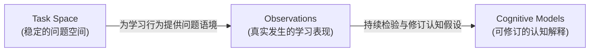

### 最小充分分辨率

模型不追求无限细分。Task Family 和 KC 都只应细化到能够显著改善诊断、Readiness 判断或 Intervention 决策的程度。认知上“仍然可以继续拆”并不构成继续建模的理由。

这一原则同时适用于 Task 与 KC：

> **Minimum Sufficient Task Resolution**：Task Family 应足够细，以区分具有不同学习与决策意义的问题结构，但不能细到把表面情境、数值和具体题目都建成独立 Task。

> **Minimum Sufficient Cognitive Resolution**：KC 应细化到能够解释稳定的跨任务表现差异，并支持有意义的不同介入；继续拆分如果不能改善 Evidence Attribution、Diagnosis 或 Decision，则不应增加模型复杂度。

### 诊断分辨率按需提升

DeerMind 不默认对所有学习活动进行最高精度认知诊断。绝大多数自然学习证据首先用于更新 Task-level Proficiency。只有当 Task-level 信息不足以支持一个重要决策，并且进一步区分认知原因会改变 Intervention 时，系统才进入 KC-level Diagnosis。

这一原则称为：

> **Progressive Diagnostic Resolution**

它是 DeerMind 控制认知建模成本与学生注意力成本的核心机制。

### 模型复杂度不得超过可观察性

任何被建模的认知差异，都必须具有现实可获得的证据路径。无法被稳定观察、无法区分、无法影响决策的认知构念，即使理论上存在，也不应在当前版本进入 operational model。

### Readiness 与 Decision 分离

Readiness 回答的是“当前是否具备合理进入某个学习目标的条件”；Decision 回答的是“现在是否值得采取行动”。一个学习目标可以已经 Ready，但 DeerMind 仍然选择等待学校教学、等待自然证据或不进行任何主动介入。

---

# 2. 领域学习架构

## 2.1 双空间模型

DeerMind 的领域学习架构由两个基础空间组成。

**Task Space** 描述外部问题结构。它回答“学习者被要求完成什么”。Task Space 不假设学习者内部存在何种认知结构，也不把教材章节直接等价于知识结构。

**Cognitive Space** 描述可用于解释学习表现的潜在认知成分。它回答“为什么不同任务上的表现会出现稳定的共同模式，以及哪些认知差异值得被诊断和干预”。

二者之间不是父子关系，而是通过学习表现建立映射。

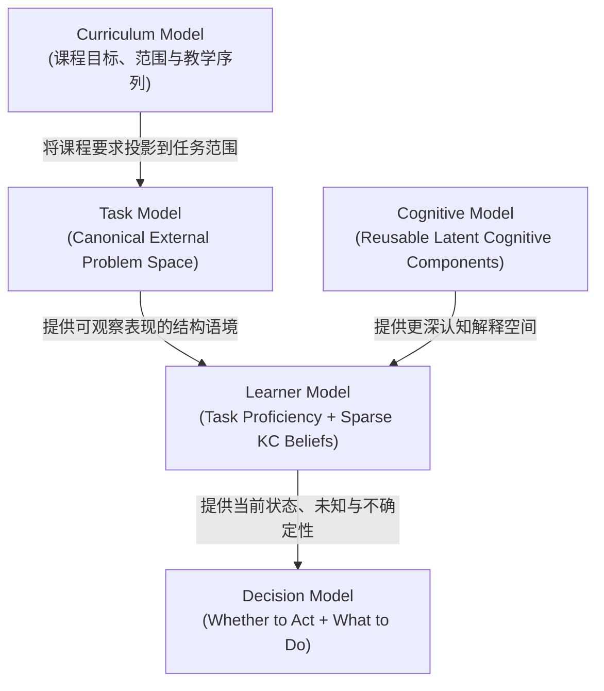

这一架构意味着，Curriculum 不需要直接决定 KC Ontology。不同教材和教学序列首先映射到 Canonical Task Space，再由 Task / Solution / Step 与 KC 之间的关系解释其背后的认知要求。

## 2.2 Task-first 与 KC-on-demand

v0.2 采用 **Task-first, KC-on-demand** 作为默认学习建模策略。

Task-level 信息具有三项优势。首先，Task 是现实课程、作业、考试和学习活动中天然存在的对象，比隐藏认知成分更容易观察。其次，Task-level Proficiency 在大量场景中已经足以支持课程进度、问题定位和 Readiness 判断。再次，外部学习证据通常只有题目、结果和有限过程信息，强行把所有 Task Error 直接归因于 KC 会造成虚假精确。

因此，DeerMind 不要求所有 Task 在进入系统时就拥有完整的 KC decomposition。一个 Task Family 可以长期只存在 Task-level Proficiency；当其表现异常具有重要学习价值，且不同潜在原因会导致不同 Intervention 时，才进入更细的 Strategy / Step / KC 分析。

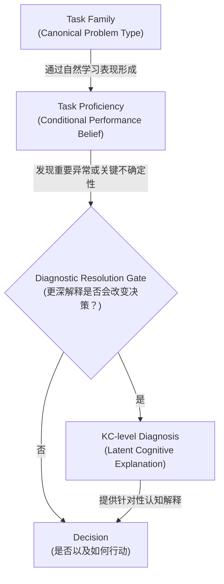

## 2.3 模型职责边界

Task Model 不承担认知原因解释；KC Model 不重复表达“能不能做某类 Task”；Learner Model 不把推断结果当作学习者真实状态；Task Learning Structure 不等同于数学上的 Task 结构；Readiness 不替代 Decision。

这一职责分离避免了早期模型中的一个根本问题：把 Curriculum、Task、Capability、KC、Prerequisite 和 Learner State 全部压入一张 Knowledge Graph。v0.2 不再追求一张“解释一切”的统一图，而采用多个语义清晰、可以独立演进的模型视图。

---

# 3. Task Model

## 3.1 Task Family 与 Task Instance

Task Model 描述某一学习领域中学习者可能被要求完成的 Canonical Problem Space。

DeerMind 不把一道具体题目定义为 Task Family。Task Family 是一组具有稳定数学或领域关系结构、明确目标和一致成功判据的问题集合；具体题目则是 Task Family 在特定参数、情境和表示方式下形成的 Task Instance。

Task Family 的基本结构定义为：

\[
TaskFamily =
(RelationStructure,\ Goal,\ RoleConfiguration,\ SuccessCriterion)
\]

Task Instance 则是：

\[
TaskInstance =
TaskFamily + TaskVariables
\]

其中，Relation Structure 描述问题中的稳定关系；Goal 描述学习者最终需要完成的认知或操作目标；Role Configuration 描述已知量、未知量和对象角色；Success Criterion 定义何种表现构成任务完成。

Task Variables 用于表达不应直接制造新 Task Family 的变化，例如数值复杂度、语言情境、表示方式、信息显式程度、辅助条件以及是否存在无关信息。

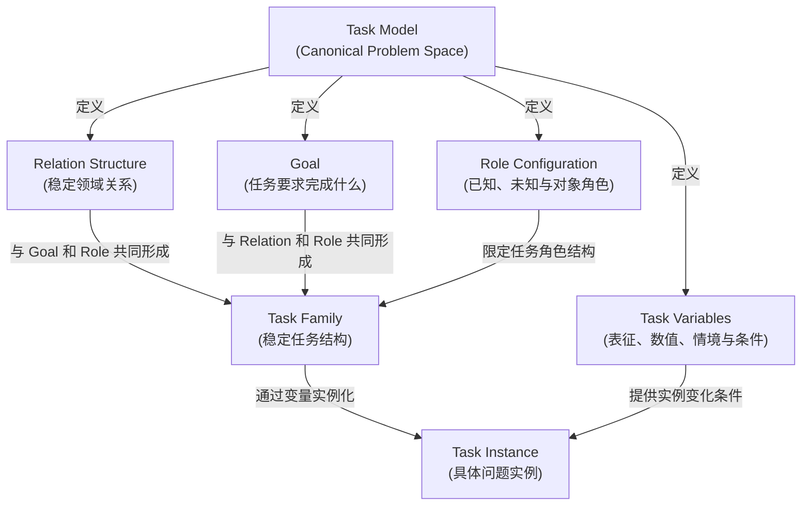

## 3.2 Task Family 的生成而非枚举

DeerMind 不采用人工维护数百种彼此独立“题型标签”的方式建立 Task Space。Task Space 应通过少量稳定的 Relation Structure、Goal 和 Role Configuration 组合产生 Task Families。

以比例推理领域为例，`Find Part`、`Find Whole` 与 `Find Ratio` 不必天然成为三个完全独立的本体对象。它们可以共享 Part–Whole relation，通过不同 Goal 和 Unknown Role 形成不同 Task Family。

类似地，“百分数表示”“分数表示”“表格呈现”“图像呈现”原则上首先属于 Task Variable。只有当真实学习数据表明某种表示方式形成稳定、具有独立诊断和干预价值的学习差异时，才考虑将其提升为更高层级的 Task distinction。

这种生成式 Task Model 有两个目的：一是避免题库规模直接导致 Task Ontology 膨胀；二是保留未来通过数据验证某些变量是否值得升级为结构性差异的能力。

## 3.3 Composite Task

复杂任务可以由多个较基础 Task Component 组成，因此 Task Model 允许递归组合。但 Task Composition 描述的是问题本身的语义结构，而不是学生实际解题时必须执行的步骤。

例如，多阶段比例变化问题可以包含初始状态建立、第一次比例变化、状态更新、第二次比例变化和最终关系判断。学生可以通过顺序计算、统一代数表达、图形表示或其他合法策略完成同一个任务。Task 的结构分解不能被错误地当作唯一解题路径。

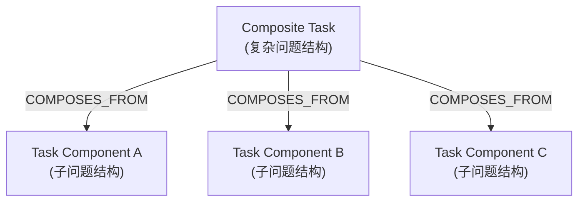

当某一种 Composite Pattern 在大量真实问题中反复出现，并且具有稳定的学习意义时，该组合结构本身可以成为 Canonical Task Family。Task Family 是否为 Composite，与其是否值得作为稳定任务单元并不冲突。

## 3.4 Task Semantic Structure 与 Solution Structure 分离

Task Semantic Structure 描述题目客观包含哪些对象、关系、约束和目标；Solution Structure 描述学习者可以如何解决问题。

同一个 Task Family 可以存在多条合法 Strategy，也可能出现稳定的错误 Strategy。Solution Strategy 由若干可观察或可推断 Step 组成，而 Step 才是进一步连接 KC 的主要 operational unit。

因此，Task Model 不应内置唯一 `Task → Step1 → Step2 → Step3` 路径。

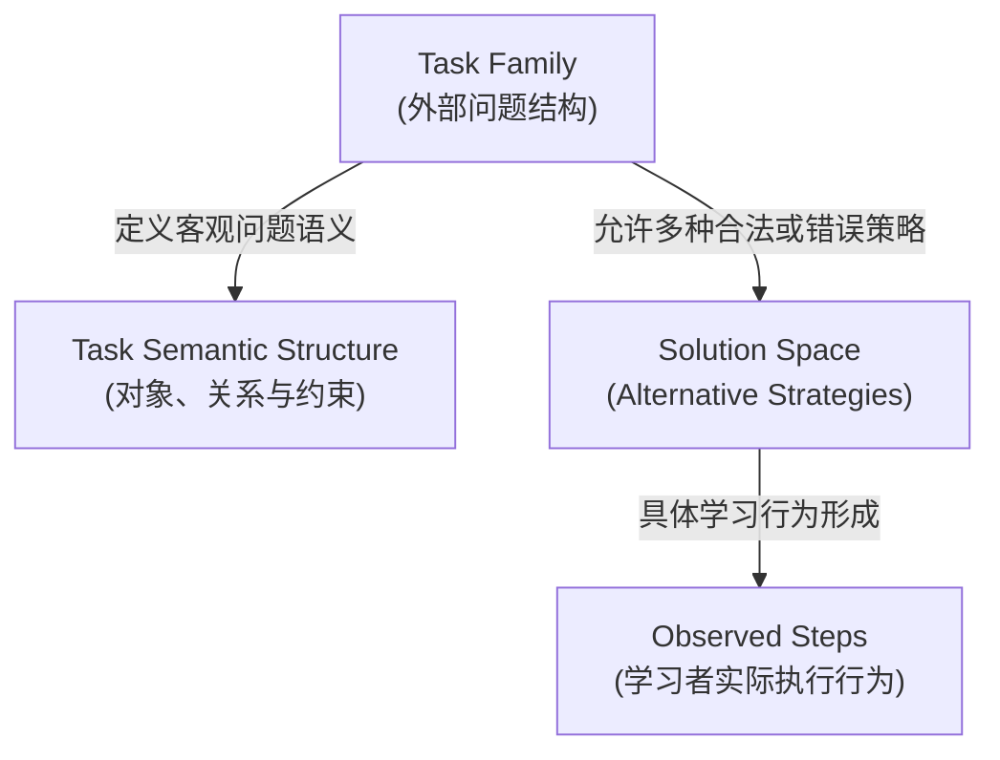

Solution Space 在 v0.2 中属于 Task 与 Evidence 之间的解释结构，不单独提升为新的一级 Core Model。

---

# 4. Cognitive Model

## 4.1 Knowledge Component 的定义

DeerMind 采用广义 Knowledge Component（KC）作为 Cognitive Model 的基础认知单元，不再预先把学习构念硬性划分为 Knowledge 与 Capability 两套独立本体。

KC 定义为：

> **一种后天形成、具有相对稳定认知意义、能够通过一组相关任务或问题解决步骤中的表现被推断，并且其区分能够改善诊断、迁移判断或学习决策的可复用认知成分。**

该定义有意保持理论中性。KC 可以对应事实、概念、原则、程序、策略成分、schema、skill 或其他具有 operational value 的认知结构。v0.2 不建立完整的 KC taxonomy，除非未来发现不同类型 KC 必须采用明显不同的 Evidence、Diagnostic 或 Intervention 机制。

KC 不是教材“知识点”的同义词，也不是 Task Family 的另一种命名方式。

## 4.2 Task、Strategy、Step 与 KC 的关系

KC 的 operational grounding 来自 Task 和实际问题解决过程。

Task 定义需要解决什么；Strategy 表示学习者可能采用何种问题解决路径；Step 表示该策略中可观察或可推断的中间行为；KC 则解释完成这些 Step 可能需要哪些可复用认知成分。

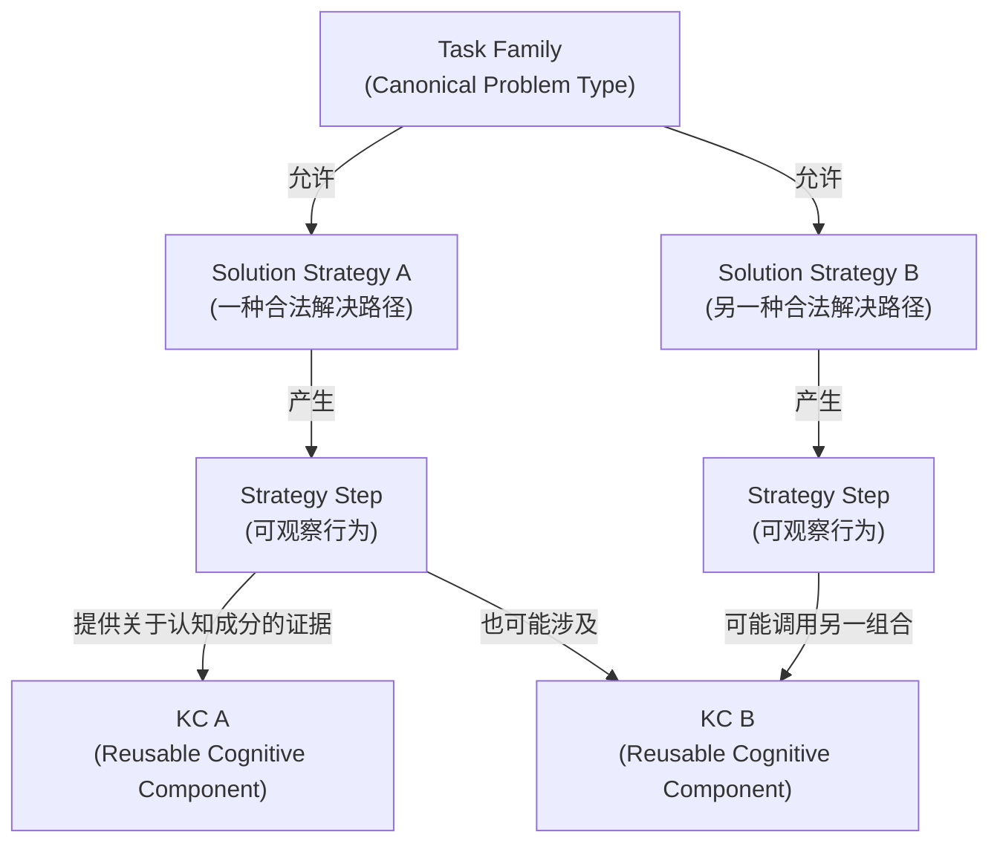

一个 Step 可以关联多个 KC；同一个 KC 可以参与多个 Task 和 Strategy；同一个 Task 可以通过不同 Strategy 成功完成，因此不能把某个 Task 的成功简单表达为所有潜在 KC 的逻辑 AND。

这也是 v0.2 不采用简单递归 KC Tree 的原因。高层 Task capability 往往存在多种合法实现路径，而这些路径可能调用不同 KC 组合。把“解决某类问题的能力”重复建成一个高层 KC，通常只会复制已经存在的 Task Proficiency，而不会增加解释价值。

## 4.3 KC 的准入标准

Candidate KC 不因专家命名而自动成为 Canonical Cognitive Model 的组成部分。一个 KC 应通过理论、任务分析和真实学习数据逐步获得 operational legitimacy。

判断一个 Candidate KC 是否值得保留，应至少考察以下方面：

| 维度 | 核心问题 |
|---|---|
| 跨任务复用 | 是否能够解释多个相关 Task、Strategy 或 Step，而不是只描述一道题 |
| 解释价值 | 是否能够解释稳定的共同成功、共同失败或迁移差异 |
| 证据可分离性 | 是否能够通过实际 Observation 与其他竞争解释区分 |
| Intervention 价值 | 不同 KC 判断是否会导致有意义的不同介入 |
| 经验稳定性 | 学习数据是否支持该构念具有相对稳定性和可重复性 |
| 复杂度收益 | 继续拆分后是否产生足够的诊断或决策收益 |

因此，KC Definition 是一个可检验的认知假设，而不是对学习者真实内部结构的最终声明。

## 4.4 KC Model 的可演化性

KC Model 必须 Canonical，但不能 Immutable。

Canonical 的含义是：在当前版本下，不同 Curriculum、Task 和 Learner 可以引用同一套认知构念坐标系。Immutable 则意味着构念一旦建立便永远不能修改，这与认知建模的经验性质冲突。

随着学习数据积累，KC 可以被：

- Split：一个原本过粗的 KC 被证明包含多个稳定差异；
- Merge：多个 KC 无法在 Evidence 或 Decision 上有效区分；
- Re-map：Step–KC Mapping 被证据证明需要调整；
- Retire：某个 KC 长期缺乏独立解释或决策价值；
- Reinterpret：KC 的定义或适用范围被重新界定。

KC 的演化不能修改已经发生的原始 Observation，而应通过版本化模型重新解释历史 Evidence。

---

# 5. Learner State 与渐进式诊断

## 5.1 Learner Model 的双视图

Learner Model 不再只定义为“对 Learning Constructs 的 Belief”。v0.2 将其扩展为两个互补但不同的状态视图：

**Task Proficiency View** 描述学习者在给定 Task Family 和规定条件下稳定完成任务的当前能力估计。

**KC Belief View** 描述 DeerMind 对潜在认知成分的当前解释性判断，并保留显式 uncertainty。

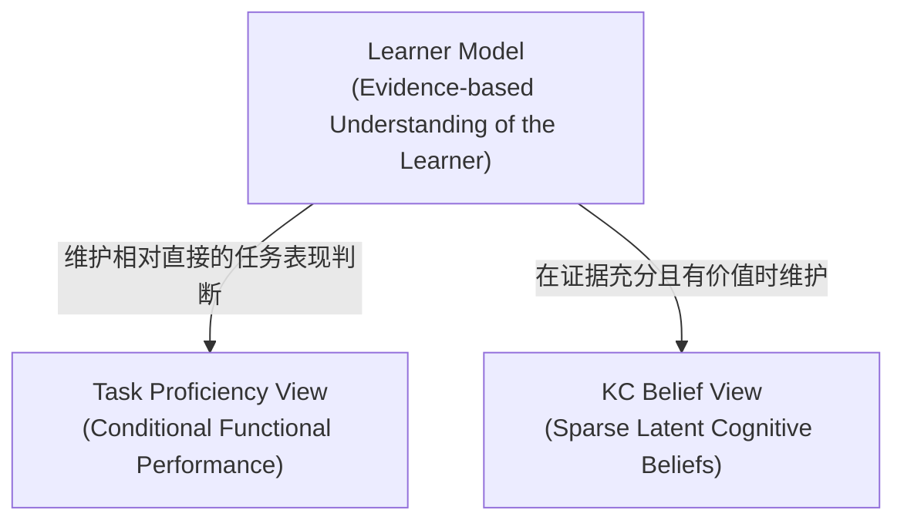

两者不是 parent-child 状态，也不能直接相互赋值。

Task Failure 不意味着所有相关 KC 都失败；KC Belief strong 也不意味着某个从未接触的新 Task 已经 mastered。

## 5.2 Conditional Task Proficiency

Task Proficiency 的正式定义为：

> **学习者在某个 Canonical Task Family 及规定 Task Conditions 下稳定完成任务的当前能力估计。**

它不是 knowledge mastery。

同一个学习者可能在简单整数条件下表现稳定，而在复杂分数、陌生表示或强时间压力下表现不稳定。因此 Task Proficiency 在概念上应被理解为：

\[
Proficiency(T \mid Conditions)
\]

Task Conditions 可以包括表示方式、数值复杂度、辅助程度、时间要求、工具可用性以及其他对表现有实际影响的条件。

v0.2 不要求立即为每一个 Condition 建立独立状态维度，但模型必须保留这种条件性，避免把所有表现差异误解释为知识状态差异。

## 5.3 Observation、Evidence 与 Diagnosis

Observation 是现实中发生的学习事件；Evidence 是 Observation 在特定 Task 与 Context 下对某个判断所具有的意义；Diagnosis 是系统在累积多个 Evidence 后形成的 Learner State 推断。

三者必须严格区分。

例如，一道 Changing-Referent Task 的最终答案错误，只能形成关于该 Task 的负面表现证据。除非书写过程、策略选择或主动诊断提供更多信息，否则不能直接推出 Referent Binding、Fraction Arithmetic 或 Proportional Reasoning 中的任何一个 KC 弱。

当一个 Observation 同时可以由多个原因解释时，Diagnostic Model 应维持竞争性假设，而不是强制单因归因。

## 5.4 Progressive Diagnostic Resolution

DeerMind 默认停留在最低但足够支持决策的诊断层级。

典型流程如下：

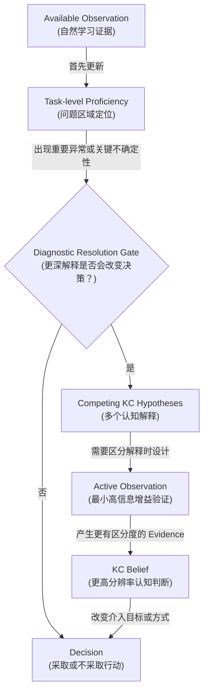

触发 KC-level Diagnosis 的典型情形包括：不同潜在原因会导致明显不同 Intervention；同类 Task 反复出现稳定异常；多个 Task 出现可由同一认知成分解释的共同模式；当前学习目标价值高且 uncertainty 会显著影响决策。

单次 careless error、当前无实际学习价值的问题、无论原因如何 Intervention 都相同的情况，以及额外诊断成本高于潜在收益的情况，不应触发深度诊断。

---

# 6. Task Learning Structure、Readiness 与模型演化

## 6.1 Task Learning Structure

Task Model 描述“问题是什么”，Task Learning Structure 描述“这些 Task Proficiency 在真实学习者中通常如何共同出现和发展”。

两者必须严格分离。

例如，`Find Part` 在数学结构上可能是 General Missing-Value 的一个特殊形式，但这并不能直接证明“必须先掌握 Find Part 才能学习 General Missing-Value”。数学结构关系、经验 mastery relation 和学习因果 prerequisite 是不同命题。

Task Learning Structure 因此被定义为：

> **基于领域假设和真实学习数据形成的、关于 Task Proficiency 状态组合与状态扩展可行性的版本化经验模型。**

其第一版可以由领域专家、成熟理论和课程实践形成 Seed Structure，但任何学习关系都只能视为待验证假设。

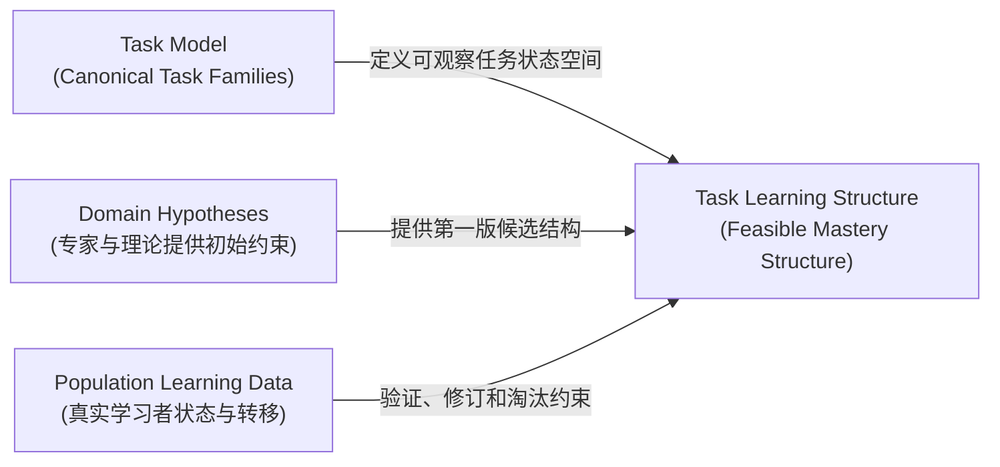

## 6.2 不把 Difficulty 等同于 Prerequisite

Task Difficulty 描述某个 Task 在特定人群中的平均成功难度；Task Learning Structure 描述不同 Task Proficiency 状态之间的联合分布、典型组合和可行转移。

一个 Task 更难，并不意味着另一个 Task 是它的 prerequisite。一个 Task 通常与另一个 Task 同时被掌握，也不意味着前者是后者的认知原因。

因此，v0.2 不把 `PREREQUISITE_OF` 作为未经验证即可由专家写入的核心关系。初始模型更适合采用中性概念，例如 Learning Constraint、Empirical Mastery Relation 或 Feasible-State Constraint。

## 6.3 Global Task State

Learner Model 中的多个 Local Task Proficiency 不应被理解为完全独立的字段集合。Task Learning Structure 可以作为 consistency prior，帮助系统判断某些局部 Evidence 是否可能受到测量噪声、Evidence Freshness、偶然失误或非典型经验影响。

例如，如果群体数据长期表明掌握 Task C 的学习者几乎都会稳定完成 Task A，而某个学生当前出现 `A weak / C strong`，系统不应强制修改 A，也不应无条件接受该组合，而应提高 uncertainty 并检查 Evidence 质量。

因此，Learner Model 可以形成两层 Task View：

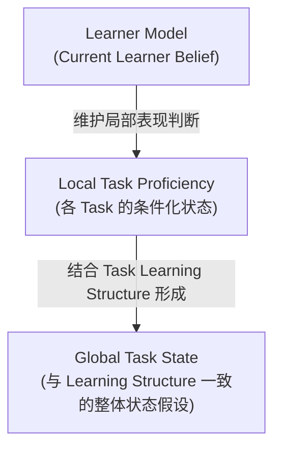

Global Task State 是推断结果，而不是覆盖原始 Local Evidence 的硬约束。

## 6.4 Readiness

Readiness 描述学习者当前进入某个目标 Task 或 Task Family 是否具有合理的学习条件。

KST / ALEKS 的 outer-fringe 思想为 DeerMind 提供重要基础：当前 learner state 周围满足 feasible learning structure 的直接扩展，可以形成候选 Ready Set。

但 DeerMind 不把 Readiness 简化为 Task State 的纯结构函数。已有 KC Evidence 和目标 Task Conditions 在重要场景下也应参与判断。

概念上：

\[
Readiness =
f(
TaskState,\
TaskLearningStructure,\
KnownKCBeliefs,\
TargetConditions
)
\]

该表达仅定义依赖关系，不规定具体算法。

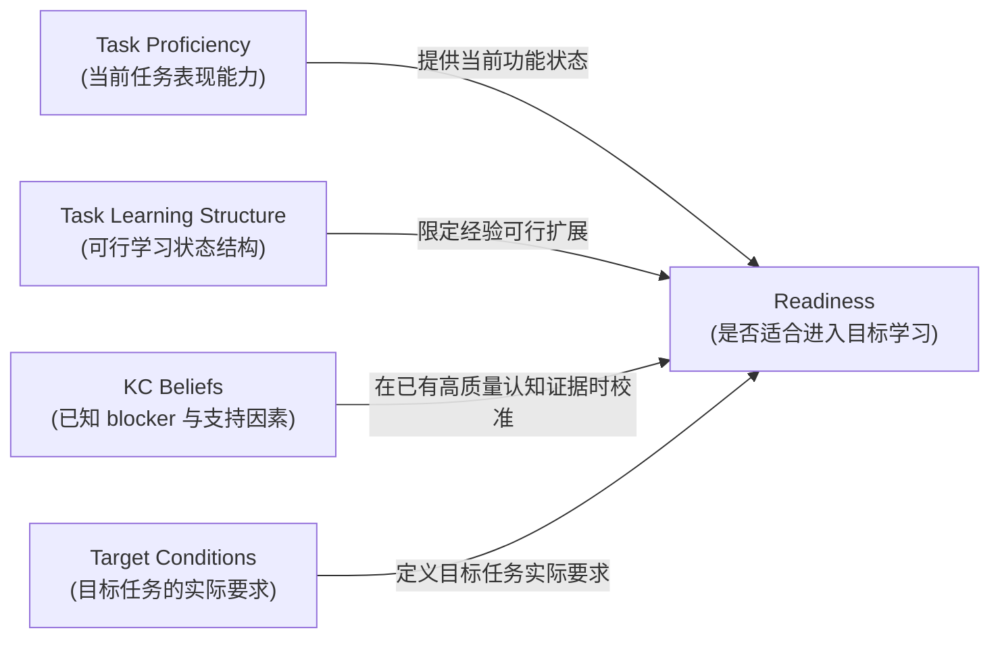

Ready、Unknown 与 Mastered 是三个不同概念。学习者可以从未做过某一 Task，因此 Task Proficiency 为 Unknown，但根据当前状态和 Learning Structure 已经高度 Ready；学习者也可以尚未 Mastered 某一 Task，但恰好已经进入最适合学习它的阶段。

## 6.5 Readiness 与 Decision 的边界

Readiness 只产生“可学候选”，不能直接产生 Intervention。

Decision Model 还需要考虑 Curriculum 当前目标、学校教学进度、任务的重要性、Evidence Gap、学生认知与注意力成本、自然学习机会以及主动介入的必要性。

因此：

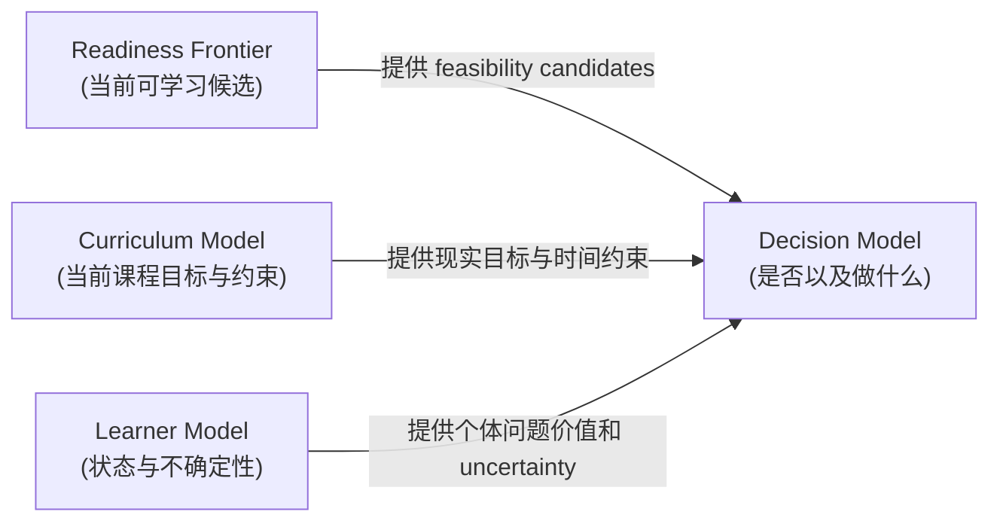

Ready 并不意味着 DeerMind 应该抢在学校之前教学。No Action、Wait for Natural Evidence、Observe、Verify 都是合法 Decision。

## 6.6 Model Evolution

Task Model、Task Learning Structure 与 KC Model 的演化机制不同。

Task Model 主要通过领域分析、Curriculum coverage 和真实 Task corpus 校准；其目标是保持问题空间的稳定、可生成和课程独立。

Task Learning Structure 主要通过真实学习者状态组合、纵向转移和干预结果进行验证，重点判断哪些状态组合和学习扩展具有经验支持。

KC Model 则通过 Step–KC Mapping、跨 Task 表现模式、Evidence Separability 和 Intervention Outcome 进行持续修订。

整个模型演化遵循统一原则：

> **Expert knowledge proposes; learner evidence constrains; decision value determines whether complexity is retained.**

---

# 7. 集成验证与阶段性结论

## 7.1 验证案例

以多阶段比例变化为例：

> 一个水箱原来装了总容量的 \(3/5\)，先用掉现有水量的 \(1/4\)，随后又加入水箱总容量的 \(20\%\)。现在水量占总容量的几分之几？

该问题可以定义为一个稳定的 Composite Task Family：

**Sequential Proportional Change with Changing Referent**

其 Task Semantic Structure 包含初始状态、基于当前状态的比例变化、状态更新、基于固定 Whole 的第二次变化以及最终相对量判断。

该 Task 允许多种合法 Solution Strategy。例如可以顺序计算：

\[
\frac35 \times \frac34 + \frac15
\]

也可以将水箱总容量离散为 20 份，通过数量状态变化得到最终 13 份。两种策略调用的具体计算 KC 不完全相同，因此 Task Success 不能定义为所有潜在 KC 的 AND。

## 7.2 Learner A：Referent Interpretation 问题

Learner A 在 Basic Part–Whole、Single Change 和 Same-Referent Sequential Task 上表现稳定，但在 Changing-Referent Task 上连续出现错误，并写出：

\[
\frac35-\frac14+\frac15
\]

该 Observation 首先形成明确的 Task-level negative evidence。由于书写过程显示学习者把“当前水量的 \(1/4\)”错误绑定到总容量，Referent Binding 与 Referent Switching 成为高价值 competing hypotheses。

系统不需要重新测试整个比例单元，而可以采用极低成本的 Active Observation，询问“当前量的三分之一是否等于总量的三分之一”一类几乎不需要计算的高区分度问题。

若额外 Evidence 支持 referent hypothesis，则 KC Belief 可以局部更新，并驱动针对 Referent Binding 的 Intervention。

该案例说明：Task-level 定位问题区域，KC-level 解释为什么出错，二者承担不同职责。

## 7.3 Learner B：Task Error 不等于 Domain Understanding Failure

Learner B 正确写出：

\[
\frac35\times\left(1-\frac14\right)+\frac15
\]

但最终把：

\[
\frac9{20}+\frac4{20}
\]

计算为：

\[
\frac{12}{20}
\]

如果系统只保留最终答案，Learner A 与 Learner B 都属于 Task Failure。但过程 Evidence 显示 B 对 proportional operator、referent binding、state transition 均具有正面证据，异常更可能属于 arithmetic execution。

因此，DeerMind 对 B 的合理 Decision 不是重教比例，而是根据当前课程目标决定是否忽略一次计算 slip、验证分数运算，或暂时使用更简单数值继续观察比例推理本身。

该案例验证了：

\[
TaskFailure
\not\Rightarrow
DomainUnderstandingFailure
\]

同时说明 Task Proficiency 必须是 conditional functional performance，而不能被命名为 knowledge mastery。

## 7.4 Learner C：Unknown、Ready 与 Mastered 的分离

Learner C 已稳定完成 Basic Part–Whole、Single Change 和 Same-Referent Sequential Tasks，但从未遇到 Changing-Referent Task。

此时：

- 目标 Task Proficiency 为 Unknown；
- Task Learning Structure 可能强烈支持该 Task 位于当前 Readiness Frontier；
- Curriculum 尚未进入该内容时，Decision 仍然可以是 No Action。

这种状态验证了三者之间的独立性：

> **Unknown 不等于 Not Ready；Ready 不等于 Mastered；Ready 更不等于 Should Act Now。**

这正是 DeerMind 区别于简单 Mastery Progression System 的关键设计。

## 7.5 完整学习闭环

v0.2 的完整工作流如下：

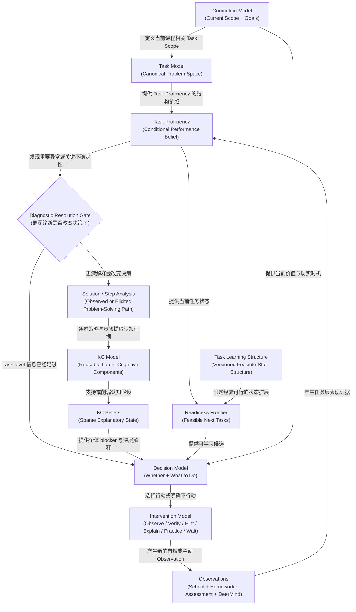

该闭环在不引入额外一级模型的情况下，可以同时解释 Task-level 状态、深层 KC diagnosis、Readiness、No Action 和针对性 Intervention，因此通过 v0.2 阶段的架构集成验证。

## 7.6 v0.2 的核心设计结论

DeerMind 不再以一个预先完备的 KC Graph 作为学习系统的绝对地基。更稳定的基础是 Curriculum、Canonical Task Space 和真实 Observation。KC Model 是对跨 Task 表现模式的可修订认知解释层。

Task Model 与 Cognitive Model 是两个独立空间。Task 描述学习者被要求解决什么，KC 描述哪些潜在认知成分能够解释不同 Task / Strategy / Step 之间的稳定表现差异。

Task Proficiency 是 conditional performance belief，而不是 knowledge mastery。它可以具有很高可信度，同时 KC 原因仍然 Unknown。

KC Diagnosis 默认是 sparse 的。系统只在 Task-level 状态不足以支持重要 Decision 时提高认知分辨率。

复杂 Task 可以递归组合，但 Task decomposition 与 Solution Strategy 必须分离。同一个 Task 可以存在多种合法 Strategy，不同 Strategy 可以调用不同 KC 组合。

能直接由 Task Proficiency 表达的“解决某类 Task 的能力”默认不重复创建高层 KC。只有能够跨多个 Task、具有独立解释与 Intervention 价值的认知构念，才应进入 KC Model。

KST / ALEKS 对 DeerMind 最主要的贡献位于 Task Proficiency Space：通过 feasible mastery states 和状态扩展帮助形成 Task Learning Structure 与 Readiness Frontier，而不是用于预先构造 KC prerequisite graph。

Task Learning Structure 是经验模型而不是领域本体。专家负责提出第一版候选结构，真实学习数据负责验证和修订，任何学习关系都不因专家共识自动成为认知真理。

Readiness 是 feasibility judgment，Decision 是 value judgment。一个学习目标可以 Ready，但 DeerMind 仍然选择等待、观察或不采取任何行动。

## 7.7 当前边界与后续工作

v0.2 已经完成的是学习模型的概念结构收敛，而不是实现算法选择。以下问题明确留到后续阶段处理：

Task Proficiency 如何估计、不同 Evidence Source 如何赋予可信度、Evidence Freshness 如何进入状态更新、Step 如何从开放式书写与对话中提取、KC Belief 使用何种统计或 AI 方法维护、Task Learning Structure 如何从纵向数据学习、Readiness 如何量化，以及模型版本升级如何处理历史 Evidence。

这些问题不会改变 v0.2 的基本职责分离，因此应在本版本冻结后分别进入后续 Concept Refinement、Experiment Design 或 System Design，而不继续扩张当前基础模型。

---

# Theoretical Foundations & References

本设计并非对任何单一教育理论的直接实现，而是对多套成熟理论与工程实践进行职责拆分后的综合设计。

**Evidence-Centered Design（ECD / ECDL / e-ECD）** 为 Observation、Evidence、Inference 之间的认识论边界提供基础，并强化了 State Evidence 与 Change Evidence、Proficiency 与 Task Context 之间的设计纪律。

**Knowledge-Learning-Instruction Framework（KLI）** 提供广义 Knowledge Component 的理论基础。KC 被视为能够从相关任务表现中推断的后天认知成分，而非狭义教材知识点。

**Cognitive Tutor / PSLC DataShop** 提供 Task / Problem、Strategy / Step 与 KC 之间的 operational mapping 思路，并通过 Learning Curve、model comparison、split / merge / remap 等方式展示 KC Model 可以作为经验性、可修订的认知假设。

**Knowledge Space Theory / Learning Space Theory / ALEKS** 提供 Task / Item-level knowledge state、feasible state space、outer fringe 与 readiness 的成熟理论和长期产品实践。v0.2 将其主要用于 Task Proficiency Space，而不是直接迁移为 KC prerequisite ontology。

上述理论均被视为 DeerMind 设计的证据来源，而不是不可修改的架构约束。DeerMind 的最终模型需要持续接受真实学习数据、跨场景泛化能力和实际学习决策效果的检验。

---

# Revision Note

v0.2 相比此前 Knowledge Model 方向发生结构性变化。原先以 `Knowledge + Capability + Typed Relations` 为中心的静态认知模型，被替换为 **Task Space + Cognitive Space + Progressive Diagnostic Resolution** 的双空间架构。Task Space 成为 operational foundation，KC Model 收缩为按需使用的 explanatory cognitive layer；Task Proficiency、Task Learning Structure 和 Readiness 共同承担原先被过度集中到 KC Graph 上的职责。

这一变化的目的不是削弱认知模型，而是提高其科学可证伪性、工程可落地性与长期演化能力，使 DeerMind 能够在不要求预先建立完美认知本体的前提下，从真实学习活动开始工作，并随着证据积累逐步提高模型分辨率。
