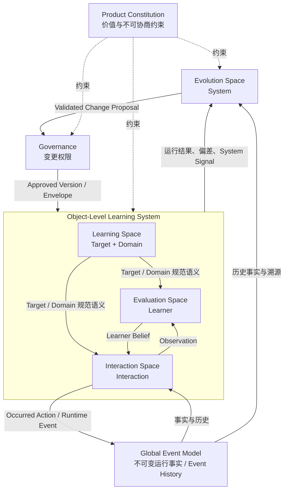

# DeerMind Concept Architecture v1.1

> **中文名称**：DeerMind 概念架构  
> **版本**：v1.1  
> **文档性质**：顶层概念架构 / Architecture Baseline  
> **状态**：架构冻结基线  
> **上位文档**：DeerMind Product Thesis v1.0、DeerMind Product Constitution v1.0  
> **下位文档**：Learning / Evaluation / Interaction / Evolution Space Design、AI-Native Architecture Principles、System Design  
> **更新时间**：2026-09-27  
> **版本说明**：v1.1 在 v1.0 四空间架构、全局事件模型、Evaluation 单写 Learner Belief、Interaction 决策权、Evolution / Governance 分离以及受控演化机制保持不变的前提下，完成三项上位语义修订：第一，DeerMind Core 从儿童学习场景一般化为面向真实学习过程的一般学习架构，小学保留为首个 Product Context；第二，Learning Space 正式增加 Learning Target 责任，使显式成功语义成为评估与交互的规范前提；第三，Product Constitution 的价值内容完全上移至 Product Constitution v1.0，Concept Architecture 只定义如何在架构层落实这些权限边界。经四份 Space Design v1.1 对齐与 Cross-Document Freeze Gate，本版本进一步收口 Authority Directive 不得绕过 Interaction Policy，并冻结 Target Binding 的事实、合法性与当前运行投影责任链；v1.1 现作为正式架构冻结基线。

---

## 1. 文档定位与架构命题

DeerMind 的目标不是在一次对话中给出更好的答案，而是长期参与真实学习过程：理解学习目标及其领域结构，形成对学习者能力的可修正认识，参与当下交互，并持续检验自己的模型和策略是否仍然成立。这四类责任面向不同的认识对象，也具有不同的事实来源、状态生命周期和变更权限；如果把它们混在同一套“智能体状态”中，系统最终会混淆规范要求、事实、解释、判断和行动。

本文档定义 DeerMind 的顶层概念架构。它承接 Product Thesis v1.0 的产品基础命题与 Product Constitution v1.0 的最高权限边界，回答系统必须维护哪些不可约的语义责任、这些责任如何协同，以及哪些架构边界必须长期稳定。它不是软件模块设计，也不预先规定数据库、服务拆分、模型供应商、提示词、部署拓扑或具体算法。

DeerMind 当前仍采用四个一级语义空间：

\[
\boxed{
DeerMind
=
LearningSpace
+
EvaluationSpace
+
InteractionSpace
+
EvolutionSpace
}
\]

四个空间分别面向四类不同的对象：**学习领域及其规范学习目标、学习者、交互、系统**。前三个空间构成面向真实学习过程的对象层学习系统；演化空间位于元层，负责认识和检验 DeerMind 自身。Learning Target 的引入扩展了 Learning Space 的内部责任，但没有产生第五类一级语义对象。

除了四个空间，系统还需要三个横切责任。**全局事件模型**提供全局事实契约，记录“什么确实发生过”；**Product Constitution** 作为上位文档限定系统不可通过普通优化突破的权限边界；**Governance** 规定谁有权在什么条件下改变正式系统语义与权限。三者都很重要，但都不构成第五个空间。

### 1.1 本文档不解决什么

概念架构有意停止在“语义结构与责任边界”这一层。以下内容不属于本文档的职责：

- 产品界面、交互形式和具体用户流程；
- 微服务、进程、数据库、消息队列和部署拓扑；
- LLM、传统模型、规则系统或统计模型的具体选型；
- 提示词、训练流程和推理服务实现；
- 事件存储、版本存储和依赖重算的工程机制；
- MVP 的功能排期和具体研发阶段；
- 治理机制的组织岗位、审批界面和运营工作流。

这些问题可以改变系统的实现方式，但不应反向改变本文档定义的语义责任。v1.1 已作为冻结基线；如果后续实现验证或实证结果证明这些责任无法表达某个重要问题，应明确通过 Evolution / Governance 重新打开对应架构判断，而不是通过实现细节静默改变语义归属。

---

## 2. 设计问题与第一性约束

四个空间不是从传统教育软件的模块名称演绎出来的，而是由 DeerMind 面对的现实约束推导出来的。理解这些约束，比记住空间名称更重要。

### 2.1 学习必须有显式成功语义与稳定领域语义

DeerMind 如果只知道“有哪些任务、解法和知识”，仍然不知道一个具体学习目的下究竟要达到什么范围、什么标准、在什么条件和支持边界下才算目标成立。没有显式成功语义，系统既无法可靠评价能力，也无法解释为什么某些任务重要、为什么某些证据足够或不足。

因此，Learning Space 不仅需要独立于具体学习者的 Task、Solution 与 Knowledge 领域语义，还必须能够把模糊意图、外部要求或领域目标解释为正式 Learning Target。Target 负责表达规范要求；Task、Solution、Knowledge 则提供能力表现、处理策略和知识基础（grounding）。四者都需要稳定身份、版本与来源，能够被 Evaluation、Interaction 与 Evolution 共同引用并接受后续修订。

这导出 **Learning Space**。它首先回答“什么叫达到这个学习目标”，然后才有资格回答“哪些任务体现该能力、这些任务怎样处理、依赖哪些知识结构”。

### 2.2 学习者的认知状态不可直接观察

DeerMind 永远不能直接读取一个学习者“真正会不会”。系统看到的只是行为、答案、书写过程、停顿、求助、语言表达以及外部提供的信息。这些事实需要先被解释，然后才可能成为支持或反驳某个学习者命题的证据。

因此，系统必须把“发生了什么”“我们如何理解它”“它对某个学习者命题意味着什么”“我们目前相信什么”分开处理。事实、观察、证据和信念属于不同层级，后文把这条边界作为 v1.1 延续的正式语义契约。

这不是术语洁癖，而是 DeerMind 的认识论底线。只要这四层被混合，系统就会很容易把自己的解释写回事实，把一次教学行为当成学习证据，或把任何学习者自述、外部主体陈述或制度结果直接当成学习者真实状态。

这导出 **评估空间**，同时要求观察不得与学习者信念混为一层。

### 2.3 认识学习者与决定如何行动不是同一件事

即使 DeerMind 有充分证据认为学习者当前尚未达到某项 Target 要求，也不能推出“此刻应该教学”。真实交互还受到当前任务、正式学习目标、外部义务、时间、学习者意愿、注意状态、已经暴露的信息、工具条件、安全边界与干预成本影响。

如果把“认识”与“行动”合并，系统会倾向于把任何能力差距或认识缺口直接转化成干预命令。这既破坏 Product Constitution 对学习者主体性和有界权限的要求，也会让 Evaluation 偷偷获得本应属于 Interaction Policy 的行动权。

因此，DeerMind 必须单独维护当前交互的语义状态，并由专门的策略责任决定是否行动、如何行动，以及何时保持沉默。

这导出 **Interaction Space**。

### 2.4 长期运行的系统必须允许“自己可能错”

即使学习空间、评估空间和交互空间的边界完全正确，它们内部的模型仍可能错误。某种 KC 划分可能没有解释力，某种观察可能经常误读行为，证据规则可能产生系统性偏差，交互策略也可能在短期指标上表现良好却削弱长期学习自主或制造不必要依赖。

因此 DeerMind 不能只在固定模型下适应学习者，还必须持续检验自己的模型、语义和策略。系统需要区分“运行中出现了异常”“我们认为系统哪里可能有问题”“为什么可能出问题”“什么证据足以支持修改”。

这导出 **演化空间**。

### 2.5 架构必须运行在 Product Constitution 的权限边界内

一个可以长期理解学习者、主动干预并持续改进自身的系统，风险不只来自模型错误，也来自局部优化成功逐步转化为权限扩张。学习效果、完成率、正确率、留存率、预测准确率甚至安全目标，都不能单独创造新的认识权、行动权或系统修改权。

这些价值与权限边界不再由 Concept Architecture 自己重新定义。Product Constitution v1.0 已冻结七个 Core Constitutional Domains 及其冲突处理原则；Concept Architecture 的职责是确保四个 Space、Global Event Model、Governance 与所有跨 Space Contract 都无法绕过这些上位边界。

因此，**Product Constitution** 是上位权限边界，**Governance** 是正式变更授权机制。前者回答“哪些收益不能换取许可”，后者回答“谁可以在什么证据、范围和审查条件下改变系统”。

### 2.6 从约束到架构

前述约束可以压缩成下表。

| 现实问题 | 必须维护的责任 | 架构归属 |
|---|---|---|
| 学习必须有显式成功语义和稳定领域坐标 | 定义 Learning Target、Task、Solution、Knowledge | Learning Space |
| 学习者状态不可直接观察 | 从 Observation 形成 Evidence，并维护 Learner Belief | Evaluation Space |
| 认识不等于行动 | 理解当前交互，维护运行状态并决定是否行动 | Interaction Space |
| 系统自己的模型可能失效 | 发现、解释并验证系统问题 | Evolution Space |
| 已发生事实不能被后续解释改写 | 提供全局发生事实与来源链 | Global Event Model |
| 系统能力和优化收益不能自动扩张权限 | 约束价值与权限边界 | Product Constitution v1.0 |
| 正式改变需要独立授权 | 定义变更与激活权限 | Governance |

四个 Space 仍对应四类不可约语义对象；Learning Target 进入 Learning Space，是对“学习领域及其规范目标”责任的补全，而不是新增一级语义世界。

## 3. DeerMind 顶层架构

DeerMind 的顶层可以理解为“两层四空间”，再加上一条全局事实底座和两类横切约束。对象层直接参与学习过程；元层观察并检验对象层是否仍然有效。

### 3.1 对象层：理解并参与真实学习

学习空间、评估空间和交互空间共同构成对象层学习系统。学习空间提供正式 Learning Target 与统一领域坐标；评估空间在这些坐标上形成对学习者的可修正认识；交互把当前事实、正式目标、学习者信念、外部义务与现实约束组合成行动决策。

这三者必须协作，但不能互相取代。学习空间不能因为某个学习者当前表现不好就修改 KC 语义；评估空间不能因为发现认识缺口就直接要求教学；交互空间也不能为了方便决策而私自修改学习者信念。

### 3.2 元层：系统认识自己

演化空间的对象不是某个学习者，而是 DeerMind 自己。它持续分析模型是否仍然解释现实，维护系统问题和竞争假设，设计验证，并把验证结果重新纳入系统认识。

演化空间可以高度自动化地认识系统，但它不因此自动获得改变系统的权限。这是 DeerMind 与无限制自我修改型智能体的关键区别。

### 3.3 全局事件模型：事实契约，而不是第五个空间

全局事件模型记录与 DeerMind 学习系统有关的、已经发生的事实。这里的“事实”是发生事实：例如“某个外部主体表达过某项判断”“系统展示过某个提示”“学习者提交过某个答案”。它并不意味着这些事件中的所有陈述都已经被证明真实。

例如，在小学 Product Context 中，家长转述“老师觉得孩子比例题不好”可以被记录为发生事实；在职业学习场景中，主管说“这个人排障能力弱”同样只是被报告的陈述。两者都不能直接升级成关于学习者能力的事实，仍需要 Evidence 与 Inference 支持。

全局事件模型不维护独立信念，也不负责决策，因此不构成第五个空间。

### 3.4 产品宪法与治理机制

Product Constitution v1.0 作为 Concept Architecture 的上位文档，规定 DeerMind 无权通过普通优化突破的价值与权限边界；Governance 规定谁有权在什么证据、风险和审查条件下改变正式系统语义。二者都横跨四个 Space，但都不是新的语义世界。

三者的关系可以压缩成一句话：**演化负责形成认识，治理负责授予权限，宪法负责限定边界。**

---

## 4. 四个语义空间

四个空间分别拥有不同的语义对象和写入权限。这里仅定义它们在概念架构中必须稳定的职责；具体实体、关系、数据结构和推理方法由对应专项设计文档继续展开。

### 4.1 学习空间：定义学习目标与领域语义

学习空间是 DeerMind 的规范学习语义层。它不仅定义领域中的任务、解法和知识，还定义在一个正式学习目标下“什么范围和标准才算目标成立”。其他空间必须围绕同一组 Target 与领域对象进行观察、评估、决策和验证。

\[
\boxed{
LearningSpace
=
TargetModel
+
TaskModel
+
SolutionModel
+
KnowledgeModel
}
\]

四个模型承担不同责任：**Target Model** 回答“学到什么范围、达到什么标准、在什么条件和责任边界下才算目标成立”；**Task Model** 回答“能力在哪些情境化认知或行动责任中体现”；**Solution Model** 回答“这些 Task 可以怎样有效处理”；**Knowledge Model** 回答“处理这些 Task / Solution 依赖哪些可复用知识或技能结构”。

Target 是规范性语义，而不是 Learner State。它可以来源于学习者意图、合法外部制度要求或专业领域目标的解释，但 `Goal Intent`、`External Standard / Obligation` 与正式 `Learning Target` 必须保持区分。External Standard 在其制度范围内可以具有真实约束力，但不能自动成为普遍的能力真理；Learning Target 必须保留其来源、解释与适用范围。Learning Target 也不拥有学习路径：教学顺序、计划和当前下一步行动仍属于 Interaction Policy 的策略责任。

Task、Solution 与 Knowledge 提供可共享的领域结构；Target 则在这些结构之上表达当前学习目的对应的规范要求。Target 不应退化成 KC checklist，也不应因为某个学习者当前水平不同就被静默改写。Learning Space 可以拥有多个 Target，并允许它们在范围、成功语义、条件和认知责任边界上显式版本化。

学习空间不拥有“某个学习者是否已经达到 Target”“某个学习者是否掌握某个 KC”，不判断一次行为是否构成 Evidence，也不决定当前应该采取什么行动。`KC`、`Task Family` 和 `Learning Target` 属于 Learning Space；`KCBelief`、`TaskProficiencyBelief` 属于 Evaluation Space；Target 是否被当前 Learner Beliefs 支持则属于跨 Space 派生判断。

Learning Space v1.1 将负责展开 Target Model、Task / Solution / Knowledge 的通用化语义以及它们之间的版本与 grounding 契约。当前 v1.0 Space Design 在完成该修订前不再视为与本候选 Concept v1.1 完全对齐。

### 4.2 评估空间：形成对学习者的可修正认识

评估空间回答一个更严格的问题：**基于目前已经观察到的事实，DeerMind 对这个学习者应该相信什么，以及为什么？**

它不直接读取学习者的“真实认知状态”，也不从原始事件自行建立第二套行为解释。评估空间的主要运行输入是交互空间形成的观察；它把观察放到明确的学习者命题上解释为证据，再综合相关证据修正学习者信念。

\[
\boxed{
Observation
\rightarrow
Evidence
\rightarrow
Inference
\rightarrow
LearnerBelief
}
\]

当前评估空间由三个核心模型组成：

\[
\boxed{
EvaluationSpace
=
LearnerStateModel
+
EvidenceModel
+
InferenceModel
}
\]

学习者状态模型规定 DeerMind 可以对学习者维护什么类型的命题；证据模型判断某个观察对某个命题意味着什么；推断模型综合相关证据，决定当前应维持怎样的信念。

当前规范学习者状态核心继续保持克制，只保留 Task Proficiency Beliefs 与 KC Beliefs。Learning Target 是规范要求，不进入 Learner State；本次修订不新增 `TargetBelief`、`TargetMasteryBelief` 或独立 `CapabilityBelief`。动机、意愿、疲劳、情绪、注意力、辅助依赖等不被默认提升为跨交互周期的学习者特征。这并不意味着它们不重要，而是意味着它们不能在证据不足时伪装成稳定的学习者事实。

Evaluation Space 是 Learner Belief 的唯一写入者。学习者自述、家长或教师评价、学校或认证结果、雇主反馈以及 DeerMind 自己的教学行为都只能成为事实、Observation 或 Evidence 的来源，不能直接覆盖 Learner Belief。

\[
\boxed{
Only\ EvaluationSpace\ may\ revise\ LearnerBelief
}
\]

同样重要的是，Evaluation Space 不决定行动。它可以暴露 Learner Belief、不确定性与认识缺口（Epistemic Gap）；Target 要求与 Learner Belief 的比较也可以形成 Target Assessment / Target Gap，但这些都不能直接要求系统出题、提示或教学。是否行动属于 Interaction Policy。

Evaluation Space 的核心模型结构保持 v1.0 结论不变；后续 v1.1 对齐只需要补充面向 Target 的输入、证据条件与派生评估契约。

### 4.3 交互空间：理解当前交互并决定是否行动

交互空间面向“现在正在发生什么，以及 DeerMind 此刻是否应该做什么”。它既不能退化为对话历史容器，也不能成为学习者状态的复制品。它需要在不污染长期认识的前提下，维护当前交互周期的语义状态，并把行动控制在产品宪法允许的范围内。

\[
\boxed{
InteractionSpace
=
ObservationModel
+
InteractionStateModel
+
ActionModel
+
InteractionPolicy
}
\]

观察模型把事件、学习产物和当前上下文转化为可被系统理解的观察。观察描述“在当前语境中观察到了什么”，但不直接断言学习者的潜在认知状态。例如 `ArithmeticMismatch` 可以是观察，而“DivisionKCWeak”属于后续学习者命题或推断问题。除非有明确、可验证的理由，观察生成不应由既有学习者信念反向塑造，否则系统很容易形成“先相信、再观察到自己所相信内容”的自我确认闭环。

交互状态模型维护当前仍然有效、进行中、待处理或形成约束的运行状态。它是事件、观察、时间和环境的可重建投影，而不是另一套事实历史。当前正式 Learning Target 的引用、Goal Intent、外部义务、截止时间、工具可用性、请求帮助、请求停止、已经暴露的提示，以及当前交互周期内的疲劳、情绪、注意力残余和当前意愿，都可以在这个层面影响决策；但这些短期条件没有跨交互周期学习者特征的权威。Target Binding 作为 learner / context 与 Target 的运行关系遵守同一原则：binding 的发生事实进入 Event History，外部 binding 的合法 authority 与 scope 来自 Product Context / Context Constitution，而当前仍然有效的 Target Binding projection 及其生命周期语义由 Interaction Space 负责。Interaction State 可以保存可重建投影，但不成为 binding 事实或 authority 的第二来源。

行动模型定义 DeerMind 能够控制的行为语义，例如要求学习者产生某种输出、暴露某种信息、改变交互生命周期。它需要显式描述信息披露和认知工作替代，因为这些因素会改变后续表现的证据价值。行动模型只描述“做了什么”，不负责判断该行为对某个学习者命题的证据意义。策略选中某个行动也不意味着该行动已经发生；只有真实执行并产生外部效果的行动，才能作为已发生事实进入 Event History，并进一步影响交互状态和证据。

Interaction Policy 负责真正的决策。它综合当前 Observation、Interaction State、Learner Beliefs、Learning Target、Target Assessment、现实约束以及 Product Constitution 所限定的 Constitutional Envelope，选择 `Execute(Action)`、`NoIntervention` 或 `Defer`。

\[
\boxed{
PolicyOutcome
=
Execute(Action)
\;|\;
NoIntervention
\;|\;
Defer
}
\]

`NoIntervention` 是一等结果。DeerMind 不预设“AI 总要做点什么”；任何干预都必须证明自己比不干预更有价值。交互策略还拥有多时间尺度规划责任，可以安排当前行动、阶段性学习机会和长期方向，但计划始终只是可修正的策略产物，不是事实、学习者信念或外部义务。

Learner 是 Core Architecture 中必然存在的学习主体；其他外部 Actor 是否存在、拥有什么合法权限，由具体 Product Context / Context Constitution 定义。小学场景可能存在 Parent / Guardian、Teacher、School，大学场景可能存在 Institution，职业学习可能存在 Employer 或 Certification Body；这些角色都不能因为现实身份而自动取得 DeerMind 的认识写入权或无限行动控制权。外部输入必须保留来源与权限语义，并区分 `Request`、`Constraint`、`Obligation` 与 `Authority Directive`。即使 Authority Directive 来自合法 Context Authority，也只能在明确 scope 内约束合法候选空间，不能绕过 Interaction Policy、Constitutional Envelope 或当前适用性检查。

Interaction Space 的核心模型结构保持 v1.0 结论不变；后续 v1.1 对齐需要清理旧有家长特定假设，并正式接入 Learning Target、Target Assessment、Context Authority 与由 Constitution 派生的约束。

### 4.4 演化空间：认识并验证 DeerMind 自身

演化空间处理的不是某个学习者的当前问题，而是 DeerMind 自己的模型、语义和策略是否仍然有效。它要能够把生产异常与系统问题区分开，把问题与解释区分开，把解释与改进方案区分开，并要求每一次正式变化接受独立于自身解释的验证。

\[
\boxed{
EvolutionSpace
=
SystemAssessmentModel
+
HypothesisModel
+
ValidationModel
}
\]

系统评估模型持续监测和分析系统表现，把多来源信号评估为具有明确支持度、范围和不确定性的系统问题。一个异常指标只是信号，不会因为语言上“看起来像问题”就自动升级成系统问题。

假设模型解释为什么可能出现该问题，并维护竞争假设、可检验预期和反证条件。必要时它可以形成修订候选，但问题、假设和修订候选必须保持分离。

验证模型检验假设和修订候选。历史重放、专家复核、影子验证、替代模型、外部结果，以及有限的前瞻性验证都可以成为验证手段。历史重放只能回答“已经发生的事实在新模型下如何被重新解释”，不能单独回答“如果当时采用另一种策略会发生什么”。方法选择取决于变更影响、可识别性、可逆性、学习者负担和证据独立性；如果在可接受条件下仍无法可靠识别，`NotIdentifiable` 是合法结果。

演化空间的输出是新的认识、证据和变更提案，而不是自动部署权限。验证证据必须重新回到系统评估；结构性或语义性变化必须进入 Governance。Learning Target Definition、Target 成功语义、Task / KC identity、Evidence 语义、State Type 与 Policy 语义 都属于可能被 Evolution 检验、但不能由运行时模型自行改写的正式语义。

Evolution Space 的三个核心模型保持 v1.0 结论不变；后续一致性修订主要增加 Learning Target 等新的规范语义 的演化对象与版本影响。

---

## 5. 系统运行与反馈闭环

静态职责只能说明“谁负责什么”；DeerMind 真正运行时，需要把这些职责连接成几个不同速度的反馈回路。v1.1 继续保留 v1.0 已冻结、且仍对系统结构有决定意义的四条闭环。

### 5.1 快速交互闭环：不必先更新长期信念

很多学习交互需要立即响应，却不值得先重算学习者的长期状态。例如小学场景中学习者在竖式计算里写错一个数字，系统可以识别局部算术不一致并决定是否给出最小提示，而不必先得出“学习者不会除法”的长期结论；职业学习场景中的一次命令错误同样不需要先形成长期能力判断。

\[
\boxed{
Event
\rightarrow
Observation
\rightarrow
InteractionPolicy
\rightarrow
Action
\rightarrow
Event
}
\]

这条快速回路保证 DeerMind 的即时交互不被长期推断链路绑死，同时也阻止策略把局部观察偷偷升级成学习者特征。

### 5.2 学习者评估闭环：从行为到可修正认识

当 Observation 与 学习者级命题 有关时，Evaluation Space 才把它解释为 Evidence，并更新 Learner Belief。Learning Target 不参与写入 Learner Belief，而是在 Belief 更新后与规范要求 组合形成可重算的 Target Assessment。

\[
\boxed{
Observation
\rightarrow
Evidence
\rightarrow
Inference
\rightarrow
LearnerBelief
}
\]

随后由 `LearningTarget + LearnerBelief → TargetAssessment` 形成目标相对判断；Learner Belief 与 Target Assessment 都只能作为 Interaction Policy 的只读输入，而不能自行产生 Action。

这条回路可以跨交互周期、跨时间运行。独立、受助、延迟、迁移等条件首先属于 证据语义，而不是把同一个学习者拆成多个互相竞争的“状态”。

一个典型例子是：DeerMind 教过某种方法以后，学习者立即完成了一次相似任务。这件事只能说明“在已有暴露条件下完成了该表现”；它不能直接证明独立掌握。只有后续独立表现、延迟保持或迁移任务，才可能形成更强证据。

### 5.3 系统演化闭环：系统也必须被现实挑战

对象层的长期偏差、模型冲突和外部理论可以进入演化空间，但不会直接变成变更结论。

\[
\boxed{
SystemSignal
\rightarrow
SystemAssessment
\rightarrow
SystemIssue
\rightarrow
Hypothesis
\rightarrow
Validation
\rightarrow
ValidationEvidence
\rightarrow
SystemAssessment
}
\]

系统评估判断“是否真的有问题”；假设回答“为什么”；验证回答“这个解释和候选修改是否经得住证据”。这三类认识必须保持分离，否则生产异常很容易被系统自己解释成支持某个修改的证据。

演化空间既支持问题驱动路径，也支持理论驱动路径。教育研究、专家判断或新模型可以直接提出假设，但来源权威永远不等于假设有效。

### 5.4 受治理变更闭环：认识不等于授权

充分验证的变更提案仍然只是一个提案。正式改变系统必须经过治理机制，并在部署后继续接受验证。

\[
\boxed{
ValidatedChangeProposal
\rightarrow
Governance
\rightarrow
ApprovedChange
\rightarrow
PostDeploymentValidation
\rightarrow
SystemAssessment
}
\]

如果验证需要真实学习者交互，治理机制只能批准“允许在什么范围内进行验证”，而不能直接命令某个学习者接受某个行动。个体层面的执行仍由交互策略根据当前学习者和当前上下文作最终决定。

因此：

\[
\boxed{
GovernanceApproval
\neq
LearnerLevelExecutionMandate
}
\]

---

## 6. 跨空间语义契约

DeerMind 最重要的架构价值并不只在于有四个 Space，而在于它们之间的语义归属。下面这些契约用于防止系统在长期演化中重新滑回“一个大模型、一个大状态、一个大而无边界的智能体记忆池”的混合结构，也用于保证新增 Learning Target 不会把规范要求、Learner Belief 和行动策略重新混在一起。

| 语义对象 | 主要归属 | 依据 | 生命周期与权威 |
|---|---|---|---|
| Learning Target | Learning Space | Goal Intent、External Standard / Obligation、领域模型与专业解释 | 规范语义；有身份与版本；不描述特定学习者当前会什么 |
| Event | Global Event Model | 已发生的现实或系统事实 | 追加式事实；后续解释不能改写 |
| Observation | Interaction Space | Event、学习产物、当前语境 | 可随 Observation Model 版本重新解释 |
| Evidence | Evaluation Space | Observation、Learner Claim、条件与溯源信息 | 可修正；只说明对某个 Learner Claim 的证据关系 |
| Learner Belief | Evaluation Space | 相关 Evidence | 可修正；仅由 Evaluation Space 写入 |
| Interaction State | Interaction Space | Event、Observation、时间与环境 | 当前运行投影；原则上可重建 |
| Target Assessment / Target Gap | 派生视图 | Learning Target + Learner Beliefs | 可重算；没有独立规范或认识权威 |
| Readiness / Context / Plan | 派生视图或策略产物 | 多个 Space 的输入 | 有决策价值，但没有独立事实或认识权威 |
| System Issue / System Hypothesis | Evolution Space | System Signal、Validation Evidence、外部理论 | 可修正的系统级认识，不直接产生变更权限 |

### 6.1 事实、观察、证据和信念必须分层

事件记录已经发生的事实；其中的“事实性”只表示某件事确实发生过，并不保证事件中所有陈述都为真。观察是系统对当前行为或产物的可修正语义解释；证据描述观察与某个命题之间的关系；信念则是综合相关证据后形成的当前认识。

\[
\boxed{
Event
\neq
Observation
\neq
Evidence
\neq
Belief
}
\]

这四层的权威不同。事件一旦发生就不能被后来的解释改写；观察可以随着模型版本变化而重新生成；证据可以随着命题、条件和溯源信息改变；信念本身只是一个可修正的认识立场，而不是学习者事实。

这种分层也意味着 `ReportedClaimEvent` 不等于 `ClaimIsTrue`，`TeachingAction` 不等于 `LearningEvidence`。DeerMind 可以记录“系统展示过答案”，但不能因此写入“学习者已经学会”。

### 6.2 规范领域语义与学习者信念必须分离

Learning Space 定义 Learning Target、Task、Solution、KC 等规范坐标；Evaluation Space 在这些坐标上维护面向特定学习者的 Belief。Target 要求说明“应达到什么”，Learner Belief 说明“基于当前 Evidence，我们相信学习者能做到什么”，两者属于不同权威。

因此必须长期保持：`Requirement != Evidence != Belief`。一个正式 Target 要求学习者独立完成某类 Task，不会因此产生任何学习者能力证据；反过来，一个学习者当前达不到某个 Target，也不能直接修改 Target 本身。只有当跨学习者、跨时间或外部现实证据表明规范 Target / Domain Model 自身失效时，问题才进入 Evolution。

这同样意味着 Learning Target、Task 与 KC 的版本变化可能使既有 Target Assessment 失效，但不能静默重写历史 Event 或过去在当时语义下成立的 学习者表现。

### 6.3 认识状态与运行时状态必须分离

学习者信念表示 DeerMind 对学习者的长期可修正认识；交互状态表示当前交互中仍然有效的运行状态。两者都可能影响决策，但来源、生命周期和写入权限完全不同。

疲劳、情绪、注意力残余和当前意愿等短期条件默认属于交互空间运行时语义。系统可以在当前交互周期中以带不确定性的方式使用这些条件，却不能把“这次显得疲劳”写成跨交互周期的稳定学习者特征。

\[
\boxed{
InteractionState
\neq
LearnerBelief
}
\]

### 6.4 理解与决策必须分离

Evaluation Space 可以输出 Learner Belief、不确定性和认识缺口（Epistemic Gap），但不能直接要求系统出题、提示或教学。跨 Space 派生的 Target Gap 同样只是“当前 Evidence 支持学习者尚未达到 Target requirement”的判断，不是行动命令。

必须区分两类 gap：**Target Gap** 表示当前 Evidence 已支持“能力低于目标要求”或“尚未达到要求的稳健性”；**Epistemic Gap** 表示系统没有足够 Evidence 知道 学习者 是否达到要求。前者是已知差距，后者是未知；把二者合并会让系统把“不会”和“还不知道会不会”错误地当成同一种问题。

因此：`TargetGap != EpistemicGap != Action`。最终行动只能由 Interaction Policy 在结合当前目标、负担、学习者意愿、外部义务、安全与 Constitutional Envelope 后决定。这条边界允许 DeerMind 同时承认“我不知道”“我知道还没达到要求”和“现在不值得采取行动”。

### 6.5 派生视图不能成为第二事实源

系统需要一些跨 Space 的派生视图，例如 Target Assessment、Target Gap、Readiness、Context 和 Assistance Context。它们有决策价值，但不能因此获得独立事实源或认识权威。

`TargetAssessment = Assess(TargetDefinition, LearnerBeliefs)` 用于回答“当前 Evidence 在这个 Target 版本下支持到什么程度”。它既不属于 Learning Space 的规范要求来源，也不属于 Evaluation Space 的学习者认识来源；必要时可以物化、缓存和版本化，但必须能够在 Target 或 Learner Belief 失效时重算。

Target Assessment 与 Readiness 不同。前者回答“是否达到这个 Target”，后者回答“当前是否具备进入某类 Task 或学习经验的条件”。`READY` 不等于 `TARGET SATISFIED`，也不等于 `SHOULD ACT NOW`。最终行动仍由 Interaction Policy 决定。

Assistance Context 可以快速告诉系统当前交互周期已经暴露过什么提示、答案或工具帮助，但关于真实 exposure 的权威依据必须追溯到已发生 Action Event。Plan 可以组织未来行动，却不能被当成已经发生的事实、Learner Belief、Learning Target 或不可撤销的外部义务。

Context 也不是万能容器。它只是多个 Space、Product Context 与现实约束在某次决策中的关系组合，不形成新的顶层语义归属。

### 6.6 版本、溯源、重放与失效传播

DeerMind 的正式语义会演化，因此任何重要派生结论都必须能够回答：它基于哪个 Learning Target 版本、哪个 Task / KC 版本、哪个 Observation Model、Evidence Rule 和 Inference Model 形成。Target Assessment 至少依赖 `Target Version + Learner Belief Version`；Target Definition 改版不能静默继承旧 Target Assessment。

当上游语义被修正或替换时，下游当前结论必须能够被定位并重新评估；但已经发生的 Event、Action Occurrence 和当时真实存在的外部约束不被重写。语义失效要求重新评估，不等于要求全系统同步重算；具体优先级、批量、异步和影响范围机制属于 System Design。

历史重放必须建立在真实事实依据上。如果系统声称某个 Event 支持 replay，而它引用的学习产物、呈现材料或外部结果已经无法还原，那么该 Event 不再具备完整历史重放能力。

\[
ReplayableEvent \Rightarrow ReplayableGrounding
\]

但历史重放能力不能反向创造无限数据权限。Product Constitution v1.0 的 Data / Epistemic Restraint 以及具体 Product Context 的合法删除、目的限定和保留策略优先于“为了方便历史重放永久保存”。当合法数据治理使 grounding 不再可恢复时，系统必须诚实降低历史重放能力，而不是扩大数据保留权。

## 7. 宪法、治理机制与受控演化

DeerMind 希望成为一个可以长期学习和改进的系统，但“可演化”不等于“可以自行重写一切”。Product Constitution v1.0 已经在 Concept Architecture 之上冻结不可被普通优化交易的价值和权限边界；本章不重新定义这些价值，而只说明它们如何约束架构，以及系统正式变化如何获得权限。

### 7.1 产品宪法：优化之外的价值边界

Product Constitution v1.0 不是 Concept Architecture 的内部原则列表，也不是另一个 Model 或奖励函数。Concept Architecture 的职责是提供足够清晰的语义归属与权限边界，使下位 Space 和 System Design 无法绕过上位 Constitution。

七个 Core Constitutional Domains 在架构层产生不同约束，但这些映射只是**落实机制**，不是对 Constitution 的重新定义：

| Constitution Domain | Concept Architecture 的主要落实责任 |
|---|---|
| Learner Agency & Cognitive Ownership | Learning Target 必须显式表达学习者应承担的认知责任；Gap 不自动成为 Action；辅助暴露可追溯 |
| Epistemic Integrity | `Event != Observation != Evidence != Belief`；只有 Evaluation 写 Learner Belief；UNKNOWN / Unresolved / NotIdentifiable 合法 |
| Non-Manipulation & Non-Dependency | Interaction Policy 保留 `NoIntervention`；Plan 与参与度指标不能取得事实或目标权限；支架与长期工具使用保持区分 |
| Bounded Authority | Evolution 与 Governance 分离；AI reasoning、验证成功、外部身份都不能自动产生提交或部署权限 |
| Learner Dignity & Data Restraint | 长期学习者模型、历史重放与推断受目的和比例限制；历史重放支持不产生无限保留权限 |
| Non-Discrimination & Equal Epistemic Standing | 群体先验不能直接成为个体 Evidence / Learner Belief；系统必须保留能够产生反证的机会，避免自我封闭认识循环 |
| Safety & Proportional Protection | Safety 约束可以影响 Interaction，但权限必须来自合法 Product Context / Governance；`AuthorityOverride != EpistemicEvidence` |

具体 Constitutional Core、冲突处理、Context Constitution 和 Emergency Authority 均以 Product Constitution v1.0 为准。Concept Architecture 不再维护第二份宪法内容副本。

### 7.2 治理机制：变更权限而不是第五个空间

治理机制回答的是“谁有权在什么证据、风险和审查条件下改变什么”。它不负责产生假设，也不替代验证。

\[
\boxed{
AbilityToUnderstandChange
\neq
AuthorityToExecuteChange
}
\]

演化空间可以自动监测、分析、提出候选、准备验证和形成推荐；这些能力本身不会产生部署权限。治理决策也应作为可追溯的系统事实记录下来，使每次正式变化都能回答“为什么改变、谁批准、证据是什么、适用范围是什么、如何回滚”。

### 7.3 变化等级

当前架构区分四级变化：

| 等级 | 典型变化 | 权限原则 |
|---|---|---|
| L1 — 学习者适应 | 当前任务、提示强度、节奏、是否主动评估 | 评估空间 + 交互正常运行 |
| L2 — 有界系统适应 | 已批准范围内的参数校准、策略变体切换、回滚 | 可在批准包络（Approval Envelope）内自动执行 |
| L3 — 结构/语义演化 | Learning Target Definition、Task / KC identity、State Type、Evidence、Inference、Action 与 Policy 语义 | 必须由相应 Governance 明确批准 |
| L4 — 宪法性变更 | Product Constitution v1.0 的 Core Constitutional Domain、不可侵犯核心边界或修订规则 | 进入独立 Constitutional Governance，不能由普通系统演化生效 |

L2 的自动化只在预先批准的适用范围、风险上限、证据阈值、激活边界、回滚条件和有效期内成立。超出边界必须重新进入治理机制。

### 7.4 演化空间契约

所有具有独立语义责任和演化生命周期的版本化系统组件，都必须能够被现实检验，而不能只定义“它是什么”。

\[
\boxed{
EvolutionContract
=
Identity
+
Version
+
ActivationBoundary
+
Provenance
+
ValidityScope
+
FalsifiableExpectation
+
ReplaySupport
}
\]

此外，重要语义依赖必须可追踪。对于运行中的组件，还需要明确自己的激活/一致性边界：一个版本获批，不意味着所有正在执行的事务立即切换。具体会话、交互周期、事件解释或验证任务在何处固定版本，由对应组件自己的一致性契约决定。

演化空间契约不是要求每个内部函数都变成版本化理论对象，而是约束那些一旦变化就会改变下游信念、策略或正式语义的组件。

### 7.5 核心架构不变量

概念架构正文继续只保留十条需要长期记忆的 Core Invariant；v1.1 新增的 Target / Context 边界先作为派生规则进入附录 A，避免 Invariant Inflation。

| 编号 | 核心不变量 |
|---|---|
| C1 | DeerMind 只承认学习领域、学习者、交互、系统四类一级语义责任；新增空间必须证明存在第五类不可约对象 |
| C2 | `Event ≠ Observation ≠ Evidence ≠ Belief` |
| C3 | 只有评估空间可以修改学习者信念 |
| C4 | 行动决策属于交互空间策略；认识缺口不自动形成干预命令 |
| C5 | 教学、提示或解释不直接推出学习者已经学会 |
| C6 | 正式版本内部语义受控，体系级语义通过演化空间 + 治理机制开放演化 |
| C7 | 自我改进不等于自我授权；验证通过不等于有权部署 |
| C8 | Product Constitution v1.0 是 Concept Architecture 的上位权限边界，不能被普通优化或下位架构绕过 |
| C9 | 重要派生语义必须绑定版本与溯源信息，并支持依赖失效后的重新评估 |
| C10 | 验证不能自我封闭；被验证模型不能成为验证证据的唯一解释来源 |

---

## 8. 架构决策、风险与下一阶段

概念架构的任务不是证明当前方案“唯一正确”，而是明确当前选择、替代方案和代价。只要这些权衡关系仍然成立，后续系统设计就应该尊重这里的边界；如果真实实现或实证结果产生反例，再重新打开架构。

### 8.1 关键架构决策

**D1 — 选择四个空间，而不是更多一级模块。**  
决策、学习者模型、支架、规划、上下文、准备度、事件都很重要，但“重要”不足以成为空间。只有拥有独立认识对象、稳定语义责任和无法被现有空间自然吸收的状态/信念/策略世界，才有资格进入顶层。当前压力测试没有发现第五类不可约对象。

**D2 — 观察属于交互空间，而不是评估空间。**  
把观察放进评估空间的优点是推断链路更集中，但会迫使即时交互依赖长期学习者推断，也容易让评估空间同时拥有“解释当前行为”和“形成学习者信念”两层责任。DeerMind 选择由交互空间生成观察，再由评估空间消费，从而保留快速交互路径，并减少自我确认闭环。

**D3 — 决策不成为独立空间。**  
行动选择与当前观察、交互状态、学习者信念、现实约束和产品宪法紧密耦合，本质上是交互空间的责任。单独建立决策空间只会把当前交互再拆成一层缺少独立语义对象的转发层。

**D4 — 全局事件模型是事实契约，不是第五个空间。**  
事件拥有不可变发生事实，但不维护自己的信念或策略世界。把它提升为空间会把“事实底座”误写成“独立认识对象”。

**D5 — 治理机制不属于演化空间。**  
演化空间负责形成知识：问题、假设、候选、验证和推荐；治理机制负责赋予权限。二者分离可以避免“系统因为认为自己是对的，所以获得修改自己的权力”。

**D6 — 运行时语义封闭，体系级语义开放。**  
LLM 可以发现新现象，却不能在运行中任意创造正式状态类型、行动类型、证据语义或 KC 并要求其他程序接受。无法映射的新现象先被保留为未映射现象或异常，再通过演化空间和治理机制进入新版本。

**D7 — 概念空间不等于软件部署边界。**  
四个空间是语义责任，不是四个服务。系统设计可以把一个空间拆成多个服务，也可以让多个模型共享基础设施，只要语义归属和写入权限不被破坏。

**D8 — Learning Target 属于 Learning Space，而不是第五个 Space 或独立 Capability Space。**  
Target 表达的是领域与学习目的之间的规范要求，它引用和约束 Task / Solution / Knowledge 语义，但不维护独立 Learner Belief 或行动策略。Capability 在当前架构中仍通过 由 Target 定义的 Task requirements 与 Evaluation 的 Task / KC Beliefs 被表达；只有未来出现无法被这一结构解释的重要反例，才重新考虑独立 Capability Model。

**D9 — 市场进入边界不能成为架构边界。**  
小学是 DeerMind 首个 Product Context，但 Parent、Guardian、School、未成年人数据规则和特定教学流程不构成 Core Architecture 的必要前提。Core 只冻结一般学习所需的语义责任；具体场景通过 Context Constitution、外部权限和产品策略增加约束。

### 8.2 当前主要风险与开放问题

v1.1 的主要风险不在于“四 Space 是否成立”，而在于新增 Target、Context Authority 与 Constitution 映射是否在下游实现中重新发生语义泄漏。以下风险用于定义失败模式，而不是提前设计实现。

| 失败模式 | 触发条件 | 后果 | 缓解方式 | 重新打开条件 |
|---|---|---|---|---|
| Target 形式化过度 | 为追求完整而把开放学习目标提前拆成僵硬分类体系或 DSL | Learning Space 失去对未知与领域差异的容纳能力 | 允许未决或部分解析的 Target；坚持 `Model Complexity <= Observability` | 多领域持续证明当前 Target 表达无法同时满足可解释性与开放性 |
| Target / Learner 语义回流 | Target 要求被当成 Evidence，或 Learner Belief 反向静默改写 Target | `Requirement != Evidence != Belief` 被破坏，能力判断自我实现 | 强制跨 Space 语义归属、版本依赖与派生评估 | 下游无法在不复制本体结构的情况下实现 Target Assessment |
| 场景污染 | 小学 Parent / School 权限 或其他市场规则逐步写回 Core | Market Entry Boundary 再次成为 Architecture Boundary | Context Constitution 单独定义场景权限；Core 只保留通用责任 | 多个场景反复要求同一新增责任且无法由 Context 表达 |
| 宪法复制下沉 | 各 Space 重新维护自己的宪法原则副本 | 上位 Constitution 漂移，冲突处理与权限解释不一致 | Concept 只定义落实机制，价值内容唯一引用 Product Constitution v1.0 | 下位机制无法在不新增独立宪法语义 的情况下落实约束 |
| 自我封闭个性化 | 群体先验或既有 Learner Belief 持续塑造 Observation / 学习机会，减少反证机会 | 系统用自己制造的数据证明已有判断 | 保持 Observation / Evidence 分层与反证机会；对被既有策略塑造的数据做 Evolution 审计 | 实证显示现有分层仍无法抑制系统性机会封闭 |

当前开放问题按性质分类如下：

| 类别 | 问题 | 当前状态 |
|---|---|---|
| 概念性 | Learning Target 在开放领域需要多强的组合表达能力 | Target 责任已确认；不提前冻结 DSL，先由 Learning Space v1.1 定义最小充分语义 |
| 概念性 | Canonical Target 与具体 Target Binding 是否需要不同正式类型 | Definition / Binding 与 owner chain 已冻结；是否增加独立正式类型或 Model 继续保持开放 |
| 实证性 | “反证机会”在不同学习领域如何被可靠观察与验证 | Constitution 与 Concept 已冻结防自我封闭边界，具体判据需要真实场景验证 |
| 实证性 | Target Assessment 是否能跨长期、高噪声任务保持有意义 | 语义归属已明确，可靠性需通过校准、迁移和长期预测验证 |
| 治理性 | Context Constitution 与外部权限如何投影到运行时 | Core / Context 边界已冻结；具体角色、授权与复核机制待 Product Context / Governance Design |
| 治理性 | L2 Approval Envelope 在不同风险场景中的范围 | 需要结合 Product Context、可逆性和影响面定义 |
| 实现性 | Target Assessment 的缓存、失效、版本依赖与查询形态 | 语义已明确；由 Space / System Design 选择实现 |
| 实现性 | Event Grounding、数据节制与重放等级如何共同实现 | Product Constitution 已给出权限边界；保存范围、期限和降级机制待 System Design |
| 实现性 | Interaction State 如何避免膨胀成通用 Agent Memory | 语义归属已明确，分类体系与准入机制待实现验证 |
| 实现性 | Learner Belief 的数学表示 | 语义责任已冻结，概率、区间或其他校准表达保持开放 |

这些开放问题分别属于 Space Design、Product Context、System Design、Governance 或实证验证，不应为了“把 Concept 写完整”而提前发明新的顶层模型。

### 8.3 v1.1 Freeze Gate 结论与下游传导

Concept Architecture v1.1 已完成 Learning / Evaluation / Interaction / Evolution Space v1.1 的跨文档一致性审计。Freeze Gate 确认四类一级语义责任、Target / Learner Belief / Target Assessment / Policy 边界、Constitution / Context Authority 约束以及 typed invalidation 之间不存在已知一级矛盾。

本轮最终关闭两个冻结前 blocker：第一，将旧 `Command` 语义统一收敛为 scoped `Authority Directive`，并明确 `AuthorityDirective != PolicyBypass`；第二，冻结 Target Binding 的责任链——发生事实属于 Global Event Model，合法性与 authority scope 来自 Product Context / Context Constitution，当前有效 binding projection 与生命周期语义由 Interaction Space 负责。该结论不要求新增 TargetBindingModel。

AI-Native Architecture Principles、System Design Roadmap 与 Development Roadmap 仍需对 v1.1 冻结基线做下游版本传导，但这些文档不拥有 Concept / Space semantic ownership，因此其版本更新不构成本次架构冻结的前置条件。若后续 AI-native / System Design 发现无法实现的重要反例，应通过正式 Reopen 机制重新进入架构层，而不是静默改变本基线。

### 8.4 进入 System Design 的条件

Concept v1.1 与四份 Space Design 完成对齐后，System Design 才应以新的冻结架构为输入。下一阶段至少需要解决最小可运行闭环、AI 输出进入正式语义的投影协议、版本与失效传播、辅助暴露链（assistance exposure lineage）、Governance / Context Authority 权限投影、Target Assessment 的缓存与重算，以及 Event Grounding / 数据生命周期。

进入 System Design 后，能力仍可以分阶段实现，但架构不变量不能以 MVP 为理由降级：**Implementation Capability may be staged; Architecture Invariant remains mandatory.**

### 8.5 结语

DeerMind 的核心挑战不是让 AI“更聪明地教学”，而是让一个长期运行的系统在面对真实学习时，始终知道自己正在处理哪一类问题：什么属于学习领域，什么只是对学习者的认识，什么只在当前交互中成立，什么说明系统自己可能错了，以及什么变化最终仍需要人类承担价值和权限责任。

这套架构因此追求的不是最大自动化，而是**可区分的事实、可修正的认识、克制的行动和受治理的演化**。

当这四件事能够同时成立时，DeerMind 才有可能成为一个真正长期可靠的 AI Learning Expert，而不是一个不断累积状态、不断扩大干预、最终无法解释自己为何这样做的通用智能体。

---

## 附录 A — 完整架构不变量

下表在 v1.0 完整不变量清单基础上增加 v1.1 的 Target、Product Context 与 Constitution 派生边界，作为后续 Space 对齐和 System Design 的审计检查表。正文仍只保留十条需要长期记忆的 Core Invariant；这里的条目用于展开具体 contract。

| ID | 不变量 | 含义 |
|---|---|---|
| I1 | 四类一级语义对象 | 顶层责任只对应学习领域、学习者、交互和系统 |
| I2 | 全局事件模型不是第五个 Space | 事件提供事实底座，但不形成独立的信念或策略世界 |
| I3 | `Event ≠ Observation ≠ Evidence ≠ Belief` | 事实、观察、证据和信念必须分层 |
| I4 | 观察语义由交互空间负责 | Observation 由 Interaction Space 生成，Evaluation Space 不建立第二套原始行为解释 |
| I5 | 学习者信念由评估空间单写 | 只有 Evaluation Space 可以修改 Learner Belief |
| I6 | 教学行为不等于学习发生 | 教过、提示过或解释过都不能直接推出学习者已经掌握 |
| I7 | 快速交互不要求先更新长期信念 | 即时反馈可以在不修改长期 Learner Belief 的情况下发生 |
| I8 | 行动决策属于交互策略 | 是否行动以及如何行动由 Interaction Policy 负责 |
| I9 | 学习者模型属于评估空间 | 学习者认识状态 不形成独立顶层 Space |
| I10 | 行动事件只是事件的一种 | `ActionEvent ⊂ Event`，系统还存在外部事件和运行事件 |
| I11 | 上下文是关系组合 | Context 不是万能容器，也不形成新的规范语义归属 |
| I12 | 演化空间评估 DeerMind，而不是替评估空间判断 学习者 | 系统级评估和学习者级评估必须分离 |
| I13 | 自我改进不等于自我授权 | 系统形成修改理由，不代表系统获得部署权限 |
| I14 | 产品宪法位于普通优化之外 | 宪法性原则不能被普通指标优化绕过 |
| I15 | 概念空间不等于部署边界 | 四个 Space 不能机械映射为四个软件服务 |
| I16 | 模型失配不能靠发明学习者特征修补 | 系统解释失败时，应先检查模型和证据链 |
| I17 | 演化空间保持三个核心模型 | `EvolutionSpace = SystemAssessmentModel + HypothesisModel + ValidationModel` |
| I18 | 问题、假设、修订候选和验证证据分层 | `Issue ≠ Hypothesis ≠ RevisionCandidate ≠ ValidationEvidence` |
| I19 | 验证证据必须回到系统评估 | Validation Model 不直接做最终变更决策 |
| I20 | 可演化组件必须可证伪、可追踪并具备相应重放能力 | 核心可演化组件遵守 Evolution Contract |
| I21 | 运行时语义封闭，体系级语义开放 | 单一正式版本中的语义必须受控；新语义通过 Evolution + Governance 进入新版本 |
| I22 | 部署不意味着验证结束 | 新版本上线后继续接受验证，并保留回滚能力 |
| I23 | 学习者级 hypothesis 与系统级 hypothesis 分离 | 学习者级推断假设不能越级成为系统级假设 |
| I24 | 系统信号、系统问题、系统假设和验证证据分层 | `SystemSignal ≠ SystemIssue ≠ SystemHypothesis ≠ ValidationEvidence` |
| I25 | 治理批准不能绕过交互策略 | 面向真实学习者的验证仍由 Interaction Policy 决定当前是否执行 |
| I26 | 辅助上下文不是第二事实源 | 关于辅助暴露的权威事实最终追溯到已发生的 Action Event |
| I27 | 准备度是跨 Space 派生视图 | Readiness 没有独立的规范语义权威 |
| I28 | 禁止跨版本静默继承语义 | 规范语义变化后，旧派生语义必须重放、重新推断或显式迁移 |
| I29 | 派生语义必须绑定明确版本上下文 | 重要派生对象必须知道自己基于哪些正式语义版本形成 |
| I30 | 独立/受助判断必须有干预暴露链 | 缺少 exposure lineage 时不能可靠判断一次表现是否独立 |
| I31 | 外部输入不能绕过交互策略 | Request、Constraint、Obligation 与 Authority Directive 必须保持来源 / scope 分层；`AuthorityDirective != PolicyBypass` |
| I32 | 派生结论必须支持依赖失效传播 | 上游失效后必须能定位并重新评估相关下游结论 |
| I33 | 多时间尺度规划属于交互策略 | Plan 是可修正策略产物，不形成独立 Planning Space / Model |
| I34 | 可重放事件需要可重放的事实依据 | 历史重放必须建立在可还原的 Grounding 上 |
| I35 | 禁止自我封闭验证 | 被验证模型不能同时成为验证证据的唯一解释来源 |
| I36 | `GoalIntent != LearningTarget != ExternalStandard` | 现实目的、正式学习目标与制度标准必须保持来源和权限区分；External Standard 的制度权威不等于普遍能力真理 |
| I37 | `Requirement != Evidence != Belief` | Target 要求不产生学习者 Evidence，也不能直接成为 Learner Belief |
| I38 | Target Assessment 是跨 Space 派生视图 | Target 达成判断 / Gap 不形成新的 事实源 |
| I39 | `TargetGap != EpistemicGap != Action` | 已知未达标、未知是否达标与当前行动决策必须分离 |
| I40 | 市场进入边界不是架构边界 | 小学首发场景不能把 Parent / School / 未成年人特定约束写成 Core 必要前提 |
| I41 | 权限覆盖不改写认识语义 | Safety、Guardian、Institution 等权限覆盖不能自动形成 Evidence 或 Learner Belief |
| I42 | 群体先验不能替代个体证据 | 群体先验可以作为受限认识来源，但必须允许个体 Evidence 修正和反证 |
| I43 | Target Binding 是受治理的运行关系 | Binding 发生事实属于 Event；合法性 / scope 属于 Product Context / Context Constitution；当前有效 projection 由 Interaction 负责 |

---

## 附录 B — 架构验证场景

这些场景用于持续压力测试架构边界，而不是定义产品功能模块。

| 场景 | 主要验证点 |
|---|---|
| Solve（真实解题） | 学习者主动求助真实问题；验证“事件 → 观察 → 快速交互”，以及后续评估闭环 |
| Learn（主动学习） | 学习者主动学习新内容；验证“教学行为不等于学习证据” |
| Review（复习） | 定时器或复习窗口触发交互；验证事件驱动的交互机制 |
| External Authority Input（外部主体输入） | 验证发生事实、来源链，以及 `Request / Constraint / Obligation / Authority Directive` 与 Evidence 的区分；小学场景可用 Parent Input 作为实例 |
| Active Assessment（主动评估） | 评估空间暴露认识缺口，交互空间决定是否值得获取新证据 |
| Stop / Fade-out（停止与淡出） | 验证减少不必要支架、`NoIntervention`、Cognitive Ownership 与 Learning Autonomy |
| Natural Event（自然事件） | 没有 DeerMind 主动行动时，真实学习行为仍可形成新事件 |
| System Failure / Drift（系统失配） | 验证对象层长期偏差如何形成系统信号，并进入演化空间 |
| Target Revision（目标修订） | 验证 Target Version 变化后 Target Assessment 重算，而历史 Event / 表现不被重写 |
| Professional Learning（专业学习） | 以系统排障、职业认证等非 K12 场景验证 Core Architecture 不依赖 Parent / School / 未成年人场景特定假设 |

如果未来出现重要场景，必须引入无法被四个 Space、全局事件模型、产品宪法或治理机制表达的独立语义世界，才应重新打开 Concept Architecture。

---

## 附录 C — 理论与实践参照

DeerMind 吸收成熟理论中的职责分离和验证思想，但不复制任何单一框架作为自身 ontology。以下参照用于解释架构思想的来源，而不是为 DeerMind 提供现成模块划分。

| 参照 | DeerMind 吸收的核心思想 | 关键差异 |
|---|---|---|
| Intelligent Tutoring Systems | 区分 Domain Model、Student Model 与 Tutoring / Pedagogical Model | DeerMind 进一步拆分 Observation、Evidence / Inference，并增加受治理的 Evolution Space |
| Evidence-Centered Design | 区分 学习者 claim、可观察行为与 evidence reasoning | DeerMind 把 Observation 放在 Interaction Space，而不是作为 Evaluation 的私有过程 |
| POMDP / Bayesian State Estimation | 区分 observation、state estimation 与 policy | DeerMind 保留无需先更新长期 Belief 的快速交互路径 |
| Control Theory / Observer-Based Control | 状态估计与控制决策应保持正交 | 学习交互中的 Observation 本身需要领域语义解释，不能直接等同于传感器读数 |
| Perception–Action / Agent Loop | 环境事件、感知、策略与行动形成闭环 | DeerMind 不把全部责任收敛成单一 autonomous agent，Learner Belief 仍由 Evaluation 单独维护 |
| System Identification / Adaptive Control | 生产数据会被既有 policy 塑造，必须考虑 feedback loop 与 identifiability | DeerMind 显式区分 factual replay 与 counterfactual evaluation，并引入治理权限 |
| Self-Adaptive Systems / MAPE-K | 系统可以持续监测、分析和适应自身 | DeerMind 将正式结构变化的授权留给 Governance |
| xAPI / Caliper | 事实性学习事件需要稳定的 Actor / Action / Object / Result / Context 表达 | DeerMind 更进一步区分事实记录与认知推断 |
| AI Runtime Monitoring & Governance | 部署后持续监测漂移（drift）、变更风险、责任与回滚 | Product Constitution 对自动演化施加 Core 权限边界；具体 Product Context 可以增加更严格的约束 |

---

## 附录 D — 设计历史与资产迁移

Concept Architecture v1.1 建立在 v1.0 四 Space 基线以及 Product Thesis v1.0、Product Constitution v1.0 和随后对 Target / capability 的压力测试之上。v1.0 仍作为历史冻结基线保留，用于语义差异；v1.1 经四 Space 对齐与 Cross-Document Freeze Gate 后成为当前正式架构冻结基线。

历史设计中的主要资产已经重新归位：

| 历史资产 | 当前归属 |
|---|---|
| Goal / Curriculum Requirement / Target | Learning Space 的 Learning Target + Product Context 中的 External Standard / Obligation |
| Domain / Task / Solution / Knowledge | Learning Space |
| Learner Model / Student State | Evaluation Space |
| Observation / Action / Scaffolding / Review / Fade-out | Interaction Space |
| System Validation / Model Improvement | Evolution Space |
| Event | Global Event Model / Event History |
| Parent / Learner / Teacher / Employer 等输入 | External Event + Interaction 语义；其权限由 Product Context / Context Constitution 定义 |
| 长期价值与权限边界 | Product Constitution v1.0 |
| 系统结构变更权限 | Governance |

v1.1 的目的不是扩大顶层架构，而是把已经冻结的 Product Thesis / Constitution 与新的 Learning Target 责任准确传导到四 Space 体系中。四类一级语义责任仍保持稳定；变化发生在责任边界和跨 Space 契约，而不是新增一个更大的模块集合。

---
