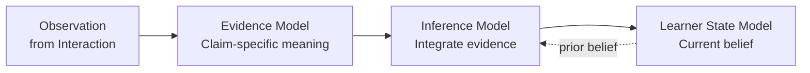
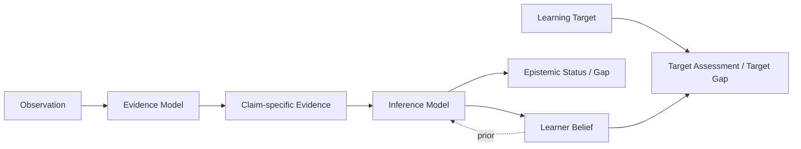

# DeerMind Evaluation Space Design v1.1

> **中文名称**：DeerMind 评估空间设计  
> **版本**：v1.1  
> **文档性质**：Space Design / Architecture Baseline  
> **状态**：架构冻结基线  
> **上位基线**：DeerMind Concept Architecture v1.1  
> **上位领域基线**：DeerMind Learning Space Design v1.1  
> **上位价值约束**：DeerMind Product Thesis v1.0、DeerMind Product Constitution v1.0  
> **写作规范**：DeerMind Design Document Standard v1.0  
> **更新时间**：2026-09-30
>
> **修订说明**：补充诊断转入教学时的证据解释，区分讲解请求与实际暴露，并保留既有表现的证据价值；不改变 Claim Space 或 Evaluation ownership。
>
> **版本说明**：v1.1 保留 v1.0 的 LearnerStateModel / EvidenceModel / InferenceModel 三模型、TaskProficiencyBeliefs + KCBeliefs 的 Learner State Core、Evaluation 单写 Learner Belief、Observation / Evidence / Belief 分层、UNKNOWN、Assistance / Contamination、Evidence Dependency、Freshness、Conflict、Disconfirmation、Evolution Contract 与历史不可重写等核心结论；本版本主要完成四项语义对齐：第一，Task Proficiency Claim 升级为对 Conditions、Support / Responsibility Boundary 与 Quality Requirement 敏感的能力命题；第二，Assistance 与 Contamination 改为相对于 Claim / Target Responsibility Boundary 解释；第三，正式接入 Target Assessment / Target Gap，但不新增 TargetBelief、CapabilityBelief 或第四个 Core Model；第四，补充 Equal Epistemic Standing、Authority Override、Target Version 与派生判断失效等上位约束。经 Interaction / Evolution v1.1 对齐与 Cross-Document Freeze Gate，本版本现作为架构冻结基线。

---

## 1. 文档定位与设计命题

Evaluation Space 解决的不是“给学习者打一个分数”，也不是维护一个越来越复杂的学习者画像。它面对的是一个更基本的问题：**DeerMind 永远无法直接读取学习者真实的认知状态，却必须根据有限、受条件影响、可能互相冲突的行为证据，形成长期、可修正的能力认识。**

Learning Space v1.1 已经把 Learning Target、Task、Solution 与 Knowledge 的规范责任分开，并明确 Target 可以规定能力成立所需的条件、质量标准和 Support / Responsibility Boundary。因此 Evaluation v1.1 需要进一步回答：同一个 Task Family 在不同条件和责任边界下，一次表现到底能证明什么；当前 Learner Belief 是否足以支持某个 Target；以及“证据已支持未达标”和“系统还不知道是否达标”为什么必须保持不同。

Evaluation 仍然是 DeerMind 的**学习者认识层**。它维护的是系统对学习者的可修正认识，而不是学习者真实状态本身，也不是 Learning Target 的规范要求。

\[
\boxed{
EvaluationSpace
=
LearnerStateModel
+
EvidenceModel
+
InferenceModel
}
\]

三个 Model 分别回答三个不可互换的问题：

| Model | 核心问题 |
|---|---|
| Learner State Model | DeerMind 允许对学习者维护什么类型的 Claim 与 Learner Belief？ |
| Evidence Model | 某个 Observation 在特定条件与责任边界下，对一个明确 Claim 具有什么证据意义？ |
| Inference Model | 综合相关证据后，当前应该维持怎样的 Learner Belief，以及这些 Beliefs 是否足以支持某个 Target requirement？ |

它们共同形成：

\[
Observation
\rightarrow
ClaimSpecificEvidence
\rightarrow
Inference
\rightarrow
LearnerBelief
\]

Target Assessment 则建立在正式 Target Definition 与当前 Learner Beliefs 之上，是跨 Space 派生认识，不属于新的 Learner State。

### 1.1 本文档解决什么

本文档定义 Evaluation Space 的稳定语义责任，包括：

- 学习者命题与 Learner Belief 的最小规范结构；
- Task Proficiency 与 KC 两类核心学习者命题；
- Conditions、Support / Responsibility Boundary 与 Quality Requirement 如何进入能力 Claim 或 Evidence Context；
- Observation 如何在明确 Claim 下形成 Evidence；
- Assistance、Delayed、Transfer、Missing Evidence 等条件如何改变一次表现的认识意义；
- 多条证据如何在依赖、时间和冲突条件下被综合；
- UNKNOWN、不确定性、Epistemic Status 和 Evidence Basis 的语义；
- Target Assessment、Target Gap 与 Epistemic Gap 的派生关系；
- Equal Epistemic Standing、Population Prior 与 Authority Override 对 Evaluation 的约束；
- Evaluation 与 Learning、Interaction、Global Event Model 和 Evolution 的边界；
- Evaluation 如何被现实挑战、版本化和重新解释。

### 1.2 本文档不解决什么

Evaluation Space 不负责：

- 定义 Learning Target、Task、Solution、KC 或 Support / Responsibility Boundary 等规范领域语义；
- 决定谁正在追求某个 Target、为什么追求、优先级或截止时间；
- 从原始 Event 直接解释当前表现；
- 决定现在是否应该提示、解释、等待、停止或主动测评；
- 把疲劳、当前意愿、情绪等运行条件写成长期能力；
- 把 Target Assessment 变成新的 `TargetBelief` 或 `TargetMasteryBelief`；
- 把 Assistance Dependency 变成稳定人格或长期 trait；
- 决定 Evaluation 模型自身是否应正式变更；
- 规定最终使用 Bayesian、IRT、neural estimator、规则系统还是其他具体算法；
- 规定 Belief、Evidence 或 Target Assessment 的数据库 schema、服务边界或 API。

这些内容分别属于 Learning Space、Interaction Space、Product Context、Evolution、Governance 或后续 System Design。

### 1.3 上位边界

根据 Concept Architecture v1.1，Learning 提供 Target 与领域规范语义；Evaluation 形成对学习者的可修正认识；Interaction 使用这些认识、当前 Context 与现实约束做行动决策。必须长期保持：

\[
Requirement
\neq
Evidence
\neq
Belief
\]

以及：

\[
Only\ EvaluationSpace\ may\ revise\ LearnerBelief
\]

Target Requirement 可以规定“学习者应当在条件 C、支持边界 S 下达到质量 Q”，但它不能据此产生“学习者已经具备该能力”的 Evidence 或 Belief。Target Assessment 只能建立在正式 Target Requirement 与已经形成的 Learner Beliefs 之上。

当前疲劳、意愿、注意残余等交互周期内条件可以由 Interaction 维护；外部考试、教师、家长、雇主、认证机构或学习者自己的陈述都只能成为事实、Observation 或 Evidence 的来源。制度 authority、群体统计或安全限制都不能绕过 Evidence / Inference 直接改写 Learner Belief。

## 2. 设计问题与基本约束

Evaluation Space 的结构来自几个不可消除的现实限制。理解这些限制，比记住后面的对象名称更重要。

### 2.1 学习者真实状态不可直接观察

DeerMind 只能看到行为和结果，而不能读取“真实掌握度”。同一个正确答案可能来自独立能力、模仿、提示、猜测、答案暴露或特殊上下文；同一个错误也可能来自粗心、算术 slip、任务理解错误或系统 Observation 错误。

因此：

\[
LearnerReality
\neq
SystemBelief
\]

Learner Belief 必须始终被理解为 DeerMind 当前的认识立场，而不是学习者真实状态的复制品。

### 2.2 行为不能直接变成 Belief

一次表现首先需要被 Interaction 解释成 Observation；只有当 Observation 被放到明确学习者命题下，才能讨论它是否构成 Evidence；多条 Evidence 还需要经过 Inference，才可能改变 Learner Belief。

\[
\boxed{
Event
\neq
Observation
\neq
Evidence
\neq
Belief
}
\]

这条分层防止系统把自己的解释写回事实，也防止“答对 → 掌握”“提示后成功 → 已会”“家长说不会 → Belief 下降”等捷径。

### 2.3 没有 Claim，就没有合法 Belief

“这个学习者数学不行”“理解能力弱”“自信心不足”这类模糊结论很难被证伪，也很容易变成永久标签。Evaluation 只允许对具有明确语义、可观察证据和实际决策价值的 Claim 形成 Belief。

\[
NoBeliefWithoutClaim
\]

同理，Evidence 也必须指向明确 Claim：

\[
NoEvidenceWithoutClaim
\]

### 2.4 模型复杂度不能超过可观测性

如果两个学习者构念无法通过现实数据稳定区分，就不应因为理论上“可能存在”而都进入规范 Learner State。模型越复杂，对 Evidence 质量、数据量和推断假设的要求越高。

因此 Evaluation 采用：

\[
ModelComplexity
\le
Observability
\]

以及：

\[
ModelResolution
\le
DecisionResolution
\]

更细的 diagnosis 只有在能够改变重要 Belief 或 Interaction 决策时才值得。

### 2.5 Evidence，不是 Command

学习者、家长、教师、学校、认证机构、雇主、外部测评和 DeerMind 自身教学动作都可以影响系统认识，但都不能直接写 Learner Belief。

外部主体可以拥有真实制度 authority，却不因此拥有对 learner capability 的直接认识写入权：

\[
ExternalAuthority
\neq
EpistemicAuthority
\]

同样，安全、监护、组织政策或制度要求可以限制当前允许执行什么，但这种限制不是关于学习者能力的 Evidence：

\[
AuthorityOverride
\neq
EpistemicEvidence
\]

### 2.6 Condition 默认属于 Evidence；只有改变 Claim 语义时才进入 Claim

Assistance、Delayed、Transfer、疲劳、环境噪声、工具可用性等条件通常改变的是一次表现“能证明什么”，而不是自动创造新的 Learner State。

因此默认规则是：

\[
EvidenceCondition
\neq
ClaimCondition
\]

只有当某个条件或 Support Boundary 真正改变“我们究竟在断言哪一种能力”时，它才进入 Claim semantics。例如“在 AI 提供候选诊断时能够验证并决策”和“在没有 AI 诊断候选时独立形成 root-cause 判断”是不同能力命题；而“今天很疲劳”通常只是 Evidence Context。

这条原则防止状态空间按照条件组合无限膨胀，同时允许 Target Responsibility Boundary 在真正改变能力含义时成为 Claim 的一部分。

### 2.7 Population Prior 不能替代 Individual Evidence

Product Constitution 要求每个学习者保有平等认识地位。Evaluation 可以使用与当前学习问题相关、经过治理允许的群体统计作为受限 prior 或假设来源，但不能把它直接写成对具体学习者的 Evidence 或 Belief。

必须保持：

\[
PopulationPrior
\neq
IndividualEvidence
\]

以及：

\[
GroupExpectation
\not\Rightarrow
IndividualCapabilityClaim
\]

当真实个体 Evidence 与 prior 冲突时，Inference 必须允许 prior 被修正，而不能通过持续降低反证权重来保护既有判断。

### 2.8 模型解释失败时，不先发明学习者特征

当现实数据与现有 Claim、Evidence 或 Inference 模型不一致时，最危险的做法是创造新的学习者 label 来吸收异常。例如学习者在 verbal 表示上成功、在 table 表示上失败，并不能自动推出一个新的 `RepresentationAbility` 特征。

更合理的路径是先保留冲突，形成临时推断假设，再检查 Task granularity、KC Application Conditions、Observation、Target Conditions 与 Evidence 语义是否过粗。

\[
ModelMismatch
\not\Rightarrow
CreateNewLearnerTrait
\]

## 3. Evaluation Space 的核心架构

Evaluation 的三个 Model 不是算法模块，而是三类不同的认识责任。它们可以在软件实现中共享基础设施，也可以由多种算法共同实现，但语义边界不能合并。

### 3.1 Learner State Model：定义 DeerMind 可以相信什么

Learner State Model 的职责不是存放所有“关于学习者的信息”，而是定义什么类型的学习者命题具有足够稳定的语义，值得被 DeerMind 长期维护。

当前 Learner State Core 只保留两类规范 Claim：

\[
\boxed{
LearnerClaimSpace
=
TaskProficiencyClaims
\cup
KCClaims
}
\]

因此：

\[
\boxed{
LearnerStateCore
=
TaskProficiencyBeliefs
+
KCBeliefs
}
\]

这是一种有意的收敛。DeerMind 不因为 motivation、疲劳、metacognition、帮助依赖等概念“教育上重要”，就自动把它们变成长期学习者特征。只有当某个 construct 拥有独立语义、可观察证据、稳定预测价值和独立 action 价值时，才值得重新考虑进入 Claim Space。

#### Task Proficiency Claim

Task Proficiency Claim 表达的不是“这个学习者抽象地会不会 Task F”，而是：

> **学习者当前是否具备足够的自身能力，能够在明确 Conditions、Support / Responsibility Boundary 与 Quality Requirement 下，相对稳定地承担某个规范 Task Family 所要求的认知或行动责任。**

概念上可以写成：

\[
CapabilityClaim
=
(
TaskFamily,
Conditions,
SupportBoundary,
QualityRequirement
)
\]

这里的四个元素不要求最终都成为独立数据库字段，但语义上必须能够被区分。Task Family 提供领域责任；Conditions 描述能力成立的环境与变化范围；Support Boundary 描述哪些责任必须由 learner 自己承担、哪些可以外部化；Quality Requirement 描述当前 Claim 所要求的表现质量与稳健性。

Task Proficiency Claim 仍然不是单次 Task Success，也不是所有相关 KC Belief 的机械聚合。一次成功可能来自环境、他人、工具或偶然因素；一个学习者也可能掌握大部分相关 KC，却仍无法组织完成复杂 Task。

因此：

\[
TaskSuccess
\not\Rightarrow
TaskProficiencyBelief
\]

以及：

\[
\{KCBeliefs\}
\not\Rightarrow
TaskProficiencyBelief
\]

Support Boundary 只有在改变 capability claim 本身时才进入 Claim semantics；否则实际 assistance、tool use、prompting 与 exposure 保持为 Evidence Context。这样既避免 `TaskProficiency(T|Condition_1|Condition_2|...)` 的状态爆炸，又允许 Target-defined responsibility 真正约束能力判断。

#### KC Claim

KC Claim 表达：

> 学习者当前是否具备并能够在该 KC 的 Application Conditions 下，自身调用这个可复用认知结构或功能，并产生预期 Cognitive Effect。

KC Claim 引用 Learning Space 的规范 KC 语义，但不拥有修改 KC 定义的权力。

观察到某个行为“看起来使用了 KC”也不能直接推出掌握，因为行为可能受到提示、答案暴露、模仿或 Observation 不确定性影响：

\[
ObservedUse(K)
\not\Rightarrow
KCBelief(K)=Known
\]

### 3.2 Evidence Model：定义 Observation 对 Claim 意味着什么

Evidence Model 不负责形成最终 Belief。它只回答一个局部问题：

> **某个 Observation，在当前 epistemic context 和 Learning Space 语义下，对一个明确 Claim 有什么认识论意义？**

\[
\boxed{
Evidence
=
Interpret(
Observation,
Claim,
EpistemicContext,
LearningSpace
)
}
\]

Evidence 是一种相对于命题的关系，而不是脱离 Claim 独立存在的“证据分数”。

同一个 Observation 可以针对不同 Claim 形成不同 Evidence。例如学习者在比例题中选择了正确的 Unit Rate 策略，却把 `42÷6` 算错：

- 对 Task Proficiency Claim，可能形成矛盾性证据；
- 对 Proportional Relation KC，可能形成 supportive 证据；
- 对 Division KC，可能形成矛盾性证据。

因此：

\[
OneObservation
\rightarrow
MultipleClaimSpecificEvidenceRelations
\]

Evidence Relation 至少需要区分：

| Relation | 语义 |
|---|---|
| Supports | Observation 支持 Claim |
| Contradicts | Observation 反驳 Claim |
| Discriminates | 主要用于区分 competing hypotheses |
| NonInformative | 对该 Claim 没有足够信息价值 |

这套结构不要求 System Design 最终必须用离散枚举实现，但概念上必须保留这些不同认识作用。

### 3.3 Inference Model：决定当前应该相信什么

Inference Model 综合先验信念、历史与当前 Evidence、Evidence 依赖、时间结构以及模型假设，形成新的 Learner Belief。

\[
B_{t+1}
=
Infer(
B_t,
Evidence_{1:t},
Dependencies,
Time,
ModelAssumptions
)
\]

Evidence 与 Inference 必须分离。相同 Evidence 面对不同先验，可能产生不同信念 update；相同先验面对不同 Evidence 语义，也可能产生不同结果。

Inference 的核心职责不是“算一个 mastery score”，而是保留 Evidence 的依赖、冲突、时间相关性和模型不确定性，使系统知道自己为什么相信、为什么犹豫，以及什么新信息可能真正改变判断。

---

## 4. Learner Belief：可修正认识，而不是分数

Task Proficiency Belief 与 KC Belief 共用同一套 Belief 语义。一个合法 Learner Belief 是：

> **DeerMind 在某一时刻，基于当前可用 Evidence，对一个明确 Learner Claim 所持有的、可追溯、带不确定性、可被未来 Evidence 修正的认识论立场。**

概念上：

\[
\boxed{
Belief_t(C)
=
(
Assessment_t,
EpistemicUncertainty_t,
EpistemicStatus_t,
EvidenceBasis_t
)
}
\]

这是一项语义定义，不是数据库 schema，也不要求某一种概率表示。

### 4.1 Assessment：方向性判断

Assessment 回答：

> 综合当前 Evidence，DeerMind 对 Claim 的方向性判断倾向是什么？

当前架构只冻结 Assessment 的语义，不冻结数值表示。System Design 可以比较 ordinal、probability、interval、分布或其他 calibrated 表示，只要它们保留这里定义的认识论含义。

\[
AssessmentSemantics\ first,
Representation\ deferred
\]

### 4.2 UNKNOWN：证据不足，不是 0.5

UNKNOWN 表示当前 Evidence 不足以支撑有根据的方向性判断。

\[
UNKNOWN(C)\neq \neg C
\]

同时：

\[
UNKNOWN\neq 0.5
\]

“没有足够证据”与“证据正反各半”是两种完全不同的认识状态。前者要求更多有信息价值的观察，后者可能需要区分竞争性假设或重新检查模型。

### 4.3 Epistemic Uncertainty：系统对自己判断的不确定性

Epistemic Uncertainty 属于 DeerMind，而不是学习者。

\[
LearnerSelfConfidence
\neq
SystemEpistemicUncertainty
\]

学习者自述“我很有把握”本身可以成为 Observation / Evidence；系统对当前 Belief 有多大把握则属于另一层。

### 4.4 Epistemic Status：为什么不确定

一个不确定性 scalar 无法解释原因。高不确定性可能来自：

- Evidence 稀缺；
- Evidence 冲突；
- Observation 歧义；
- 证据 currentness concern；
- 模型失配。

Epistemic Status 用于表达这种结构。多个原因可以同时存在，因此当前不把它冻结成互斥 enum。

这一信息很重要，因为不同不确定性来源对 Interaction 的意义不同。Evidence 稀缺可能需要新的 observation opportunity；Evidence 冲突可能需要更有区分力的任务；模型失配则可能产生 System Signal。

### 4.5 Evidence Basis：每个 Belief 都必须可以回答“为什么”

任何重要 Learner Belief 都必须能够追溯到形成它的 Evidence：

\[
Belief
\rightarrow
EvidenceBasis
\rightarrow
Observation
\rightarrow
Event
\]

这使 DeerMind 能够在 Observation 被修正、Evidence 语义被更新或规范版本发生变化后，定位受影响的 Belief，并重新推断。

\[
\boxed{
NoOpaqueLearnerBelief
}
\]

### 4.6 Belief 的时间语义

时间流逝本身不是负 Evidence。

\[
TimePassage
\not\Rightarrow
CompetenceDecrease
\]

如果很久没有新 Evidence，首先增加的是对当前状态是否仍然有效的不确定性，而不是自动降低能力评估。

\[
CurrentnessUncertainty\uparrow
\]

只有存在新的 Evidence，或已经通过现实验证的 learning / forgetting transition 模型，系统才可以做方向性能力 revision。

\[
NoDirectionalCompetenceRevision
Without
NewEvidence
Or
ValidatedStateTransitionModel
\]

---

## 5. Evidence 与 Inference：决定一次表现能证明什么

Evaluation 的真正难点不在保存 Belief，而在于避免系统把受条件影响的表现错误地当作独立能力证据。Assistance、Delayed、Transfer、Missing Evidence、Evidence 依赖、Freshness 和 Conflict 都属于这一问题的不同侧面。

### 5.1 Evidence 是结构化关系，不是先压成一个数字

概念层不建立统一的：

\[
EvidenceStrength=0.83
\]

因为 evidential 价值至少可能依赖：

- Claim relevance；
- Observation 质量；
- 帮助 / 信息暴露；
- diagnosticity；
- 任务 / 过程轨迹覆盖度；
- temporal 关系；
- 迁移 / novelty 关系；
- 溯源信息。

System Design 可以为具体推断 algorithm 设计数值表示，但不能因此丢掉这些结构差异。

### 5.2 Assistance：关键不是“用了工具”，而是是否替代 Claim 要求的责任

Independent / Assisted 不属于 Learner State，也不是天然高低排序的两套 Belief。一次帮助是否削弱 Evidence，取决于它是否替代了当前 Claim 要求由 learner 自己承担的认知或行动责任。

因此真正关键的是：

\[
ClaimSubstitutingAssistance
\]

Evaluation 在解释 assistance 时至少需要区分三层语义：

1. **Task Canonical Tool Semantics**：Task 在领域上允许或要求哪些工具；
2. **Claim / Target Responsibility Boundary**：当前能力命题要求 learner 自己承担什么；
3. **Actual Exposure / Tool Use**：这次运行中真实发生了什么。

例如，日志与监控可能是诊断 Task 的正常工具；但某个 Target 仍可能要求 learner 自己形成 root-cause 判断。如果 AI 直接给出 root cause，即使 Task 本身允许使用 AI，这次表现也不能证明该独立判断能力。反之，如果 Target 本身要求的是“在 AI 提供候选的情况下验证、识别风险并做最终决策”，相同 AI 行为不构成对该 Claim 的越界替代。

所以：

> **Support Compatibility Is Claim-Relative。**

`Prompted` 也不作为与 Independent / Assisted 平级的规范证据类型。不同 prompt 暴露的信息差异极大，从“再检查一下”到直接给出关键结构，必须依据真实 exposure lineage 解释。

学习者请求讲解与系统实际提供帮助是不同事实。请求可以结束一次独立诊断，但不能仅凭请求推出能力不足，也不能将请求时刻当作帮助已经暴露的时刻。请求前的独立表现保留原有证据价值；诊断结束时证据不足，可以保持 UNKNOWN / InsufficientEvidence，不能因活动终止而补造负面结论。转入教学后，Evaluation 依据实际发生的帮助及其时间、内容与 Claim 关系解释后续表现。

后续判断独立能力需要新的、符合该 Claim 支持条件的机会。新建活动或重新标记为“独立”不会消除既有暴露；刚接受解法讲解后答对同一道题，不能直接证明独立掌握。是否形成有效的独立 Evidence，仍需检查相关历史暴露，而不是只看活动名称或会话边界。

### 5.3 Contamination 是 Claim 与 Responsibility-Boundary Relative 的

一次干预不会均匀污染整个 Task 的所有 Evidence。更准确地说：

\[
Contamination
=
f(
Observation,
Claim,
ResponsibilityBoundary,
InterventionHistory
)
\]

同一个提示可能严重污染 Strategy Selection Claim，却仍允许 learner 独立执行某个 KC；同一次 AI 帮助对“独立形成诊断”Claim 构成强污染，对“验证 AI 候选诊断”Claim 却可能完全兼容。

Evaluation 不能只知道“发生过帮助”，还必须能够追溯暴露链：帮助在什么时间发生、暴露了什么、替代了哪部分责任，以及这种替代与当前 Claim 的关系。

\[
NoAssistanceClassificationWithoutExposureLineage
\]

如果暴露链不完整，正确结果是降低 Evidence 可解释性或标记 support state unknown，而不是默认 Independent。

### 5.4 Delayed 与 Transfer 默认改变 Evidence，不拆分 Claim

Delayed 描述当前表现与相关 learning / 干预之间的时间关系；Transfer 描述当前 Task 相对于已有学习分布的 generalization distance。

它们通常增加 retention 或 generalization 诊断价值，但不存在简单的全局排序，例如：

\[
Delayed > Immediate
\]

并不总成立。

同样，默认不建立 `TaskProficiency(T|Transfer)` 这样的 condition-specific 状态。只有当条件真正改变 Claim 本身语义时，才拆分 Claim。

### 5.5 Missing Evidence 不是 Negative Evidence

系统没有看到某种表现，可能只是从未创造观察机会。

\[
MissingEvidence
\neq
NegativeEvidence
\]

因此：

- 未观察到迁移 success，不等于迁移能力 weak；
- 未观察到某 KC activation，不等于学习者不会该 KC；
- 没有 intermediate 过程轨迹，不等于学习者没有策略。

Evaluation 必须认识到 data collection 策略会塑造可见数据。选择性缺失不能自动解释成学习者能力不足。

### 5.6 Provenance 决定 Evidence 是否可解释

Evidence 必须保留足够溯源信息，使 Inference 和 Evolution 能判断：

- Observation 来源；
- underlying Event references；
- Task / Solution / KC 版本；
- 干预链路；
- timestamp；
- observation 不确定性；
- 来源直接性；
- 任务相似度与交互周期关系。

如果外部主体 A 转述主体 B 的评价，则应同时保留直接来源与被转述来源。这类信息可以与学习者命题相关，但来源身份或制度地位不会自动变成学习者真实状态。

### 5.7 Evidence Resolution 必须有行动价值

Evidence attribution 可以无限细化到 Task、Strategy、TaskNode、Step、KC 和干预，但系统不应默认这样做。

\[
EvidenceResolution
\le
RequiredBeliefResolution
\le
ActionResolution
\]

只有更细 attribution 会改变重要 Learner Belief 或 Interaction 决策时，进一步下钻才有价值。

### 5.8 Evidence Dependency：多次成功不一定是多份独立证据

三道高度同构 Task 即使每次都没有 Hint，也可能共享同一次 explanation、相同 surface structure 和相近时间窗口，因此不能机械地当成三份独立证据。

\[
ExecutionIndependence
\neq
EpistemicIndependence
\]

Inference Model 必须识别 shared 干预链路、任务相似度和交互周期 correlation，避免相关的证据被重复计算。

### 5.9 Freshness 属于 Inference，而不是改写历史 Evidence

历史 Evidence 在发生时的意义不会因为时间流逝被重写。变化的是它对**当前 Learner Claim** 的相关程度。

\[
CurrentRelevance(E,t)
=
f(
EvidenceTime,
CurrentTime,
ClaimStabilityAssumption,
SubsequentEvidence,
TransitionAssumptions
)
\]

这里使用 `ClaimStabilityAssumption`，而不是含糊的 `TargetStability`。Learning Target 的版本变化与能力状态随时间变化是两种不同问题：前者通常要求重新计算 Target Assessment；后者才可能影响当前 Learner Belief 的相关性判断。

因此 Freshness 是 Inference concern。系统不能为了表达“旧了”而修改历史 Evidence 本身。

### 5.10 Conflict 必须在聚合后仍然可见

高质量矛盾性证据不能被一个平均值吞掉。

\[
10\ Supports
+
10\ Contradicts
\]

并不自然等价于：

\[
Mastery=0.5
\]

系统必须区分：

\[
UnknownDueToInsufficientEvidence
\]

与：

\[
UncertainDueToConflictingEvidence
\]

两者可能具有相似不确定性，却要求完全不同的下一步。

### 5.11 Structured Conflict：先怀疑模型，再增加特征

如果学习者在 verbal 表示中稳定成功、在 table 表示中稳定失败，Inference 不应该立即创建新的稳定学习者特征。

更合理的结果是：

- 当前 Claim remains conflicted；
- 形成类似 `RepresentationDependentPattern` 的临时推断假设；
- 检查 Task Family、KC Application Conditions、Observation 和 Evidence 语义是否过粗。

这保留了进一步解释空间，同时避免学习者画像变成吸收所有异常的垃圾桶。

### 5.12 Competing Inference Hypotheses

Inference 可以维护学习者层竞争性假设，例如：

\[
H_1=DivisionKCWeak
\]

\[
H_2=ProportionalReasoningWeak
\]

\[
H_3=ObservationError
\]

\[
H_4=OneTimeSlip
\]

这些 hypothesis 是 Evaluation 内部的推断 workspace，用于解释当前学习者的 Evidence 冲突，并指导未来证据 acquisition。它们不是 Learner State，也不形成独立 Hypothesis Model。

必须与 Evolution Space 的 SystemHypothesis 分开：

\[
InferenceHypothesis
\neq
SystemHypothesis
\]

单个学习者模式可以产生 `ModelMismatchSignal`，但是否构成系统问题、原因是什么，由 Evolution 负责。

### 5.13 Disconfirmation：Belief 必须允许被现实推翻

Disconfirmation 不是一种 Evidence Type，而是一条推断 discipline：

\[
EveryBeliefMustRemainRevisable
\]

当前强 Belief 遇到高质量矛盾性证据时必须允许下降；原本弱 Belief 也必须允许被新 Evidence 修正上升。Inference 不能把所有反证都解释成 noise 来保护已有判断。

### 5.14 Epistemic Gap：Evaluation 只表达“不知道什么”

Inference 可以识别重要未解决不确定性，例如 Evidence 太少、strong 冲突、竞争性假设无法区分、old 证据 currentness concern 或模型失配模式。

Evaluation 负责表达：

> **我们不知道什么，以及为什么不知道。**

是否值得为了填补这个 Gap 而主动打扰学习者，属于 Interaction。

\[
EpistemicGap\in Evaluation
\]

\[
WorthResolving(EpistemicGap)\in Interaction
\]

### 5.15 教学动作不能成为自证学习者 update

DeerMind 的教学 Action 是 Event，但不是能力证据。

\[
InstructionDelivered
\not\Rightarrow
LearnerBeliefIncrease
\]

否则系统会形成危险的自证循环：

\[
Teach
\rightarrow
BelieveLearned
\rightarrow
Stop
\]

学习是否真正发生，必须由后续学习者表现产生新的 Observation 与 Evidence 来回答。

---

### 5.16 Task Outcome、Learner Performance 与 Capability 必须分离

Learning Space v1.1 已经明确：

\[
TaskOutcome
\neq
TaskPerformance
\neq
Capability
\]

真实任务的结果可能同时受到环境、其他参与者、工具与偶然因素影响。Evaluation 不能因为团队项目失败就直接降低 learner capability，也不能因为系统最终恢复成功就自动把全部成功归给 learner。

Evidence Model 应尽可能解释 learner 在当前责任边界内实际承担了什么、表现如何，以及哪些结果可以归因于 learner contribution。Outcome 可以是重要 Observation，但它不是 Capability 的直接代理。

### 5.17 Equal Epistemic Standing：prior 必须允许被个体 Evidence 推翻

群体统计、历史画像或已有高置信 Belief 都不能让系统失去观察反证的能力。Inference 可以使用合法 prior，但必须保证高质量个体 Evidence 能真正改变结论。

如果系统因为既有 prior 持续把反证解释成 noise，或者因为既有低 Belief 只采集低难度任务而再用这些数据证明原判断，Evaluation 会形成认识论自我封闭。

因此：

\[
Prior
\neq
Evidence
\]

并且：

\[
StrongPrior
\not\Rightarrow
ClosedBelief
\]

Interaction 负责提供是否存在充分反证机会的运行条件；Evaluation 负责不把 prior、机会选择偏差或缺失数据伪装成个体能力事实。

### 5.18 Authority Override 不能生成能力结论

Product Context 中的安全限制、监护要求、组织政策或制度义务可以改变当前允许执行什么，但不能自动产生能力 Evidence。

\[
AuthorityOverride
\neq
EpistemicEvidence
\]

例如因为安全规则禁止 learner 独立操作高压设备，只说明当前 Action 被限制；它既不能证明 learner 不具备能力，也不能证明 learner 已具备能力。Evaluation 必须把“没有机会表现”与“表现失败”区分开。

## 6. Evaluation 如何在运行系统中工作

Evaluation 的运行起点不是原始 Event，而是 Interaction Space 已经形成的 Observation。它既支持跨交互周期的长期认识，也必须允许局部交互在不等待 Belief 更新的情况下继续运行。

### 6.1 主运行链

Evaluation 的主认识链仍然保持：

Observation 描述当前表现；Evidence Model 把它放入明确 Claim；Inference Model 综合历史 Evidence 与先验；Learner State Model 保存当前认识；Epistemic Status / Gap 暴露系统认识的限制。

Target Assessment 不进入这条 Belief 写入链。它读取正式 Target Definition 与当前 Learner Beliefs，回答现有认识是否足以支持目标要求。它可以物化、缓存和版本化，但没有独立 source of truth。

### 6.2 Fast Interaction 与 Learner Evaluation 是两条不同回路

DeerMind 可以根据当前 Observation 直接作出局部反应，而不必先把一次错误写成长时学习者能力不足。

Fast Interaction Loop：

\[
Event
\rightarrow
Observation
\rightarrow
InteractionPolicy
\rightarrow
Action
\rightarrow
Event
\]

Learner Evaluation Loop：

\[
Observation
\rightarrow
Evidence
\rightarrow
Inference
\rightarrow
LearnerBelief
\rightarrow
InteractionPolicy
\]

两条回路在 Interaction Policy 汇合，但 Evaluation 不拥有 Action 决策。

### 6.3 一个端到端例子

假设学习者解决：

> 6kg 苹果 42 元，15kg 多少钱？

学习者写：

\[
42\div6=8
\]

\[
8\times15=120
\]

Interaction 可能形成：

- Unit Rate structure observed；
- division 操作已选择的；
- arithmetic 失配 at division step；
- multiplication consistent with 先验 wrong result；
- final answer incorrect。

Evaluation 不会直接得到“不会比例”。

Evidence Model 可以分别形成：

- 对 Task Proficiency Claim：矛盾性证据；
- 对 Proportional Relation KC：possible supportive 证据；
- 对 Division KC：矛盾性证据。

如果 DeerMind 随后提示“再检查一下 42÷6”，学习者修正为 7 并得到 105，那么这次成功的 Evidence 需要按 Claim 与发生顺序解释。提示前已经呈现的 Unit Rate 策略保留原有证据价值，不能因后来的算术提示追溯性地判为受助选择；提示后的步骤也不能被重复计为一次新的独立策略选择。Division KC 仍可能获得一定 positive 证据，但须保留提示指出计算位置这一条件，完整 Task success 则不能被当作独立完成。

一周后学习者在新的 surface 情境中独立完成同构比例题，这条 delayed / 迁移 Evidence 对 retention 和 generalization 的解释价值更高。

如果之后学习者在 table 表示中持续失败，Inference 应保留 structured 冲突，而不是创建永久 `TableAbilityState`。必要时产生 System Signal，交给 Evolution 判断是否是 Task / KC / Observation / Evidence 模型失配。

这个例子展示了：

\[
Observation
\rightarrow
ClaimSpecificEvidence
\rightarrow
EvidenceIntegration
\rightarrow
Belief
\]

而不是：

\[
WrongAnswer
\rightarrow
WeakKC
\]

### 6.4 Progressive Evaluation Resolution

Evaluation 不默认对所有行为进行最细粒度诊断。合理流程仍然从 Task-level Observation / Evidence 开始；只有当进一步分析可能改变重要 Learner Belief、Target Assessment、Epistemic Gap 或 Interaction 决策时，才继续进入 Solution Trace、KC、Subtask 或 Step-level Evidence。

\[
ProgressiveEvaluationResolution
\]

目标不是牺牲理论精度，而是让诊断复杂度、计算成本和学习者注意力负担与真实认识价值匹配。拥有更细模型不意味着运行时必须获取最大分辨率。

### 6.5 Target Assessment：比较 Requirement 与 Learner Belief

Target Assessment 是跨 Space 派生认识：

\[
TargetAssessment
=
Assess(
TargetDefinition,
LearnerBeliefs
)
\]

Learning Space 拥有 Target Requirement；Evaluation Space 拥有 Learner Belief 与比较所需的认识论语义；Target Assessment 自身不成为新的 Learner State primitive。

一个 Target Assessment 至少需要能够区分：

- Evidence 已足以支持当前 requirement；
- Evidence 已支持 learner 当前低于 requirement；
- Evidence 不足，无法判断是否达到；
- Evidence 冲突、过时或只覆盖部分 requirement；
- 某些 requirement 无法在当前条件下可靠识别。

具体状态表示暂不冻结成 enum，也不要求压缩为单一百分比。

必须长期保持：

\[
BelowRequirement
\neq
InsufficientEvidence
\]

### 6.6 Target Gap 与 Epistemic Gap

**Target Gap** 表示已有 Evidence 支持“当前能力低于某项 Target requirement”；**Epistemic Gap** 表示系统还没有足够 Evidence 判断是否达到 requirement。

\[
TargetGap
\neq
EpistemicGap
\]

例如 learner 多次在独立网络诊断中失败，可以形成 Target Gap；而 learner 从未获得过独立诊断机会，只能形成 Epistemic Gap。两者都不能直接产生 Action：

\[
Gap
\neq
Action
\]

是否值得评估、练习、提示或暂不干预，仍属于 Interaction Policy。

### 6.7 Assistance / Support Dependency 是 Target-relative 派生诊断

Evaluation 可以形成一个派生诊断：对于某个 Target 明确要求 learner 自己承担的责任，learner 是否持续只能在替代性支架存在时成功。

这种 dependency 必须相对于 Target / Responsibility Boundary 解释：

\[
DependencyRisk
=
f(
ObservedAssistancePattern,
ResponsibilityBoundary
)
\]

它不是新的 Learner Trait，也不进入 Learner State Core。同一个 learner 对 Target A 可能存在不必要依赖，对 Target B 则完全不存在，因为 Target B 本身允许外部化相同责任。

## 7. Cross-Space Contracts、版本与 Evolution

Evaluation 必须保持自己的认识职责，同时依赖其他 Space 提供规范坐标、当前 Observation、事实溯源信息和系统级演化机制。

### 7.1 Learning Space → Evaluation：提供规范坐标，不提供学习者结论

Learning Space v1.1 向 Evaluation 提供：

- Learning Target / Target Version；
- Required Task Capabilities；
- Task Family / Task Instance 语义；
- Task Objective 与 Task Success Semantics；
- Target Conditions 与 Support / Responsibility Boundary；
- Target Required Standard / Quality dimensions；
- Solution Strategy / Solution Task Topology；
- KC definitions 与 Application Conditions；
- Knowledge Grounding；
- 规范身份、版本与 Validity Scope。

Evaluation 可以基于这些坐标形成面向具体学习者的 Task Proficiency Claim、KC Claim、Evidence、Learner Belief，以及派生 Target Assessment。

但必须保持：

\[
Requirement
\neq
Evidence
\neq
Belief
\]

Learning Target 不直接生成 Learner Belief；单个 learner 的表现也不能反向修改 Learning Space canonical semantics。

### 7.2 Interaction Space → Evaluation：提供 Observation 和暴露事实

Interaction 是 Evaluation 的主要运行时 semantic input 来源。它提供 Observation，包括 Task 结果、observed 策略、过程轨迹语义、error / 失配、self-报告、外部报告、Observation 不确定性和 Event 溯源信息。

Evaluation 不得绕过 Observation Model，直接从原始 Event 建立竞争性的表现 interpretation。

Assistance / 独立性 / 污染判断还必须结合已发生的 Action Event 与信息暴露链路。Observation 告诉系统“看到了什么”，Action Event 告诉系统“系统实际暴露过什么”；两者不能互相替代。

### 7.3 Observation 被修正后，Evaluation 必须重新评估依赖结论

Observation 是可修正解释。如果 Observation 后来被纠正、替代或失效，Evaluation 必须能够定位依赖它形成的 Evidence，并重新推断相关 Learner Belief。

\[
\boxed{
ObservationInvalidated
\rightarrow
EvidenceReevaluation
\rightarrow
BeliefReInference
}
\]

语义上要求重新评估，不代表工程上必须同步全量重算。stale 标记、优先级、batch 和 async recomputation 属于 System Design。

已经真实发生的 Event / Action 不被重写，因为解释错误不等于现实交互没有发生。

### 7.4 Global Event Model → Evaluation：提供历史事实与溯源信息

Evaluation 可以查询 Event History 获取：

- timestamp；
- 来源身份；
- 干预链路；
- causal / correlation history；
- 模型 / semantic 版本 references。

但 Event 不能绕过 Observation / Evidence 直接写 Learner Belief。

### 7.5 Evaluation → Interaction：提供只读认识论 view

Evaluation 向 Interaction 提供：

- Task Proficiency Beliefs；
- KC Beliefs；
- 不确定性 / Epistemic Status；
- Epistemic Gaps；
- Target Assessment；
- Evidence-supported Target Gaps；
- 相对于 Responsibility Boundary 的 Assistance / Support Dependency diagnostic；
- 其他经过依据支持的派生 diagnostic views。

Interaction 可以读取这些内容，但无权直接修改 Learner Belief，也不能把 Target Gap 或 Epistemic Gap 当成自动行动命令。

### 7.6 Evaluation → Evolution：输出 System Signal，不越级形成结论

Evaluation 可以发现 recurring 模型失配、Evidence 映射 failure、Inference 校准 failure、systematic contradiction 模式或 claim granularity concern。

这些内容首先是 System Signal：

\[
EvaluationSystemSignal
\neq
SystemIssue
\neq
SystemHypothesis
\neq
ValidationEvidence
\]

单个学习者 anomaly 不能自动触发 ontology 变更。是否存在 System Issue、原因是什么、是否需要 Revision Candidate，由 Evolution 继续处理。

### 7.7 Evolution / Governance → Evaluation：新语义必须通过正式版本进入

Evolution 可以形成 System Issue、System Hypothesis、Revision Candidate、Validation Evidence 和 Change Recommendation，但这些输出本身不能直接改写 Evaluation 规范语义。

正式变化需要：

\[
ValidatedChange
\rightarrow
Governance
\rightarrow
NewApprovedEvaluationVersion
\]

这适用于 Learner Claim definitions、Evidence 语义、Inference 语义、transition assumptions、校准 parameters 和有效范围。

### 7.8 Evolution Contract

Evaluation 中具有独立语义责任和演化生命周期的组件必须支持：

\[
Identity
+
Version
+
ActivationBoundary
+
Provenance
+
ValidityScope
+
FalsifiableExpectation
+
ReplaySupport
\]

至少包括：

- Learner Claim 语义身份 / 版本；
- Evidence 映射身份 / 版本；
- Inference 语义 / 模型身份 / 版本；
- Evidence Basis 与 Event / Observation / 信息暴露链路；
- Belief revision history；
- 不确定性 / 冲突原因；
- 校准结果；
- Evidence 依赖；
- Target Assessment 所绑定的 Target Version 与 Learner Belief Version；
- 有效范围和已知限制；
- 可证伪预期；
- 重放支持；
- downstream 依赖过程轨迹。

Target Assessment 可以被物化，但它的 identity 不能被理解成新的 epistemic source of truth；它始终是上游 Target 与 Learner Belief 的版本化派生结果。

### 7.9 两类版本变化必须使用不同失效路径

如果 Target 的 Required Standard、Conditions、Support Boundary 或 Success Semantics 改变，通常不意味着 learner 的既有能力发生了变化。此时应失效并重新计算 Target Assessment：

\[
TargetRevision
\Rightarrow
TargetAssessmentInvalidation
\]

但：

\[
TargetRevision
\not\Rightarrow
LearnerBeliefRevision
\]

相反，如果 Task Family、Learner Claim semantics、Evidence 解释规则或 Inference 语义发生变化，旧 Belief 可能不再能静默继承。正确路径是重新解释历史事实、重新形成 Evidence 并重新推断，或者使用经过验证、显式记录 provenance 的 migration rule。

\[
NoSilentCrossVersionInterpretation
\]

证据不足时返回 UNKNOWN。历史重放产生的是新的解释，而不是新的历史事实。

### 7.10 Evaluation 必须可以被现实证伪

三个 Model 都必须有独立失败信号。

**Learner State Model** 应在以下情况被重新打开：Task Proficiency + KC Belief 无法解释重要决策差异；Condition / Support-aware Claim 仍无法表达重要能力边界；存在第三类稳定 learner construct，拥有独立 Evidence、预测价值和行动价值。

**Evidence Model** 应在相对于命题的映射持续失真、Responsibility Boundary 无法解释 assistance 污染、Outcome 与 learner contribution 经常被错误归因、群体 prior 系统性替代个体 Evidence 时接受修订。

**Inference Model** 应在校准长期偏差、相关 Evidence 被重复计算、历史证据当前相关性处理失真、冲突被平均隐藏、Target Assessment 长期失配或 system 置信度与真实结果不匹配时接受挑战。

正常面向具体学习者的 Belief revision 属于 Object-Level Evaluation；修改 Claim、Evidence 或 Inference 语义则属于 System Evolution。

\[
LearnerAdaptation
\neq
SystemAdaptation
\]

## 8. 关键架构决策、风险、开放问题与下游对齐

### 8.1 关键架构决策

**D1 — 三个 Core Model 保持不变。**  
v1.1 不新增 Target Evaluation Model、Capability Model、Dependency Model 或 Fairness Model。Target 对齐通过现有 Learner State / Evidence / Inference 责任与跨 Space 派生语义完成。

**D2 — Learner State Core 继续只保留 Task Proficiency 与 KC Belief。**  
TargetBelief、TargetMasteryBelief、CapabilityBelief、AssistanceDependencyTrait 都不进入 Core。目标要求、派生 assessment 与 dependency diagnostic 都保持各自 owner。

**D3 — Task Proficiency Claim 必须能够表达 Conditions、Support Boundary 与 Quality Requirement。**  
“会不会某类 Task”如果脱离能力成立条件和责任边界，无法在 AI-native 学习环境中保持稳定语义。代价是 Claim 解释更复杂，但避免把不同认知责任误认为同一种能力。

**D4 — Evidence Condition 与 Claim Condition 默认分离。**  
只有真正改变能力命题语义的条件才进入 Claim；疲劳、一次性环境、普通提示等默认保持为 Evidence Context。这避免状态空间按条件组合爆炸。

**D5 — Assistance 的认识意义由 Responsibility Boundary 决定。**  
“用了 AI”不是能力高低判断。真正需要判断的是帮助是否替代了当前 Claim 要求 learner 自己承担的责任。

**D6 — Target Assessment 是派生认识，不是 Learner State。**  
它绑定 Target Version 与 Learner Belief Version，可以缓存和重算，但没有独立 source of truth。

**D7 — Target Gap 与 Epistemic Gap 分离。**  
Evidence 支持未达标与证据不足是不同认识状态，不能用一个“能力缺口”覆盖。

**D8 — Population Prior 不得替代 Individual Evidence。**  
受限 prior 可以存在，但必须允许被真实个体 Evidence 推翻。

**D9 — Authority Override 不产生能力 Evidence。**  
制度、安全或监护限制影响 Action authority，不直接改变 learner capability belief。

### 8.2 主要失败模式

| 失败模式 | 触发条件 | 后果 | 缓解方式 | 重新打开条件 |
|---|---|---|---|---|
| Claim 条件爆炸 | 每个 assistance / context 都拆成新 Task Proficiency State | Learner State 无法校准、无法复用 | EvidenceCondition 与 ClaimCondition 分离 | 大量真实能力无法在当前 Claim 模型中区分 |
| Target 偷偷进入 Learner State | 为每个 Target 创建 mastery belief | Requirement 与 Belief 混淆、重复真相 | Target Assessment 保持 derived | 发现 Target-specific latent state 具有不可约证据语义 |
| Assistance 二元化 | “用了工具”即低价值 Evidence | AI-native Target 被错误低估，传统独立性被绝对化 | Responsibility-boundary-relative contamination | 实证证明更简单规则长期更准 |
| Outcome 归因错误 | 把团队/环境结果直接归给 learner | 能力高估或低估 | 区分 Outcome / Performance / Capability | 无法可靠识别 learner contribution |
| Prior 自我封闭 | 群体 prior 或既有 Belief 持续压制反证 | Equal Epistemic Standing 失效 | prior 可反证、反证机会审计 | 多场景证明该约束不足 |
| Gap 混用 | 不知道与已知未达标都输出“缺口” | Interaction 采取错误行动 | Target Gap / Epistemic Gap 分层 | 实现无法稳定区分两者 |
| 版本失效过度 | Target 改版直接重算所有 Learner Belief | 历史认识被无必要改写 | Target revision 只失效 Target Assessment | Target revision 真正改变 Claim semantics |
| 版本失效不足 | Claim / Evidence semantics 变化仍复用旧 Belief | 跨版本含义漂移 | replay / reinference / explicit migration | 证明语义等价可安全继承 |

### 8.3 开放问题

| 类别 | 问题 | 当前状态 |
|---|---|---|
| 概念性 | Task Proficiency Claim 中哪些 Conditions 必须进入 Claim semantics | 冻结原则，不冻结统一字段集 |
| 概念性 | 多维 Quality Requirement 如何与 Belief 表示对齐 | 保持开放，不提前压成标量 |
| 概念性 | Strategy Competence 是否具有独立 learner claim 价值 | 暂不进入 Core |
| 实证性 | Task Proficiency + KC Belief 是否跨数学、系统工程、写作等领域仍最小充分 | 需跨域验证 |
| 实证性 | Responsibility-boundary-relative contamination 是否能预测后续表现 | 需真实 assistance / AI 使用数据 |
| 实证性 | Target Assessment 在高噪声开放任务中的校准质量 | 需长期数据 |
| 实证性 | Assistance / Support Dependency diagnostic 是否具有稳定预测与干预价值 | 暂保持 derived |
| 治理性 | 哪些 Population Prior 允许进入 Inference，如何审计公平风险 | 需 Product Constitution / Governance 细化 |
| 治理性 | 高风险 Target 的 Evidence threshold 与 Safety authority 如何交互 | 需 Context Constitution |
| 实现性 | Belief 与 Target Assessment 的 version pinning / invalidation 索引 | 交给 System Design |
| 实现性 | 多维 Claim、Evidence 与 Assessment 的存储/查询协议 | 交给 System Design |
| 实现性 | LLM 参与 Evidence / Inference 时如何保证依据可追踪 | 交给 AI Runtime / System Design |

### 8.4 冻结后的下游传导

Evaluation Space v1.1 已完成 Interaction / Evolution v1.1 对齐与跨文档审计。后续 AI-Native Architecture Principles 与 System Design 需要落实 AI 参与 Evidence / Inference 的 candidate / commit authority、Claim identity、Evidence provenance、TargetAssessment dependency graph、version pinning、typed invalidation、replay 与 calibration。

这些实现与执行原则不得引入第二 Learner Belief writer、TargetBelief 或自动 Gap→Action 路径；出现强反例时必须正式 Reopen，而不是在 runtime 静默扩张认识 authority。

## 附录 A — Evaluation Space Semantic Invariant Registry

正文只保留最核心的认识边界；以下 registry 用于设计审计、实现检查和跨版本回归。

| ID | Invariant | 含义 |
|---|---|---|
| E1 | No Belief Without Claim | 任何 Learner Belief 必须对应明确 Claim |
| E2 | Observation != Evidence != Belief | 行为解释、证据关系与最终认识不可合并 |
| E3 | No Evidence Without Claim | Evidence 必须是 claim-relative |
| E4 | Only Evaluation Writes Learner Belief | Learner Belief 只有 Evaluation 能修改 |
| E5 | Requirement != Evidence != Belief | Target requirement 不能直接生成 learner evidence / belief |
| E6 | Missing Evidence != Negative Evidence | 未观察到不能自动解释成不会 |
| E7 | EvidenceCondition != ClaimCondition | 条件默认属于 Evidence；只有改变能力语义才进入 Claim |
| E8 | Support Compatibility Is Claim-Relative | Assistance 的证据影响取决于 Claim / Responsibility Boundary |
| E9 | No Assistance Classification Without Exposure Lineage | 独立/受助判断必须有真实暴露链 |
| E10 | TaskOutcome != TaskPerformance != Capability | 现实结果、可归因表现与稳定能力必须分层 |
| E11 | Knowledge Mastery != Task Proficiency | KC Belief 不自动推出 Task proficiency |
| E12 | Belief Must Remain Revisable | 任何 Belief 都必须允许未来 Evidence 推翻 |
| E13 | Teaching Action != Learning Evidence | DeerMind 自己教过不能成为学习者已学会的证据 |
| E14 | Time Passage != Negative Evidence | 时间流逝本身不降低 competence assessment |
| E15 | Correlated Evidence != Independent Repetition | 多次执行独立不等于 epistemic independence |
| E16 | Conflict Must Survive Aggregation | 高质量冲突不能被平均值隐藏 |
| E17 | Belief Is Action-Neutral | Learner Belief 不包含 action recommendation |
| E18 | Target Assessment Is Derived | Target Assessment 没有独立 source of truth |
| E19 | TargetGap != EpistemicGap | 已知未达标与未知是否达标必须分离 |
| E20 | PopulationPrior != IndividualEvidence | 群体 prior 不能替代个体 Evidence |
| E21 | AuthorityOverride != EpistemicEvidence | 制度/安全限制不产生能力证据 |
| E22 | Do Not Invent Learner Traits to Repair Model Mismatch | 模型失配先检查模型，不靠新 trait 吸收异常 |
| E23 | InferenceHypothesis != SystemHypothesis | learner-level explanation 与 system-level explanation 分层 |
| E24 | Observation Invalidation Reaches Dependents | Observation 失效后相关 Evidence / Belief 必须重新评估 |
| E25 | Target Revision Invalidates Assessment, Not Automatically Belief | Target 改版默认重算 assessment，而非能力 belief |
| E26 | No Silent Cross-Version Interpretation | canonical semantics 变化后旧 Belief 不得静默继承 |
| E27 | Historical Replay Creates New Interpretation, Not New History | replay 产生新解释，不改写 Event truth |

## 附录 B — 典型反模式

### B.1 Answer Correct → Mastered

错误：

\[
CorrectAnswer
\Rightarrow
Mastered
\]

它忽略策略、帮助、guessing、过程轨迹覆盖度和 claim specificity。

### B.2 Hint 后成功 → 所有相关 KC 都会

Assisted Task success 不能机械映射到所有 structural KC。Evidence 必须基于实际 Observation Trace 和相对于命题的污染。

### B.3 没看到 → 不会

错误：

\[
AbsenceOfObservation
\Rightarrow
NegativeEvidence
\]

这把 selection 效应误写成学习者能力不足。

### B.4 正反 Evidence 平均成 0.5

把冲突压成一个均值会丢掉 future diagnostic 价值。Evidence 稀缺与 Evidence 冲突必须可区分。

### B.5 模型解释不了 → 给学习者增加新特征

结构化差异首先形成冲突 / 推断假设；如果怀疑规范模型失配，则产生 System Signal，而不是直接扩张 Learner State。

### B.6 DeerMind 教过 → 学习者学会

这是典型自证循环。教学 Action 只能改变后续信息暴露情境，不能直接提升 Belief。

### B.7 把疲劳 / willingness 写入能力

这些 condition 可以改变 Interaction 决策，但默认不改变长期学习者能力信念。

---

### B.8 Target Requirement → Learner Belief

错误：

\[
TargetRequires(X)
\Rightarrow
LearnerHas(X)
\]

规范要求只说明“应该达到什么”，不能成为“已经会什么”的 Evidence。

### B.9 Group Prior → Individual Belief

错误：

\[
PopulationPrior
\Rightarrow
IndividualLearnerBelief
\]

群体统计最多是受限 prior 或假设来源，必须允许个体 Evidence 推翻。

### B.10 Authority Restriction → Capability Failure

因为安全、监护或制度要求不允许 learner 执行某项行为，不能据此推出 learner 缺乏能力。没有表现机会与表现失败必须区分。

## 附录 C — Evaluation Validation Checklist

### Learner State Model

- Task Proficiency 与 KC Belief 是否足以解释重要决策差异？
- Task Proficiency Claim 是否能表达必要的 Conditions、Support Boundary 与 Quality Requirement？
- 是否把一次性 Evidence Condition 错误升级成长期 Claim dimension？
- 是否出现具有独立证据和行动价值的稳定第三类 construct？
- 是否存在不可证伪的学习者特征膨胀？

### Evidence Model

- 相对于命题的映射是否能预测后续表现？
- assistance 污染是否真正相对于 Responsibility Boundary 解释？
- 暴露链缺失是否被错误解释成 Independent？
- Outcome 是否被错误当成 learner Performance？
- Authority Override 是否被错误当成能力 Evidence？
- 某类 Observation 是否被系统性高估或低估？
- 迁移 / delayed condition 是否真的增加预期诊断价值？

### Inference Model

- Belief 校准是否长期偏差？
- 相关 Evidence 是否被重复计算？
- ClaimStabilityAssumption 是否与现实能力变化相符？
- 高质量冲突是否被平均隐藏？
- Population Prior 是否压制了高质量个体反证？
- Target Assessment 是否与 Target Version / Learner Belief Version 正确绑定？
- Below Requirement 与 Insufficient Evidence 是否被稳定区分？
- system 置信度是否与后续结果匹配？

### Cross-Space Derived Semantics

- Target Assessment 是否仍然可以追溯到 Target Requirement 与 Learner Beliefs？
- Target revision 是否只失效必要的派生结果？
- Task / Claim / Evidence semantic revision 是否触发正确的 reinference？
- Assistance Dependency diagnostic 是否保持 Target-relative，而没有变成 learner trait？
- Target Gap、Epistemic Gap 是否都保持 action-neutral？

## 附录 D — v1.0 → v1.1 语义修订说明

v1.1 不是 Evaluation Core Model 重构，而是对 Concept Architecture v1.1 与 Learning Space v1.1 的语义对齐。

保留不变的核心包括：

- `LearnerStateModel + EvidenceModel + InferenceModel` 三模型；
- `TaskProficiencyBeliefs + KCBeliefs` 的 Learner State Core；
- UNKNOWN、Epistemic Uncertainty、Epistemic Status、Evidence Basis；
- Evidence claim-relative、Assistance / Contamination、Delayed、Transfer、Missing Evidence；
- Evidence Dependency、Freshness、Conflict、Competing Inference Hypotheses、Disconfirmation；
- Evaluation single-writer、Action-neutral Belief 与 Teaching Action 非学习证据；
- Observation invalidation、Evolution Contract、跨版本重新解释与历史不可重写。

v1.1 的主要 semantic diff 包括：

1. Task Proficiency Claim 增加 Conditions、Support / Responsibility Boundary 与 Quality Requirement 语义；
2. Assistance 从“是否用了帮助”升级为 Responsibility-Boundary-relative Evidence interpretation；
3. 正式引入 Target Assessment / Target Gap，但不新增 TargetBelief、CapabilityBelief 或第四个 Evaluation Model；
4. 正式区分 Target Gap 与 Epistemic Gap；
5. 增加 Task Outcome / Learner Performance / Capability 分层；
6. 增加 Population Prior / Equal Epistemic Standing 与 Authority Override 边界；
7. 把旧 `TargetStability` 命名修正为 `ClaimStabilityAssumption`；
8. 区分 Target revision 与 Claim / Evidence semantic revision 的两类失效路径；
9. 增加 Target-relative Assistance / Support Dependency derived diagnostic；
10. 更新上位基线到 Concept Architecture v1.1 与 Learning Space Design v1.1。

本次修订没有新增第四个 Evaluation Model，也没有把 Target、dependency、fairness、motivation、fatigue 或 strategy competence 提升为新的 Learner State Core。

## 结语

Evaluation Space 的价值不在于让 DeerMind 拥有一个更复杂的学习者画像，而在于让系统对自己的判断保持纪律。

v1.1 进一步明确：能力判断必须知道自己在断言什么条件、什么支持边界和什么质量要求；一次 AI-assisted 表现到底能证明什么，取决于它是否替代了当前 Claim 要求 learner 自己承担的责任；Target 规定“应该会什么”，Evaluation 只能根据 Evidence 回答“我们现在有理由相信 learner 会什么”。

因此 DeerMind 必须同时能够区分：已知未达标与尚不知道，Task Outcome 与 learner Performance，工具使用与责任替代，群体 prior 与个体 Evidence，以及制度限制与认识事实。

Evaluation 最终维护的仍然是一套可追溯、可质疑、可修正的学习者认识论模型，而不是一张漂亮但不可反证的 mastery profile。
