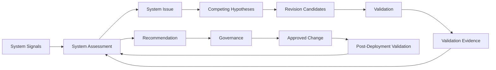
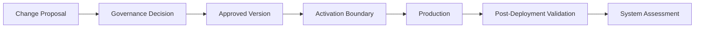

# DeerMind Evolution Space Design v1.1

> **中文名称**：DeerMind 演化空间设计  
> **版本**：v1.1  
> **文档性质**：Space Design / Architecture Baseline  
> **状态**：架构冻结基线  
> **上位基线**：DeerMind Concept Architecture v1.1  
> **关联基线**：DeerMind Learning Space Design v1.1；DeerMind Evaluation Space Design v1.1；DeerMind Interaction Space Design v1.1  
> **上位价值约束**：DeerMind Product Thesis v1.0；DeerMind Product Constitution v1.0  
> **写作规范**：DeerMind Design Document Standard v1.0  
> **更新时间**：2026-09-27  
> **版本说明**：v1.1 保留 v1.0 的 `SystemAssessmentModel + HypothesisModel + ValidationModel` 三模型结构、Governance 外置、Signal / Issue / Hypothesis / Revision / Validation Evidence 分层、最低充分验证、Historical Replay、禁止自我封闭验证、Approval Envelope、四级变化权限、Evolution Contract、Version Activation、Rollback 与 Post-Deployment Validation 等核心结论。本版本主要完成五项语义对齐：第一，将 Learning Target Definition、Target Responsibility / Support Boundary 等正式纳入 Versioned Evolution Contract；第二，区分经验模型失效、规范来源变化与 authority boundary 变化，避免把所有改变都解释成普通模型优化；第三，引入 typed dependency invalidation，使 Target、Learner Belief 与 Policy / Plan 的失效路径保持不同；第四，把 Policy-induced data bias 扩展为更一般的 System-induced evidence bias，并正式审计 Opportunity self-sealing；第五，使 Context Authority、Safety 与 Constitutional Change 的提案、验证和授权边界与 Product Constitution v1.0 对齐。经四 Space Cross-Document Freeze Gate，本版本现作为架构冻结基线；AI-Native / System Design 的后续版本传导不改变本 Space 的 semantic ownership。

---

## 1. 文档定位与设计命题

DeerMind 的前三个 Space 在一套已经批准的系统语义下运行：Learning Space 定义学习领域，Evaluation Space 形成对学习者的认识，Interaction Space 理解当前交互并决定是否行动。即使这三个 Space 的职责边界完全正确，它们内部的模型仍然可能错。

Learning Target 可能把错误的能力要求写成正式标准，Task Family 的粒度可能过粗，某个 KC 可能没有稳定复用价值；Observation Model 可能系统性误读某类行为；Evidence / Inference 可能把受助表现高估为 learner-owned capability；Interaction Policy 也可能在短期任务完成率上表现良好，却长期增加认知替代、减少反证机会或错误扩大外部 authority 的运行影响。对于一个长期运行的 AI Learning Expert，这些都不能被当成偶发“bug”而只靠人工事后修补。

Evolution Space 因此处理一个 Meta-Level 问题：

> **如果 DeerMind 用来理解学习领域、理解学习者、理解当前交互和选择行动的模型本身可能错误，系统如何发现问题、形成解释、验证解释与候选修改，并在明确治理边界下推动改进？**

Evolution 的对象不是某个学习者，也不是某次交互，而是 **DeerMind 自己的模型、规范语义、派生判断、策略及其有效性**。当问题涉及 Context Constitution 或 Product Constitution 时，Evolution 可以形成问题认识、候选解释和变更提案，但不能因此取得新的 authority；价值和权限边界的正式改变仍属于相应 Governance。

\[
\boxed{
EvolutionSpace
=
SystemAssessmentModel
+
HypothesisModel
+
ValidationModel
}
\]

三个 Model 分别回答：

| Model | 核心问题 |
|---|---|
| System Assessment Model | 系统哪里可能存在问题，我们有多大依据认为问题成立？ |
| Hypothesis Model | 为什么会出现这个问题，有哪些竞争解释和候选修改？ |
| Validation Model | 这些解释和候选修改是否经得住足够独立、足够有区分力的证据？ |

Evolution Space 的输出是**系统认识和变更提案**，不是最终变更权限。

\[
\boxed{
Evolution\ knows
\qquad
Governance\ authorizes
}
\]

这条边界是 DeerMind 能够“持续改进”而不退化为不受约束的自修改 Agent 的前提。

### 1.1 本文档解决什么

本文档定义 Evolution Space 的稳定语义责任，包括：

- 运行信号如何被评估为 System Issue；
- Learning Target、Task / Solution / Knowledge、Learner Claim、Evidence、Observation、Action / Policy 等正式语义如何进入可演化体系；
- System Issue 如何保持证据、范围、不确定性与生命周期；
- 问题、解释、候选修改和验证证据为什么必须分离；
- Hypothesis 如何保持可证伪并支持竞争解释；
- Validation 如何区分 Hypothesis Validation 与 Revision Validation；
- 如何选择最低充分验证强度，并显式处理可识别性；
- Historical Replay、Shadow Validation、前瞻性验证与 Target re-interpretation 的边界；
- 系统自己的 Target、Belief、Policy 与 Authority Context 如何塑造未来 Evidence Opportunity；
- Opportunity self-sealing、Support / Responsibility mismatch、Target Assessment calibration 等问题如何进入 System Signal；
- Normative Source Change、Empirical Model Failure 与 Authority Change 为什么必须分层；
- typed semantic dependency 与失效传播如何保证 Target、Learner Belief、Target Assessment、Plan / Policy 不被粗暴联动；
- Evolution Contract 如何保证其他 Space 从第一天起可版本化、可追溯、可验证；
- Governance、Approval Envelope、Change Proposal、Rollback 与版本激活的权限边界；
- Context Constitution / Constitutional Change Proposal 如何形成，但不能由 Evolution 自行生效；
- Post-Deployment Validation 如何把变化重新纳入系统认识。

### 1.2 本文档不解决什么

Evolution Space 不负责：

- 对单个学习者形成 Learner Belief；
- 选择当前面向学习者的 Action；
- 定义或直接提交 Target、Task、Solution、KC、Observation、Evidence、Action、Policy 等正式语义；
- 把单个 Target Gap、learner anomaly、异常指标或投诉自动解释成系统问题；
- 把外部专家、制度来源或高权威 Actor 的意见直接升级为系统真理；
- 把“某个系统设计效果更好”自动解释为 DeerMind 应获得更多 authority；
- 批准 Level 3 结构 / 语义变化或 Level 4 Constitution / Context Authority 变化；
- 在运行时创造 Context Authority、Emergency Authority 或新的 Constitutional permission；
- 规定具体组织岗位、审批 UI 和公司治理流程；
- 冻结 OPE、因果推断、随机实验、Bayesian 模型比较等具体验证技术路线；
- 为了历史重放、模型训练或未来验证价值而无限扩大数据采集、推断和保留；
- 用单一奖励指标定义整个 DeerMind 的“更好”。

这些问题分别属于其他 Space、Product Constitution、Product Context / Context Constitution、Governance、System Design 或具体 Validation Design。

### 1.3 为什么 Evolution 必须从系统一开始就存在

Evolution 不是产品成熟后才补上的“自动调优系统”。如果早期系统没有保存稳定身份、版本、溯源信息、依据、策略情境和重放信息，未来发现模型错误时，即使有更好的算法，也可能无法回答：

- 哪些历史 Learner Belief 受旧 Task / Claim / Evidence / Inference 语义影响；
- 哪些 Target Assessment 绑定了旧 Target Version；
- 哪些交互使用过旧 Policy、旧 Target Binding 或旧 Context Authority projection；
- 某次成功是否发生在 Hint 暴露之后；
- 新 Observation / Evidence / Target Model 对旧学习产物会产生什么解释；
- 某个变更上线后到底改善了什么、伤害了什么；
- 旧版本是否还能被安全回滚。

因此可演化性首先是一种**从第一天开始保存验证条件的架构能力**，而不是后期才添加的模型功能。

---

## 2. 设计问题与第一性约束

Evolution Space 的三模型结构不是为了把“系统优化”拆成更多模块，而是为了防止自我改进过程中几个最危险的认识论捷径。

### 2.1 Signal 不等于 Issue

线上指标异常、用户投诉、某个学习者模式、模型输出冲突或专家意见，都只能先成为 System Signal。Signal 表示“这里值得看”，而不是“这里已经证明有问题”。

\[
SystemSignal
\neq
SystemIssue
\]

如果看到指标波动就直接修改模型，系统会把噪声、短期分布变化和监控误差都转化为结构变化，最终形成持续漂移。

System Assessment 的职责就是在 Signal 与 Issue 之间建立认识论门槛。

### 2.2 没有预期，就没有合法 Assessment

要判断一个系统对象是否失效，必须先知道它原本声称自己应该在什么条件下表现如何。

\[
NoAssessmentWithoutExpectation
\]

如果一个 Model 从未声明任何可观察预期，那么无论现实发生什么，它都可以事后解释成“仍然合理”，也就无法被证伪。

因此 Evolution 不是只看 metrics，而是把现实表现与某个 Versioned System Component 的 Falsifiable Expectation、Validity Scope 和当前上下文对照。

### 2.3 Issue、Hypothesis、Revision Candidate 和 Validation Evidence 必须分离

“这里有问题”“问题为什么发生”“应该怎么改”和“证据是否支持这种改法”是四个不同问题。

\[
\boxed{
Issue
\neq
Hypothesis
\neq
RevisionCandidate
\neq
ValidationEvidence
}
\]

例如 Observation Model 在某类手写轨迹上持续误判，是一个可能的 System Issue；“现有 parser 对跨行书写结构建模不足”是 Hypothesis；“引入新的 stroke grouping 语义”是 Revision Candidate；影子比较和盲审结果则是 Validation Evidence。

如果这四层合并，系统很容易从“发现异常”直接跳到“我知道为什么，而且我知道该怎么改”。

### 2.4 系统认识与系统变更必须分离

即使 Validation 强烈支持某个 Revision Candidate，也不能推出系统自动获得部署权限。

\[
ValidationEvidence
\neq
ChangeDecision
\]

Evolution 可以尽可能自动化地观察、分析、提出假设、设计验证、整理证据并形成 Recommendation；但结构性语义改变的最终权限属于 Governance。

这条分离同时防止两种错误：一是“模型自证后自动改写自己”，二是让人工 Governance 重新从海量原始日志开始分析。Evolution 应准备完整决策材料，Governance 承担最终授权责任。

### 2.5 System-Induced Evidence Bias：生产数据不是自然、无偏的现实样本

DeerMind 看到的数据不仅受到 Interaction Policy 影响，还受到系统已有的 Target、Learner Belief、Target Assessment、Context Authority 和现实环境共同塑造。

例如系统决定：

- 哪个 Learning Target 当前被绑定、优先或暂缓；
- 谁看到什么 Task 与 challenge level；
- 谁获得何种 Support / Cognitive Work Substitution；
- 谁被主动评估；
- 哪些 Action 因 Context Authority 或 safety constraint 不可执行；
- 谁被跳过；
- 什么 Observation 和反证机会最终有机会出现。

因此更一般地：

\[
ObservedEvidenceOpportunity
=
f(
Target,
LearnerBelief,
Policy,
AuthorityContext,
Environment
)
\]

这意味着：

\[
ObservedProductionData
\neq
UnbiasedEvidenceAboutSystem
\]

Policy-induced data bias 仍然是最重要的子类，但 v1.1 要求 Evolution 进一步审计**系统整体如何塑造 Evidence Opportunity**。最危险的情况不是普通抽样偏差，而是系统形成自我封闭循环：

\[
LowBelief
\rightarrow
LowerChallengeOpportunity
\rightarrow
LessDisconfirmingEvidence
\rightarrow
LowBelief
\]

因此 Equal Epistemic Standing 在 Evolution 层的核心要求是：系统必须能够发现 Opportunity self-sealing，而不能用自己减少反证机会后产生的数据证明原 judgment 正确。

### 2.6 历史可重放，不等于反事实可识别

Historical Replay 可以用新模型重新解释已经发生的事实：

\[
HistoricalEvents
\xrightarrow{NewModel}
NewDerivedResults
\]

但它不能自动回答：

> 如果当时没有给 Hint，会发生什么？  
> 如果当时使用另一种 Policy，会发生什么？

因为替代世界没有发生。

\[
\boxed{
FactualReplay
\neq
CounterfactualEvaluation
}
\]

进一步：

\[
ReplayableHistory
\not\Rightarrow
CounterfactualIdentifiability
\]

反事实问题可以根据具体条件采用前瞻性验证、随机或准实验、causal estimation、off-策略 evaluation 等方法，但 Evolution Space 不把任何一种方法预先冻结为统一路线。

### 2.7 验证不是越强越好，而是达到最低充分强度

不同变化需要不同证据强度。修改一个可逆参数，与修改 KC 身份、Evidence 语义或 Product Constitution，不能采用同一门槛。

概念上：

\[
\boxed{
RequiredValidationStrength
=
f(
ChangeImpact,
Identifiability,
Reversibility,
LearnerBurden,
EvidenceIndependence
)
}
\]

影响越大、越难回滚，越需要更独立、更有区分力的证据；反事实越难识别，越不能把重放包装成充分验证。但如果进一步提高验证强度需要不可接受的学习者负担、隐私成本或伦理风险，系统必须允许停止。

因此 `Inconclusive` 与 `NotIdentifiable` 都是合法结果。

\[
\boxed{
Unresolved
\neq
NotIdentifiable
}
\]

`Unresolved` 表示当前证据还不够；`NotIdentifiable` 表示在当前数据生成机制、可接受假设和允许成本下，该问题无法被可靠识别。后者不是“继续多收一点数据”就必然能够解决的问题。

### 2.8 系统有效性永远有条件

一个模型在某一人群、学科、交互 channel 或 Task 分布上有效，不代表它在所有条件下有效。

\[
SystemValidityIsConditional
\]

Evolution 必须显式维护 Validity Scope，而不能把平均效果包装成普遍真理。

### 2.9 Evolution 自身也必须允许被检验

如果 Evolution 只能检验其他模型，却不能被评价自己的 false positive、漏检、confirmation 偏差、验证 discrimination 和真实改进效果，它仍然会形成自我封闭。

Evolution Space 因此本身也是 Versioned System Component，可以被当前已经批准的 Assessment / Validation 机制检验；但它不能据此自行批准自己的结构性修改。结构变化仍需外部 Governance。

### 2.10 Normative Change、Empirical Failure 与 Authority Change 必须分层

并不是所有系统变化都来自“现实证明模型错了”。DeerMind 同时存在经验语义、规范语义和权限语义，它们的变化来源不同。

**Empirical Model Failure** 表示模型关于现实的可检验预期被 Evidence 挑战。例如某个 Evidence mapping 长期校准失败。

**Normative Source Change** 表示规范来源本身发生变化。例如认证机构正式提高要求，或某个行业标准更新。此时需要重新解释 / version Target，却不能把这种变化说成 learner data “证伪”了旧规范来源。

**Authority Change** 表示 Product Constitution、Context Constitution 或 Governance 正式改变了谁在什么 scope 下拥有什么权限。Authority 变化尤其不能被普通系统效果指标直接产生。

因此：

\[
NormativeSourceChange
\neq
EmpiricalModelFailure
\]

\[
EmpiricalBenefit
\neq
AuthorityJustification
\]

\[
ValidationSuccess
\not\Rightarrow
AuthorityExpansion
\]

Evolution 可以收集经验后果、形成冲突解释、比较替代方案并提出 Proposal，但当变化涉及价值或 authority boundary 时，最终授权必须回到相应 Governance。

同样：

\[
SafetySignal
\neq
EmergencyAuthority
\]

新的 safety failure mode 可以要求重新打开 Context Constitution 或 Emergency Envelope，但不能成为模型在运行时自我扩权的后门。

---

## 3. Evolution Space 的整体架构与生命周期

Evolution 不是一个“发现问题就改模型”的流水线，而是两条相互连接、但权限不同的闭环。

第一条是**系统认识闭环**：

\[
Signal
\rightarrow
Assessment
\rightarrow
Issue
\rightarrow
Hypothesis
\rightarrow
Validation
\rightarrow
Evidence
\rightarrow
Assessment
\]

它回答：

> DeerMind 现在对自己的系统状态应该相信什么？

第二条是**受治理演化闭环**：

\[
ValidatedProposal
\rightarrow
Governance
\rightarrow
ApprovedChange
\rightarrow
PostValidation
\rightarrow
SystemAssessment
\]

它回答：

> 哪些变化有资格被正式授权，以及变化后是否真的继续成立？

### 3.1 Lifecycle 不是强制同步流水线

概念上，Evolution 可以按以下生命周期推进：

\[
Monitor
\rightarrow
Detect
\rightarrow
Analyze
\rightarrow
Assess
\rightarrow
Hypothesize
\rightarrow
Propose
\rightarrow
Validate
\rightarrow
AssessAgain
\rightarrow
Recommend
\]

随后进入 Governance、Deployment / Activation、Post-Deployment Validation，再回到 Monitor / Assessment。

这不是要求每个 Issue 都经过完全相同的同步步骤。不同问题可能从不同位置进入，也可能在 `No Issue`、`Insufficient Evidence`、`Unresolved`、`NotIdentifiable` 或 `Maintain Current Version` 结束。

### 3.2 两类合法入口

**问题驱动路径**从现实异常开始：

\[
SystemSignal
\rightarrow
SystemIssue
\rightarrow
Hypothesis
\]

**理论驱动路径**从新的外部理论、专家建议或模型能力开始：

\[
ExternalTheory
\rightarrow
Hypothesis
\rightarrow
Validation
\]

理论来源可以高质量，但来源权威不等于假设有效性。任何理论驱动提案仍需明确 Falsifiable Expectation、Validity Scope 和 Validation Evidence。

### 3.3 Recommendation 不是第四个 Model

Recommendation 是 Assessment、Hypothesis 和 Validation 输出在当前证据下形成的决策材料，不拥有独立认识对象，也不需要形成第四个 Model。

Evolution 的三个核心 Model 已经覆盖：

- 现在系统是否存在值得相信的问题；
- 为什么可能出现；
- 哪些解释和候选修改经得住验证。

是否授权变化由 Governance 负责。

---

## 4. System Assessment Model：从 Signal 到有依据的 System Issue

System Assessment Model 是 Evolution 的认识入口。它不负责解释原因，也不负责提出修改，而是判断：

> **当前是否存在一个值得 DeerMind 正式承认的系统问题？**

### 4.1 Evolution Monitoring 与普通运维监控不同

CPU、错误率、请求延迟、服务可用性属于普通运维监控；Evolution Monitoring 关注的是**系统语义和决策是否仍然符合其被批准时的预期**。

两者可以共享 telemetry，但问题不同。

例如：

- 服务 500 错误主要是运维问题；
- Observation Model 在某类学习产物上长期误读则是 Evolution concern；
- Interaction Policy 对某群体持续过度干预，也属于 Evolution concern；
- KC 拆分后校准明显恶化，则需要进入 System Assessment。

Evolution Space 不应成为所有 monitoring tool 的垃圾桶。

### 4.2 System Signal 只是待评估线索

Signal 可以来自：

- Learning Space 的 Target validity / grounding failure、Task / Solution / Knowledge 失配；
- Target Responsibility Boundary 与真实能力要求持续失配；
- Evaluation 的 Target Assessment calibration、Support contamination、Evidence / Inference failure；
- Interaction 的 Observation、State、Action 或 Policy failure；
- Target Gap / Epistemic Gap 被错误自动化成行动的模式；
- Goal / Obligation / Target laundering；
- Context Authority scope leakage 或 Authority Directive 被实现成 Policy bypass；
- Opportunity self-sealing、challenge / assessment opportunity 异常；
- Population Prior 持续压制 Individual Evidence；
- product / safety / fairness metric；
- learner、合法 External Actor 或 expert 报告；
- external standard / research 的正式变化；
- post-deployment monitoring；
- Target / Belief / Policy typed invalidation failure。

但任何单个 Signal 都不能自动成为 Issue。

Assessment 需要回答：

- 它是否重复出现；
- 是否超出正常变异；
- 是否与明确预期冲突，还是规范来源本身发生了变化；
- 影响范围是什么；
- 证据独立性如何；
- 是否可能由系统自己的机会分配或 authority constraint 造成；
- 这是经验模型问题、规范解释问题还是 authority / governance 问题；
- 不确定性有多大。

### 4.3 System Issue 描述问题，不解释原因

一个合法 System Issue 应描述：

> 哪个系统对象，在什么 Validity Scope 下，以什么方式偏离了什么可检验预期。

它至少需要包含：

- target component / semantic object；
- observed deviation；
- 证据依据；
- 预期的 behavior；
- 范围；
- 不确定性 / 支持度；
- first seen / latest seen；
- affected versions；
- severity / impact；
- 未解决情境；
- 溯源信息。

Issue 不应写成：

> “Observation Model 因 parser 太弱而失败。”

因为这已经混入 Hypothesis。

更合适的 Issue 是：

> “Observation Model v3 在多行竖式场景中，对 step boundary 的人工盲审一致率持续低于批准阈值。”

原因留给 Hypothesis Model。

### 4.4 No Issue 与 Insufficient Evidence 都是合法结果

Evolution 不能因为“持续改进”而强迫系统永远找到问题。

Assessment 可以返回：

\[
NoIssue
\]

也可以返回：

\[
InsufficientEvidence
\]

前者表示当前证据支持“没有足够问题成立”；后者表示现有证据不足以判断。它们与“问题不存在”或“问题一定存在但还没查清”都不同。

### 4.5 System Belief 是 Assessment 内部认识机制

Assessment 可能需要维护对 System Issue 的支持度、不确定性、状态和证据依据，但这并不要求新增独立 System Belief Model。

System Belief 属于 Assessment 的内部认识论 mechanism。

具体采用 probability、ordinal 支持度、interval、structured 状态还是其他表示，当前保持开放。

### 4.6 Issue 需要稳定身份和生命周期

同一个系统问题可能跨时间、跨版本持续，也可能被多个 Signal 重复发现。因此 Issue 需要稳定身份、merge / 拆分 / resolve / reopen 等生命周期语义。

但“哪些 Signal 属于同一个 underlying issue”本身可能具有不确定性。v1.1 不冻结 Issue merge algorithm。

### 4.7 Assessment 不能被单一指标绑架

DeerMind 的系统质量至少可能同时涉及：

- 学习结果；
- 学习者独立性；
- 校准；
- 证据质量；
- 注意力成本；
- 交互负担；
- safety；
- fairness；
- 迁移；
- 任务完成；
- 长期依赖。

这些维度之间可能存在真实 trade-off。

因此：

\[
SystemQuality
\neq
SingleReward
\]

Assessment 可以使用综合判断，但不能通过一个总分把 Product Constitution 或关键负面效果隐藏掉。

---

## 5. Hypothesis 与 Validation：从“为什么”到“证据够不够”

System Assessment 只确认“哪里可能有问题”。Evolution 真正的推理核心，是在多个可能解释之间保持开放，并用能够区分它们的证据挑战自己。

### 5.1 Hypothesis Model：解释问题，但不拥有真理

Hypothesis 回答：

> **为什么会出现这个 System Issue？**

一个 Issue 可以有多个竞争解释。例如 Interaction Policy 在某类学习者上过度干预，可能因为：

- Learner Belief 校准偏低；
- Observation Model 把 hesitation 误识别为求助；
- Policy 对不确定性的 penalty 过高；
- 注意力成本没有进入决策情境；
- 某类外部 obligation 被错误当成 learning objective。

Evolution 必须保留竞争性假设，而不是让第一个“听起来合理”的解释获得默认优势。

\[
AlternativeHypothesesMustBeConsidered
\]

### 5.2 Hypothesis 必须可证伪

一个 Hypothesis 至少应明确：

- 它解释哪个 Issue；
- mechanism 是什么；
- 适用范围是什么；
- 如果它正确，应该看到什么；
- 如果它错误，什么证据会反驳它；
- 哪些 Observation / 结果可以区分它与替代 Hypothesis；
- 当前支持与反证是什么。

不能出现：

> “模型可能不够好。”

这种永远无法被现实挑战的伪假设。

### 5.3 来源权威不等于假设有效

Hypothesis 可以来自：

- 自动分析；
- LLM；
- engineer；
- teacher；
- educational researcher；
- 外部 paper；
- product team；
- learner / External Actor 报告。

来源影响溯源信息，但不赋予真实性。

\[
SourceAuthority
\neq
HypothesisValidity
\]

专家意见可以成为高价值 hypothesis 来源，却不能绕过 Validation。

### 5.4 Revision Candidate 与 Hypothesis 是多对多关系

一个 Hypothesis 可以有多个候选修订；同一个 Revision Candidate 也可能同时解决多个 Hypothesis。

因此：

\[
Hypothesis
\neq
RevisionCandidate
\]

Revision Candidate 至少应说明：

- proposed 变更；
- target component；
- 预期的 mechanism；
- affected dependencies；
- 有效范围；
- compatibility / migration concern；
- 风险；
- 回滚 possibility；
- 候选版本 / 身份。

它仍然只是候选，不具有部署权。

### 5.5 Unresolved 是合法状态

有些 Issue 可以确认存在，却暂时无法在多个 Hypothesis 之间区分。

\[
UnresolvedIsValid
\]

系统不应为了完成生命周期而强行选一个“最可能原因”。

### 5.6 Validation Model：验证解释和候选修改是两个不同问题

Validation 必须区分：

**Hypothesis Validation**

> 这个解释是否真的能说明 Issue？

以及：

**Revision Validation**

> 即使解释正确，这个 Candidate 是否真的改善目标问题，而且没有造成不可接受的副作用？

\[
HypothesisValidation
\neq
RevisionValidation
\]

一个正确 Hypothesis 可以对应一个无效 Revision；一个 Revision 也可能偶然提高某个指标，却没有支持最初 Hypothesis。

### 5.7 Validation 输出 Evidence，不输出 Change Decision

Validation 不能简化成：

\[
Pass / Fail
\]

它应该形成结构化 Validation Evidence，说明：

- 支持什么；
- 反驳什么；
- 证据来自哪里；
- 在什么条件下成立；
- 不确定性；
- 已知偏差；
- Validity Scope；
- subgroup difference；
- 未解决 question；
- 可识别性限制。

这些 Evidence 必须返回 System Assessment，使系统更新对 Issue、Hypothesis 和 Candidate 的认识。

\[
ValidationResult
\neq
ChangeDecision
\]

### 5.8 验证阶梯：使用最低充分验证

Validation 可使用：

1. 历史数据分析；
2. Historical Replay；
3. 专家复核；
4. benchmark / curated test set；
5. simulation；
6. 影子验证；
7. 有界 production 验证；
8. limited 前瞻性学习者实验；
9. 部署后验证。

这些不是固定流水线，而是工具箱。

原则是：

\[
UseLeastCostlySufficientValidation
\]

能用低风险、低成本、足够独立的方式区分问题时，不直接拿真实学习者做实验；影响重大、不可逆或反事实依赖强时，则不能只凭低成本重放得出过度结论。

### 5.9 Historical Replay：重新解释事实，不创造替代世界

Replay 要求历史 Event 以及它依赖的学习产物、输入、呈现材料、已发生 Action / Tool Use、外部结果和关键 authority context 可以按必要粒度还原。

\[
ReplayableEvent
\Rightarrow
ReplayableGrounding
\]

Replay 可以回答：

> 新 Observation / Evidence / Inference / Target interpretation 重新解释同一历史事实，会得到什么结果？

但不能自动回答：

> 如果当时换了 Action / Policy，会发生什么？  
> 如果当时 Target 要求不同的 Responsibility Boundary，learner 会不会仍然成功？

因此：

\[
ReplaySupport
\neq
CounterfactualGuarantee
\]

对于 Target evolution，还必须明确：新的 Target semantics 可以重新解释旧事实，却不能创造当时从未存在的 Evidence Opportunity、Responsibility Condition 或 independent-performance condition。

\[
Replay
\ cannot\ create\ missing\ evidence\ opportunity
\]

例如旧 Target 允许 AI 给出 diagnosis candidate，而新 Target 要求 learner 独立提出 diagnosis hypothesis；大量旧 assisted-success 记录可以被重新解释，但不能凭 replay 自动升级成新 Target 下的 independent capability Evidence。合法结果可能只是 `InsufficientEvidence`。

### 5.10 禁止自我封闭验证

被验证模型不能成为验证证据的唯一解释来源。

\[
\boxed{
ModelUnderTest
\not\equiv
SoleInterpreterOfValidationEvidence
}
\]

如果 Learning Space 的 KC 划分本身可能有错，就不能只使用完全依赖同一 KC 划分形成的派生 Evidence 来证明该结构正确。

结构性验证应根据风险和成本引入足够独立的锚点，例如：

- 原始 Event / 学习产物；
- 专家盲审；
- 竞争性模型；
- 外部结果；
- 区分性 Task；
- 影子比较；
- 后续 retention / 迁移。

“独立”不意味着每次都必须人工验证，而是不能让被验证假设在认识论上定义所有证据。

### 5.11 Shadow Validation：候选可以先观察，不先控制生产行为

Candidate Model 可以与正式版本并行运行，只产生影子结果：

\[
Model_{official}
\]

继续影响生产；

\[
Model_{candidate}
\]

只用于比较和验证。

这特别适合 Observation、Evidence、Inference 和部分 Policy 候选。

但影子仍然受现有 production 策略的数据生成机制限制，不能被误认为完整反事实验证。

### 5.12 System-Induced Evidence Bias 与 Opportunity Self-Sealing

Validation 必须尽可能保存能够解释数据生成过程的 provenance，例如：

- Target / Target Binding identity 与 version；
- Learner Belief / Target Assessment version；
- Policy identity / version 与 decision context；
- Context Authority / constraint version 与 scope；
- learner / Task eligibility；
- available action set；
- considered / candidate actions（可行时）；
- selected action 与 actual occurred action；
- Action Information Disclosure / Cognitive Work Substitution；
- Task / challenge exposure；
- assessment opportunity；
- assignment reason 与 selection condition。

这些信息不保证 counterfactual 一定可识别，但决定系统有没有资格判断某种 replay、shadow、causal 或 prospective method 是否成立。

Evolution 还必须特别审计 Opportunity self-sealing：如果既有 Belief、群体 prior 或 Policy 让 learner 长期失去高挑战 Task、独立表现或反证机会，则后续“缺少反证”不能被解释为原判断越来越可靠。

\[
NoDisconfirmingEvidence
\not\Rightarrow
ConfirmedByReality
\]

当没有反证是系统机会分配的产物时，它首先是 Validation design / Policy data-generation 问题，而不是 learner-level truth。

### 5.13 Evidence Dependency 与统计独立性

同一学习者连续做多个相似 Task，不等于多个独立样本。

Validation 必须考虑：

- 学习者依赖；
- 任务相似度；
- shared instruction history；
- Policy 依赖；
- temporal correlation；
- repeated 信息暴露。

\[
ExecutionIndependence
\neq
StatisticalIndependence
\]

### 5.14 Validity Scope 与异质效果

平均效果可能掩盖真实伤害。

如果：

\[
AverageEffect>0
\]

但某个重要学习者 subgroup：

\[
Effect<0
\]

系统不能只报告“整体有效”。

Validation Evidence 必须保留范围、异质效应和已知限制。对于公平性相关问题，subgroup outcome 只是信号之一；Evolution 还必须检查 subgroup 是否获得了可比较的 challenge、assessment、support 与 disconfirmation opportunity。否则“结果差异”可能同时混入真实能力差异和系统机会分配差异。

### 5.15 多维 Outcome

一个 Candidate 可能提高任务完成，却降低独立的表现；提高短期正确率，却增加认知替代；改善校准，却显著增加评估负担。

因此 Validation 不把所有结果压成单一 reward。

\[
ValidationOutcome
\text{ retains multidimensional structure}
\]

Product Constitution 相关边界更不能因为综合得分上升而被抵消。

### 5.16 真实学习者 Experiment 的边界

Validation Model 可以提出 `ValidationIntent`，但不能直接作用于 learner。

正确链路是：

\[
ValidationIntent
\rightarrow
ApprovedValidationEnvelope
\rightarrow
InteractionPolicy
\rightarrow
PolicyOutcome
\rightarrow
OccurredEvent
\]

Governance / Product Context 批准的是某类验证在什么 scope、risk、burden、authority 和 stop condition 内可以被考虑，而不是命令某个 learner 必须参加。Interaction Policy 仍需结合 Target Binding、learner intent / refusal、当前 burden、Context Authority、Safety 与 Product Constitution 决定 `Execute / NoIntervention / Defer`。

真实实验至少必须考虑：

- legitimate authority 与批准 scope；
- risk constraint；
- minimum Information Disclosure / Cognitive Work Substitution；
- safe baseline；
- learner burden；
- refusal / stop condition；
- rollback；
- Product Constitution 与 Context Constitution。

批准验证本身不能成为 learner-level execution command。

### 5.17 Post-Deployment Validation：上线不是验证终点

正式部署后仍可能出现：

- 分布 shift；
- curriculum 变更；
- new 学习者 population；
- new 交互 channel；
- 策略 feedback loop；
- unseen failure mode。

因此：

\[
\boxed{
ValidationDoesNotEndAtDeployment
}
\]

新版本进入生产，只是进入新的现实验证阶段。

---

## 6. Evolution Contract：让整个 DeerMind 具备可演化性

Evolution Space 能否工作，不只取决于自己的三个 Model，还取决于其他 Space 是否保存了足够的身份、版本、来源和历史事实。

Evolution Contract 因此适用于任何具有独立语义责任和独立演化生命周期的 **Versioned System Component**，而不仅仅是顶层 Model。

\[
\boxed{
EvolutionContract
=
Identity
+
Version
+
ActivationBoundary
+
Provenance
+
ValidityScope
+
FalsifiableExpectation
+
ReplaySupport
}
\]

### 6.1 Stable Identity：变化不能抹掉历史对象

Learning Target Definition、Task Family、Solution Strategy、KC、Learner Claim、Evidence / Inference semantics、Observation semantics、State Type、Action semantics、Interaction Policy 等对象，即使未来被拆分、merge、retire，也必须保留可追踪的历史身份。

Target 尤其不能因为标准升级就覆盖旧定义。旧 Target Version 下的 Target Assessment、Plan、Interaction context 和 learner history 必须能够继续解释“当时依据什么要求做出了什么判断”。

Context Constitution / Authority definitions 作为上位 governance dependency 也必须拥有可审计 version / activation history；Evolution 不拥有这些 authority，但必须知道 downstream 结果当时受哪一版 authority envelope 约束。

否则系统只能看到“当前定义”，无法判断旧 Evidence、旧 Target Assessment 和旧决策到底依赖什么。

### 6.2 Version：任何正式语义改变都必须显式版本化

\[
EverySemanticChangeMustBeVersioned
\]

不能静默修改旧对象，并假装历史一直如此。

版本化是重放、影子比较、回滚、依赖失效和 governance audit 的基础。

### 6.3 Version Activation / Consistency Boundary

Governance 批准新版本，不等于所有运行中的实例立即切换。

\[
ApprovedVersion
\neq
ImmediateGlobalReplacement
\]

每个 Versioned Component 必须根据自身运行语义声明适当的 activation / 一致性边界，例如：

- 一次 Event interpretation；
- 一次 Learner Belief recomputation；
- 一个 Interaction Episode；
- 一次 Validation Run。

\[
\boxed{
VersionActivation
\ obeys\
ComponentConsistencyBoundary
}
\]

具体使用快照、版本 pinning、MVCC、configuration generation 或其他机制属于 System Design；Evolution 只要求边界明确、可追踪、与溯源信息一致。

### 6.4 Provenance：任何重要派生结果都必须能解释自己的来源

系统必须能够回答：

> 这个结论基于什么事实、使用哪个版本、经过什么推导形成？

例如：

\[
LearnerBelief
\rightarrow
Evidence
\rightarrow
Observation
\rightarrow
Event
\]

并绑定相应 Model Version。

因此：

\[
NoOpaqueDerivedState
\]

### 6.5 Falsifiable Expectation：组件不能只定义“是什么”

每个重要可演化组件还应尽量声明：

> 如果这个设计合理，现实中应该出现什么；什么结果会挑战它。

例如一个 KC 声称具有跨 Task reuse 价值，就需要某种可观察 generalization 预期；一个 Interaction Policy 声称 Minimum Sufficient Intervention 能提高独立性，就必须允许独立表现、注意力成本或长期依赖数据反驳它。

不同组件的预期可以有不同表达方式；v1.1 不强制统一 DSL。

### 6.6 Replay Support：如实声明能力，而不是创造数据权限

Replay Support 要求系统尽可能保留能够重新解释历史的事实和依据，但 replay / validation value 没有高于 Product Constitution 与当前 Product Context 的数据 authority。

\[
\boxed{
ReplaySupport
\neq
IndefiniteRetention
}
\]

同时：

\[
ValidationValue
\neq
DataAuthority
\]

“未来可能有训练、重放或验证价值”不能成为无限扩大采集、推断和保留范围的合法性来源。Retention Policy、purpose limitation、数据最小化、合法删除、Context-specific protection 与适用法律都可能导致某些 grounding 到期或删除。

当依据不再可用时，系统应显式降低 replay / validation capability，不能继续把历史声明为 fully replayable。System Design 可以定义 Full / Bounded / Unavailable 等能力等级，但具体等级不是本层冻结内容。

### 6.7 Semantic Dependency 必须可追踪，而且失效传播必须有类型

不同语义变化影响不同 downstream object。Revision Candidate 不能只列“依赖对象”，还需要说明**为什么该依赖应该失效，以及默认失效到哪一层**。

三个典型路径必须分开：

| 变化类型 | 默认需要重新评估的对象 | 默认不应自动重写 |
|---|---|---|
| Target Requirement / Standard / Conditions / Support Boundary | Target Assessment、相关 Plan / Policy Context | Learner Belief |
| Task / Claim / Evidence / Inference semantics | Evidence interpretation、Learner Belief、Target Assessment 及相关 downstream | Historical Event |
| Target Binding / Context Authority | Policy Context、Plan、Action admissibility | Target Definition、Learner Belief、Historical Event |

因此：

\[
TargetRevision
\Rightarrow
TargetAssessmentInvalidation
\]

但通常：

\[
TargetRevision
\not\Rightarrow
LearnerBeliefRevision
\]

而 Claim / Evidence semantics 改变时，旧 Belief 可能需要 replay / reinference。Context Authority 改变时，则主要触发 Policy / Plan reevaluation。

\[
SemanticDependenciesMustBeTraceable
\]

这不要求新增独立 Dependency Model，但要求 System Design 支持 typed dependency tracking、version pinning 与精确失效。

### 6.8 多版本共存是演化能力的一部分

Validation 与 rollout 需要允许正式与候选版本并存，以支持：

- 重放；
- 影子 execution；
- 有界验证；
- staged activation；
- 回滚比较。

多版本不是单纯部署技巧，而是“系统可以在不破坏当前正式版本的情况下验证另一种解释”的概念前提。

### 6.9 各 Space 与上位 Context 对 Evolution 的最小责任

四个 Space 的 v1.1 文档已经分别定义自身 Evolution Contract。这里不重复内部字段，只冻结横向责任：

| 来源 | 至少需要可演化 / 可审计的信息 |
|---|---|
| Learning | Target / Task / Solution / KC identity、version、Responsibility semantics、Validity Scope、historical mapping、split / merge / retire history |
| Evaluation | Claim / Evidence / Inference version、Evidence Basis、Belief revision、Target Assessment dependencies、calibration、replay support |
| Interaction | Observation / State / Action / Policy version、Target / Authority projection、decision context、opportunity allocation、exposure lineage、selected vs occurred action、rationale 与 result |
| Product Context / Context Constitution | 当前生效 authority / constraint version、scope、activation / expiration 与 governance provenance |
| Global Event Model | immutable occurrence truth、grounding identity / version、source / provenance、occurred Action / Tool Use、historical references |

Evolution 可以重新解释这些历史，也可以提出 revision / authority change proposal，但不能重写历史事实或自行修改上位 authority。

\[
HistoricalFact
\neq
LaterInterpretation
\]

\[
EvolutionProposal
\neq
ChangeAuthority
\]

---

## 7. Governance、变更权限与正式部署

Evolution 负责形成系统知识；Governance 负责赋予变化权限。两者必须协作，但不能合并。

### 7.1 四级变化

当前架构继续区分四类变化：

| 等级 | 典型变化 | 权限原则 |
|---|---|---|
| Level 1 — Learner Adaptation | 当前 Task、Support、节奏、是否主动评估、Plan 调整 | Evaluation + Interaction 在当前正式语义与 Context Authority 内正常运行 |
| Level 2 — Bounded System Adaptation | 已批准参数范围、Policy Variant 切换、bounded calibration、安全版本回滚 | 可在 Approval Envelope 内自动执行 |
| Level 3 — Structural / Semantic Evolution | Target / Task / KC identity、Claim / Evidence / Inference、Observation / State / Action / Policy semantics | 必须进入人工 Governance |
| Level 4 — Constitutional / Authority Boundary Change | Core Constitution，或 Context Constitution 中价值、合法 authority / Emergency Envelope 边界的变化 | 对应 Constitutional / Context Governance；不得降级为普通产品优化 |

Level 1 不是系统演化；它是系统按当前正式语义服务具体 learner。

Level 3 改变 DeerMind **如何理解学习、学习者或交互**，因此不能因为 Validation 指标更高就自动上线。

Level 4 改变的是系统“有没有权这样做”。它不是更高强度的 Level 3，也不是经验验证的自然结果：

\[
\boxed{
EvolutionCannotOptimizeConstitutionAway
}
\]

\[
EmpiricalBenefit
\neq
ConstitutionalJustification
\]

例如实验发现强制完成任务能够提高考试成绩，最多形成 empirical consequence；它不能因此授权 DeerMind 获得新的强制学习权。

### 7.2 Approval Envelope：低风险自动化的权限边界

为了避免 Governance 对每个低风险变化逐项审批，Level 2 使用预授权 Approval Envelope：

\[
\boxed{
ApprovalEnvelope
=
Scope
+
AllowedVariants
+
RiskLimit
+
EvidenceThreshold
+
ActivationBoundary
+
RollbackCondition
+
Expiration
}
\]

Envelope 内可以自动执行已经批准的有界 adaptation：

\[
InsideApprovedEnvelope
\rightarrow
BoundedAutomaticExecution
\]

超出 Envelope：

\[
OutsideApprovedEnvelope
\rightarrow
HumanGovernance
\]

Approval Envelope 的作用是降低重复审批成本，不是降低 Level 3 / Level 4 的治理门槛。

### 7.3 Change Proposal：Governance 不应从原始日志重新分析

进入 Governance 的材料不能只有一句“建议修改模型”。

完整 Change Proposal 至少应包含：

- System Issue；
- Evidence Basis；
- 竞争性假设；
- strongest 当前 hypothesis；
- Revision Candidate；
- Validation Evidence；
- Validity Scope；
- 未解决不确定性 / 可识别性 limit；
- 已知风险；
- 依赖 impact 与 typed invalidation path；
- normative source change（如适用）；
- authority / permission delta（如适用）；
- Constitutional / Context impact（如适用）；
- 历史 compatibility；
- activation / deployment boundary；
- 回滚 plan；
- recommendation。

Governance 的责任是承担授权，不是重新执行 Evolution 的全部分析工作。

### 7.4 Governance Decision 不只有 Approve / Reject

合法决策至少包括：

- Approve；
- Reject；
- Need More Evidence；
- Approve Additional Validation；
- Approve Shadow Run；
- Approve Bounded Deployment；
- Rollback；
- Maintain Current Version。

这种结构允许系统在证据不足时保持开放，而不是为了流程完结强制做二元判断。

### 7.5 Rollback 是一等能力

任何正式部署的变化原则上都需要考虑：

- old 版本；
- new 版本；
- deployment 范围；
- 回滚 condition；
- 回滚 path。

对于 Governance 预先批准的严重质量或安全条件，可以允许：

\[
PreAuthorizedAutomaticRollback
\]

这不是系统创造新语义，而是退回已经批准的安全版本。

### 7.6 Governance Decision 本身也进入历史

每次正式变化都应能够回答：

- 谁批准；
- 基于哪些 Evidence；
- 当时有哪些反证；
- 接受了哪些风险；
- Validity Scope 是什么；
- 为什么选择该版本；
- 激活边界是什么；
- 何时触发回滚。

治理不是系统历史之外的“人工黑箱”，而是可审计事实的一部分。

### 7.7 Human 可以进入完整 Evolution Lifecycle

Human 不只在最后审批时出现，也可以：

- 提交 System Signal / Issue；
- 提交 Hypothesis；
- 提交 Revision Candidate；
- 提出 Validation Requirement；
- 提供专家盲审；
- 作出 Governance Decision。

但任何来源都不能绕过 Assessment、Validation 和 Governance 直接成为正式系统真理。

### 7.8 部署后的闭环

正式批准后，新版本按其 Activation Boundary 进入运行；Post-Deployment Validation 持续观察真实影响，并把结果重新送回 System Assessment。

因此“上线”不是 Evolution 生命周期的结束，而是新一轮现实检验的开始。

### 7.9 Context / Constitutional Change Proposal 的特殊边界

Evolution 可以发现 Core Constitution、Context Constitution 或 Emergency Envelope 与现实发生持续冲突，也可以提出 Constitutional / Context Change Proposal、整理 Evidence、替代方案和 downstream impact，但这种 Proposal 与普通 Revision Candidate 不同。

普通 empirical revision 主要回答“什么解释更接近现实、什么设计在既定权限内更有效”；authority / constitutional change 还必须回答“DeerMind 是否应该拥有这种权力”。后者不能被 performance metric 替代。

因此：

\[
ConstitutionalChangeProposal
\neq
ConstitutionAmendment
\]

\[
ContextAuthorityProposal
\neq
AuthorityGrant
\]

\[
SafetySignal
\neq
EmergencyAuthority
\]

新的 safety signal 可以触发风险 containment、已有 envelope 内的保护行动和 Governance review；如果需要扩大 Emergency Envelope，则必须由合法 Governance 明确授权，并继续满足 scope、duration、necessity、proportionality 与 least intrusion 等上位约束。

---

## 8. 架构决策、风险、开放问题与 System Design Handoff

Evolution Space v1.1 的目标不是构建一个永远自动改变自己的系统，而是建立一个能够**科学地怀疑自己、保留竞争解释、选择足够证据，并把真正变化交给治理授权**的机制。

### 8.1 关键架构决策

**D1 — Evolution 只有三个 Core Model。**  
Monitoring、Recommendation、Planning、Governance、Fairness / Safety Audit 都很重要，但没有形成第四类不可约认识责任。Assessment 负责确认问题，Hypothesis 负责竞争解释，Validation 负责形成区分性 Evidence；Governance 负责授权。

**D2 — Governance 不属于 Evolution Space。**  
把 Governance 放进 Evolution 会把“认为应该改变”与“有权改变”合并。v1.1 在 Target、Context Authority 与 Constitution 对齐后更严格坚持 knowledge / authority separation。

**D3 — System Issue、Hypothesis、Revision Candidate 与 Validation Evidence 必须分离。**  
这使系统可以保留竞争解释，并阻止从 anomaly 直接跳到 revision。

**D4 — Target Definition 是正式 Evolution object，但单个 Target Gap 不是 Target revision 命令。**  
Target 的 Scope、Required Task Capabilities、Success Semantics、Conditions 与 Responsibility Boundary 可以被现实挑战；然而 learner-level gap 只能先形成 Signal，只有系统性 evidence 才能进入 Target issue / revision。

**D5 — Normative Source Change 不等于 Empirical Model Failure。**  
认证标准、制度要求或正式规范来源改变时，系统需要新 version / interpretation；这种变化不能被描述成 learner data “证明旧规范错误”。

**D6 — Historical Replay 是基础能力，但不是 counterfactual engine。**  
Replay 能回答新模型如何解释旧事实，但不能创造旧历史中不存在的 Responsibility Condition、Action 或 Evidence Opportunity。

**D7 — `NotIdentifiable` 是合法结果。**  
DeerMind 不为了得到答案而无限制造 learner experiment、收集数据或扩大 authority。

**D8 — Evolution Contract 适用于 Versioned Semantic Responsibility，而不只顶层 Model。**  
Target、Task、Evidence mapping、Policy 等只要具有独立语义责任和演化生命周期，就应可 version、trace、validate；反之不为形式主义版本化所有内部函数。

**D9 — Replay / Validation requirement 不创造 Data Authority。**  
数据保留受 Product Constitution、Product Context 与适用治理约束。无法保留完整 grounding 时，应降低 replay capability，而不是扩大数据权力。

**D10 — Semantic invalidation 必须 typed。**  
Target revision、Claim / Evidence revision 与 Context Authority revision 默认影响不同 downstream object。粗暴“版本一变全部重算”与“版本变化什么都不失效”都不可接受。

**D11 — Opportunity self-sealing 是正式 System concern。**  
Evolution 不只看 subgroup outcome，也检查 Target / Belief / Policy 是否通过机会分配让原判断失去反证可能。

**D12 — Validation success / system performance 不创造 authority。**  
Context / Constitutional authority 的扩张、收缩与 Emergency Envelope 变化必须回到合法 Governance。Evolution 可以提出 Proposal，但不能自我授权。

### 8.2 开放问题

| 类别 | 问题 | 当前状态 |
|---|---|---|
| 概念性 | Normative Source Change 与 Empirical Model Failure 在混合场景中的判定边界 | 原则已冻结；需要更多跨领域反例验证 |
| 概念性 | Target revision 何时真正改变 Learner Claim semantics，而不仅是 Required Standard | 默认只失效 Target Assessment；边界由 Evaluation / Learning 联合验证 |
| 概念性 | System-induced evidence bias 的最小充分 provenance 集 | 已冻结必须可解释 data generation；具体字段不冻结 |
| 实证性 | Opportunity self-sealing 指标能否可靠区分合理个性化与机会封闭 | 需跨数学、职业学习等真实场景验证 |
| 实证性 | Target validity / Responsibility Boundary 的系统级校准应使用哪些外部 outcome | 保持多方法验证，不冻结单一 benchmark |
| 实证性 | Target / Belief / Policy typed invalidation 是否显著降低错误继承而不过度增加重算成本 | 需 System Design 与历史 replay 验证 |
| 治理性 | Context Constitution / Authority Change Proposal 的治理流程与责任矩阵 | Authority owner 已明确外置；流程待 Governance Design |
| 治理性 | Level 2 Approval Envelope 在 safety / fairness 敏感 adaptation 中的上限 | 需结合风险、可逆性与 Context Constitution 定义 |
| 治理性 | Constitutional Change Proposal 需要何种非经验性价值论证 | Product Constitution 已规定修改权；具体治理程序待专项设计 |
| 实现性 | typed dependency graph、invalidation reason 与 version pinning 如何落地 | 交给 System Design |
| 实现性 | replay grounding 在数据删除 / retention 到期后的 capability level 如何表示 | 语义已冻结，存储协议开放 |
| 实现性 | Validation Evidence、Issue identity、Hypothesis workspace 的统一协议 | 交给 System Design |
| 实现性 | OPE / causal / randomized / quasi-experimental validation 的适用选择器 | 不冻结方法，由 Validation Design 决定 |

### 8.3 主要失败模式

| 失败模式 | 触发条件 | 后果 | 缓解方式 | 重新打开条件 |
|---|---|---|---|---|
| 指标即修改 | 异常 metric 直接触发参数 / semantic revision | 噪声和短期分布漂移被放大成系统变化 | Signal → Issue → Hypothesis → Validation 分层 | 大量低风险参数证明可安全进入更窄 Approval Envelope |
| Target Self-Validation | Target 自己定义成功语义，又只用同一结构派生 Evidence 证明 Target 合理 | Target ontology 形成自我封闭 | 独立 outcome、Task performance、专家 / competing model 等 anchor | 实证显示当前独立 anchor 无法区分 Target validity |
| Normative / Empirical Collapse | 标准或制度变化被解释成“模型错了”，或经验收益被当成规范正当性 | authority 与 truth 混淆 | `NormativeSourceChange != EmpiricalModelFailure` | 出现当前分层无法解释的混合型规范变化 |
| Opportunity Self-Sealing | 既有 Belief / prior 持续降低 challenge / assessment opportunity | 系统用自己制造的数据证明自己 | provenance + opportunity audit + disconfirmation requirement | 多场景证明仍存在不可见的机会封闭机制 |
| Authority-by-Performance | Candidate 效果更好便申请 / 自动取得更大控制权 | 系统能力静默转化为权力 | `ValidationSuccess not=> AuthorityExpansion`；独立 Governance | 新 authority 类型无法由现有 Context Constitution 表达 |
| Over-Invalidation | Target / Context 版本变化触发全量 Learner Belief 重算 | 历史认识无必要漂移、计算成本暴涨 | typed dependency invalidation | 实证证明 Target revision 经常真正改变 Claim semantics |
| Under-Invalidation | Claim / Evidence semantics 已变仍静默复用旧 Belief | 跨版本含义漂移 | replay / reinference / explicit migration | 证明某类语义变化可自动验证 equivalence |
| Safety Authority Creep | 新 safety signal 被直接用作永久权限扩张 | Safety 成为自我授权后门 | PreAuthorized Emergency Envelope + Governance review | 高风险场景证明现有 envelope 结构不足 |
| Validation Data Expansion | 为 replay / training / validation 不断扩大采集和保留 | Data Restraint 被系统改进目标侵蚀 | `ValidationValue != DataAuthority` | 合法场景确需新数据类别并完成专项授权 |
| Governance Rubber Stamp | Proposal 只提供支持 evidence，不呈现反证、uncertainty 与 authority delta | 人工审批失去实质约束 | competing hypotheses、negative evidence、typed impact package | Governance 实证表明现有 package 过重且不增加判断质量 |
| Evolution Contract 过度工程化 | 每个内部函数都要求独立版本 / replay | 实现成本超过可证伪价值 | 只覆盖独立 semantic responsibility | 持续出现未纳入 contract 的高影响不可追踪组件 |

### 8.4 Evolution Space 自身的验证责任

Evolution 本身需要持续回答：

- Assessment 是否产生过多 false positive Issue；
- 是否遗漏重大系统问题；
- Hypothesis generation 是否存在 confirmation 偏差；
- Validation 是否真正能区分候选；
- `NotIdentifiable` 是否被合理使用，还是成为逃避验证的借口；
- Governance 信息 package 是否足以支持人类决策；
- Evolution Contract 是否造成过度实现负担；
- monitoring 是否诱导系统追逐容易测量的指标；
- 真实演化是否改善 long-term learner-owned capability，而不是只提高局部任务指标；
- 是否把 Target Gap 或少量 learner anomaly 误当成 Target model failure；
- 是否能够发现 Opportunity self-sealing 与 system-induced evidence bias；
- 是否把 normative source change 错当成 empirical failure；
- 是否出现“效果更好所以应扩大 authority”的隐性推理；
- typed invalidation 是否过度或不足。

这些结果可以产生针对 Evolution 自身的 System Signal / Issue，但结构性改变仍需 Governance。

### 8.5 System Design Handoff

Evolution Space v1.1 已经形成“系统如何形成可演化知识并保持 authority boundary”的冻结语义合同。System Design 至少需要进一步解决：

- System Signal ingestion、classification 与 empirical / normative / authority-change 类型识别；
- System Issue store、身份、merge / 拆分 / 生命周期；
- Falsifiable Expectation 的协议表示；
- Hypothesis / 竞争性 hypothesis workspace；
- Revision Candidate 身份、typed dependency impact、semantic diff 与 authority delta；
- Validation Plan / Validation Evidence schema；
- 重放 engine 与依据 retrieval；
- 正式 / 候选多版本并行执行；
- 影子验证 orchestration；
- Target / Belief / Policy / Authority Context 的 data-generation provenance capture；
- Evidence dependency、cohort / subgroup analysis 与 opportunity allocation audit；
- 可识别性评估；
- 有界实验 orchestration 与学习者-safety gate；
- Approval Envelope 的可执行表示；
- Change Proposal package；
- Governance workflow / audit log；
- 版本 pinning、激活边界、staged rollout、回滚；
- post-deployment monitoring；
- replay / retention / data-authority capability level；
- typed semantic dependency 与 invalidation；
- Target Assessment / Learner Belief / Policy Plan 的精确失效与重算；
- Context Constitution / authority version pinning 与 activation audit；
- Evolution 自身 observability。

Implementation 可以分阶段，但不能降低以下边界：

\[
Signal
\neq
Issue
\neq
Hypothesis
\neq
ValidationEvidence
\]

\[
ValidationEvidence
\neq
ChangeAuthority
\]

\[
\boxed{
FactualReplay
\neq
CounterfactualEvaluation
}
\]

\[
SelfImprovement
\neq
SelfAuthorization
\]

\[
NormativeSourceChange
\neq
EmpiricalModelFailure
\]

\[
ValidationSuccess
\not\Rightarrow
AuthorityExpansion
\]

---

## 附录 A — Evolution Space Semantic Invariant Registry

以下 registry 用于 v1.1 的设计审计、实现检查和跨版本回归；v1.0 核心 invariants 保留，并增加 Target、typed invalidation、authority 与 opportunity self-sealing 相关边界。

| ID | Invariant | 含义 |
|---|---|---|
| E1 | Learner Adaptation ≠ System Evolution | 个体适配不等于系统语义变化 |
| E2 | Signal ≠ Issue | 异常线索不自动成为正式系统问题 |
| E3 | Issue ≠ Hypothesis ≠ Revision Candidate | 问题、解释和候选修改必须分层 |
| E4 | No Assessment Without Expectation | 没有可检验预期就无法合法评估模型有效性 |
| E5 | Every Evolvable Component Should Be Falsifiable | 重要可演化组件应允许现实挑战 |
| E6 | System Validity Is Conditional | 有效性必须带 Validity Scope |
| E7 | Alternative Hypotheses Must Be Considered | 重要问题必须允许竞争解释 |
| E8 | Unresolved Is Valid | 无法区分假设时可以保持未解决 |
| E9 | Hypothesis Validation ≠ Revision Validation | 解释正确不等于候选修改有效 |
| E10 | Validation Evidence ≠ Change Decision | 验证只形成证据，不产生最终变更权限 |
| E11 | Observed Evidence Is System-Shaped | 可观察 Evidence Opportunity 受到 Target、Belief、Policy、Authority Context 与环境共同塑造 |
| E12 | Validation Does Not End at Deployment | 正式部署后继续验证 |
| E13 | Runtime Semantics Closed, System Semantics Evolvable | 单版本语义受控，体系级通过受治理版本开放 |
| E14 | Evolution Does Not Rewrite History | 新模型可重新解释历史，不能改写 Event truth |
| E15 | Evolution Does Not Authorize Structural Change | Evolution 不拥有结构性变化授权 |
| E16 | Evolution Cannot Optimize Constitution Away | Constitution 不属于普通优化对象 |
| E17 | Every Semantic Change Is Versioned | 正式语义改变必须版本化 |
| E18 | Every Important Derived Result Is Traceable | 重要派生结果必须可追溯 |
| E19 | Semantic Dependencies Must Be Traceable | 语义变化的下游影响必须可定位 |
| E20 | Use Least Costly Sufficient Validation | 使用足以区分问题的最低成本验证 |
| E21 | No Self-Closed Validation | 被验证模型不能成为验证证据的唯一解释来源 |
| E22 | Replay Requires Replayable Grounding | 声称可 replay 的 Event 必须能够还原关键 grounding |
| E23 | Target Definition Is an Evolvable Semantic Component | Target 的正式成功语义、责任边界与能力要求必须可版本化、可证伪 |
| E24 | Learner Target Gap != Target Revision Command | 个体未达标不能自动修改规范 Target |
| E25 | Normative Source Change != Empirical Model Failure | 规范来源变化与经验模型失效必须分层 |
| E26 | Validation Success Does Not Create Authority | 验证通过或性能提升不产生新的权限 |
| E27 | Semantic Invalidation Must Be Typed | Target、Belief、Policy / Plan 变化使用不同失效路径 |
| E28 | Opportunity Self-Sealing Must Be Detectable | 系统不能通过机会分配让已有判断无法被反证 |
| E29 | Validation Value != Data Authority | 验证 / replay 价值不产生额外数据采集或保留权限 |
| E30 | Safety Signal != Emergency Authority | 新风险信号不能在运行时创造紧急权限 |

### 其他已冻结边界

以下边界在 v0.2 已进入 Freeze Candidate，本次保持不变，但不重新编号为新的 invariant：

| 边界 | 含义 |
|---|---|
| `FactualReplay != CounterfactualEvaluation` | 事实重放不等于反事实评估 |
| `ReplayableHistory != CounterfactualIdentifiability` | 历史可重放不保证替代世界可识别 |
| `Unresolved != NotIdentifiable` | 尚未解决与原则上不可识别必须区分 |
| `ReplaySupport != IndefiniteRetention` | replay 能力不产生无限期保存义务 |
| `ApprovedVersion != ImmediateGlobalReplacement` | 新版本批准不要求所有运行实例立即切换 |
| `VersionActivation obeys ComponentConsistencyBoundary` | 激活遵守组件自身一致性边界 |
| `InsideApprovedEnvelope -> BoundedAutomaticExecution` | Level 2 可在预授权范围自动执行 |
| `OutsideApprovedEnvelope -> HumanGovernance` | 超出预授权范围重新进入人工治理 |

---

## 附录 B — 端到端压力测试场景

| 场景 | Evolution 需要回答什么 | 核心边界 |
|---|---|---|
| KC 拆分 | 旧 KC 是否真的缺乏解释力；split 是否改善并具有稳定 Validity Scope | Learner anomaly 不直接触发 KC split |
| Observation Model 持续误识别 | 这是 parsing issue、domain mismatch 还是数据偏差 | Issue 与 Hypothesis 分离 |
| 新 Interaction State Type 被发现 | 新现象是否真的需要正式 canonical type | runtime 不能直接创造 State Type |
| Evidence / Inference 校准失败 | 问题来自 Evidence mapping、dependency 还是 Inference | competing hypotheses |
| Interaction Policy 过度干预 | 是否真的降低独立性 / 增加 burden；候选 Policy 是否改善 | 多维 Outcome、No self-closed validation |
| 外部专家提出新理论 | 理论是否产生可证伪预期并经现实验证 | Source Authority ≠ Validity |
| Validation Evidence 冲突 | 是否存在不同 scope / subgroup / bias | Conflict 不强迫二元结论 |
| 新版本上线后恶化 | 是否触发 rollback；旧版本是否仍可安全激活 | Post-validation + rollback |
| Counterfactual Policy 问题 | 历史 replay 是否足以回答替代 Action 结果 | Replay ≠ Counterfactual |
| 高风险但不可识别问题 | 是否值得增加 learner experiment | `NotIdentifiable` + learner burden |
| Retention 到期后历史 grounding 删除 | 哪些 replay / validation 能力需要降级 | Data Restraint 优先于无限 replay |
| Target 标准提高 | 应失效 Target Assessment 还是重算 Learner Belief | Target revision 默认不自动改写 Belief |
| Target Responsibility Boundary 改变 | 旧 assisted success 能否证明新 Target | Replay 不能创造缺失的 independent evidence opportunity |
| Opportunity self-sealing | 低 Belief 是否导致更少挑战并进一步缺少反证 | Production data 是 system-shaped |
| Context Authority 扩张提案 | 更高学习效果是否足以支持新增 authority | Empirical benefit ≠ authority justification |
| 新 Safety failure mode | 是否可立即扩张 Emergency Action scope | Safety Signal ≠ Emergency Authority |
| External Standard 正式改版 | 是 model failure 还是 normative source change | Normative / empirical change 分层 |

截至 v1.1，这些场景仍未发现必须新增第四个 Evolution Model 的反例。

---

## 附录 C — 主要反模式

### C.1 看到指标异常立即修改模型

这跳过了 Assessment、Hypothesis 和 Validation，把 Signal 直接变成 Revision。

### C.2 LLM 在运行时直接创造正式语义

LLM 可以提出新现象和 Hypothesis，但正式 State Type、KC、Evidence 语义等必须经过 Evolution + Governance。

### C.3 把 Production Data 当成无偏现实

这忽略 Policy 对任务分配、Hint、评估和 observable data 的影响。

### C.4 Validation 输出 Pass 后直接上线

`Pass` 不能替代 structured 证据、Validity Scope、风险和 Governance。

### C.5 用单一 Reward 优化整个 DeerMind

这会把注意力、独立性、负担、fairness 和 Constitution 隐藏在综合得分后面。

### C.6 新模型上线后覆盖旧历史

正式变化只能产生新解释和新版本，不能改写旧 Event。

### C.7 Evolution Space 变成所有 Monitoring 的垃圾桶

普通运维监控与系统语义有效性评估必须保持边界。

### C.8 只有内部自动演化入口

Human / 外部 theory 也可以进入 Issue、Hypothesis、Validation 和 Governance 生命周期。

### C.9 为了“持续改进”强迫系统永远找到问题

`NoIssue`、`InsufficientEvidence`、`Unresolved` 和 `NotIdentifiable` 都是合法状态。

### C.10 用同一个模型定义现实并证明自己

这是典型 self-closed 验证。结构性验证必须有足够独立的证据 anchor。

### C.11 把重放当作 counterfactual engine

重新跑历史模型不等于知道未发生的 Action 会造成什么结果。

### C.12 为了重放 / 验证无限扩大数据保留

Evolution Contract 要求如实声明重放 capability，而不是把未来验证价值解释成额外 Data Authority。

### C.13 Target Gap 直接触发 Target Revision

个体 learner 未达到目标可能来自 learner capability、Evidence scarcity、Task mismatch、Support Boundary 或 Target 本身的问题。单个 gap 只能成为 signal，不能绕过 System Assessment。

### C.14 用旧 assisted history 证明新 independent Target

Target Responsibility Boundary 改变后，历史 replay 只能重新解释已发生事实，不能凭空生成当时不存在的 independent-performance opportunity。

### C.15 “效果更好”直接升级 Context Authority

系统性能、学习结果或安全预测更好，都不能自动生成新的控制权。Authority change 必须进入相应 Governance。

### C.16 只看 subgroup outcome，不看 opportunity allocation

如果某个 subgroup 被系统长期分配更低 challenge 或更少 assessment opportunity，最终表现差异不能被直接解释成 learner capability difference。

---

## 附录 D — v1.0 → v1.1 语义修订说明

v1.1 不是 Evolution Core Model 重构，而是对 Product Constitution v1.0、Concept Architecture v1.1 以及 Learning / Evaluation / Interaction Space v1.1 的语义对齐。

**保留不变的核心包括：**

- `SystemAssessmentModel + HypothesisModel + ValidationModel` 三模型；
- Governance 不属于 Evolution Space；
- problem-driven / theory-driven 合法入口；
- Signal / Issue / Hypothesis / Revision Candidate / Validation Evidence 分层；
- No Assessment Without Expectation、System Validity Is Conditional；
- competing hypotheses、Unresolved、NotIdentifiable；
- Hypothesis Validation / Revision Validation 分离；
- least-costly sufficient validation 与 validation ladder；
- Historical Replay、Replayable Grounding、Shadow Validation；
- 禁止 self-closed validation；
- Evidence Dependency、Validity Scope、heterogeneous effect、多维 Outcome；
- learner experiment 的 Governance + Interaction execution boundary；
- `FactualReplay != CounterfactualEvaluation`；
- Evolution Contract、multi-version coexistence、Version Activation / Consistency Boundary；
- Approval Envelope、Rollback、Governance history、Post-Deployment Validation；
- Evolution 自身可被验证但不可自我授权。

**v1.1 的主要 semantic diff 包括：**

1. Learning Target Definition 与 Target Responsibility / Support Boundary 进入正式 Evolution Contract；
2. `NormativeSourceChange != EmpiricalModelFailure`，制度 / 标准变化不再被普通模型优化语义吸收；
3. `ValidationSuccess not=> AuthorityExpansion`，Context / Constitutional authority 变化显式回到 Governance；
4. Semantic dependency 从“可追踪”升级为 typed invalidation，区分 Target、Belief 与 Policy / Plan 的失效路径；
5. Policy-induced data bias 扩展为 System-induced evidence bias；
6. Opportunity self-sealing 成为正式 Evolution concern；
7. Target replay 明确不能创造历史中缺失的 Responsibility / Evidence Opportunity；
8. Replay / Validation value 不再以“儿童隐私”表述，而统一受 Product Constitution 的 Data Restraint 与 Product Context 约束；
9. Level 4 更新为 Core Constitution / Context Constitution 中价值与 authority boundary 的变化；
10. Open Questions 按 Conceptual / Empirical / Governance / Implementation 分类，主要风险改为 Failure Mode 结构。

v1.1 没有新增第四个 Evolution Model，也没有把 Fairness、Safety、Target Evolution 或 Governance 提升为独立 Space / Model。变化发生在被 Evolution 认识和验证的对象、依赖失效规则与 authority boundary，而不是顶层职责扩张。

---

## 结语

Evolution Space 的目标不是让 DeerMind 更频繁地改变自己，而是让系统拥有一种受约束的科学态度：**现实可以证明我们错，第一种解释可能不是正确解释，找到支持证据不等于完成验证，而认为某个改变正确也不等于拥有改变系统的权力。**

因此 Evolution 真正维护的是一条从现实到系统自我认识、再到受治理变化的链路：

\[
Reality
\rightarrow
Assessment
\rightarrow
Hypothesis
\rightarrow
Validation
\rightarrow
Governance
\rightarrow
Change
\rightarrow
Reality
\]

一个成熟的 DeerMind 不应该“永远相信自己”，也不应该“永远修改自己”或“因为效果更好就扩大自己的权力”。它应该知道什么时候有足够理由怀疑，什么时候证据不足，什么时候问题不可识别，什么时候候选变化值得进入 Governance，以及什么时候最正确的决定仍然是保持当前版本。

\[
Doubt\ systematically,
validate\ independently,
change\ only\ with\ authority,
and\ keep\ testing\ after\ change
\]
