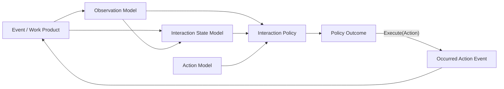
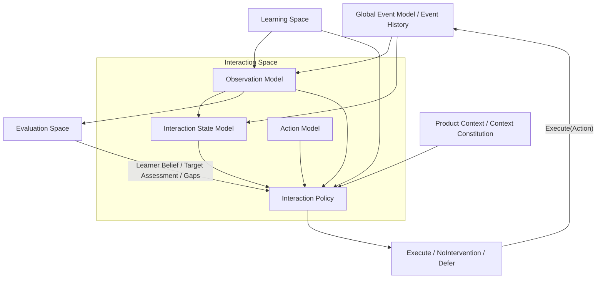

# DeerMind Interaction Space Design v1.1

> **中文名称**：DeerMind 交互空间设计  
> **版本**：v1.1  
> **文档性质**：Space Design / Architecture Baseline  
> **状态**：架构冻结基线  
> **上位基线**：DeerMind Concept Architecture v1.1  
> **关联基线**：DeerMind Learning Space Design v1.1；DeerMind Evaluation Space Design v1.1  
> **上位价值约束**：DeerMind Product Thesis v1.0；DeerMind Product Constitution v1.0  
> **写作规范**：DeerMind Design Document Standard v1.0  
> **更新时间**：2026-09-27  
> **版本说明**：v1.1 保留 v1.0 的 Observation Model、Interaction State Model、Action Model、Interaction Policy 四模型结构，以及 Runtime Learner Condition、NoIntervention、Minimum Sufficient Intervention、多时间尺度规划、assistance exposure lineage、Observation 修正与失效传播、Evolution Contract 等成熟语义。本版本完成五项对齐：第一，正式接入 Learning Target、Target Assessment、Target Gap、Epistemic Gap 与 Target Support / Responsibility Boundary；第二，分离 Goal Intent、Learning Target、External Obligation、Target Binding 与 Plan；第三，将 Parent / School 等首发场景角色从 Core Actor 假设中移除，外部 Actor 权限改由 Product Context / Context Constitution 定义；第四，把工具语义拆分为 Task Canonical Tool Semantics、Target Support Boundary、Runtime Tool Availability 与 Occurred Tool Use；第五，补充 Context Authority、反证机会与版本失效对 Policy 的约束。经 Evolution v1.1 对齐与 Cross-Document Freeze Gate，本版本进一步冻结 Target Binding projection 的 Interaction ownership；v1.1 现作为架构冻结基线。

---

## 1. 文档定位与设计命题

Interaction Space 面对的是 DeerMind 最接近现实的一层问题：**此刻正在发生什么，哪些事情仍然有效，DeerMind 能做什么，以及现在是否真的应该做。**

这不是传统意义上的“教学流程模块”，也不是一个保存对话历史的通用 Agent Memory。Interaction Space 必须同时处理即时行为、持续中的交互状态、Learning Target 与其运行绑定、外部现实义务、Context Authority、学习者当前意图、长期 Learner Belief，以及 DeerMind 自己可执行的行动。更重要的是，它必须在这些信息之间保持边界：一次局部错误不能被偷偷升级成长时学习者特征，Target Gap 不能自动变成练习命令，Epistemic Gap 不能自动变成测评命令，外部 Actor 的身份不能自动变成行动权限，教学行为也不能因为“已经做了”就变成学习证据。

因此 Interaction Space 的核心结构是：

\[
\boxed{
InteractionSpace
=
ObservationModel
+
InteractionStateModel
+
ActionModel
+
InteractionPolicy
}
\]

四个 Model 分别回答四个不可互换的问题：

| Model | 核心问题 |
|---|---|
| Observation Model | 当前发生的事情，在学习和交互语义上是什么？ |
| Interaction State Model | 已经发生的这些事情，到现在为止还有什么仍然有效？ |
| Action Model | DeerMind 可以有意做什么，这些行为会要求、暴露或控制什么？ |
| Interaction Policy | 当前是否值得行动；如果值得，什么行动是最低充分的？ |

这四类责任共同构成一条从现实事实到系统行动的闭环，但它们不能被压缩成一个通用“Agent 状态 + 下一步行动”模型。只要 Observation、State、Action 和 Policy 被混在一起，DeerMind 就很难再回答某个判断来自事实、运行投影还是策略理由，也无法可靠支持后续 Evidence、Evolution 和重放。

### 1.1 本文档解决什么

本文档定义 Interaction Space 的稳定语义责任，包括：

- Event / 学习产物如何形成可追溯 Observation；
- Observation 与 Learner Belief、Evidence、Policy Outcome 的边界；
- Interaction State 如何从 Event、Observation、Time 与 Environment 投影，并保持可重建；
- Runtime Learner Condition 的表示边界；
- Assistance Context 如何保留运行便利但不成为第二事实源；
- DeerMind 可控 Action 的语义以及 Information Disclosure / Cognitive Work Substitution；
- 已选择的 Action 与已发生的 Action 的区别；
- Interaction Policy 如何决定 Execute、NoIntervention 或 Defer；
- Active Assessment、Target Gap / Epistemic Gap、现实义务、最小充分干预、Fade-out 与多时间尺度规划的归属；
- Goal Intent、Learning Target、Target Binding、External Obligation 与 Plan 的运行边界；
- Task Canonical Tool Semantics、Target Support Boundary、Runtime Tool Availability 与 Occurred Tool Use 的分层；
- 外部 Request、Constraint、Obligation 与 Authority Directive 的边界；
- Product Context / Context Constitution 如何向 Policy 提供限域 authority，而不创建第二事实源；
- Interaction 与 Learning、Evaluation、Global Event Model、Evolution / Governance 的契约；
- 规范语义的版本、失效传播和历史重放责任。

### 1.2 本文档不解决什么

Interaction Space 不负责：

- 定义 Learning Target、Task、Solution、KC、Task Canonical Tool Semantics 或 Target Support Boundary 等规范领域语义；
- 判断学习者是否长期掌握某个 Task 或 KC；
- 维护 Evidence、Inference 与 Learner Belief；
- 直接修改 Observation / State / Action / Policy 的正式语义；
- 为 Parent、Teacher、School、Employer 等具体角色定义跨场景通用权限，或把任何外部 Actor 身份自动解释为行动权限；
- 定义 Context Constitution、Emergency Authority 或 Product Context 的合法权限来源；
- 静默创建 Learning Target、Target Binding 或把 External Obligation 改写成 learner 的 Goal Intent；
- 规定具体 UI、对话协议、Agent 框架、LLM 提示词或编排引擎；
- 规定 Interaction State 的最终数据库结构、缓存方式或分布式一致性机制；
- 冻结 Policy 的最终规则、学习算法或优化器。

这些内容分别属于 Learning、Evaluation、Product Context / Context Constitution、Evolution / Governance 或后续 System Design。

### 1.3 Interaction Space 的基本责任边界

根据 Concept Architecture v1.1，Interaction Space 是 Object-Level Learning System 中唯一拥有**当前行动决策**的 Space。Learning 提供 Learning Target、Task 与 Responsibility Boundary 等规范坐标，Evaluation 提供 Learner Belief、Target Assessment、Target Gap 与 Epistemic Gap 等可修正认识，Product Context / Context Constitution 提供当前合法外部权限与约束，而 Interaction 负责把这些来源保持分层并与当前现实组合起来，决定此刻应该发生什么。

因此：

\[
Understanding
\neq
Decision
\]

以及：

\[
InteractionPolicy
\ owns\ object\text{-}level\ action\ decision
\]

这并不意味着 Interaction 拥有学习者认识论事实。它可以基于 Observation 做快速局部反应，也可以读取 Evaluation 提供的 Learner Belief，但无权在 Policy 内偷偷创建或修改 Learner Belief。

---

## 2. 设计问题与基本约束

Interaction Space 的四模型结构来自几个现实约束。这些约束决定了 DeerMind 不能简单地采用“输入上下文 → 大模型 → 下一步动作”的通用 Agent 模式。

### 2.1 现实事实、语义解释和当前状态不是一回事

Event 记录“发生过什么”；Observation 表达“这件事在当前交互中意味着什么”；Interaction State 表达“这些已经发生的事情，到现在还有什么仍然有效”。

例如：

- `HelpRequestedEvent` 是永久历史事实；
- `LearnerRequestsHelp` 可以是当前 Observation；
- `OpenHelpRequest` 只有在请求尚未解决时才是当前 State。

因此：

\[
Event
\neq
Observation
\neq
InteractionState
\]

如果把三者合并，历史事实会被当前解释污染，State 也会逐渐变成无法重建的通用 Agent Memory。

### 2.2 即时交互不能被长期 Learner Modeling 绑死

学习过程中很多问题需要低延迟响应。例如当前计算步骤出现明显 arithmetic 失配，系统可以要求学习者再检查当前步骤，而不必先等待 Evaluation 得出“Division KC 当前掌握度下降”。

因此 DeerMind 必须支持：

\[
Event
\rightarrow
Observation
\rightarrow
InteractionPolicy
\rightarrow
Action
\]

同时也支持跨时间的：

\[
Observation
\rightarrow
Evidence
\rightarrow
LearnerBelief
\rightarrow
InteractionPolicy
\]

两条回路在 Interaction Policy 汇合，但不能被强制串成一条同步链。

### 2.3 当前条件不等于长期学习者特征

Fatigue、情绪、注意力残余、暂时性认知过载和当前意愿等条件可以真实影响当下决策，但这不意味着它们应进入 Evaluation 的长期 Learner State。

DeerMind 需要一种能够在当前交互周期中表达这些条件、允许不确定、能够过期并可以被重新构建的运行表示。

因此：

\[
\boxed{
RuntimeLearnerCondition
\neq
LearnerBelief
\neq
LearnerTrait
}
\]

这类状态默认只服务当前交互，不产生跨交互周期的人格化标签。

### 2.4 “系统可以做什么”与“系统应该做什么”必须分离

一个 Action 的合法语义，与当前是否值得选择它，是两个问题。

例如 `ExposeHint` 可以是一个合法 Action，但这并不说明此刻应该提示。是否提示还取决于学习者意图、当前 Target、Target Support / Responsibility Boundary、Target Assessment、已有暴露、注意力成本、现实义务、Context Authority 和 Product Constitution。

因此：

\[
ActionSemantics
\neq
ActionSelection
\]

### 2.5 触发重新决策，不等于命令系统干预

Timer、截止时间、Target Gap、Epistemic Gap、External Request、Authority Directive、Review Window 或 Governance-approved Validation Intent 都可以触发 Policy 重新评估，但不能绕过 Policy 直接生成 Action。

\[
DecisionTrigger
\neq
InterventionMandate
\]

这一约束使 DeerMind 能够真正把 `NoIntervention` 作为合法结果，而不是“只要有 trigger 就必须做点什么”。

### 2.6 Action 发生过，才有后续事实效力

Policy 选择一个 Action 不代表它已经发生。网络失败、设备问题、UI 未展示、学习者已离开，都可能使已选择的 Action 没有形成真实发生事实。

因此：

\[
\boxed{
SelectedAction
\neq
OccurredAction
}
\]

只有真实发生的 Action Event 才可以改变后续 State，成为信息暴露溯源信息，并影响 Evaluation 对帮助 / 污染的判断。

### 2.7 运行时语义必须受控

Interaction 是 DeerMind 中最容易受到开放输入和 LLM 生成影响的 Space。如果系统允许模型在运行时任意创造 `StateType`、`ActionType` 或新的正式 Observation 语义，传统程序、数据分析、版本管理和 Evolution 都会失去稳定契约。

因此：

\[
\boxed{
RuntimeSemanticsClosed
\quad
SystemSemanticsEvolvable
}
\]

新的现象可以被发现，但正式语义只能通过 Evolution + Governance 进入新版本。

### 2.8 Goal、Target、Obligation 与 Plan 必须保持来源可见

Interaction 同时面对学习者现实意图、正式 Learning Target、外部义务和 DeerMind 自己的计划。如果这些对象被压成一个“当前目标”，系统就会失去谁在要求什么、为什么要求以及谁拥有修改权。

必须长期保持：

\[
GoalIntent
\neq
LearningTarget
\neq
ExternalObligation
\neq
Plan
\]

Goal Intent 表达 learner 的现实目的；Learning Target 由 Learning Space 定义能力成功语义；External Obligation 来自合法现实制度或场景约束；Plan 只是 Interaction Policy 对未来交互机会的可修正安排。Interaction 可以协调它们，但不能把一个对象静默改写成另一个对象。

这意味着约束来源必须保持可见。学校要求、认证截止时间、组织安全规则或 guardian 权限都可以真实影响决策，但不应为了产品叙事被伪装成 learner 自己选择的学习目标。

### 2.9 Actor 身份不自动产生 Authority

Core Architecture 中只有 learner 是必然存在的学习主体。Parent、Guardian、Teacher、School、Institution、Employer、Certification Body 等 Actor 是否存在以及拥有什么合法权限，由 Product Context / Context Constitution 定义。

因此：

\[
ActorIdentity
\neq
Authority
\]

一个 Actor 的现实身份可以成为权限验证输入，却不能直接产生无限行动控制权。Interaction 必须保留 authority 的来源、范围、对象、时效和适用条件，并且所有 object-level 行动仍受 Product Constitution 与 Interaction Policy 约束。

### 2.10 Target Gap、Epistemic Gap 与 Action 必须分离

Evaluation v1.1 已经区分 Target Gap 与 Epistemic Gap。前者表示现有 Evidence 已支持“当前能力低于某项 Target requirement”，后者表示系统还不知道是否达到 requirement。

Interaction 必须继续保持：

\[
TargetGap
\neq
EpistemicGap
\neq
Action
\]

Target Gap 不自动产生练习命令，Epistemic Gap 也不自动产生测评命令。Policy 仍需判断当前价值、学习者意图、注意力成本、现实义务、自然 observation opportunity 与 Constitutional Envelope。

---

## 3. Interaction Space 的核心架构

四个 Model 构成一条从事实到行动的受控链路：

这张图只表达 Interaction Space 内部的主要运行关系。Learning Space 提供规范领域语义，Evaluation Space 提供 Learner Belief / Epistemic Gap，Global Event Model 提供不可变运行事实；这些跨 Space 契约将在第 6 章展开。

### 3.1 Observation Model：把事实转成当前可用的交互语义

Observation 是基于明确交互范围内的 Event、Event 所引用的学习产物，以及当前正式语义形成的、可追溯且允许不确定的行为解释。

它回答：

> **在这次 interaction 中，我们可以有依据地说发生了什么？**

形式上：

\[
Observation
=
Interpret(
EventScope,
EventGroundedArtifacts,
LearningSemantics,
InteractionSemantics
)
\]

Observation 必须与 latent 学习者状态、Evidence 和 Policy 决策保持距离。`ArithmeticMismatch`、`StrategySequenceObserved`、`HelpRequested` 都可以是 Observation；`DivisionWeak`、`ShouldHintNow`、`SupportsMastery` 则分别属于 Evaluation 或 Policy。

因此一个合法 Observation 应尽量满足：

- **交互周期-local**：描述当前交互，而不是直接跨交互周期泛化；
- **以事件为依据的**：能够追溯到 Event 或学习产物；
- **semantically meaningful**：不是 raw telemetry 的机械复制；
- **latent-状态 neutral**：不直接断言学习者潜在状态；
- **claim-agnostic**：不直接宣布对某个 Learner Claim 的 Supports / Contradicts；
- **行动中立的**：不把“应该做什么”混进“看到了什么”；
- **溯源信息-preserving**：保留来源、范围与解析版本；
- **不确定性-explicit**：允许 ambiguous / uncertain Observation。

\[
ObservedUse(K)
\neq
CanUse(K)
\]

\[
SurfaceError
\neq
CausalDiagnosis
\]

Observation Model 默认不应因为当前 Learner Belief 而改变“这一次到底观察到了什么”。否则系统容易形成：

\[
PriorBelief
\rightarrow
ObservationInterpretation
\rightarrow
Evidence
\rightarrow
PriorBelief
\]

这样的 confirmation loop。

Observation 可以跨多个 Event 形成。例如，只有结合一组连续书写步骤，系统才可能判断学习者使用了某种 Solution Strategy。关键不在“一条 Observation 对应一个 Event”，而在于 Observation 必须声明清楚自己的范围和溯源信息。

Observation resolution 同样需要克制。如果最终答案是否正确已经足以支持当前决策，就不应为了“更智能”而强制解析完整思维过程。

\[
ObservationResolution
\le
RequiredSemanticResolution
\]

Event 是不可变发生事实 record；Observation 是可修正解释。同一组历史 Event 可以被新的 Observation Model 重新解释，但新解释永远不能改写历史事件。

\[
NewObservation
\neq
RewriteHistoricalEvent
\]

Observation 由 Interaction 生成，却可以被多个 Space 消费。Interaction State 用它重建当前运行状态，Interaction Policy 用它做局部决策，Evaluation 用它形成相对于命题的 Evidence，Evolution 也可以把跨样本 Observation 模式作为 system 评估 input。

因此：

\[
ObservationGeneration
\in
InteractionSpace
\]

但：

\[
ObservationConsumption
\ is\ CrossSpace
\]

当 Observation 因新的信息、人工纠正或更好的解析模型被修正或替代时，Interaction 必须保留旧 Observation 的溯源信息与 replacement 关系，并使依赖它的当前 State 可以重建；下游 Evaluation 也必须能够重新评估相关 Evidence / Belief。已经真实发生的 Action Event 不能因为旧 Observation 后来被证明错误而被删除。

### 3.2 Interaction State Model：维护“现在仍然有效什么”

Interaction State 不是历史数据库，也不是学习者画像。它是 Event、Observation、当前时间和环境条件对“此刻仍然有效的交互语义”的可重建投影。

\[
\boxed{
InteractionState_t
=
Project(
EventHistory_{\le t},
ObservationHistory_{\le t},
CurrentTime,
Environment
)
}
\]

Event 回答“发生过什么”；State 回答“这些发生过的事情，到现在还有什么仍然有效”。

因此：

\[
HistoricalFact
\neq
CurrentInteractionState
\]

State 可以被缓存、持久化或做快照，但这些实现不能改变它的派生性质：

\[
\boxed{
EventHistory
=
FactualSource
}
\]

\[
InteractionState
=
DerivedOperationalState
\]

如果 State 快照与可验证的 Event History 冲突，应以事实来源为准，并触发 State rebuild。

#### 受控 State Type，开放 State Instance

Interaction State 不采用完全开放的运行时 ontology。正确模式是：

\[
FiniteCanonicalStateSemantics
+
ParameterizedStateInstances
\]

State Type 必须受控、程序可理解、可版本化；State Instance 可以开放、动态且数量无限。LLM 可以发现无法映射的新现象，却不能自行把它注册成新的正式 State Type。

当前可支持的 State Family 包括：

| State Family | 典型语义 |
|---|---|
| Interaction Focus | 当前 Task、Subtask、Artifact、Conversation Thread、当前决策相关 Target |
| Pending / Commitment | 等待回答、未解决请求、未完成事项 |
| Lifecycle | 进行中、暂停、恢复、结束、过期 |
| Current Constraint | deadline、time budget、external obligation、context authority constraint、runtime tool availability |
| Explicit Intent / Preference | Goal Intent、请求帮助、请求停止、拒绝额外任务 |
| Runtime Learner Condition | 当前 episode 内的 fatigue、affect、attention residual、temporary cognitive overload、current willingness |
| Assistance Context | 当前 episode 已经暴露的提示、策略、结果或答案信息 |

这些是 State Family，不意味着所有 State Type 或字段已经被冻结。Target Binding、External Obligation 与 Context Authority 可以以运行投影进入当前 Decision Context。对于 Target Binding，Interaction Space 拥有“当前仍然有效的 binding projection”及其生命周期语义，但 Interaction State 不是事实源：binding occurrence 必须追溯到 Event History，外部 binding 的合法 authority 与 scope 必须追溯到 Product Context / Context Constitution。State 只保存当前决策所需的可重建投影，不能把 Product Context 吸收成新的事实源。

#### Runtime Learner Condition 的边界

Runtime Learner Condition 只在当前交互 / 交互周期中表达对短期条件的带不确定性判断。它可以来源于自我报告、行为 Observation、时间和环境，但必须满足：

- **交互周期内的**：默认不跨交互周期持续；
- **不确定性-aware**：弱信号不能被写成确定属性；
- **溯源信息-traceable**：可追溯到 Event / Observation / Time / Environment；
- **non-特征**：重复出现也不自动升级为长期学习者特征；
- **no silent carry-over**：新交互周期需要新的当前依据。

例如学习者明确说“我今天很累”，首先形成一个 Event / Observation；如果这一条件仍然有效并会改变当前决策，Interaction 才可以投影为运行时条件。Evaluation 默认不据此修改能力信念。

因此：

\[
\boxed{
RuntimeLearnerCondition
\neq
LearnerBelief
\neq
LearnerTrait
}
\]

这也是为什么 `MotivationLow` 之类带有稳定 latent 特征含义的状态不应进入 Interaction State；Interaction 只能表达当前、受范围限制、带不确定性的 condition。

#### Assistance Context 不是第二事实源

Assistance Context 的价值是让 Policy 和 Evaluation 快速知道当前交互周期已经暴露过什么，但它只是已发生的 Action Event 的运行投影。

\[
AssistanceContext
\neq
AuthoritativeExposureFact
\]

任何独立的 / assisted / 污染判断最终必须追溯到真实已发生的 Action 与 Event 溯源信息。

#### State 的准入标准

一个候选 State 至少应满足：

1. 当前仍然有效；
2. 有一定持续性，不只是瞬时 Event；
3. 有明确生命周期；
4. 会影响后续交互决策；
5. 可追溯到 Event / Observation / Time / Environment；
6. 不是 Learner Belief；
7. 不是 Policy Decision。

如果一个对象只是历史事实，应留在 Event；如果只是一次语义解释，应留在 Observation；如果是学习者的长期认识，应进入 Evaluation；如果是“应该做什么”，则属于 Policy。

### 3.3 Action Model：定义 DeerMind 能有意做什么

Action 是由 DeerMind 有意选择、可以控制执行，并会改变交互 environment、向学习者暴露信息、要求学习者产生输出，或改变交互生命周期的语义行为。

\[
\boxed{
Action
=
Intentional
\land
ControllableByDeerMind
\land
InteractionEffectBearing
}
\]

Action Model 只定义 DeerMind 可控行为。Learner 是 Core Architecture 中必然存在的学习主体；其他直接或间接 External Actor 由具体 Product Context 定义。无论 Actor 是 Parent、Teacher、Institution、Employer 还是其他角色，其行为发生后都首先进入 Event / External Input 语义，而不会因为身份被强行统一成 DeerMind Action，也不会自动获得 object-level action authority。

#### Action Specification 与 Action Occurrence

必须区分：

\[
ActionSpecification
\neq
ActionOccurrence
\neq
Event
\]

Policy 选择 Action，只生成执行意图；只有实际执行成功，才形成已发生的 Action Event。后续 State、Evidence 和帮助信息暴露都只能依据真实发生事实，而不能依据“系统原本准备做什么”。

#### Action Function 使用正交功能，而不是产品动作枚举

Interaction 不采用不断扩张的 `HintAction / ExplainAction / ReflectAction / ReviewAction` 类型树。当前更稳定的 Action Function 是：

\[
\boxed{
ActionFunctions(A)
\subseteq
\{Elicit,Expose,Control\}
}
\]

- **Elicit**：要求学习者产生某种认知或行为输出；
- **Expose**：向学习者暴露信息、结构、评价或资源；
- **Control**：改变交互生命周期或操作状态。

一个 Action 可以同时具有多个 function。产品层的 Hint、Explain、Reflect、Present Task 等可以由这些功能与具体内容组合得到，而不必成为永久 ontology。

Review 更像 Policy Strategy；Active Assessment 是 Evaluation need + Interaction Policy；Fade-out 是跨时间 Policy trajectory；Silence / Wait 通常是 Policy Outcome，而不是伪装成 Action。

#### Information Disclosure 与 Cognitive Work Substitution

任何会向学习者暴露信息的 Action，都必须能够回答：

> 暴露了什么？替代了哪部分原本应由学习者自己完成的认知工作？

因此 Action 语义至少需要表达：

\[
InformationDisclosure
\]

以及：

\[
CognitiveWorkSubstitution
\]

Action Model 不直接判断这些暴露是否越过当前 Target 的 Responsibility Boundary，也不直接判断是否污染某个 Evidence Claim。它只描述系统实际暴露和替代了什么；规范责任边界来自 Learning Target，认识论影响由 Evaluation 解释。正确链路是：

\[
ActionSemantics
+
TargetResponsibilityBoundary
\rightarrow
OccurredActionEvent
\rightarrow
EvidenceModel
\rightarrow
ClaimRelativeContamination
\]

这使 Interaction 与 Evaluation 的 responsibility 保持分离。

Action 只能声明 system-controlled 效应，例如提示被展示、Task 被呈现、学习者被要求解释或交互被终止。它不能声明学习者已理解、motivation 已提升或 learning 已发生。

\[
ActionEffect
\neq
LearningEffect
\]

### 3.4 Interaction Policy：决定是否行动以及如何行动

Interaction Policy 是 Interaction Space 的决策责任。它综合 Learning Space 提供的 Learning Target / Responsibility Boundary、当前 Observation、Interaction State、Evaluation 提供的 Learner Belief / Target Assessment / Target Gap / Epistemic Gap、Interaction 维护的当前有效 Target Binding projection、Product Context / Context Constitution 提供的 External Obligation / Context Authority、Available Action 和 Product Constitution，对当前是否值得行动、为什么行动以及如何行动作出判断。

\[
InteractionPolicy:
DecisionContext
\rightarrow
PolicyOutcome
\]

Policy 必须保留不同输入的 authority source，而不能为了实现方便压成一个不可解释的“综合状态”：

| 决策输入 | 规范来源 |
|---|---|
| Learning Target、Required Capability、Responsibility Boundary | Learning Space |
| Learner Belief、Target Assessment、Target Gap、Epistemic Gap | Evaluation Space |
| Observation、Interaction State、Assistance Context | Interaction Space |
| Goal Intent | Runtime / learner-originating Event |
| 当前有效 Target Binding projection | Interaction（发生事实来自 Event；外部合法性 / scope 来自 Product Context / Context Constitution） |
| External Obligation | Product Context / Context Constitution + Event |
| Context Authority、Safety Constraint | Context Constitution / Governance |
| Runtime Tool Availability | Environment / Interaction |
| Constitutional Envelope | Product Constitution |
| Available Action Semantics | Action Model |

Policy 的正式输出是：

\[
\boxed{
PolicyOutcome
=
Execute(Action)
\;|\;
NoIntervention
\;|\;
Defer
}
\]

`Stop / Terminate` 可以通过执行 Control Action 表达。

Policy 可以根据当前 Observation 做快速局部反应，但不能偷偷进行 Evaluation。例如 `ArithmeticMismatch` 可以支持 `Elicit(CheckCurrentStep)`，却不能在 Policy 内部创建 `DivisionWeak`。

\[
NoHiddenEvaluationInInteractionPolicy
\]

#### Policy 是受约束多准则决策，而不是单一 reward 最大化

Interaction Policy 不应被概念化为一个可以用单一 reward 将所有目标相互抵消的优化器。某些 Product Constitution 约束必须先决定“这个结果是否允许进入候选集”，而不是只给它一个负权重。

概念上 Policy 至少包含四层判断：

1. **Admissibility**：这个 Outcome 是否允许被考虑；
2. **Value / Cost Assessment**：行动的信息价值、学习价值和现实价值是否足以覆盖注意力、负担与认知替代；
3. **Outcome Selection**：哪个候选结果是最低充分的；
4. **Rationale**：为什么做出这个选择。

因此：

\[
ConstrainedMultiCriteriaDecision
\]

#### Minimum Sufficient Intervention

Interaction Policy 不追求“干预越少越好”，而是：

> 在足以解决当前高价值问题的候选方案中，优先选择认知替代更少、注意成本更低、认知所有权更完整的方案。

\[
MinimumSufficientIntervention
\]

其中：

\[
Minimal
\neq
Insufficient
\]

这避免 DeerMind 一方面过度干预，另一方面又用“克制”作为不提供必要帮助的借口。

#### NoIntervention 是一等结果

每次 Policy 决策都必须真正考虑不干预。

\[
\boxed{
NoIntervention
\in
CandidatePolicyOutcomes
}
\]

以及：

\[
InterventionMustJustifyItselfAgainstNoIntervention
\]

DeerMind 不以“更多交互”作为天然更好的结果。更多交互 并不自动意味着更好策略。

#### Gap 不产生命令：Evaluation 表达差距或未知，Interaction 决定现在是否值得行动

Evaluation 可以产生 Target Gap 与 Epistemic Gap，但任何 Gap 都不能自动触发某类行动。Target Gap 不等于必须练习，Epistemic Gap 不等于必须评估。

\[
Gap
\not\Rightarrow
ActionCommand
\]

Interaction Policy 需要同时考虑：

- gap 的决策 relevance；
- 信息价值；
- 注意力成本；
- 学习者明确意图；
- 当前 constraints；
- 外部 obligations；
- 当前是否存在更自然的未来 observation opportunity。

只有当新增 Observation 的价值足够高时，系统才应主动制造测评机会。

#### 现实义务与学习价值必须分开

学校作业、考试、家庭时间要求等现实义务不能被简单压成“学习价值”。

\[
LearningValue
\neq
ObligationValue
\]

某个任务即使教育增益有限，也可能因为现实义务而需要完成；Interaction Policy 的职责不是否认现实世界，而是在满足必要义务时减少无意义负担与不必要 AI 替代。

#### 多时间尺度规划属于 Interaction Policy

Interaction Policy 不只决定下一步，还需要在多个时间尺度上组织未来交互：

- **当前行动**：此刻是否行动、怎样行动；
- **阶段安排**：接下来若干机会如何排序、等待、恢复、跳过或放弃；
- **长期方向**：当前已接受、已绑定或现实必须面对的 Target 之间，未来交互机会如何组织，并在需要时提出新的 Target / Binding candidate。

这种规划不能形成第二事实源：

\[
\boxed{
Plan
\neq
Event
\neq
LearnerBelief
\neq
LearningTarget
\neq
TargetBinding
\neq
Obligation
}
\]

Plan 是可修正的 Policy 产物。新的 Observation、Learner Belief、学习者意图、时间和现实约束都可以使旧 Plan 失效并触发重新规划。

因此：

\[
MultiTimescalePlanning
\subset
InteractionPolicy
\]

不新增 Planning Model。

#### Fade-out 是 Policy trajectory

Target Responsibility Boundary 规定的是最终能力归属，不等于学习过程中禁止支架。Fade-out 不是某个 Action Type，也不是单独 Model；它是在长期证据显示 learner 对 Target 明确要求其拥有的认知责任逐步形成后，降低对这些责任的替代、减少不必要主动介入并增加 NoIntervention 的策略趋势。对 Target 本来允许长期外部化的工具使用，不要求为了“独立”而机械撤除。

\[
EvidenceOfIndependentCompetence\uparrow
\Rightarrow
NeededCognitiveSubstitution\downarrow
\]

这正是 Removable Cognitive Scaffold 在运行层的实现方向。

---

## 4. 运行机制：从事实到行动，再回到事实

四个 Model 只有在真实运行链中才能体现自己的边界。

### 4.1 Event 可以经 Observation 或直接影响 State

Interaction 是 Event-driven，但不是每个 Event 都必须机械生成 Observation。

某些 Event 本身已有足够稳定的运行语义。例如：

- `StopRequestedEvent` 可以直接关闭 pending 交互；
- 定时触发 / 截止时间可以触发 State transition 或 Policy reevaluation；
- system 生命周期 event 可以直接改变环境约束。

因此：

\[
Event
\not\Rightarrow
Observation
\]

是否需要 Observation，取决于是否存在值得单独表达的交互语义。

### 4.2 State Transition 不依赖学习者 Evidence

Interaction State 可以因为：

- 新 Event；
- 新 Observation；
- Current Time；
- Environment；
- 已发生的 Action Event；

而改变。

它不需要新的学习者 Evidence 才能发生 transition，因为“当前请求是否仍然开放”“截止时间是否已经到期”“tool 是否可用”本来就是运行事实，而不是学习者能力推断。

### 4.3 Action 执行失败不能伪造 State

Policy 选择 Action 后，如果执行失败，就不能假设学习者已经看到、听到或经历了该行为。

\[
IntendedAction
\neq
OccurredAction
\]

只有真实 Action 发生事实才进入 Global Event Model，并影响 Assistance Context、后续 State 与 Evaluation。

### 4.4 Interaction State 不等于 Session State

DeerMind 的交互可以跨 app 会话、设备和时间窗口持续。一个未解决请求可能在下一次进入产品时仍然有效，一个 pending commitment 可能随时间变 stale，一个现实义务可能在多次会话中持续存在。

因此：

\[
InteractionState
\neq
SessionState
\]

System Design 可以定义会话、交互周期和 persistence boundary，但这些实现边界不能决定 Interaction 语义。

### 4.5 外部输入：Request、Constraint、Obligation 与 Authority Directive

External Actor 的输入必须区分其决策作用，而不能因为来源身份强行统一成“命令”。Core Architecture 不预设 Parent、Teacher、School、Employer 等角色必然存在；具体 Actor 与合法权限由 Product Context / Context Constitution 定义。

必须长期保持：

\[
Request
\neq
Constraint
\neq
Obligation
\neq
AuthorityDirective
\]

- **Request**：希望 DeerMind 考虑某个行动，本身不改变合法候选空间；
- **Constraint**：改变当前可行行动空间，例如时间、环境或工具限制；
- **Obligation**：来自现实制度或关系，需要被纳入决策的实际义务；
- **Authority Directive**：由合法 Context Authority 在明确 scope 内提出的强约束性指令，可以显著缩小合法候选空间，但仍不能绕过权限有效性、Constitutional Envelope 与当前适用性检查。

因此：

\[
AuthorityDirective
\neq
PolicyBypass
\]

即使某个 Product Context 存在 guardian、institution 或 safety authority，最终 object-level 行动仍需经过 Interaction Policy。Authority 可以限制“哪些结果允许被考虑”，却不能自动创造 Learner Belief、Learning Target 或无限行动控制权。

\[
AuthorityOverride
\neq
EpistemicEvidence
\]

Safety Emergency 也不构成系统临时自我扩权的理由。若某类紧急行动可以跳过普通等待或确认，它必须位于事前由 Product Constitution / Governance 定义的授权 envelope 中。

### 4.6 一个端到端例子

假设学习者正在完成一道比例题，当前步骤写出错误计算结果。

1. Work Product 更新形成 Event。
2. Observation Model 识别当前 step 存在 arithmetic 失配，但不判断学习者长期是否会除法。
3. Interaction State 仍记录当前 Task focus、已有帮助信息暴露、剩余时间和 learner 尚未请求帮助；当前 Target 要求 learner 自己承担算术检查责任。
4. Evaluation 可能已有 `DivisionKCBelief=uncertain`，也可能没有足够长期结论。
5. Interaction Policy 判断当前错误具有局部可修复性，并结合 Target Responsibility Boundary 认为最小检查请求不会替代关键责任，因此选择 `Elicit(CheckCurrentStep)`。
6. Action 实际展示成功，形成已发生的 Action Event。
7. Assistance Context 更新为“已暴露检查方向”，但这条 State 不是信息暴露的事实源；真实溯源信息仍来自 Action Event。
8. 学习者自行修正后产生新的 Event / Observation。
9. Evaluation 根据前后 Observation 与 Action 链路判断这次成功到底能对哪些 Claim 形成 Evidence。
10. 如果学习者随后明确说“我不想继续了”，新的 Stop Request 会改变 State，Policy 可以直接结束当前交互，而不能把它解释为 `MotivationLow`。

这个过程展示了 Interaction Space 的基本纪律：

> **当前行为可以快速响应，但长期 Learner Belief 必须留给 Evaluation；Action 可以帮助，但真实 exposure 必须有事实依据；Policy 可以计划，但任何计划都可以被新的现实推翻。**

---

## 5. 多时间尺度决策与克制原则

Interaction Space 不只是一个毫秒级 next-action selector。对于长期学习产品，它还必须处理阶段性安排和长期方向。但越向长期延伸，越需要防止 Plan 变成新的事实或控制权来源。

### 5.1 当前行动、阶段安排和长期方向共享同一 Policy responsibility

三个时间尺度使用的输入不同，但本质都是：

> 在当前已知现实、Learner Belief、Target / Binding、现实约束和 Constitutional Envelope 下，什么值得成为下一阶段的交互选择？

因此不建立独立 Planning Space，也不默认建立第五个 Planning Model。当前行动可能决定是否提示；阶段安排可能决定下次自然机会再观察；长期方向可以在当前已接受、已绑定或现实必须面对的 Target 之间组织未来交互，并提出新的 Target / Binding candidate，但不能静默创建 Learning Target，也不能替 learner 决定 Goal Intent。每一个计划节点在真正执行前，都必须重新经过当时的 Interaction Policy。

### 5.2 Plan 只能表达当前策略意图

Plan 不具有事实 authority，也不属于 Learner Belief，更不能把 External Obligation 静默改写成 learner 的 Goal Intent 或 DeerMind 自己定义的 Learning Target。

\[
Plan
\neq
Fact
\neq
Belief
\neq
LearningTarget
\neq
TargetBinding
\neq
Obligation
\]

Plan 必须带形成时依赖的 Target Version、Binding / Obligation context、Evaluation version 与 Policy version，并允许失效和重新规划。新的 Goal Intent、Target Binding、Target Definition、Target Assessment、Learner Belief、deadline、Context Authority 或现实机会都可以使旧 Plan 失效。

特别是：

\[
TargetBindingChanged
\rightarrow
PolicyContextInvalidation
\rightarrow
PlanReevaluation
\]

这不会重写已经发生的 Event 或 Action。

### 5.3 NoIntervention、Defer 和自然机会

`NoIntervention` 表示当前不采取面向 learner 的 action；`Defer` 表示当前不执行，但保留未来重新评估的明确理由。DeerMind 不应为了“完成计划”不断制造额外学习任务。当未来自然学习场景可以以更低注意力成本提供同样的信息或学习价值时，Defer 往往优于立即主动评估。

这同样适用于 Gap。系统知道存在 Target Gap，不意味着当前必须制造练习；系统存在 Epistemic Gap，也不意味着当前必须制造测评。

### 5.4 Engagement 不是 Policy 的顶层目标

Interaction Policy 可以关注 learner 是否愿意继续、当前交互是否可持续，但不能把“更多使用”“更多对话”“更长会话”作为顶层成功标准。

\[
MoreEngagement
\not\Rightarrow
BetterPolicy
\]

如果 learner 已经能承担 Target 要求的责任，最优 Policy 可能就是减少支架；如果当前问题不值得打扰，最优结果可能是 NoIntervention；如果系统不知道，但新增测评的价值不足，UNKNOWN 可以继续存在。

### 5.5 Target Binding 是运行关系，不是 Learning Target 本体

Interaction 需要知道当前哪些 Target 与 learner 存在实际运行关系，以及这些关系来自自主选择、明确接受、现实义务还是其他合法来源。但 Target Binding 不属于 Target Definition，也不应被静默压入 Interaction State 形成新的 canonical truth。

v1.1 冻结 Target Binding 的责任链：

> **Binding 的发生事实进入 Event History；外部 Binding 的合法 authority 与 scope 由 Product Context / Context Constitution 定义；Interaction Space 负责从这些来源形成当前仍然有效的 Target Binding projection，并维护其生命周期、staleness 与对 Policy / Plan 的依赖语义。**

因此 Interaction 拥有的是 current binding projection 的 semantic ownership，而不是原始事实或外部 authority。该责任足以支持运行决策，不需要新增 TargetBindingModel。

### 5.6 Policy 必须保留合理反证机会

Equal Epistemic Standing 对 Interaction 的主要约束，不是要求所有 learner 接受相同 Task，而是禁止 Policy 用已有 Belief 或群体 prior 持续控制机会分配，使系统自己的判断越来越无法被现实推翻。

典型自我封闭循环是：

\[
LowBelief
\rightarrow
FewerChallengingOpportunities
\rightarrow
LessContraryEvidence
\rightarrow
LowBelief
\]

Interaction Policy 应在风险、Target、负担和现实约束允许的范围内，保留与当前重要判断相称的反证机会。它不要求机械“给所有人同样机会”，而要求系统不能通过自己的机会分配机制把已有判断变成不可证伪结论。

## 6. Cross-Space Contracts、版本与受治理演化

Interaction Space 是 Object-Level 中连接现实与决策的枢纽，因此它与其他 Space 的接口必须比普通软件模块接口更严格地区分 semantic ownership。

### 6.1 Learning Space → Interaction：提供规范目标、Task 与责任边界

Interaction 从 Learning Space v1.1 读取：

- Learning Target / Target Version；
- Required Task Capabilities 与 Target Conditions；
- Target Support / Responsibility Boundary；
- Task Family / Task Instance、Task Objective 与 Task Success Semantics；
- Solution Strategy / Solution Task Topology；
- KC 与 Knowledge Grounding；
- Task Canonical Tool Semantics；
- 规范对象的 identity、version 与 validity scope。

Interaction 不修改这些规范语义，也不能把当前现实限制写回 Target。特别需要区分：

\[
TaskCanonicalToolSemantics
\neq
TargetSupportBoundary
\neq
RuntimeToolAvailability
\neq
OccurredToolUse
\]

Task 层说明领域上什么工具合法或改变 Task 语义；Target 层说明哪些责任必须由 learner 承担、哪些允许外部化；Interaction State 表达当前工具是否可用；Occurred Tool Use 只有真实发生后才成为 Event / Observation 输入。

### 6.2 Interaction → Evaluation：Observation 与真实信息暴露

Interaction 向 Evaluation 提供的主要语义输入仍是 Observation。Evaluation 可以结合 Event 溯源、已发生的 Action / Tool Use 和 Assistance Context，判断一次表现相对于 Claim 与 Target Responsibility Boundary 能证明什么。

Assistance Context 只是运行投影。独立性、受助程度和污染的最终依据必须追溯到真实已发生的 Action Event：

\[
NoExposureInferenceWithoutOccurredActionLineage
\]

Action 的 `CognitiveWorkSubstitution` 描述 DeerMind 实际替代了什么；它是否越过 Target Responsibility Boundary、是否污染某个 Claim，由 Evaluation 解释。

### 6.3 Evaluation → Interaction：提供认识，不提供命令

Evaluation v1.1 向 Interaction 提供：

- Task Proficiency Beliefs；
- KC Beliefs；
- Target Assessment；
- Target Gap；
- Epistemic Gap；
- epistemic uncertainty / conflict；
- Assistance / Support Dependency 等 justified derived diagnostic views。

Interaction 可以读取这些认识，但 Evaluation 不指定面向 learner 的 Action。

\[
TargetGap
\neq
EpistemicGap
\neq
ActionCommand
\]

同样，派生 dependency diagnostic 只能作为 Policy 输入，不能被改写成稳定 learner trait。

### 6.4 Global Event Model → Interaction：提供事实来源

Global Event Model 提供不可变的发生事实、来源与溯源、学习产物引用、已发生的 Action / Tool Use、外部报告、定时触发与 system events。Interaction 可以解释和投影这些事实，却不能重写它们。

当 State 快照、Assistance Context、Target / Authority projection 或其他派生对象与 Event History 冲突时，事实来源具有更高 authority。

### 6.5 Product Context / Context Constitution → Interaction：提供限域权限，而不是事实真理

Product Context / Context Constitution 定义当前场景中哪些 External Actor 存在、拥有什么合法 authority、适用对象与 scope，以及哪些 safety / regulatory constraints 会改变 Policy 的合法候选空间。Interaction 只消费已经生效的 authority context，不在运行时自行创造权限。

必须保持：

\[
ActorIdentity
\neq
Authority
\]

\[
AuthorityDirective
\neq
PolicyBypass
\]

\[
AuthorityOverride
\neq
EpistemicEvidence
\]

这意味着 Safety、Guardian、Institution 或 Employer 权限可以让某些 Action 不可执行，却不能据此改写 Learning Target、Learner Belief 或历史事实。

### 6.6 Interaction → Evolution：暴露系统层级 Signal，而不是越级下结论

Interaction 应向 Evolution 暴露至少以下问题：

- Observation Model 的解析错误、歧义和系统性偏差；
- 现有 State 语义无法表达的重要运行现象；
- Action 语义不足或 Information Disclosure / Cognitive Work Substitution 无法表达的情况；
- Interaction Policy 的系统性失败；
- Target / Binding / Context Authority 在运行投影中的语义泄漏；
- Target Gap / Epistemic Gap 被自动化成行动的模式；
- NoIntervention / Attention Cost / Fade-out 的长期异常；
- Policy 机会分配造成的反证机会封闭；
- 策略诱导的数据偏差；
- 新 State Type / Action / Observation 语义候选；
- 版本、provenance、validity scope 与 replay information。

这些内容首先是 System Signal 或 assessment input：

\[
SystemSignal
\neq
SystemIssue
\neq
SystemHypothesis
\neq
ValidationEvidence
\]

Interaction 不拥有把异常升级为 System Issue 或正式 Revision Candidate 的权力。

### 6.7 Evolution / Governance → Interaction：批准范围不等于 learner-level command

如果 Validation Model 需要真实 learner 交互，可以提出 Validation Intent。结构性验证必须先进入 Governance；即使某类实验、Policy Variant 或 Context Authority envelope 获得批准，最终是否在某个 learner 的当前情境中执行，仍由 Interaction Policy 在当前 Constitutional Envelope 内判断。

\[
ValidationIntent
\rightarrow
Governance
\rightarrow
ApprovedValidationIntent
\rightarrow
InteractionPolicy
\]

因此：

\[
GovernanceApproval
\neq
LearnerLevelExecutionCommand
\]

最终结果仍可以是 `Execute(Action)`、`NoIntervention` 或 `Defer`。只有真实发生的 Validation Action 才形成 Event，并成为后续系统验证的事实基础。

### 6.8 Evolution Contract

Interaction 中具有独立语义责任和演化生命周期的组件至少需要声明：

\[
Identity
+
Version
+
ActivationBoundary
+
Provenance
+
ValidityScope
+
FalsifiableExpectation
+
ReplaySupport
\]

具体包括 Observation / State Type / Action / Interaction Policy 的 identity 与 version，Policy Decision Context 依赖的 Target / Evaluation / Context Authority version，Information Disclosure / Cognitive Work Substitution，selected 与 occurred Action 区分，rationale、considered alternatives、validity scope、known limitations 与 replay support。

Interaction 的重要派生状态不能成为无法解释来源的 opaque 状态：

\[
NoOpaqueDerivedInteractionState
\]

### 6.9 跨版本解释与失效传播

Observation、State 快照、Policy Decision Context 与 Plan 等重要派生语义必须记录形成时依赖的规范 versions。不同上游变化对应不同失效路径：

- Target Definition / Version 改变：重新评估相关 Policy Context 与 Plan；
- Target Binding / External Obligation 改变：使依赖它的 Plan / pending decision stale；
- Target Assessment / Learner Belief 改变：触发 Policy reevaluation，但不改写过去 Action；
- Context Authority 改变：重新计算当前 admissible action set；
- Task / Observation / State Type / Action semantics 改变：按依赖关系 replay / reinterpret；
- Observation 修正：重建依赖 State，并通知 Evaluation 重新评估 Evidence / Belief。

必须保持：

\[
NoSilentCrossVersionInterpretation
\]

新的解释和新的决策上下文不产生新的过去；已经真实发生的 Event / Action Event 不被重写。

## 7. Validation 与 Evolution：Interaction Space 如何被现实挑战

Interaction Space 的成熟不取决于“功能覆盖是否完整”，而取决于它是否能被真实运行证伪。

### 7.1 Observation Model 的验证

需要持续检查：

- Observation 是否稳定、可追溯、可校准；
- 是否系统性受到先验 Learner Belief 影响而产生 confirmation loop；
- Observation resolution 是否经常过细或过粗；
- 歧义 / 不确定性是否被诚实保留；
- 同一类行为在不同情境中是否被错误地统一解释；
- Observation 修正后 downstream 失效是否真实可执行。

### 7.2 Interaction State Model 的验证

需要检查：

- State 是否能由 Event / Observation / Time / Environment 重建；
- State 快照是否频繁与 Event History 冲突；
- State Type 是否不断膨胀成通用 Agent Memory taxonomy；
- Runtime Learner Condition 是否被错误 carry over 成长期特征；
- Assistance Context 是否被误用为信息暴露权威事实源；
- pending / 生命周期 / constraint 是否能正确跨时间过期和恢复。

### 7.3 Action Model 的验证

需要检查：

- Elicit / Expose / Control 是否足以表达真实行为；
- Information Disclosure 是否能支持相对于命题的污染；
- Cognitive Work Substitution 是否能够被后续 Evaluation 使用；
- 已选择的 Action 与已发生的 Action 是否被可靠区分；
- 产品级动作是否因为实现方便而不断侵入规范 ontology。

### 7.4 Interaction Policy 的验证

需要检查：

- 是否出现 hidden Evaluation；
- NoIntervention 是否真的是常见、可选、可审计的结果；
- Minimum Sufficient Intervention 是否能够减少不必要认知替代；
- Policy 是否为了 observability 过度制造评估；
- Target Gap 是否被自动变成练习，Epistemic Gap 是否被自动变成测评；
- External Obligation 是否被错误伪装成 learner Goal 或 Learning Target；
- Actor Identity 是否被错误当作 Authority；
- Authority Directive 是否绕过 Policy / Constitution；
- Task 允许工具是否被错误解释为 Target 允许责任外部化；
- learner explicit stop / refusal 是否得到尊重；
- Target / Binding / Authority 变化后 Plan 是否及时失效；
- Fade-out 是否针对 learner-owned responsibility，而不是机械撤除所有工具；
- engagement 是否偷偷变成优化目标。

### 7.5 机会分配与反证能力的验证

需要持续检查：

- 既有 Learner Belief 是否系统性降低 learner 接触更高挑战或反证任务的机会；
- 群体 prior 是否通过 Policy 间接决定可获得的学习机会；
- Policy 是否因为短期效率而形成自我封闭的 exposure distribution；
- 在风险和负担可接受时，重要判断是否拥有现实反证机会；
- Safety / Context Authority 是否被泛化使用，导致不必要的长期机会封闭。

### 7.6 新现象如何进入体系

运行中发现现有语义无法表达的重要现象时，不允许运行时直接扩展规范语义。

正确路径是：

\[
RuntimeAnomaly
\rightarrow
SystemSignal
\rightarrow
SystemAssessment
\rightarrow
SystemIssue
\rightarrow
SystemHypothesis
\rightarrow
RevisionCandidate
\rightarrow
Validation
\rightarrow
Governance
\rightarrow
NewApprovedVersion
\]

这保证 LLM 可以发现新现象，却不能自己把新现象变成全系统事实类型。

---

## 8. 关键架构决策、风险与下一阶段

Interaction Space v1.1 不把当前结构视为不可挑战的终局，而是明确当前选择背后的理由、代价和重新打开条件。

### 8.1 关键架构决策

**D1 — Observation 属于 Interaction，而不是 Evaluation。**  
Observation 首先解释当前行为和学习产物，在快速交互中也直接服务当前 Policy。把它放进 Evaluation 会让即时交互依赖长期学习者建模，并让 Evaluation 同时拥有行为解释与学习者信念两层认识权。当前架构因此由 Interaction 生成 Observation，Evaluation 只消费。

**D2 — Interaction State 是派生运行状态，不是通用 Agent Memory。**  
替代方案是把当前对话、历史事实、学习者信念、策略理由和各种标签全部放入统一 memory。虽然实现简单，但会破坏权威事实源、生命周期和重放。当前架构要求 State 可重建、有准入标准并服务当前决策。

**D3 — Runtime Learner Condition 留在 Interaction。**  
疲劳、情绪、注意力残余、暂时性认知过载和当前意愿可以影响当前行动，却不因此成为长期能力信念。只有未来出现稳定、可证伪且具有独立认识论价值的证据，才值得重新审视 Evaluation boundary。

**D4 — Action 使用正交 Function，而不是产品动作类型树。**  
`Hint / Explain / Reflect / Review` 很容易随产品形态膨胀。`Elicit / Expose / Control` 更接近稳定语义，并允许通过 Information Disclosure 和 Cognitive Work Substitution 描述不同产品行为。

**D5 — Policy Outcome 包含 NoIntervention 与 Defer。**  
如果 Policy 只能输出 Action，那么任何 trigger 都会被系统压力转化成干预。NoIntervention 使“AI 不做事”成为正式设计能力；Defer 则允许系统等待更自然、更低成本的未来机会。

**D6 — Gap 不产生独立行动 Model。**  
Evaluation 负责表达 Target Gap 与 Epistemic Gap，Interaction Policy 负责判断当前是否值得练习、评估、等待或不干预。增加独立 Active Assessment / Remediation Model 会重新混合认识结果和行动权限。

**D7 — 多时间尺度规划属于 Interaction Policy。**  
Planning 没有独立的 semantic world；它仍然是“未来交互应如何组织”的决策责任。把 Planning 升级为第五个 Model 会产生新的 action authority 和 第二事实源风险。

**D8 — External Actor 身份不等于 Authority，Authority Directive 也不能绕过 Policy。**  
Parent、Guardian、Teacher、Institution、Employer 等角色是否存在及其权限由 Product Context / Context Constitution 定义。Request、Constraint、Obligation 或 Authority Directive 都必须保留来源和 scope，并经过当前 Policy 与 Constitutional Envelope；Core 不冻结 Parent-specific directive semantics。

**D9 — Target Definition、Target Binding 与 Plan 保持分层。**  
Learning Space 定义 Target；Interaction 从 Event 与 Context Authority 输入形成并维护当前有效 Target Binding projection，并据此组织未来交互。Policy 可以提出 Target / Binding candidate，但不能静默创建正式 Target、替 learner 取得 Goal Ownership 或把 External Obligation 洗成 learner 自愿目标。

**D10 — Context Authority、Safety 与 Fairness 不新增 Interaction Core Model。**  
它们通过 Policy Admissibility、Decision Context 与机会分配约束进入 Interaction。只有未来出现无法由现有 State / Policy / Context contract 表达的重要稳定责任，才重新打开第五个 Model。

### 8.2 当前开放问题

当前开放问题按性质分类如下。这些问题不构成新增第五个 Interaction Model 的理由。

| 类型 | 开放问题 | 当前处理 |
|---|---|---|
| 概念性 | Target Binding 是否需要独立正式类型或 Model | owner chain 已冻结；当前不建独立 Model，仅在现有责任链出现强反例时 reopen |
| 概念性 | `Elicit / Expose / Control` 是否足以长期表达跨领域 Action Function | 继续作为候选稳定集合，以真实场景反例触发 reopen |
| 概念性 | 多个并行 Target / Obligation / Context Authority 冲突时需要多强的通用优先级语义 | 不冻结全局优先级；先由 Policy + Constitution + Context Authority 处理 |
| 实证性 | Minimum Sufficient Intervention 如何可靠降低替代而不造成帮助不足 | 需要真实学习结果、依赖与注意力成本验证 |
| 实证性 | 反证机会在不同领域需要怎样的 exposure 才算足够 | 保持原则性约束，判据通过长期运行验证 |
| 实证性 | Attention Cost、Cognitive Work Substitution 与 Runtime Learner Condition 如何观察 | 不提前冻结统一量化方法 |
| 治理性 | Context Authority / Safety Envelope 如何从 Context Constitution 投影到 runtime | authority source / scope 必须显式，具体授权机制待 Governance / Product Context Design |
| 治理性 | learner refusal 与强现实义务冲突时的 escalation / review | Core 只冻结来源可见与 bounded authority，场景流程下沉 |
| 实现性 | State Type、State transition、Target / Authority projection 的具体 schema | System Design 决定，不改变派生状态责任 |
| 实现性 | Policy 使用规则、规划、模型或混合实现 | 只要保留 admissibility、rationale、NoIntervention 与 authority boundary 即可 |
| 实现性 | Event replay、State rebuild、Plan invalidation 与 version pinning | 进入 Runtime / State / Versioning System Design |
| 实现性 | LLM 如何参与 Observation / Policy 而不突破受控语义 | 进入 AI Reasoning Runtime / Policy protocol 设计 |

### 8.3 主要失败模式

| 失败模式 | 触发条件 | 后果 | 缓解方式 | 重新打开条件 |
|---|---|---|---|---|
| State 退化成通用 Agent Memory | 为方便把 Target、Authority、Belief、Policy rationale 与历史事实都持久化进 State | 派生状态失去可重建性和 owner 边界 | State admission discipline；只保存当前决策所需投影 | 多场景证明现有 owner 分层无法满足运行需求 |
| Goal Laundering | External Obligation 或 DeerMind Plan 被描述成 learner 自己的目标 | Goal Agency 与 authority source 被掩盖 | `GoalIntent != LearningTarget != Obligation != Plan`；来源可见 | 真实场景需要新的 goal-source ontology |
| Authority Laundering | Parent / Teacher / Employer 身份直接变成 command 权 | Core 被 Product Context 污染，Bounded Authority 失效 | `ActorIdentity != Authority`；Context Constitution 定义 scope | 多场景出现无法由 context authority 表达的共同 core 权限 |
| Gap Automation | Target Gap 自动触发练习，Epistemic Gap 自动触发测评 | Evaluation 越级获得行动 authority，额外争夺注意力 | `Gap != Action`；所有 trigger 回到 Policy | 实证证明某类 gap 具有跨场景安全的 mandatory action semantics |
| Support Boundary Collapse | Task 允许工具就推断 Target 允许责任外部化 | Cognitive Ownership 与能力 Evidence 被破坏 | 三层工具 / 支持语义 + occurred use 分离 | Target / Task 工具关系持续无法表达真实场景 |
| Plan Ossification | Target / Binding / Belief / Authority 已变化，旧 Plan 仍自动执行 | 历史策略变成 future command queue | version context、stale / invalidation、执行前重新 Policy | 计划规模导致现有失效机制不可维护 |
| Opportunity Self-Sealing | 既有 Belief / prior 持续控制 Task exposure | learner 缺少反证机会，系统用自己制造的数据证明自己 | opportunity audit + Evolution signal | 实证显示现有约束仍无法抑制系统性封闭 |
| Safety Expansion | 所有扩权都以 safety 名义进入 admissibility | Context Authority 越界并长期化 | authority source/scope/expiry + Constitution proportionality | 多种 safety 场景需要独立 runtime safety responsibility |
| NoIntervention 只存在于文档 | KPI 或模型偏好持续奖励更多交互 | Non-Manipulation / Attention boundary 失效 | Policy audit、NoIntervention availability、engagement 非顶层目标 | 长期数据证明无需显式 NoIntervention 也能保持克制 |

### 8.4 System Design Handoff

Interaction Space v1.1 已经定义冻结基线下后续实现必须尊重的语义合同。System Design 至少需要进一步解决：

- Event → Observation 的 semantic projection protocol；
- LLM Observation 输出的 schema 验证、依据、不确定性和 unmapped path；
- Interaction State store、Target / Authority projection、快照、rebuild 与失效；
- 交互周期 / 会话 / cross-time persistence boundary；
- Action schema、execution acknowledgment 与已发生的 Action Event；
- Information Disclosure / Cognitive Work Substitution 表示；
- Assistance 信息暴露链路；
- Interaction Policy 的 Decision Context、Target / Binding / Context Authority inputs、admissibility、候选生成、rationale 与 audit；
- NoIntervention / Defer 的真实执行语义；
- Multi-timescale Plan 表示、Target / Binding dependency、expiration、stale 与重新规划；
- 运行时学习者条件的生命周期；
- Observation correction 后的依赖失效；
- Policy / State / Action 版本 pinning 与激活边界；
- Context Constitution / Governance authority 如何进入对象层 Policy 且不形成 bypass；
- opportunity allocation / disconfirmation opportunity 的审计；
- Task Tool、Target Support、Runtime Availability 与 Occurred Tool Use 四层语义的运行 contract；
- observability、latency、failure handling 与重放。

实现可以阶段性简化，但以下边界不能因为 MVP 而被省略：

\[
Event
\neq
Observation
\neq
InteractionState
\]

\[
InteractionState
\neq
LearnerBelief
\]

\[
\boxed{
SelectedAction
\neq
OccurredAction
}
\]

\[
\boxed{
NoIntervention
\in
PolicyOutcome
}
\]

\[
InteractionPolicy
\ cannot\ create\ LearnerBelief
\]

\[
GoalIntent
\neq
LearningTarget
\neq
ExternalObligation
\neq
Plan
\]

\[
TargetGap
\neq
EpistemicGap
\neq
Action
\]

\[
ActorIdentity
\neq
Authority
\]

---

## 附录 A — Interaction Space Semantic Invariant Registry

正文只强调最关键的运行边界；以下完整 registry 用于设计审计、实现检查和跨版本回归。

| ID | Invariant | 含义 |
|---|---|---|
| I1 | Event ≠ Observation ≠ Interaction State | 事实、解释和当前运行投影必须分离 |
| I2 | Observation Does Not Assert Learner Latent State | Observation 不直接声明长期 learner state |
| I3 | Interaction State Is Not Primary Fact | State 是派生运行状态，不是第二事实源 |
| I4 | State Type Controlled, State Instance Open | 正式类型受控，实例可动态开放 |
| I5 | Action Semantics ≠ Action Selection | Action 定义与 Policy 选择分离 |
| I6 | Selected Action ≠ Occurred Action | 选择行为不等于行为已经发生 |
| I7 | No Hidden Evaluation | Interaction Policy 不能创建 Learner Belief |
| I8 | External Request ≠ Policy Decision | 外部请求不直接产生 Action |
| I9 | Target Gap ≠ Epistemic Gap ≠ Action | 已知未达标、未知是否达标与行动决策分离 |
| I10 | NoIntervention Is a First-Class Outcome | 不干预是正式策略结果 |
| I11 | Policy Rationale ≠ Observation ≠ Evidence ≠ Belief | 决策理由不能产生认识论事实 |
| I12 | More Engagement ≠ Better Policy | engagement 不是顶层优化目标 |
| I13 | Assistance Context ≠ Occurred Action Event | Assistance Context 不是 exposure 的事实源 |
| I14 | Governance Approval ≠ Learner-Level Execution Mandate | 批准范围仍需当前 Policy 决定是否执行 |
| I15 | Plan ≠ Event ≠ Learner Belief ≠ Learning Target ≠ Target Binding ≠ Obligation | Plan 只是可修正策略产物 |
| I16 | Goal Intent ≠ Learning Target ≠ External Obligation ≠ Plan | 现实目的、能力目标、外部义务和策略计划保持来源分层 |
| I17 | Task Tool ≠ Target Support ≠ Runtime Availability ≠ Occurred Tool Use | 工具合法性、责任外部化、现实可用性和实际使用不可合并 |
| I18 | Actor Identity ≠ Authority | 角色身份不能自动创造权限 |
| I19 | Authority Directive ≠ Policy Bypass | 合法强约束仍须经过 scope / Constitution / 当前 Policy 检查 |
| I20 | Authority Override ≠ Epistemic Evidence | 权限覆盖不产生能力 Evidence |
| I21 | Target Responsibility Boundary ≠ Scaffold Prohibition | 目标最终责任边界不禁止学习过程中临时支架 |
| I22 | Policy Must Preserve Reasonable Disconfirmation Opportunity | Policy 不得通过机会分配让已有 learner judgment 系统性失去反证可能 |
| I23 | Target Binding Projection Is Interaction-Owned | Binding 事实属于 Event、外部合法性 / scope 属于 Product Context / Context Constitution，当前有效 projection 与生命周期由 Interaction 负责 |

---

## 附录 B — 典型压力测试场景

| 场景 | 核心验证点 | 架构结论 |
|---|---|---|
| Solve：局部错误 | Fast Loop 是否能局部响应而不更新长期 Belief | 不需要等待 Evaluation |
| Learn：主动学习 | 当前 Focus + Learner Belief + Policy 是否足够 | 不需要额外 Teaching Model |
| Review：定时复习 | timer 是否只是 reevaluation trigger | Review 属于 Policy Strategy |
| Context Authority | Actor identity、authority scope 与 Policy 是否分层 | 外部角色不自动拥有 command authority |
| Target Gap / Epistemic Gap | 两类 gap 是否都必须经过 Policy | Gap 不产生行动命令 |
| Stop | stop request 是否被尊重且不 trait 化 | Runtime State 与 Learner State 分离 |
| Fade-out | 独立能力提高后是否减少 substitution | Fade-out 是 Policy trajectory |
| 跨时间恢复 | pending state 是否能跨 session 并随时间变化 | State ≠ Session State |
| 多现实约束 | 作业、考试、家庭时间与学习价值能否并存 | State / Policy 支持并行约束 |
| 工具与 AI 支持 | Task Tool、Target Support、Runtime Availability、Occurred Use 是否分层 | 不需要额外 Tool Model |
| Observation 歧义 | uncertainty 是否可以保留而非强制追问 | UNKNOWN 不自动产生 interaction |
| 多时间尺度规划 | Target / Binding / Authority 改变后旧 Plan 是否失效 | Planning 属于 Policy |
| 反证机会 | 既有 Belief 是否封闭未来 exposure | Policy 必须保留合理反证机会 |
| Safety Constraint | Safety 是否只改变 admissible action 而不产生 Learner Belief | Safety 不新增 Core Model |

截至 v1.1，仍未发现必须新增第五个 Interaction Model 的反例。

---

## 附录 C — 主要反模式

### C.1 Interaction State 变成通用 Agent Memory 垃圾桶

把全部历史、推测、Learner Belief、Policy rationale 和临时文本都塞进 State，会使 State 无法定义生命周期，也无法从事实重建。

### C.2 LLM 在运行时动态创造正式 State Type

新现象可以被记录为 unmapped phenomenon，但不能绕过 Evolution 直接成为正式 ontology。

### C.3 Policy 偷偷完成 Evaluation

例如将一次 arithmetic 失配直接升级成 `DivisionWeak`。

### C.4 Timer 直接触发 Review Action

Timer 只能触发决策 reevaluation；新 Evidence 可能已经让原计划复习失去价值。

### C.5 Teaching Action 被当成 Learning Evidence

\[
TeachingAction
\neq
EvidenceOfLearning
\]

### C.6 Hint 只有固定强度等级

真正重要的是具体 Information Disclosure 与 Cognitive Work Substitution，而不是简单 `HintLevel=2`。

### C.7 为了可观测性持续制造主动测评

Information Value 必须与 Attention Cost、学习者意图和现实义务一起评估；可观测性不是干预的自动正当性。

### C.8 Plan 变成 future command queue

计划如果绕过未来 Policy 直接执行，就失去了“可修正策略产物”的语义。

### C.9 Runtime 学习者 condition 被持久化为稳定特征

“今天很累”不能静默演化为“这个学习者容易疲劳”的长期标签。

### C.10 Goal Laundering

把学校、认证、组织或 DeerMind 自己的计划描述成 learner 主动选择的 Goal，会破坏 Goal Agency，并隐藏真实 obligation source。

### C.11 Authority Laundering

把“Parent / Teacher / Employer”身份直接映射成 action command，会让 Product Context 污染 Core，并绕过 Bounded Authority。

### C.12 Gap Automation

Target Gap 直接触发练习、Epistemic Gap 直接触发测评，都会把认识结果错误升级成行动命令。

### C.13 Support Boundary Collapse

Task 允许 AI / tool，不意味着 Target 允许 learner 把关键责任外部化。两层语义合并会同时破坏 Cognitive Ownership 与 Evidence interpretation。

### C.14 Plan Ossification

Target、Binding、Belief 或 Authority 已变化，旧 Plan 仍排队自动执行，会把可修正策略变成 future command queue。

### C.15 Opportunity Self-Sealing

已有 Belief 如果持续减少 learner 接触反证 Task 的机会，系统会用自己制造的数据分布证明已有判断。

### C.16 Safety Expansion

如果任何额外控制都能用“安全”作为无 scope 理由，Context Authority 就会绕过 Constitution 的 proportionality 与 least intrusion。

---

## 附录 D — v1.0 → v1.1 对齐说明

v1.1 是对 Concept Architecture v1.1、Learning Space v1.1 与 Evaluation Space v1.1 的语义对齐，不是新的 Interaction Core Model 版本。

本次对齐：

- 保留 `ObservationModel + InteractionStateModel + ActionModel + InteractionPolicy` 四模型结构；
- 保留 Fast Interaction Loop、派生 Interaction State、受控 State Type 与 Runtime Learner Condition；
- 保留 Assistance Context 不是 exposure 事实源、Action Specification / Occurrence / Event 分层；
- 保留 `Elicit / Expose / Control`、Information Disclosure、Cognitive Work Substitution；
- 保留 `Execute(Action) / NoIntervention / Defer`、Minimum Sufficient Intervention、Active Assessment、Fade-out 与 Multi-timescale Planning 的 Policy 归属；
- 正式接入 Learning Target、Target Assessment、Target Gap、Epistemic Gap 与 Target Support / Responsibility Boundary；
- 将 Goal Intent、Learning Target、Target Binding、External Obligation 与 Plan 分层；
- 将 Parent / School 等首发场景角色从 Core Actor 假设移除，权限由 Product Context / Context Constitution 定义；
- 将 `Command` 收敛为 scoped `Authority Directive`，明确 `AuthorityDirective != PolicyBypass`；
- 将工具 / 支持语义扩展为 Task Canonical Tool Semantics、Target Support Boundary、Runtime Tool Availability 与 Occurred Tool Use 四层；
- 增加 opportunity allocation / disconfirmation opportunity 对 Policy 的约束；
- 增加 Target / Binding / Context Authority 变化后的 Policy / Plan 失效路径；
- 更新 Failure Modes、Open Questions、Invariant Registry 与压力测试场景。

v1.1 未新增第五个 Interaction Model，也没有把 Context Authority、Safety、Fairness 或 Target Binding 提升为 Interaction Core Model。Cross-Document Freeze Gate 已通过；Target Binding 仅冻结为由 Event / Context Authority 支撑、由 Interaction 维护 current projection 的跨责任运行关系。

---

## 结语

Interaction Space 的成熟，不体现在 DeerMind 可以生成多少种教学动作，而体现在它能够清楚地区分：

> **发生了什么，系统如何理解，什么仍然有效，系统能做什么，以及现在究竟是否值得做。**

这套结构允许 DeerMind 在必要时快速响应，也允许它在长期Learner Belief 和现实约束面前保持克制。它要求系统对真实发生的行为留下事实依据，对短期运行状态保持可重建，对帮助造成的信息暴露保持可追溯，并让每一个干预都必须与 `NoIntervention` 竞争其正当性。

最终，Interaction Space 不是一个让 AI“持续参与”的机制，而是一个让 DeerMind **只在值得且有权参与时参与，并且知道自己为什么参与、依据什么权限参与** 的机制。

\[
Observe\ clearly,
maintain\ only\ what\ is\ current,
act\ deliberately,
and\ know\ when\ not\ to\ act
\]
