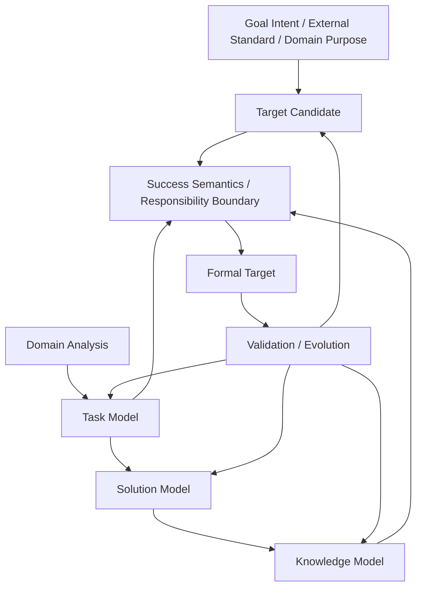

# DeerMind Learning Space Design v1.1

> **中文名称**：DeerMind 学习空间设计  
> **版本**：v1.1  
> **文档性质**：Space Design / Architecture Baseline  
> **状态**：架构冻结基线  
> **上位基线**：DeerMind Concept Architecture v1.1  
> **上位价值约束**：DeerMind Product Thesis v1.0、DeerMind Product Constitution v1.0  
> **写作规范**：DeerMind Design Document Standard v1.0  
> **更新时间**：2026-09-27  
> **版本说明**：v1.1 在保留 v1.0 的 Task Family / Task Instance、Solution Strategy、Solution Task Topology、TaskNode、Cognitive Decomposition、Knowledge Component、Knowledge Grounding、Organization Knowledge、Progressive Diagnostic Resolution、Task Learning Structure、Evolution Contract 与历史不可重写原则的基础上，完成四项语义升级：第一，正式新增 Target Model，使显式成功语义成为 Learning Space 的规范入口；第二，把 Task 从“问题 / 题目”一般化为对学习者提出情境化认知或行动责任的 demand；第三，重新分层 Goal Intent、Learning Target、Task Objective、Task Success 与 Target Proficiency Requirement；第四，把工具与支持语义拆分为 Task Canonical Tool Semantics、Target Support / Responsibility Boundary 与 Runtime Tool Availability。经 Evaluation / Interaction / Evolution v1.1 对齐与 Cross-Document Freeze Gate，Target Binding 的跨责任 owner chain 已正式收口；v1.1 现作为架构冻结基线。

---

## 1. 文档定位与设计命题

DeerMind 的 Learning Space 不是教材目录、课程树，也不是一张不断扩张的知识图谱。它承担的是更基础的规范责任：把现实学习领域表示成一套稳定、可引用、可版本化、可证伪的语义结构，使系统能够回答“当前学习目标到底要求什么能力”“这些能力在哪类任务中体现”“这些任务可以怎样有效处理”“处理它们依赖哪些可复用知识与技能结构”。

Concept Architecture v1.1 已经把 Learning Space 的顶层责任正式扩展为四个核心模型：

\[
\boxed{
LearningSpace
=
TargetModel
+
TaskModel
+
SolutionModel
+
KnowledgeModel
}
\]

四个模型不是四个互相独立的知识库，而是对同一学习领域的四种不可互换的规范视角。Target Model 定义“什么叫达到目标”；Task Model 定义“能力在哪里表现”；Solution Model 定义“责任可以怎样有效承担”；Knowledge Model 定义“什么可复用认知结构支撑这种承担”。

Learning Space 的核心任务可以压缩为一句话：

> **把学习意图、外部要求与真实领域结构转化为一套明确成功语义、能力责任和领域 grounding 的规范学习语义，使 Evaluation 能够形成有依据的能力判断，使 Interaction 能够在不篡改规范语义的前提下做出学习行动决策。**

### 1.1 本文档解决什么

本文档主要回答以下问题：

- 什么样的意图或外部要求才能被解释成正式 Learning Target；
- 一个正式 Target 至少需要表达哪些成功语义、条件与责任边界；
- Target 如何通过 Task capability grounding，而不是通过 KC checklist 定义学习成功；
- Task 为什么不能继续被限制为“题目”或“问题”，以及如何一般化到诊断、判断、设计、发现、表达和执行等真实活动；
- Task Objective、Task Success 与 Target Proficiency Requirement 如何分层；
- Solution Strategy 与 Knowledge Grounding 如何在开放领域继续成立；
- Knowledge Component 为什么仍然不能从教材知识点、Target 要求或 Solution 节点机械生成；
- Learning Space 如何服务 Evaluation / Interaction，又不吸收 Learner State、Target Binding、Plan 或 Runtime Context；
- Target / Task / Solution / Knowledge 如何接受现实证据挑战，并通过 Evolution + Governance 受控演化。

### 1.2 本文档不解决什么

Learning Space Design 有意不定义以下内容：

- 某个学习者当前是否已经达到某个 Target；
- 某个学习者当前是否掌握某个 Task Family 或 KC；
- 一次表现对 Learner Claim 构成怎样的 Evidence；
- Target Assessment、Learner Belief 的数学计算与校准形式；
- 谁当前正在追求某个 Target、为什么追求、优先级与截止时间；
- 当前是否应该教学、提示、评估、暂停或保持沉默；
- 当前设备、网络或权限下某个工具是否真实可用；
- Curriculum 的教学顺序、课堂组织和课程进度；
- 具体数据库、索引、缓存、服务拆分与推理协议；
- 系统级变更如何审批、发布、回滚与激活。

这些责任分别属于 Evaluation、Interaction、Product Context、System Design、Evolution 或 Governance。

### 1.3 上位边界

Learning Space 拥有规范学习语义，但不拥有面向特定学习者的事实与信念。一个 Target 可以规定“达到该目标必须独立承担某类诊断责任”，但它不能据此写入“这个学习者已经能够独立诊断”。

必须长期保持：

\[
Requirement \neq Evidence \neq Belief
\]

同样，Learning Space 可以定义某类 Task 的规范工具语义，却不能据此知道当前 learner 是否真的使用了某个工具；可以定义某个 Target 的 Support Boundary，却不能据此决定当前此刻应该允许或禁止哪个工具。规范定义与运行事实必须由不同的语义 owner 维护。

---

## 2. 设计问题与基本约束

Learning Space 的四模型结构不是为了“模型更完整”而增加抽象，而是为了避免几个长期会导致系统混乱的责任冲突。

### 2.1 学习意图不是正式 Learning Target

“学会 Kubernetes”“提高写作能力”“准备五年级数学”“成为优秀管理者”都可以是真实而重要的 Goal Intent，但它们本身不足以支持可靠评估。它们通常没有明确范围，也没有说明学习者最终应承担什么责任、在什么条件下做到什么程度才算成立。

同样，课程标准、学校要求、岗位标准、认证规范和专家意见可以形成真实外部约束，但外部权威并不自动等于对能力本体的最终认识权。因此：

\[
GoalIntent
\neq
ExternalStandard
\neq
LearningTarget
\]

Learning Target 是 DeerMind 对当前学习目的所作的规范解释。它必须保留来源、适用范围和解释理由，同时允许未来被现实证据挑战。

### 2.2 没有显式成功语义，就没有可靠学习判断

如果系统不知道“什么叫学会”，它就无法解释为什么某些 Task 重要，也无法判断某组 Evidence 是否足够。把“课程完成”“练习全对”“知识点覆盖率 100%”直接当成成功标准，会重新把任务完成或内容消费伪装成能力。

因此 Learning Space 接受一个强约束：

> **No Formal Target Without Success Semantics。**

这里的“显式”不意味着所有目标必须被压缩成一个分数，也不意味着系统必须假装开放领域已经被完全理解。相反，如果 Scope、能力要求或 Support Boundary 仍然不清楚，系统应允许 Target 保持未决或部分解析状态，而不是制造伪完整性。

### 2.3 Task、Solution 与 Knowledge 仍然不能压成一层

一个 Task 可以存在多种有效 Solution Strategy；不同 Strategy 可能要求不同的子任务组织、不同的知识结构和不同的工具使用。即使 Target 已经存在，也不能把模型重新压缩成 `Target → KC` 或 `Task → KC`。

例如，同一个系统故障诊断 Task 可以通过日志驱动、指标驱动、变更回溯或假设排除等不同 Strategy 完成。它们面对同一 Task demand，却可能调用完全不同的中间责任和 Knowledge Grounding。数学中的单位率、比例因子、比例方程也是同样的结构。

因此 Target、Task、Solution、Knowledge 必须保持分层，并通过可检验关系连接。

### 2.4 分辨率必须足够，但不能无限细化

学习领域几乎可以无限拆分。DeerMind 不追求“绝对最小原子”，而追求当前目的下的最小充分分辨率。

一个更细的 Target requirement、Task、TaskNode、Step 或 KC，只有在至少改变以下一种结果时，才值得进入正式模型：能力边界、知识归因、诊断、干预、迁移解释、组织结构、验证结论或版本影响。

因此，“叶节点”只是当前建模分辨率下停止继续分解，并不代表本体上不可再分。

### 2.5 模型复杂度不能超过真实可观测性

理论上可以描述的认知结构，不等于 DeerMind 应该正式建模的结构。一个 Target requirement 如果无法被任何现实表现区分，一个 KC 如果没有独立 Evidence，可分性极弱且不会改变任何决策，那么它们只是命名上的精细化。

Learning Space 继续遵循：

\[
\boxed{
ModelComplexity
\leq
Observability
}
\]

这条约束同时适用于 Target 粒度、Task Family、Solution 分解、Organization Knowledge 和 KC admission。

### 2.6 规范学习语义不能吸收学习者解释

Target、Task、Solution 与 Knowledge 描述规范结构；Evaluation 描述 DeerMind 当前如何认识某个 learner。一个 learner 表现异常可以挑战系统对这个 learner 的 Belief，却不能直接创建新的 Target requirement、Task Family 或 KC。

只有当跨 learner、跨时间、跨条件或外部现实的证据表明规范模型本身失效，问题才升级到 Evolution。Learning Space 不能用“给这个人创造一个新领域对象”来修补 Learner Model 的解释失败。

### 2.7 规范要求、运行事实与学习者认识必须分离

学习者采取某一步、调用某工具、请求帮助或提交一个结果，首先属于 Event / Action Occurrence。Interaction 负责把事实解释成 Observation；Evaluation 再判断这些 Observation 对某个 Learner Claim 构成怎样的 Evidence。

Learning Space 只提供规范坐标，不直接把行为解释为“会”或“不会”。因此 Target requirement 不能直接变成 Evidence；Target revision 也不能重写历史表现。

---

## 3. Learning Space 的四模型架构

四个核心模型分别回答四个不可互换的问题。

| 模型 | 核心问题 | 主要语义对象 |
|---|---|---|
| Target Model | 什么范围、标准、条件和责任边界下才算目标成立？ | Learning Target、Required Task Capability、Success Semantics、Support / Responsibility Boundary |
| Task Model | 能力在哪类情境化责任中体现？ | Task Family、Task Instance、Task Objective、Task Success Semantics |
| Solution Model | 这些 Task 可以怎样有效处理？ | Solution Strategy、Solution Task Topology、TaskNode、Control Constraints |
| Knowledge Model | 哪些可复用知识与技能结构支撑这些处理？ | Knowledge Component、Application Conditions、Cognitive Effect、Knowledge Grounding |

从规范要求方向看：

\[
LearningTarget
\rightarrow
RequiredTaskCapabilities
\rightarrow
Task
\rightarrow
Solution
\rightarrow
KnowledgeGrounding
\]

从现实解释方向看，Learning Space 只能提供语义坐标；真正的 learner capability claim 仍必须经过 Observation、Evidence 与 Evaluation。

### 3.1 Target 是规范投影，不是新的独立领域宇宙

Task、Solution 与 Knowledge 构成可以被多个 Target 复用的领域语义图。Target 在这些共享结构之上表达某一学习目的对应的规范要求：哪些 Task capability 属于范围、达到什么标准、在什么条件和支持边界下成立。

因此 Target 不是复制一份属于自己的 Task / KC 树，也不应建立与领域模型平行的 ontology。更准确的理解是：

> **Target 是对共享 Task / Solution / Knowledge 结构的规范投影与约束。**

这种设计允许多个 Target 共享相同 Task Family，却对 Required Standard、Conditions 和 Responsibility Boundary 提出不同要求。

### 3.2 当前不建立独立 Capability Model

Capability 是学习者在一类结构共同情境中相对稳定承担认知或行动责任的潜在倾向。它在本体上不等于 Task，但在系统认识上需要通过多个 Task Instance 的表现形成 Evidence。

Learning Space 当前只需要定义“能力在哪里表现”和“Target 要求怎样的 Task proficiency”，而不需要新增第五个 Capability Model。Evaluation 继续通过 Task Proficiency Beliefs 与 KC Beliefs 形成对 learner 的可修正认识。

只有未来出现重要反例——例如大量能力要求无法通过 Target-defined Task capability 与现有 Evaluation 语义表达——才重新打开 Capability Model。

---

## 4. Target Model：定义“什么叫达到学习目标”

Target Model 是 v1.1 新增的核心 Model。它不是 Goal 管理器，也不是课程计划器；它承担的是规范能力定义。

### 4.1 Target Model 的责任

Target Model 把模糊学习意图、合法外部要求或领域目的，解释为具有明确范围、能力要求、条件、责任边界和成功语义的正式 Learning Target。

一个正式 Target 应能够回答：

- 学习范围是什么；
- 哪些 Task Family 的能力属于目标要求；
- 这些能力要达到什么质量、稳定性或迁移水平；
- 能力在什么情境、工具与环境条件下成立；
- 哪些认知或行动责任必须由 learner 自己承担；
- 哪些责任可以合理外部化给 AI、工具或他人；
- 什么 Evidence 类型原则上能够支持或反驳目标达成判断；
- Target 的来源、版本和适用范围是什么。

Target Model 不负责回答“这个 learner 现在会不会”。那属于 Evaluation。

### 4.2 Target Source 与 Target Definition 必须分离

Learning Target 可以来源于不同现实源：

- learner 主动表达的 Goal Intent；
- 学校、认证、岗位或组织提出的 External Standard / Obligation；
- 领域安全或专业责任要求；
- DeerMind 的专业解释与领域分析。

这些来源都不能直接成为 Target Definition。Target Model 必须显式保留解释过程与适用范围。

External Standard 可以在其制度范围内具有真实 authority，但：

> **External Authority != Universal Epistemic Authority over Capability。**

例如某项认证要求可能真实决定“通过考试必须做到什么”，却不自动定义某领域所有真实能力。

### 4.3 Target 的最小充分语义

v1.1 不冻结完整字段结构，但一个正式 Target 至少需要能够表达以下五类语义：

1. **Scope**：目标覆盖哪些领域责任、Task Families 与适用边界；
2. **Required Task Capabilities**：需要 learner 在哪些 Task Family 上具备怎样的能力；
3. **Success Semantics**：什么程度的表现与稳健性足以支持目标成立；
4. **Conditions**：能力判断成立所依赖的环境、变化范围、时间、风险和工具条件；
5. **Support / Responsibility Boundary**：哪些认知或行动责任必须由 learner 承担，哪些允许外部化。

这些语义必须绑定 Provenance 与 Version。它们可以逐步解析，但不能在正式 Target 中被完全省略。

### 4.4 Required Task Capability

Target 不直接把 KC 列表当作能力要求。它首先通过 Task capability 表达：

\[
RequiredTaskCapability
=
TaskFamily
+
RequiredStandard
+
Conditions
+
ResponsibilityBoundary
\]

其中 Required Standard 不必是一个标量。它可以涉及准确性、稳健性、时间、解释质量、验证能力、迁移范围、风险控制或其他与 Task 领域相关的质量维度。

因此：

\[
KnowledgeMastery
\neq
Capability
\]

KC 可以解释某种能力为什么形成、哪里可能存在 gap，却不能自动替代完整 Task capability。

### 4.5 Success Semantics 不等于一个分数

Target 的成功语义可以是多维的。开放性任务通常无法被压缩成单一正确答案；甚至同一 Task Family 也可能同时要求判断质量、过程稳健性、验证能力、风险控制和迁移能力。

因此：

> **Assessable != Numerically Measurable。**

DeerMind 可以使用分数、等级或概率表达某些派生判断，但 Target 本体不能为了计算便利而被迫变成单一分数阈值。

### 4.6 Target Definition 与 Target Binding

Target Definition 说明“这个学习目标是什么”。谁正在追求该 Target、为什么追求、优先级、截止日期、是否自愿、是否属于外部义务，则属于 learner / context 与 Target 的关系。

因此必须区分：

\[
TargetDefinition
\neq
TargetBinding
\]

Target Definition 属于 Learning Space。Target Binding 是 learner / context 与 Target 的运行关系，不由 Learning Space 持有：其发生事实进入 Global Event Model；若 binding 来源具有外部约束力，其合法 authority 与 scope 由 Product Context / Context Constitution 定义；当前仍然有效的 Target Binding projection、生命周期与失效语义由 Interaction Space 负责。v1.1 不建立独立 TargetBindingModel，也不把 Binding 写回 Target Definition。

### 4.7 Target Support Boundary 与认知所有权

Product Thesis 与 Product Constitution 已经明确：认知所有权不等于“所有事情都不能使用工具”。Target Model 必须把责任边界写进能力定义。

例如某个系统诊断 Target 可以允许 learner 使用日志、监控和搜索，却要求 learner 自己承担 root-cause 判断与验证责任；另一个面向 AI-assisted operations 的 Target 则可以允许模型提出诊断候选，只要求 learner 能够验证、识别风险并做最终决策。

因此 Support Boundary 不是“是否允许工具”的简单布尔值，而是对责任分配的规范描述。

### 4.8 三层工具与支持语义

新增 Target 后，工具相关语义必须拆成三层：

| 层 | 责任 |
|---|---|
| Task Canonical Tool Semantics | 这个 Task 本身在领域上允许、要求或会被哪些工具改变语义 |
| Target Support / Responsibility Boundary | 当前 Target 要求 learner 自己承担什么，什么可以外部化 |
| Runtime Tool Availability | 当前现实环境到底有哪些工具、权限和资源可用 |

前两层属于 Learning Space 的规范语义，第三层属于 Interaction Runtime。

不能因为当前没有某工具就改写 Task 本身；也不能因为 Task 允许某工具，就推出某个 Target 允许 AI 替 learner 承担所有关键认知责任。

### 4.9 Formal Target 与未决状态

一个 Candidate Target 只有在以下条件达到最小充分程度时，才应成为正式 Target：

- Scope 足够清楚；
- Required Task Capabilities 已得到领域 grounding；
- Success Semantics 已定义；
- Conditions 与 Responsibility Boundary 足够明确；
- Provenance 已知；
- 关键冲突没有被伪确定性掩盖。

无法满足时，Target 可以保持 Ambiguous、Incomplete、Conflicting 或 Unresolved 等语义状态。v1.1 不冻结这些状态的具体 enum，只冻结“未决是合法状态”。

### 4.10 Target decomposition 与 prerequisite

Target 可以包含多个能力要求，也可以存在 Target 之间的范围包含或组合关系，但不能为了方便课程编排把所有 Target 强行组织成树。

Target decomposition 只有在子目标本身拥有独立、可解释的 capability boundary 时才有意义。某个能力 requirement 是另一个 requirement 的 prerequisite，也不意味着课程必须固定先教前者。

必须保持：

\[
PrerequisiteRelation
\neq
CurriculumSequence
\]

顺序和计划属于 Interaction / Curriculum 责任。

### 4.11 Target identity、version 与历史语义

Learning Target 必须拥有稳定 Identity 与 Semantic Version。以下变化通常足以构成新的 Target 语义版本：

- Scope 改变；
- Required Task Capabilities 改变；
- Required Standard 改变；
- Conditions 改变；
- Support / Responsibility Boundary 改变；
- Success Semantics 改变。

新版本可以使同一个 learner 的 Target Assessment 发生变化，但不能改写过去事实：

\[
NewTargetSemantics
\neq
NewPast
\]

Target v1 在当时语义下被满足，与 Target v2 在新语义下证据不足，可以同时成立。

### 4.12 Target 专属不变量

Target Model 当前冻结六条长期边界：

- **T1 — Target Is Normative, Not Learner State**：Target 定义要求，不描述某个 learner 当前能力；
- **T2 — No Formal Target Without Success Semantics**：正式 Target 必须拥有最小充分成功语义；
- **T3 — Target Capability Must Be Task-Grounded**：核心能力要求必须最终能够落到可表现、可产生 Evidence 的 Task capability；
- **T4 — Target Does Not Own Learning Path**：Target 不决定教学顺序、学习计划或当前 Action；
- **T5 — External Standard Does Not Become Universal Capability Truth**：外部制度 authority 保持其范围；
- **T6 — Target Evolution Does Not Rewrite Learner History**：Target 改版只创建新解释上下文，不改写既有 Event 与历史事实。

---

## 5. Task、Solution、Knowledge 与 Grounding

新增 Target Model 后，v1.0 的 Task / Solution / Knowledge 主干继续保留，但需要从“解题”语义一般化到真实学习活动。

### 5.1 Task Model：定义情境化认知或行动责任

Task 表示领域或环境中一类具有可识别情境、对 learner 提出特定认知或行动责任的 demand。

概念上：

\[
Task
=
Situation
+
Demand
+
LearnerResponsibility
+
Constraints
\]

Task 不要求存在唯一正确答案，也不要求它以“题目”形式出现。它可以是 Solve、Explain、Diagnose、Judge、Compare、Design、Create、Discover、Reframe、Plan、Communicate、Perform、Evaluate 或 Verify。

“发现真正的问题是什么”本身也可以成为 Task。真实 Task 可以开放、多人协作、结果受环境影响，只要其中存在可识别的 learner responsibility。

### 5.2 Task Objective 替代含糊的 Goal

v1.0 使用 GoalBearing 和 Task Family 中的 `Goal`，新增 Learning Target 后会造成 Goal ownership 冲突。

v1.1 统一采用：

> **Task Objective**：某类 Task 在领域内部要求完成的局部目标。

因此长期保持：

\[
GoalIntent
\neq
LearningTarget
\neq
TaskObjective
\]

Goal Intent 描述现实目的；Learning Target 描述能力目标；Task Objective 描述一次领域 demand 的内在目的。

### 5.3 Task Success 与 Target Proficiency 必须分离

Task 本身仍需要 Success Semantics，用于描述“这个 Task 是否被有效处理”。但 Target 的成功语义关注的是 learner 是否在多个实例、变化条件、责任边界和质量标准下形成相对稳定的能力。

因此：

\[
TaskSuccessSemantics
\neq
TargetProficiencyRequirement
\]

一次 Task 成功不自动证明 Target 达成；一次失败也不能自动证明 learner 没有相关 capability。

### 5.4 Task Outcome、Task Performance 与 Capability

真实世界任务的最终结果可能由 learner contribution、环境、其他 actor 与偶然因素共同决定。因此必须区分：

\[
TaskOutcome
\neq
TaskPerformance
\neq
Capability
\]

Outcome 是现实结果；Performance 是 learner 在该 Task 中可归因的实际表现；Capability 是跨实例相对稳定承担责任的潜在倾向。Evaluation 必须基于 Evidence 而不是直接从 Outcome 推出 Capability。

### 5.5 Task Family 与 Task Instance

**Task Family** 是 Task Model 的主要规范实体，表示一类共享稳定 Situation / Demand 结构、Learner Responsibility、Task Objective 与 Task Success Semantics 的任务。

它不应因为数值、表面故事、界面形式或单次环境差异机械拆分。真正改变责任结构、Solution space 或能力要求的差异，才有资格进入 Task Family identity。

**Task Instance** 是 Task Family 在具体参数、情境、表示、约束和参与者条件上的一次实例化。Task Variables 可以影响真实表现，但只有具有稳定诊断、Solution 或能力区分价值的变量才进入正式建模。

### 5.6 Solution Model：表达有效承担 Task 责任的结构

Solution Model 描述一个 Task 在领域上可以怎样被有效处理。它不记录某个 learner 这一次具体做了什么，而定义领域中可认可、可分析的处理方式。

**Solution Strategy** 表示针对某类 Task 的领域特定处理策略。它可以是完整显式方法，也可以只被部分理解。Learning Space 必须允许 Solution knowledge 处于 Known、Partial、Tacit 或 Unresolved 等不同认识状态，而不能为了“可解释”强迫所有专家能力变成完整步骤树。

**Solution Task Topology** 仍表示某个 Strategy 下的认知 / 行动责任结构：

\[
SolutionTaskTopology(T,S)
=
(TaskNodes, ControlConstraints)
\]

Control Constraints 可以表达顺序、依赖、分支、循环、回退、并行、验证门槛或其他真实控制关系。

### 5.7 TaskNode 与规范 Task identity

TaskNode 表示某个 Task Family 在特定 Solution Task Topology 中的一次结构性出现。它不是新的局部 Task ontology。

必须保持：

\[
TaskIdentity
\neq
TaskNodeIdentity
\]

每个正式 TaskNode 必须引用 Task Model 中的 Task Family。若分析过程中出现有独立 Task Objective、但规范 Task Model 中尚不存在的局部 demand，它应作为 Candidate Task Family 进入建模流程，最终要么提升为正式 Task Family，要么降级为 Step / Execution Action，要么保持未决。

### 5.8 Knowledge Model：表达可复用知识与技能结构

Knowledge Model 的基本单元仍然是 Knowledge Component（KC）。KC 表示一种可学习、可复用，并能在可描述条件下产生相对稳定认知或行动作用的知识 / 技能结构。

一个 KC 可以表现为概念理解、程序技能、关系模式、表征能力、感知辨识、策略选择、验证习惯或其他领域相关认知功能。Declarative、Conceptual、Procedural、Relational、Perceptual、Representational 等分类可以作为分析标签，但 v1.1 不冻结跨领域固定类型树。

必须保持：

\[
Knowledge
\neq
Capability
\]

拥有某些 KC 不自动意味着 learner 能够承担复合 Task responsibility；反过来，某些真实能力也可能通过多个 KC 与组织能力共同形成。

### 5.9 KC admission

Candidate KC 不应因为教材、Target 或专家语言中出现一个“知识点”名称就自动进入 Knowledge Model。

一个独立 KC 至少应在复用、表现区分、Evidence 可区分性、诊断、干预、迁移或解释价值中证明自己的存在意义，并且新增模型复杂度与获得的解释价值相称。

KC admission 是可证伪的模型选择，不是专家命名权。

### 5.10 Cognitive Decomposition：分解责任，不是复制流程

复杂 Task 可以按照某个 Solution Strategy 分解为多个子 Task 与控制约束。规范分解表达的是具有领域意义的认知 / 行动责任组织，而不是操作步骤列表。

如果某个节点只是点击、复制、执行已经完全指定的机械动作，通常更适合作为 Step 或执行轨迹；只有它拥有独立 Task Objective、稳定 demand 语义并对解释或能力区分有独立价值时，才进入 Task Model。

### 5.11 Task 与 Step

Task 和 Step 的区别不是粒度大小，而是是否承担独立领域责任。

| 维度 | Task | Step |
|---|---|---|
| Task Objective | 必须存在 | 不要求独立存在 |
| Success Semantics | 独立存在 | 可以依附上层 Task |
| 领域 / 情境责任 | 必须稳定 | 可以只是符号、工具或执行动作 |
| 是否进入规范 Task Model | 可以 | 默认不进入 |
| 对 Grounding 的要求 | 最终必须可解释 | 可以只作为执行轨迹 |

v1.1 仍不建立独立 Step Model。

### 5.12 叶 Task 的 Direct Knowledge Grounding

在某个 Solution Task Topology 中不继续分解的 TaskNode 称为叶 TaskNode。Leaf 只是当前建模分辨率的终点。

成熟模型中，每个叶 Task 必须具有非空 Direct Knowledge Grounding：

\[
Leaf(T)
\Rightarrow
DirectKG(T)\neq\varnothing
\]

构建阶段允许 `DirectKG(T)=UNKNOWN`。UNKNOWN 表示模型尚未完成，不表示 Task 不需要 knowledge / skill support。

### 5.13 No Knowledge-Free Decomposition

DeerMind 继续保留 v1.0 的可证伪建模假设：如果 learner 能够自主地把一个复合 Task 分解、组织并协调多个子 Task 共同达成 Task Objective，那么这种组织本身必然受到某种可学习认知结构支持。

因此非叶分解必须拥有 Organization Knowledge Grounding。

这不等于必须为每个分解自动创建一个新的 Organization KC。Grounding 可以由已有 KC、领域 schema、已被合理假设的基础能力，或在独立 Evidence 支持下形成的新 KC 提供。

### 5.14 Organization Knowledge 以 Strategy 为条件

同一个 Task Family 可以通过不同 Strategy 形成完全不同的子任务组织。因此 Organization Knowledge 不是 Task 的固定属性，而是 Task × Strategy × Topology 的关系。

Knowledge Model 不能机械镜像 Solution Model；每个非叶 Task 都产生一个新 KC 会迅速制造不可验证、不可复用的 ontology。

### 5.15 Recursive Structural Grounding

对叶 Task：

\[
KG(T)=DirectKG(T)
\]

对按照 Strategy \(S\) 分解的复合 Task：

\[
KG_{struct}(T,S)
=
OrgKG(T,S,C)
\cup
\bigcup_i KG_{struct}(T_i,S_i)
\]

这个关系保留两个重要事实：复合 Task 的知识要求不仅来自子 Task，也来自组织它们的能力；同时，组织知识的存在不要求每层都创建独立 KC。

### 5.16 Structural Grounding 与 Runtime Trace

Solution Model 描述一个 Strategy 的完整可能结构，一次真实执行只会走其中某条实际路径。因此：

\[
KG_{trace}
\subseteq
KG_{struct}(T,S)
\]

`KG_struct` 描述规范 Strategy 的完整知识覆盖；`KG_trace` 描述这一次实际执行涉及的 Knowledge。Runtime Trace 可以帮助 Observation / Evidence interpretation，但不能反过来定义完整 Solution。

### 5.17 Integrative Competence

如果 learner 已经在多个组件 Task 上表现稳定，却持续无法完成 Composite Task，说明“组件能力之和”可能不足以解释复合表现。

v1.1 使用更清晰的表达：

\[
ComponentTaskCompetence
\not\Rightarrow
CompositeTaskCompetence
\]

这可以触发对 Organization / Integrative Knowledge 的候选假设，但仍不能仅凭拓扑分解自动创建 KC。系统需要稳定表现差异、迁移、干预响应等独立 Evidence。

---

## 6. Learning Space 与 Evaluation / Interaction 的跨 Space Contract

Learning Space 本身不形成 learner-level runtime loop。它提供规范坐标，由 Evaluation 和 Interaction 在运行时使用，并由运行结果通过 Evolution 长期挑战。

### 6.1 对 Evaluation：提供规范能力坐标

Evaluation 需要知道 Observation 指向什么 Task Family、Task condition、Solution context 和 Knowledge grounding，才能形成面向 Learner Claim 的 Evidence。

Learning Space 向 Evaluation 提供：

- Learning Target / Target Version；
- Required Task Capabilities；
- Task Family / Task Instance identity；
- Target Conditions 与 Support Boundary；
- Solution Strategy / Task Topology；
- KC identity 与 Application Conditions；
- Direct / Organization Knowledge Grounding；
- 规范对象版本与 Validity Scope。

Evaluation 可以在这些坐标上维护：

- Task Proficiency Beliefs；
- KC Beliefs；
- 不确定性、Evidence Basis 与 Freshness。

但不新增 TargetBelief、TargetMasteryBelief 或独立 CapabilityBelief。

### 6.2 Target Assessment 是跨 Space 派生判断

Target 是否被当前 Learner Beliefs 支持，不属于 Learning Space 的规范事实，也不是新的 Learner Belief primitive。

概念上：

\[
TargetAssessment
=
Assess(TargetDefinition, LearnerBeliefs)
\]

它可以物化、缓存、版本化，但没有独立 source of truth。至少必须绑定 Target Version 与 Learner Belief Version，并在上游失效时重新计算。

必须保持：

\[
TargetGap
\neq
EpistemicGap
\]

Target Gap 表示现有 Evidence 已支持“当前能力低于 requirement”；Epistemic Gap 表示系统缺乏足够 Evidence 判断是否达到 requirement。

### 6.3 对 Interaction：提供目标、Task 与责任边界

Interaction Policy 需要理解：

- 当前正式 Learning Target；
- 当前 Task / Task Objective；
- Target Assessment / Target Gap；
- Task Canonical Tool Semantics；
- Target Support / Responsibility Boundary；
- Learner Beliefs；
- Runtime Situation 与 Product Context constraints。

但 Learning Space 不决定当前是否行动，也不决定 learner 是否接受某个 Target。

### 6.4 三层工具语义的运行接口

Learning Space 提供 Task Canonical Tool Semantics 与 Target Support Boundary；Interaction 提供 Runtime Tool Availability 与 Occurred Tool Use。

因此不能把：

- “领域上允许使用工具”
- “Target 允许把某项责任外部化”
- “当前实际上使用了工具”

混成一个字段。

其中最后一项只有真实发生后，才能进入 Event History 并影响 Assistance Context 与 Evidence interpretation。

### 6.5 Task Learning Structure：经验覆盖层而不是 Task identity

Difficulty、Prerequisite、Transfer Likelihood、Ready-after 等关系可以具有经验价值，但不应直接成为 Task identity。

这些关系可以形成 Task Model 之上的实证覆盖层，并允许随群体、Target 与数据变化。特别需要保持：

- Task Difficulty ≠ Prerequisite；
- Prerequisite ≠ Curriculum Sequence；
- UNKNOWN ≠ NOT READY；
- READY ≠ MASTERED；
- READY ≠ TARGET SATISFIED；
- READY ≠ SHOULD ACT NOW。

### 6.6 Readiness 是跨 Space 派生视图

Readiness 回答“当前是否具备进入某类 Task 或 learning experience 的条件”。它可能综合：

- Learning Space 的 Task Learning Structure、Target Conditions、Task constraints；
- Evaluation 的 Task Proficiency / KC Beliefs 与 uncertainty；
- Interaction 的当前状态、现实约束与工具条件。

因此 Readiness 与 Target Assessment 是不同问题：

> Target Assessment 问“是否达到目标”；Readiness 问“是否适合进入下一项活动”。

二者都不产生 Action authority。

### 6.7 Progressive Diagnostic Resolution

Learning Space 可以拥有细粒度模型，但 Interaction / Evaluation 不应默认每次把问题分解到最细 KC 或 Step。

默认应从 Task 层开始。只有当更细分析可能改变重要 Learner Belief、Target Assessment 或 Interaction Policy 时，才继续下钻到 Strategy、子 Task、KC 或执行轨迹。

这条原则继续防止“模型拥有最大分辨率”被误解成“运行时必须获取最大分辨率”。

### 6.8 Authority Override 不产生能力 Evidence

Product Context 中的安全限制、监护要求、组织政策或制度义务可以改变当前允许执行什么，但不能因此自动生成 Learner Evidence。

必须保持：

\[
AuthorityOverride
\neq
EpistemicEvidence
\]

例如因为安全规则禁止 learner 独立执行某实验，不等于系统已经证明 learner 不具备该实验能力。

---

## 7. 构建、验证、版本与受控演化

Learning Space 不是从课程目录一次性生成的 ontology。Target、Task、Solution、Knowledge 必须在领域分析、真实 Task corpus、专业解释与长期 Evidence 中协同形成。

### 7.1 四模型不是严格线性构建

v1.1 不采用简单的“先 Target，再 Task，再 Solution，再 KC”流水线。原因是 Target 自己需要借助领域结构才能判断什么能力是有意义的，而 Task / Solution / Knowledge 的分析也会反过来证明某个 Target 是否可表达、可观察和可评估。

更合理的是协同迭代：

AI 可以帮助生成 Candidate，但不能在 runtime 直接写入 canonical semantics。

### 7.2 Target Model 的构建

Target construction 至少要检查：

- 原始 Goal Intent / External Standard 的来源与 authority；
- Scope 是否足够清楚；
- Required Task Capabilities 是否有领域 grounding；
- Required Standard 是否与 Task 真实质量维度一致；
- Conditions 与 Responsibility Boundary 是否可解释；
- 是否把 KC checklist 错当能力；
- 是否把 Curriculum sequence 错当 capability structure；
- Success Semantics 是否能够被现实 Evidence 挑战。

如果无法可靠解析，应保留 unresolved，而不是为了完整度制造结构。

### 7.3 Task Model 的构建

Task Model 应从代表性现实 Task corpus 出发，而不是从教材目录或按钮流程出发。

核心问题包括：

- 哪些实例共享稳定 Situation / Demand / Responsibility structure；
- 哪些差异只是参数与场景变量；
- 哪些差异会改变 Solution、Responsibility 或能力要求；
- 哪些 Task 可以作为复合 Task 的可复用子责任；
- 哪些 Task distinction 真正改变 Evidence interpretation、诊断或迁移解释。

Task Family 粒度必须被真实表现与 Solution 分析挑战。

### 7.4 Solution Model 的构建

对重要 Task Family，需要分析：

- 是否存在多个稳定有效的 Strategy；
- Strategy 是否为真实专家 / learner 所采用；
- 哪些责任可以被显式分解，哪些仍然 Tacit / Partial；
- TaskNode 是否引用规范 Task Family；
- 哪些节点只是 Step；
- Organization Knowledge 是否真实存在；
- Control Constraints 是否具有领域意义；
- 该结构是否产生独立解释价值。

如果一个拓扑只是分析者把流程切得更细，却没有独立责任与 Grounding 价值，就不应进入规范模型。

### 7.5 Knowledge Model 的构建

Candidate KC 可以来自叶 Task 的直接要求、Organization Knowledge、跨 Task 反复出现的结构、迁移、干预响应、表现差异和 Solution 对比。

但 Candidate KC 必须接受独立准入审查，特别要检查它是否只是某个 Task、Target requirement 或 Solution step 的重命名。

### 7.6 Validation：四个核心 Model 都必须能被现实挑战

Learning Space 的逻辑完整不能构成有效性证明。

**Target validity** 需要检验其 Scope、Required Task Capabilities、Success Semantics、Conditions 与 Responsibility Boundary 是否真实对应领域责任，是否能被现实 Evidence 支持或反驳。

**Task validity** 需要检验 Task Family 粒度是否稳定，Task distinction 是否真正改变责任结构或表现解释。

**Solution validity** 需要检验 Strategy 是否真实存在、拓扑是否过度依赖分析者想象、Tacit 部分是否被伪造为显式结构。

**KC validity** 需要检验跨 Task 复用、Evidence 可区分性、干预相关性、迁移价值和稳定性。

Learning Space 还需要持续防止 self-sealing：模型不能通过控制 Task selection 或 Observation opportunity，使自己失去被反证的机会。

### 7.7 Evolution Contract

Target Definition、Task Family、Solution Strategy、KC 与关键 Grounding relationship 都属于具有独立语义责任和演化生命周期的正式对象，应遵守：

\[
EvolutionContract
=
Identity
+
Version
+
ActivationBoundary
+
Provenance
+
ValidityScope
+
FalsifiableExpectation
+
ReplaySupport
\]

具体持久化、快照、MVCC、依赖索引和激活机制属于 System Design；Space Design 只冻结语义责任。

### 7.8 规范语义变化不得静默继承旧派生语义

当 Target / Task / Solution / KC 发生拆分、合并、重映射或退役时，新版本定义新的解释上下文，而不是证明旧版本从未存在。

旧版本下形成的 Observation、Evidence、Learner Belief、Target Assessment 和其他派生结论必须保留版本语境。进入新版本后，只能通过重放、重新推断或显式迁移形成新解释。

证据不足时允许 UNKNOWN。

### 7.9 系统变更不重写历史事实

新的 Target / Task / KC 版本可以改变我们如何解释历史表现，却不能改变当时实际发生过什么。

过去 learner 做过的 Task、收到过的提示、使用过的工具、提交过的结果仍是原 Event。变化的是“这些事实在新语义下支持怎样的判断”。

---

## 8. 架构决策、风险、开放问题与下游对齐

### 8.1 关键架构决策

**D1 — 采用 Target / Task / Solution / Knowledge 四模型，而不是单一 Knowledge Graph。**  
四者分别承担规范目标、表现载体、处理结构和认知 grounding。把它们压成一层会把“应该会什么”“在哪里表现”“怎样处理”“依赖什么知识”混为同一类边。四模型增加了关系成本，但换来了明确 owner 与可证伪性。

**D2 — Target 是规范投影，不建立自己的 Task / KC 镜像。**  
Target 通过 Required Task Capabilities 引用共享领域结构。这样多个 Target 可以共享 Task / Knowledge，同时拥有不同标准与责任边界。若每个 Target 复制自己的能力树，长期会产生 identity drift 和重复 ontology。

**D3 — 当前不建立独立 Capability Model。**  
能力要求由 Target-defined Task proficiency 表达，learner capability claim 由 Evaluation 形成。新增 Capability Model 只有在现有结构无法解释重要反例时才有正当性。

**D4 — Task 一般化为情境化 demand，而不是“题目 / problem”。**  
这使 Learning Space 可以统一覆盖 solve、diagnose、judge、design、create、discover、communicate 与 perform 等真实学习活动，同时保留 Task Family / Instance 的稳定 identity。

**D5 — Task Success 与 Target Proficiency Requirement 分离。**  
一次任务完成的局部成功不能承担跨实例能力标准。这个分离阻止 `TaskCompletion -> Capability` 的隐性回归。

**D6 — Knowledge Grounding 继续以 Solution Strategy 为条件。**  
静态 `Task -> KC` 更简单，但无法表达多 Strategy、组织知识和路径差异。v1.1 保留 v1.0 这一核心选择。

**D7 — 不建立独立 Step Model，也不固定 KC 类型树。**  
两者都可以作为分析工具存在，但当前缺少足够证据证明它们需要稳定规范 identity 和独立生命周期。

**D8 — Readiness 与 Target Assessment 都不是 Learning Space 内部状态。**  
二者都依赖跨 Space 输入，因此保持为派生视图。

**D9 — Curriculum 不是 Learning Space。**  
Curriculum 可以引用 Target / Task / Knowledge，并规定现实教学顺序与制度义务，但不能替代规范学习语义。同一领域可以存在多个 Curriculum。

### 8.2 主要失败模式

| 失败模式 | 触发条件 | 后果 | 缓解方式 | 重新打开条件 |
|---|---|---|---|---|
| Target 伪形式化 | AI 或分析者把模糊 Goal 强制生成完整能力树 | UNKNOWN 被隐藏，后续评估建立在伪精确性上 | Formal Target qualification；允许 unresolved | 多领域证明最小语义仍无法支持可靠 Target |
| Target 退化为 KC checklist | 以知识覆盖率替代 Task capability | 学习成功重新等于内容掌握 | Required Task Capability 作为核心 grounding | 大量真实 Target 无法通过 Task capability 表达 |
| Task 仍被题目化 | 只有有答案的 problem 才能成为 Task | 职业、创造、诊断、表达类学习无法建模 | Situation + Demand + Responsibility 定义 | 开放领域持续出现无法稳定识别 Task Family 的问题 |
| Goal / Target / Task Objective 混用 | 同一“目标”字段同时承担人生目的、能力规范和局部任务目的 | ownership 与 authority 混乱 | 三层命名与 owner 强制分离 | 下游实现无法保持这种语义分层 |
| Tool / Support 边界混用 | Task 允许工具被误写成 Target 允许外部化责任 | AI 辅助表现被错误解释为目标能力 | 三层工具 / 支持语义 | 多领域证明三层仍不足以表达责任结构 |
| Capability ontology 膨胀 | 为每个 Target requirement 创建新 Capability object | Learning / Evaluation 重复本体 | 暂不建立 Capability Model | 出现无法通过 Task proficiency 表达的重要反例 |
| Knowledge ontology 自我封闭 | 每个 Step / Topology 都自动生成 KC | 模型复杂度超过 Evidence 区分力 | KC admission、observability、anti-mirroring | 实证证明当前 KC 表达持续欠拟合 |
| Context / Curriculum 泄漏 | 教学顺序、学校规则或 learner plan 写入 canonical domain identity | Market / Curriculum 成为 Core Architecture | Learning / Interaction / Product Context 分层 | 多个场景稳定要求同一新规范责任 |

### 8.3 开放问题

| 类别 | 问题 | 当前状态 |
|---|---|---|
| 概念性 | Canonical Target 与具体 Target Binding 是否最终需要不同正式类型 | Definition / Binding 与 owner chain 已冻结；是否增加独立正式类型或 Model 保持开放 |
| 概念性 | Target requirement 的组合逻辑需要多强表达能力 | 不提前设计 DSL；先验证最小充分语义 |
| 概念性 | 高度 Tacit 的专家 Solution 如何与可解释架构共存 | 允许 Partial / Tacit / Unresolved；需要进一步形式化边界 |
| 实证性 | 不同领域是否共享同一 Task Family resolution principle | 需跨数学、系统工程、写作等场景验证 |
| 实证性 | Target Assessment 在长期、高噪声开放任务中的校准质量 | 由 Evaluation v1.1 与真实数据验证 |
| 实证性 | Organization / Integrative Knowledge 的独立可区分性 | 需要表现、迁移与干预证据 |
| 实证性 | 哪些 Task Variable 真正改变 capability claim | 由跨实例表现与 Solution 差异验证 |
| 治理性 | External Standard 进入 Target 的解释与批准边界 | 需结合 Product Context / Governance 定义 |
| 治理性 | 高风险领域的 Responsibility Boundary 谁有权定义 | Core 原则已冻结，具体 authority 待 Context Constitution |
| 实现性 | Target / Task / Solution / KC 的 version dependency 与 invalidation 索引 | 交给 System Design |
| 实现性 | Target Assessment 的缓存、查询与重算机制 | 语义已冻结，工程实现开放 |
| 实现性 | Candidate semantic objects 如何由 AI 辅助生成并进入 governed commit | 交给 AI Runtime / System Design |

### 8.4 冻结后的下游传导

Learning Space v1.1 已完成 Evaluation / Interaction / Evolution v1.1 的语义对齐与跨文档审计。后续仍需把本基线传导到 AI-Native Architecture Principles 与 System Design，重点落实 Target Candidate / governed commit、Target Binding projection、identity、version、activation、typed dependency invalidation 与 replay。

这些属于冻结基线向执行架构的下游传导，不改变 Learning Space 的 semantic ownership。若实现或实证结果暴露无法由当前 Target / Task / Solution / Knowledge 结构表达的强反例，应通过 Evolution / Governance 正式 Reopen。

---

## 附录 A — Learning Space Semantic Invariant Registry

| ID | Invariant | 含义 |
|---|---|---|
| T1 | Target Is Normative, Not Learner State | Target 定义要求，不描述 learner 当前能力 |
| T2 | No Formal Target Without Success Semantics | 正式 Target 必须拥有最小充分成功语义 |
| T3 | Target Capability Must Be Task-Grounded | Target 的核心能力要求必须最终落到 Task capability |
| T4 | Target Does Not Own Learning Path | Target 不决定 curriculum、plan 或 current action |
| T5 | External Standard != Universal Capability Truth | 外部制度 authority 不能自动成为普遍能力真理 |
| T6 | Target Evolution Does Not Rewrite Learner History | Target 改版不重写历史 Event 或旧版本语义 |
| L1 | Canonical Task Closure | 正式 TaskNode 必须引用 Task Family，不长期维护局部 Task ontology |
| L2 | Task Objective Is Local | Task Objective 与 Goal Intent / Learning Target 分离 |
| L3 | Task Success != Target Proficiency | 单次 Task success 不等于 Target capability requirement |
| L4 | Cognitive Decomposition | 规范分解表达认知 / 行动责任组织，不是 workflow 切割 |
| L5 | Leaf Direct Grounding | `LeafTask => DirectKG != empty`；构建阶段允许 UNKNOWN |
| L6 | No Knowledge-Free Decomposition | 非叶认知分解需要 Organization Knowledge Grounding |
| L7 | Strategy-Conditioned Grounding | Knowledge Grounding 必须以 Solution Strategy 为条件 |
| L8 | Structural / Runtime Separation | Runtime trace 只覆盖完整 structural grounding 的子集 |
| L9 | Decomposition Must Earn Its Keep | 分解必须改变能力、归因、诊断、迁移或验证等重要解释 |
| L10 | Knowledge Model Is Not a Solution Mirror | Organization Knowledge 存在不意味着自动创建 KC |
| L11 | Knowledge != Capability | KC 不是 learner capability 的等价物 |
| L12 | Canonical Semantics != Learner Belief | 面向特定 learner 的状态只能由 Evaluation 维护 |
| L13 | Requirement != Evidence != Belief | 规范要求不能直接生成 learner evidence |
| L14 | Curriculum != Learning Space | 课程组织不能替代规范学习语义 |
| L15 | Readiness Is Derived | Readiness 不是 Target / Task / KC 固有属性 |
| L16 | Target Assessment Is Derived | Target Assessment 没有独立 source of truth |
| L17 | Task Tool != Target Support != Runtime Availability | 三层工具 / 支持语义必须分离 |
| L18 | Object-Level Evidence != System-Level Signal | learner evidence 不直接构成 canonical model revision evidence |
| L19 | Runtime Semantics Are Controlled | 运行时 AI 不能直接创造正式 Target / Task / Strategy / KC |
| L20 | Evolution Contract Applies | 核心 versioned semantic objects 必须可追踪、可证伪 |
| L21 | No Silent Cross-Version Interpretation | 规范语义变化后旧派生语义不得静默继承 |
| L22 | Occurrence History Is Immutable | 新模型可以重解释历史，但不能重写 Event |

---

## 附录 B — 当前不进入核心模型的对象

### B.1 Capability Model

Capability 是重要概念，但当前不建立独立 Capability Model。Target 通过 Required Task Capabilities 表达规范能力要求，Evaluation 通过 Task Proficiency / KC Beliefs 形成 learner-level capability claim。除非未来出现无法被这一结构解释的强反例，否则不增加第五个 Learning Space Core Model。

### B.2 Target Binding Model

Target Definition 与“谁正在追求、为什么、优先级、截止时间和义务来源”明确分离，但当前不建立独立 TargetBindingModel。Binding occurrence 由 Event History 保存，外部合法性与 scope 由 Product Context / Context Constitution 提供，Interaction 拥有当前有效 binding projection 与生命周期语义。未来只有在这一责任链无法表达重要跨场景现实时，才重新评估是否需要独立 Model。

### B.3 Solution Pattern

跨 Task Family 重复出现的高阶 Solution Pattern 可以作为分析概念存在，例如 Decompose → SolveComponents → Compose。当前尚未证明它需要独立规范 identity，因此不进入核心模型。

### B.4 Step Model

Step 对 Runtime Trace、Observation 与 Progressive Diagnostic Resolution 很重要，但当前没有证据要求一套独立、稳定、跨 Task 的 Step ontology。

### B.5 General KC Relation Graph

Learning Space 不预设覆盖全部 KC 的通用先修 / 组合 / 层级关系图。具体关系只有在某个领域有独立语义和 Evidence 价值时才建模。

### B.6 固定 KC 类型树

Declarative、Procedural、Strategic、Integrative、Perceptual 等术语可以用于分析和研究，但不直接成为硬编码本体。

---

## 附录 C — 理论与实践参照

Learning Space 可以吸收成熟理论中的有效思想，但不复制任何单一理论作为 DeerMind ontology。

| 参照 | 主要启发 | DeerMind 的边界 |
|---|---|---|
| Evidence-Centered Design | claim、task、observable behavior 与 evidence reasoning 分层 | DeerMind 进一步区分 Target requirement、Observation 与 Learner Belief |
| Knowledge Space Theory / ALEKS | empirical learning structure、readiness 与 mastery 的区分 | Learning Space 不等同于 Knowledge Space；Readiness 保持跨 Space 派生 |
| ACT-R / Cognitive Architectures | 可分解认知过程、strategy 与可学习结构 | 不把 production system 当作统一 ontology |
| HTA / GOMS / HTN | task decomposition 与 control relation | 只保留具有领域认知 / 行动责任的 Task，不把 workflow 直接升级为规范 Task |
| Competency Frameworks | ability requirement、standard 与 context | DeerMind 不建立脱离 Task manifestation 的抽象 competency list |
| Authentic / Performance Assessment | 开放 Task 与多维质量标准 | Task Outcome 不直接等于 learner capability |

---

## 附录 D — v1.0 → v1.1 语义修订说明

v1.1 不是对 v1.0 的完全重构，而是一次受上位 Product Thesis / Constitution 与 Concept Architecture v1.1 驱动的语义升级。

**保留的核心资产：**

- Task Family / Task Instance；
- Solution Strategy / Solution Task Topology / TaskNode；
- Cognitive Decomposition 与 Task / Step 分层；
- Knowledge Component 与 KC admission；
- Leaf Direct Knowledge Grounding；
- No Knowledge-Free Decomposition；
- Organization Knowledge；
- Strategy-conditioned Grounding；
- Recursive Structural Knowledge Grounding；
- Structural Grounding / Runtime Trace 分离；
- Task Learning Structure；
- Progressive Diagnostic Resolution；
- Evolution Contract；
- No Silent Cross-Version Interpretation；
- 历史 Event 不可重写。

**主要修订：**

1. `LearningSpace = Task + Solution + Knowledge` 升级为 `Target + Task + Solution + Knowledge`；
2. 新增 Target Model、Required Task Capability、Success Semantics、Conditions 与 Support / Responsibility Boundary；
3. `GoalBearing` 语义被拆分为 Goal Intent、Learning Target 与 Task Objective；
4. Task 从传统 problem unit 一般化为情境化 demand + learner responsibility；
5. Task Success 与 Target Proficiency Requirement 正式分离；
6. Tool semantics 拆分为 Task Canonical Tool、Target Support Boundary 与 Runtime Tool Availability；
7. `ChildCompetence != ParentCompetence` 改为不歧义的 `ComponentTaskCompetence != CompositeTaskCompetence`；
8. Target Assessment / Target Gap 正式进入跨 Space derived semantics；
9. Target Definition 被纳入 Evolution Contract 与 version dependency；
10. Learning Space 从小学 / 数学默认语义一般化到通用学习架构。

---

## 结语

Learning Space 的价值不在于建立一套看起来完备的“知识世界”，而在于持续提供一套足够稳定、足够简洁、能够被真实学习过程挑战的规范语义。

Target 告诉 DeerMind“什么叫真正达到这个学习目标”；Task 告诉系统“这种能力要在哪类情境责任中体现”；Solution 告诉系统“这些责任可以怎样有效承担”；Knowledge 则解释“哪些可复用知识与技能结构支撑这种承担”。

四者只有保持清晰分工，DeerMind 才能同时避免两种相反失败：一边是把学习退化成内容覆盖、知识点打勾和任务完成；另一边是为了追求通用性而建立无法观测、无法验证、无法演化的抽象能力 ontology。

v1.1 因此选择一个更克制的方向：**Target 明确成功语义，Task 提供能力表现载体，Solution 保留真实处理结构，Knowledge 提供可复用 grounding；Learner Belief、Target Assessment 与 Action authority 则继续留在各自正确的 Space。**
