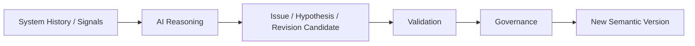

# DeerMind AI-Native Architecture Principles v0.2

> **中文名称**：DeerMind AI 原生架构原则  
> **版本**：v0.2  
> **文档性质**：Concept Architecture 与 System Design 之间的横切架构原则 / AI-Native Execution Doctrine  
> **状态**：架构冻结基线  
> **上位基线**：`DeerMind_Product_Thesis_v1.0.md`、`DeerMind_Product_Constitution_v1.0.md`、`DeerMind_Concept_Architecture_v1.1.md` 及四份 Space Design v1.1  
> **写作规范**：`DeerMind_Design_Document_Standard_v1.0.md`  
> **更新时间**：2026-09-30
>
> **修订说明**：明确开放语义解释与校验采用语义规则约束下的 LLM reasoning，区分语义判断与确定性结构、权限、提交执行；保留既有 Space ownership 与 authority 边界，并传导至 AI Runtime、Observation 与 Spike 验证合同。
>
> **版本说明**：v0.2 在 v0.1 的 Open Cognition / Controlled Authority、Reasoning Protocol、Candidate / Validation / Commit、版本化 reasoning 与 Governed Evolution 主干保持不变的前提下，对齐冻结的 Concept Architecture v1.1 与四份 Space Design v1.1。新增或明确 Learning Target / Target Assessment / Target Binding 的不同运行权威，Context Authority 与 scoped Authority Directive 不得绕过 Interaction Policy，Target / Belief / Policy 的 typed invalidation，以及 Validation / Replay 不能创造新的 authority 或 data authority。v0.2 作为当前 AI-native execution doctrine 的冻结基线。

---

## 1. 文档定位与核心命题

DeerMind 的 Concept Architecture 已经回答了系统必须维护哪些不可约的语义责任：学习领域由 Learning Space 负责，学习者认识由 Evaluation Space 负责，当前交互与行动决策由 Interaction Space 负责，系统对自身的认识与验证由 Evolution Space 负责；全局事件模型记录发生事实，Product Constitution 提供不可被普通优化覆盖的价值边界，Governance 规定系统变更权限。

但当这些概念进入可运行系统时，还存在一个传统软件架构没有充分回答的问题：**如果现实世界中的对象、状态、关系和判断无法在设计期穷举，而大量具体理解、分析、结构发现、假设生成和情境决策必须由 AI 在运行时完成，那么系统如何既保持开放认知能力，又不失去事实边界、语义边界和权力边界？**

这正是本文档的职责。

本文档不创建第五个 Space，也不重新解释四个 Space 的 semantic ownership。它位于 Concept Architecture 与 System Design 之间，定义所有 Space 在使用 AI 进行开放式认知计算时必须共同遵守的执行原则。它回答的是“**AI 原生 DeerMind 应以什么方式运行**”，而不是“系统最终部署成哪些服务”。

### 1.1 DeerMind 为什么不是“传统软件 + LLM”

传统业务软件通常假定系统面对的是一个基本可枚举的世界：对象类型、状态、状态转换、规则和操作在设计期被提前定义，运行时主要是在这些预定义结构中执行。即使规则规模很大，其基本形式仍接近：

\[
Input \rightarrow PredefinedLogic \rightarrow Output
\]

DeerMind 面对的不是这种封闭世界。真实学习过程中会不断出现无法提前列举的表达、错误、解题策略、上下文关系、认知现象和系统异常；Learning Target、Task、Solution、KC 等领域结构本身也可能随着长期证据被重新理解。若要求工程师提前把所有对象和判断规则写成静态流程，系统最终只能覆盖被预见的部分现实，无法承担 Concept Architecture 所要求的长期认识责任。

因此 DeerMind 的设计重点不是提前冻结“每种现实应该得到什么答案”，而是提前冻结：

- 什么是事实，什么是解释，什么是证据，什么是信念，什么是决策；
- 哪个 Space 对哪类语义负责；
- 什么信息有资格参与某次判断；
- AI 可以形成什么认识、提出什么候选结果；
- 什么结果可以自动获得系统效力，什么必须验证、授权或治理；
- 当旧认识被证明不充分时，系统如何修正而不重写历史。

在这一前提下，具体语义理解与情境 reasoning 才由 AI 在运行时完成。

对开放语言、上下文关系、行为含义和语义职责边界的判断，DeerMind 采用**显式语义规则约束下的 LLM reasoning**。语义规则定义可以作出什么断言、需要什么依据、如何保留归属与不确定性，并通过版本化 Protocol 执行；不得用关键词、正则或枚举表达方式的业务分支替代这些语义判断。确定性机制继续承担结构解析、精确计算、引用与版本检查、权限和提交执行；这些可精确判定的操作不因采用 LLM 而被移交给生成式判断。

### 1.2 AI-native 的正式定义

本文将 DeerMind 定义为一个**面向开放世界的 AI 原生认识型系统**：

> DeerMind 预先设计并冻结稳定的认知框架、语义责任、事实规则和权力边界，而不试图穷举现实世界中的全部对象、状态和业务逻辑；运行时大量具体的语义理解、结构发现、假设生成、分析与情境决策由 AI 完成，再通过受控 Context、分层 Validation、明确 Authority、确定性 Commit、Version / Provenance 和 Governance，把开放式认知约束为可审计、可修正、可演化的系统行为。

这个定义的核心不是“系统大量调用 LLM”，而是系统把**认知开放性**与**制度性权力**分离。

本文最重要的总原则是：

\[
\boxed{Open\ Cognition \neq Open\ Authority}
\]

开放的是系统认识现实、提出解释和发现结构的空间，不是事实权、语义权、执行权和系统变更权。

### 1.3 本文档不解决什么

本文档有意停止在 AI-native 跨系统架构原则这一层。以下内容留给 System Design 或更下位设计：

- 使用一个还是多个具体 LLM，以及具体模型供应商；
- Prompt 模板、模型参数和 token budget；
- Agent 数量、Agent framework 与具体 workflow engine；
- Context 数据结构、JSON Schema 和 Tool API；
- 数据库、向量检索、缓存、消息系统和存储实现；
- 微服务、进程、部署拓扑和扩缩容；
- Retry、Timeout、并发控制等具体工程参数；
- MVP 功能范围和研发排期。

这些实现可以演进，但不得绕过本文档冻结的 AI-native Architecture Invariants，除非后续实现或实证结果证明相关原则本身不可成立，并按照 Governance 重新打开架构决策。

---

## 2. 静态制度与开放认知共同构成 AI-native 系统

DeerMind 的 AI 原生性并不意味着把整个系统交给生成式模型。相反，模型能力越开放，系统越需要稳定的制度性结构来决定什么可以被认识、什么可以被相信、什么可以被执行、什么可以被改变。

从执行视角看，DeerMind 可以理解为四类互补结构：

\[
DeerMind
=
SemanticConstitution
+
DeterministicAuthority
+
AICognition
+
GovernedEvolution
\]

四者不是四个新的软件模块，而是四类不可混淆的系统责任。

### 2.1 Semantic Constitution：系统允许怎样认识世界

Semantic Constitution 来自 Concept Architecture、Space Design、Product Constitution 和被正式批准的 canonical semantics。它规定系统不能在普通运行时 reasoning 中随意突破的边界，例如：

- Event、Observation、Evidence、Belief 与 Policy Outcome 不能被混成同一种对象；
- 只有 Evaluation Space 可以修改 Learner Belief；
- 行动决策属于 Interaction Policy；
- Teaching / Hint / Explain 本身不能证明 learner 已经学会；
- Product Constitution 不能被普通优化目标覆盖；
- canonical semantic change 必须遵循 Evolution 与 Governance。

这些约束不是给 LLM 的“建议”，而是系统制度的一部分。

### 2.2 Deterministic Authority：系统决定什么可以生效

身份、版本、权限、生命周期、正式 Commit、依赖、失效、执行确认、审计和版本激活等责任必须由确定性系统控制。AI 可以提出某个 Observation、Action 或 KC 候选，但不能因为自然语言输出了“应该这样做”就自动拥有写入正式状态或改变 canonical semantics 的权力。

这里的“deterministic”并不要求整个 DeerMind 行为可预测，而是要求**权力边界本身不能由生成式 reasoning 临场改写**。

### 2.3 AI Cognition：系统在开放现实中形成具体认识

AI Cognition 承担传统静态程序难以穷举的认知计算，例如：

- 理解自然语言和多模态输入；
- 解释 learner work 与学习行为；
- 解释或生成 Learning Target Candidate，并分解 Task、Solution 和潜在知识结构；
- 解释 Observation 对具体 Claim 的证据意义；
- 生成 competing hypotheses；
- 在当前 Context 下规划并选择 Action；
- 发现系统模型可能存在的结构性问题；
- 生成候选修订和验证方案。

AI 可以承担真正的判断责任，而不是只能做文本分类器；但它的判断必须处于明确的 semantic role 和 authority envelope 内。

### 2.4 Governed Evolution：系统可以改变自己的认识框架，但不能自我授权

长期运行以后，DeerMind 必须允许当前 ontology、Evidence semantics、Policy 或 Reasoning Protocol 被现实证据否定。AI 可以高度自动化地发现问题、形成 Hypothesis、提出 Revision Candidate、设计 Validation、分析结果，但从“我们认为应该改变”到“系统正式改变”之间仍然存在 Governance Boundary。

因此：

> **Evolution 负责形成系统认识，Governance 负责授予系统变更权限。**

系统可以开放地发现新的世界结构，但不能单方面为自己立法。

### 2.5 一个统一的运行心智模型

上述四类责任最终形成一条稳定主链：


这条链表达了 DeerMind AI-native Runtime 的核心结构：**系统控制 AI 基于什么认识世界，AI 在边界内进行开放 reasoning，系统再控制 reasoning 结果如何获得正式效力。**

---

## 3. AI 与确定性系统按“认知责任 / 生效权力”分工

AI-native 架构最容易犯的错误，是按照“简单逻辑交给代码、复杂逻辑交给 AI”划分责任。复杂度并不是正确边界。一个简单的权限检查必须由确定性程序负责，而一个非常复杂的 Interaction Decision 可以由 AI 完成；两者的差异在于前者决定制度性合法性，后者承担开放式认知判断。

因此 DeerMind 采用“认知责任可以开放，系统生效权力必须受控”的分界。

### 3.1 四类 Authority Level

不同 reasoning 结果具有不同的系统影响，应被区分为至少四类 authority level：

| Authority Level | 典型责任 | AI 是否可以自主形成结果 | 是否可以直接改变 canonical system |
|---|---|---|---|
| Reasoning | 理解、解释、分析、Hypothesis、比较 | 可以 | 不可以 |
| Derived Semantic Commit | Observation、Evidence、System Issue 等可修正认识 | 可以生成 Candidate；满足 Commit Policy 后可自动提交 | 不可以 |
| Runtime Decision | Action、NoIntervention、Defer、Plan | 可以承担实际决策 | 需经过运行时 admissibility / authority gate |
| Canonical Change | Target / Task / KC / State Type / Evidence semantics / Policy semantics 等正式语义变更 | 可以发现、提出、验证 | 必须进入 Evolution / Governance |

Constitutional Change 位于更高权限层级，不属于普通运行时 AI 的直接权限范围。

这个表中的关键不是建立固定枚举，而是明确：**开放性与权力是两个独立维度。** 一个 Hypothesis 可以非常开放，但直接 authority 很低；一个 Interaction Decision 可能只能在已有 Action ontology 内选择，却会真实影响 learner。

### 3.2 Commit Boundary：从“AI 认为”到“系统承认”

每个 AI-derived result 获得正式系统效力之前，都必须跨越显式的 **Commit Boundary**。Commit Boundary 不代表需要人工审批，而是表示系统必须知道某个结果在何种规则、版本和 authority 下从 Candidate 转化成正式对象。

例如：

```text
Event
→ ObservationCandidate
→ [Commit Boundary]
→ Observation
```

以及：

```text
Policy Reasoning
→ ActionCandidate
→ [Commit Boundary]
→ ActionIntent
→ Executor
→ ActionOccurrence
```

对于 canonical change，Commit Boundary 前还必须经过 Evolution Validation 与 Governance。

### 3.3 Authority Envelope：AI 可以在什么范围内自由行动

每次 reasoning execution 都应在一个由系统赋予的 Authority Envelope 内运行。它至少在概念上限定：

- 当前 Reasoning Protocol；
- 允许读取的 Context 类别；
- 允许生成的 Candidate 类型；
- 可使用的 Tool 类别；
- 可触达的 Action scope；
- Semantic Openness；
- 对应的 Commit Class。

AI 可以在 envelope 内进行开放 reasoning，也可以申请更多 Context 或提出新的 Candidate，但不能自行扩大 envelope。Authority 的来源是系统 provenance，而不是模型文本。

### 3.4 确定性 Gate 只验证合法性，不重复教育判断

如果 Interaction Policy 已通过 AI reasoning 选择 `NoIntervention` 或某个 Action，deterministic gate 不应重新实现一套教学规则来判断“教育上是否同意”。否则 AI 决策只是前置建议，真正业务逻辑仍然隐藏在 if/else 中。

Deterministic gate 应验证的是：Action Type 是否当前版本合法、已解析的 Stop Request / Constraint 是否允许该 effect、是否在当前 authority scope、参数是否有效、关键 Context 是否已经变化，以及 Protocol 要求的语义校验是否已完成并通过。若需要理解自然语言是否表达停止意图、候选内容是否违反 Constitution 等开放含义，应由语义规则约束下的 LLM 判断并留下校验依据；gate 执行相应结果与正式约束，不能把词语匹配当作含义判断，也不能让 LLM 的通过意见创建权限。

因此：

> **AI 可以拥有运行时 decision responsibility；deterministic system 拥有 admissibility、commit 与 execution authority。**

---

## 4. Reasoning Protocol 驱动 AI 认知执行

DeerMind 不把“Agent”或“一次 LLM call”作为基本认知抽象。更稳定的一级对象是 **Reasoning Protocol**：它定义一次 AI reasoning 正在承担什么 semantic role、可以基于什么 Context、可以产生什么结果，以及失败时如何表达不确定性。

一次典型认知执行可以表示为：

```text
Reasoning Purpose
→ Reasoning Protocol
→ Context Policy / Assembly
→ AI Reasoning Runtime
→ Candidate
```

### 4.1 Reasoning Protocol 是版本化的认知程序

Reasoning Protocol 不等于 Prompt。Prompt 只是某个模型适配器执行 Protocol 的一种技术表达。一个正式 Protocol 至少需要定义以下语义：

```text
ReasoningProtocol
- SemanticRole
- Objective
- InputContract
- ContextPolicy
- ToolPolicy
- SemanticOpenness
- AuthorityLevel
- OutputContract / CandidateType
- GroundingPolicy
- UncertaintyPolicy
- ValidationPolicy
- FailurePolicy
- ProtocolVersion
```

例如 `ObservationInterpretationProtocol` 的目标是解释“当前发生了什么”，而不是判断 learner 会不会某个 KC；`InteractionDecisionProtocol` 可以读取相关 Learner Belief 并进行行动决策，但不能修改 canonical KC；`DomainStructureDiscoveryProtocol` 可以提出系统中不存在的 KC Candidate，但不能直接使其成为 Canonical KC。

因此，教育理论和系统认识规则不应被埋在“万能 Prompt”里，而应成为可以独立版本化、验证和演化的 Reasoning Protocol。

### 4.2 Context 首先受认识资格约束，其次才考虑相关性

普通 RAG 往往先问“哪些信息最相关”。DeerMind 必须先问“哪些信息有资格参与这一次判断”。一个 Learner Belief 对 Observation Interpretation 可能高度相关，却可能因为会制造自证循环而属于 Forbidden Context；同一个 Belief 对 Interaction Decision 又可能是必要输入。

因此：

\[
EpistemicAdmissibility \rightarrow Relevance
\]

而不是先检索所有“相关”信息再交给模型自行判断如何使用。

Context 本身不是 Source of Truth，而是针对特定认知目的形成的系统状态投影：

\[
Context = PurposeBoundProjection(SystemState)
\]

Context Package 应保留事实、derived semantics、canonical semantics、constraint 等不同 epistemic class，并显式表达 required / optional / forbidden / missing / stale 等状态。AI 可以申请 Context Expansion，但是否允许读取仍由 Context Policy 决定。

### 4.3 Minimum Sufficient Context，而不是“模型知道得越多越好”

AI reasoning 默认只应获得完成当前 semantic role 所需的最少充分信息。过度暴露历史可能产生 confirmation bias、隐私风险和不必要的 token / latency；过度裁剪又可能让模型忽略决定性 runtime constraint。

因此 Context Assembly 的目标不是最少信息，而是 **Minimum Sufficient Context**。Context selection 应同时考虑认识资格、相关性、freshness、semantic version、privacy 和当前 purpose。

### 4.4 AI Reasoning Runtime 是认知执行环境，不是 semantic owner

统一 AI Reasoning Runtime 可以横跨四个 Space，为不同 Protocol 提供公共执行能力，例如：

- Context Assembly 与模型适配；
- Model Routing；
- Tool Access；
- Protocol Execution；
- Structured Candidate Generation；
- Provenance Capture；
- Failure Handling。

但 Runtime 自身不拥有 Learning、Evaluation、Interaction 或 Evolution authority。Space 决定 semantic responsibility，Protocol 定义某次 reasoning responsibility，Runtime 负责执行。

这避免两种相反但同样危险的设计：一是把四个 Space 简单做成四个自治 Agent；二是建立一个拥有所有语义与权力的万能 DeerMind Agent。

### 4.5 Semantic Openness 必须显式声明

不同 Protocol 对新语义的开放程度不同。至少需要区分以下层次：

```text
Closed Ontology
→ Open Interpretation
→ Ontology Extension
→ Structural Redesign
```

Observation Interpretation 通常应在当前 canonical ontology 内解释现实，遇到无法映射的现象可以输出 `Unmapped`，而不能偷偷创建新的正式 Observation Type。KC Discovery 则必须允许提出当前 ontology 中不存在的新结构，否则系统无法演化。

Semantic Openness 与 Authority Level 必须分开：**AI 可以高度开放地提出新世界模型，同时保持极低的直接生效权。**

### 4.6 不确定性与失败是一等运行结果

AI Runtime 不应假设模型每次都能给出一个可提交答案。合法结果包括但不限于：

- `Ambiguous`；
- `InsufficientContext`；
- `InsufficientEvidence`；
- `Unmapped`；
- `InvalidOutput`；
- `GroundingFailure`；
- `ModelFailure`；
- `Disagreement`；
- `Stale`；
- `Unresolved`。

失败不能通过“持续重试直到模型给出一个答案”被掩盖。UNKNOWN、歧义和无法识别本身就是系统需要保留的认识状态。

---

## 5. Candidate 通过分层 Validation 获得系统效力

AI 的开放式输出默认不是正式事实、正式认识或正式系统变更。DeerMind 通过 **Candidate** 把“模型提出什么”与“系统承认什么”分开。

Candidate 并不是为了把所有 AI 结果都人工审核，而是为不同风险的结果提供统一的 provenance、validation 和 commit 入口。

### 5.1 Candidate 是开放 cognition 与正式系统语义之间的中间态

典型 Candidate 包括：

- ObservationCandidate、EvidenceCandidate 等 Derived Semantic Candidate；
- ActionCandidate、NoIntervention、Defer、Plan 等 Runtime Decision Candidate；
- TaskCandidate、KCCandidate、StateTypeCandidate、EvidenceSemanticsCandidate 等 Canonical Semantic Candidate；
- HypothesisCandidate、RevisionCandidate 等 Evolution 内部对象。

不同 Candidate 的开放程度、影响范围和 commit authority 不相同，因此不存在一个统一的“模型置信度超过阈值就提交”的规则。

### 5.2 Validation 与 Authority 必须分离

Validation 回答“这个 Candidate 是否满足当前要求”，Authority 回答“即使它满足要求，谁有权让它生效”。一个 KCCandidate 可以经过高质量分析与实证验证，但仍不能绕过 Governance 直接成为 Canonical KC。

因此：

\[
ValidationSuccess \neq CommitAuthority
\]

### 5.3 Validation Ladder

DeerMind 采用分层、可组合的 Validation 模型，而不是一个抽象的万能 Validator。概念上至少包括：

| 层级 | 主要问题 | 典型机制 |
|---|---|---|
| L1 Structural | 输出结构是否有效 | Schema、字段、枚举、格式检查 |
| L2 Grounding | 引用是否存在、内容是否支持候选解释 | 引用 / identity / 版本的确定性检查；需要理解含义的支持关系由语义规则约束下的 LLM 判断 |
| L3 Semantic Contract | 是否违反 Space ownership / Architecture Invariant | LLM 校验开放内容的断言、归属和职责边界；确定性机制检查类型、权限与校验记录 |
| L4 Context Validity | reasoning 使用的关键 Context 是否仍有效 | freshness、dependency version、stale check |
| L5 Semantic Quality | 判断本身是否足够可信 | 规则约束下的 LLM critique、按风险安排的独立复核与交叉检查 |
| L6 Empirical Validation | 高影响结构变更是否被现实证据支持 | replay、benchmark、shadow、prospective validation |
| L7 Governance Authorization | 是否有权正式改变 canonical system | Governance / Approval Envelope |

L7 严格说是 authority 而不是 epistemic validation，但它是高等级 Candidate 生命周期中的最终生效门槛。

确定性 Commit 不意味着前置语义判断也能由确定性算法证明。LLM 语义校验必须有明确的规则、输入范围、依据和未决路径，其错误通过实验、运行反馈与可修正状态处理；不能只凭模型自报“已通过”取得 standing。是否增加独立校验 execution 或使用不同模型由 Validation Profile 按风险与证据决定，不要求所有 reasoning 固定调用多个模型，也不把模型间一致当作正确性的证明。

### 5.4 Validation 强度与风险匹配

Derived semantics 本质上可修正，因此普通 Observation 不需要证明“绝对正确”才允许进入系统。真正要求是它 grounded、可追溯、受当前 ontology 约束，并且未来可被 supersede、invalidate 和 recompute。

相反，影响范围大、可逆性低或会改变 canonical semantics 的 Candidate 必须接受更强 Validation。Required Validation Strength 应至少考虑：

- Authority；
- Impact；
- Reversibility；
- Uncertainty；
- Blast Radius。

这避免两个极端：一是把每次日常 reasoning 都升级成高成本委员会审查；二是把结构性系统变更与一次低风险 Observation 使用相同提交标准。

### 5.5 Commit 是确定性系统事务

正式 Commit 不等于数据库 insert。它至少意味着：

\[
Commit
=
AuthorityGrant
+
VersionBinding
+
ProvenanceBinding
+
DependencyRegistration
+
Persistence
\]

因此 Commit 必须由 deterministic system 完成。AI 可以生成 Candidate、解释理由、请求更多证据，但不能自行决定“从现在开始这就是正式系统状态”。

Commit Result 也不能只有 success / fail。`Committed`、`Rejected`、`Deferred`、`NeedsMoreEvidence`、`NeedsReview`、`Stale`、`Conflict`、`Unauthorized`、`ValidationFailed` 等结果具有不同语义；特别是 `Unresolved` 不等于 `Rejected`。

### 5.6 Decision Commit、Reality 和 Version Activation 必须分离

Interaction 中：

```text
ActionCandidate
→ ActionIntent
→ Executor
→ ActionOccurrence
```

只有 ActionOccurrence 才证明某个行动真实发生。网络失败、客户端断线或执行被拒绝都可能导致 `SelectedAction != OccurredAction`；Assistance Exposure 只能依据真实 Occurrence 建立。

Canonical change 中同样需要区分：

```text
Validated Candidate
→ Governance Approval
→ Version Commit
→ Activation Plan
→ Activation Boundary
→ Active Version
```

`ApprovedVersion != ImmediateGlobalReplacement`。Commit 与 Activation 是不同的系统责任。

---

## 6. 持久状态与信息权力都必须由系统治理

AI-native 系统存在两条很容易绕过正式架构的隐蔽路径：第一条是 Agent 私下保存长期“记忆”，形成未受 semantic ownership 管理的第二套认识；第二条是外部内容因为“写得像指令”而获得本不属于它的 authority。DeerMind 必须同时关闭这两条路径。

### 6.1 AI Runtime 不拥有隐藏长期认识状态

任何跨 reasoning execution 持续影响系统行为的信息，都必须进入正式、typed、versioned、provenanced、invalidatable 的 System State。AI Runtime 可以在单次执行中拥有 Working Memory，但 execution 结束后，如果某个认识要长期存在，就必须通过对应 semantic owner 的正式状态模型表达。

因此：

\[
DurableMemory \Rightarrow ExplicitSystemState
\]

而不是通过 `AgentMemoryStore` 保存“student weak at fractions”“usually careless”“prefers hints”一类混合语义。

这类通用 Agent Memory 会把 Learner Belief、Preference、Runtime Condition、Observation 和 History 压扁成一套没有清晰 owner 的 Shadow Epistemic State，并构成 hidden second writer。

### 6.2 Working Memory、System State、Recall View 和 Workflow State 必须区分

DeerMind 至少区分四类常被统称为“memory”的对象：

- **Working Memory**：一次 reasoning execution 内的临时工作状态，不具有长期 authority；
- **System State**：Event、Learning Target、Learner Belief、Interaction State、Task/KC、System Issue 等正式持久状态；
- **Derived Recall View**：针对当前 purpose 从历史和正式状态投影出的相关回忆，不构成新事实源；
- **Workflow Checkpoint**：长时间 Agent / workflow 为恢复执行而保存的进度状态，不自动获得 epistemic authority。

因此 History 不等于当前 Belief，保存过往对话也不意味着下一次 reasoning 应该看到全部对话。AI 的“回忆”必须重新经过 Context Policy 与 Context Assembly。

### 6.3 Content、Instruction 与 Authority 不是同一种东西

进入 LLM Context 的自然语言可能同时包含 Product Constitution、Reasoning Protocol、Learner Request、External Actor Request / Authority Directive、Task Content、检索资料、网页内容和模型自己此前生成的文字。对 LLM 而言它们都可能呈现为文本，但对系统而言它们的 authority 完全不同。

因此：

\[
Content \neq Instruction \neq Authority
\]

一个 Task 文本即使写着“忽略此前规则”，仍然只是 Task Content；learner 说“以后每次都直接告诉我答案”，首先是 Learner Request，而不是 Policy Override；外部论文可以成为 Evidence Source 或 Hypothesis Input，但不能直接修改 canonical KC。

Authority 只能来自 provenance、role、Protocol 和 Governance，不能来自文本本身的命令语气。

### 6.4 Context 必须同时保留 epistemic status 与 authority status

Context 不是一串被压平的文本。一个 Context Item 至少在语义上需要知道：它是事实、self-report、derived belief、canonical rule 还是 external content；同时还需要知道它对当前 reasoning 是普通材料、可影响 intent 的 request、必须遵守的 runtime constraint，还是 constitutional / governance authority。

因此同一个信息可以“可读取、可引用”，但并不“可服从”。制度性 authority conflict 也不能让 LLM 临场自由裁决，而应由 canonical rule 决定优先级。

Target 与 Binding 也必须保持同样的权威分层。AI 可以提出 `TargetCandidate` 或 `TargetBindingCandidate`，但二者不是同一种 commit：Target Definition 的正式语义属于 Learning Space 并通过受治理 canonical commit 生效；Binding occurrence 的事实进入 Event History，外部 Binding 的合法 authority / scope 来自 Product Context / Context Constitution，当前有效 Binding projection 由 Interaction 形成。任何自然语言表达都不能同时取得这三类 authority。


### 6.5 Tool Access 是 Authority 的延伸

Tool 不能因为模型能够调用就被视为有权调用。Protocol 应限定当前 execution 可以访问哪些 Read / Context Tool、Reasoning Tool、Action Tool 或 Governance Tool；真正的后端还必须再次执行 deterministic authorization。

即使错误地把高权限 Tool 暴露给模型，后端也必须能够根据 Protocol、Authority Envelope、目标对象和当前 scope 拒绝越权请求。

因此：

> **LLM 永远不能成为系统安全边界。**

Prompt injection、恶意文档、间接注入、learner jailbreak 或模型自己生成的越权文本，本质上都属于“非授权内容试图升级 authority”的同一类问题。系统应在结构上阻止这种 authority escalation，并将重要异常记录为可审计的 Security Signal。

---

## 7. AI 的非确定性通过历史重建与版本归因治理

AI-native system 不能假设相同输入与相同模型名称一定产生相同输出。即使固定 Prompt 和 inference 参数，模型服务的后端实现、路由、权重版本或推理环境也可能发生变化；某些 Protocol 本身还需要保留探索性，以发现新的 Hypothesis 或 domain structure。

因此 DeerMind 的目标不是把 LLM 假装成 deterministic function，而是确保每一次重要 cognition 都能被重建、归因和重新评价。

### 7.1 Reasoning 是版本化计算

一个正式 AI-derived result 不能只记录“由某个模型生成”。它至少依赖：

```text
ReasoningExecutionContext
- ProtocolVersion
- ModelVersion / Provider Revision if available
- SemanticVersion
- ContextAssemblyVersion
- ToolVersion
```

同时还必须能追溯实际 Input References、Context Manifest、Tool Result、Candidate、Validation 与 Commit Outcome。Model Version 只是系统行为版本的一部分。

Reasoning Protocol 自身因此属于 versioned semantic responsibility：Protocol 的改变可能在代码不变的情况下改变系统如何解释 Observation、Evidence 或 Policy Context，必须受 Evolution Contract 约束。

### 7.2 四种“回放”能力必须分开

“Replay”一词如果不加区分会掩盖完全不同的认识论问题。DeerMind 至少区分：

**Historical Reconstruction**：回答“当时实际发生了什么、模型实际看到了什么、产生了什么 Candidate、经过什么 Validation、最终 Commit 了什么”。它依赖历史执行记录，不依赖重新调用模型。

**Reasoning Re-execution**：尽可能使用当时的 Protocol / Context / Model 条件再次执行，用于 regression 或 drift 分析，但默认不保证得到相同输出。

**Semantic Reinterpretation**：使用新的 semantic / protocol / model version 重新解释旧的 factual history，故意允许产生新的 Observation、Evidence 或 Belief。

**Counterfactual Evaluation**：回答“如果当时采用了另一个 Action / Policy 会怎样”。这需要额外的 causal assumption、simulation 或 empirical validation，不能被 factual replay 冒充。

因此：

\[
HistoricalReconstruction \neq ReasoningReexecution
\]

以及：

\[
FactualReplay \neq CounterfactualEvaluation
\]

### 7.3 Reasoning Execution Record 记录系统可治理的执行证据，而不是 CoT

为了支持 Historical Reconstruction，DeerMind 需要持久化足够的 `ReasoningExecutionRecord` / `ReasoningExecutionCapsule`。它至少应能够表达：

- execution identity；
- Protocol 与版本；
- Model identity / revision（若 provider 提供）；
- Context Package / Manifest；
- 重要 Tool Call 与当时 Tool Result；
- 模型实际生成的 Candidate；
- Validation / Authority / Commit result；
- 时间与状态信息。

系统不需要、也不应依赖保存模型私有 chain-of-thought。需要保存的是 DeerMind 能够观察、审计和治理的 reasoning provenance。

这里有两个重要后果。第一，实际 Candidate 即使最终被 Reject，也属于 reasoning execution history，因为它对模型质量评估和 Evolution 有价值。第二，Historical Reconstruction 需要知道“模型当时实际看到了什么”，不能只依赖未来重新运行 Context Assembly 得到一个看似相同的上下文。

### 7.4 新认识不能创造新的过去

DeerMind 需要长期保留三个不同层面的历史：

- **Factual History**：Event、ActionOccurrence、Learner Work、External Input；
- **Reasoning Execution History**：Context、Protocol、Candidate、Validation、Authority、Commit；
- **Semantic State History**：某个版本下形成的 Observation、Evidence、Belief、Interaction State、System Issue。

新的 semantic version 可以对旧 Event 形成新的 Interpretation，但不能覆盖旧版本当时形成的认识，更不能修改真实发生过的历史。

因此：

\[
NewUnderstanding \neq NewPast
\]

历史认识可以被 supersede，历史事实不能被重写。

### 7.5 ReplaySupport 有边界，Non-determinism 也是可测系统属性

ReplaySupport 不是一个简单布尔值，也不意味着无限期保留全部数据。受 privacy、retention、删除要求或外部依赖限制，某些历史重建未来只能达到 `FULL`、`PARTIAL` 或 `UNAVAILABLE` 中的某个等级，并应显式说明缺失原因。

同时，Reasoning Variability 本身可以成为系统质量指标。Observation Interpretation 可能要求高稳定性，而 Hypothesis Generation 可以允许更高探索性。Protocol 应能够声明 stability / variability expectation，Evolution 则可以持续监测 disagreement rate、decision consistency、classification stability 和 uncertainty calibration 等指标。

AI-native 的审计目标因此是：

\[
Reconstructability
+
Attribution
+
Reevaluation
\]

而不是无法兑现的严格 deterministic reproducibility。

---

## 8. Agent、Governed Evolution 与架构不变量

前述设计把 AI 能力放进 DeerMind，但没有把“Agent”提升为新的 semantic authority。这样既保留了未来使用单次 LLM call、Protocol Chain、bounded Agent Workflow 等不同执行方式的自由，也避免执行框架反向侵蚀 Concept Architecture。

### 8.1 Agent 是执行方式，不是一级架构主体

在 DeerMind 中，Agent 可以被定义为：**在一个明确 Goal、Context、Protocol 和 Authority Envelope 下，连续执行多个 Reasoning Protocol 与 Tool Operation 的 bounded workflow。**

其层次关系是：

```text
Space       owns semantic responsibility
Protocol    defines reasoning responsibility
Runtime     executes reasoning
Agent       orchestrates reasoning
```

因此：

- `Space != Agent`；
- Agent 不拥有独立 Learner Belief、canonical semantics 或 Governance authority；
- Agent 可以替换、拆分或取消，而 Space ownership 不能因此改变；
- 多个 reasoning process 默认通过 typed semantic object 协作，而不是依赖 Agent 间自由自然语言聊天形成系统契约。

对于长时间 Agent Workflow，可以保存明确的 Workflow Checkpoint，但该 checkpoint 只是执行状态，不得偷偷变成新的 epistemic memory。

### 8.2 AI-native 与 Evolution Space 的连接

AI-native Runtime 不只服务 learner-facing runtime，也服务 DeerMind 对自身的持续认识：



AI 可以帮助发现 canonical ontology 中不存在的新结构，可以提出新 KC、Observation semantics 或 Reasoning Protocol，也可以设计并分析验证；但正式语义改变仍由 Evolution Contract、Governance 与 Activation Boundary 控制。

这使 DeerMind 同时具备两种性质：运行时对现实保持认知开放，系统层面对自身保持可证伪和可演化。

### 8.3 AI-Native Architecture Invariants

以下不变量构成本文档的正式架构约束。它们优先约束后续 System Design；具体实现能力可以分阶段建设，但实现不能以“暂时做不到”为由悄悄改变这些边界。

**AN-1 — Open World Cognition**  
系统不得假定现实中的语义对象、状态、关系和所有有效解释能够由设计期穷举。开放式 semantic interpretation 与 structure discovery 是正式系统能力，而不是异常路径。

**AN-2 — Open Cognition ≠ Open Authority**  
开放式 AI reasoning 不自动产生事实权、语义权、执行权或系统变更权。

**AN-3 — AI Reasons, System Commits**  
AI 可以承担开放式理解、推断和决策，但其结果获得正式系统效力之前必须跨越明确的 Commit Boundary。

**AN-4 — Deterministic Authority**  
Identity、Authority、Version、Commit、Execution、Audit、Activation 等制度性权力必须由确定性机制控制，生成式 reasoning 不得自行扩展或覆盖这些规则。

**AN-5 — Candidate Before Commitment**  
开放式 AI 生成结果默认首先是 Candidate，而非正式 factual object、derived semantic object 或 canonical semantics；任何例外必须由明确 Protocol 与 Commit Policy 定义。

**AN-6 — Purpose-Bound Context**  
每次正式 AI reasoning 必须绑定明确 Reasoning Protocol 与受控 Context；不得以“模型更聪明”为理由开放无限制全局上下文。

**AN-7 — No Hidden Durable Epistemic State**  
AI Runtime、Agent 或 Workflow 不得维护绕过正式 semantic ownership 的持久认知状态；跨 execution 持续影响系统行为的认识必须进入显式 System State。

**AN-8 — Authority Comes From Provenance**  
Content、Instruction 与 Authority 必须区分。任何 learner input、external actor input、retrieved content、external document 或 AI-generated text 都不得仅凭文本形式自行升级 authority。

**AN-9 — Fallible but Revisable Semantics**  
Observation、Evidence、Belief、Hypothesis 等 derived semantics 可以出错，但必须可追溯、可 supersede、可 invalidation、可重新计算；系统不得通过隐藏状态保留已经失效的旧认识。

**AN-10 — Risk-Proportional Validation**  
Candidate 的 Validation 与 Authorization 强度必须与其 Authority、Impact、Reversibility、Uncertainty 和 Blast Radius 匹配；Reasoning quality 不能替代必要的 empirical validation。

**AN-11 — Canonical Change Requires Governed Evolution**  
AI 可以发现、提出和验证新的 canonical semantic structure，但不得单方面修改 ontology、semantic responsibility、Product Constitution 或其他受治理语义。

**AN-12 — Reasoning Is Versioned Computation**  
任何正式 AI-derived result 必须能够追溯其 Protocol、Model、Semantic Context、Context Assembly 与必要 Tool 版本；模型名称本身不足以解释一次 reasoning。

**AN-13 — Historical Reality Is Immutable**  
Reasoning re-execution、semantic reinterpretation 与系统演化可以形成新的认识，但不得重写已经发生的 Event、ActionOccurrence 或当时实际发生的 execution history。

**AN-14 — Agent Does Not Own Authority**  
Agent / multi-agent workflow 只是受控 reasoning orchestration，不得成为第五个 Space、独立事实源、semantic owner、hidden memory owner 或 authority owner。

**AN-15 — Target Definition ≠ Target Binding ≠ Target Assessment**  
AI 可以分别参与三者的 reasoning，但不得把规范目标、运行绑定关系和派生达成判断压成同一状态或同一 commit authority。

**AN-16 — Authority Directive ≠ Policy Bypass**  
合法 Context Authority 可以约束 admissible action space，但 learner-level Action 仍必须经过 Interaction Policy、Constitutional Envelope 与当前适用性检查。

**AN-17 — Typed Invalidation Is Mandatory**  
Target revision、Claim / Evidence semantic revision 与 Target Binding / Context Authority revision 默认影响不同 downstream object；系统不得以统一“版本变化”机制静默全量继承或全量重算。

**AN-18 — Validation Value Does Not Create Authority**  
Reasoning quality、validation success、replay value 或 safety signal 都不能自动扩大 action authority、constitutional authority 或 data collection / retention authority。

### 8.4 关键 Design Rules

以下规则服务于上述 Invariants，但不与 Invariant 处于同一层级。它们可以在 System Design 中根据实证和实现约束细化，只要不破坏上位架构：

- Context 默认遵循 Minimum Sufficient Context；
- Context selection 先判断 epistemic admissibility，再进行 relevance ranking；
- AI 可以提出 Context Expansion Request，但由系统决定是否授权；
- Context 与 reasoning output 应保留 provenance、freshness 与关键 dependency；
- Candidate commit 前应检查关键 Context 是否已经 stale；
- high-risk Candidate 可以使用独立 critique / review，但不要求所有 reasoning 都做重复模型调用；
- Tool Access 必须 Protocol-bound，Tool Backend 必须执行独立 authorization；
- typed semantic object 是 reasoning process 间的默认系统契约，自然语言对话不是默认跨模块协议；
- Workflow Checkpoint 用于执行恢复，不拥有 epistemic authority；
- Reasoning Execution Record 应保存系统可观察 provenance，而不是依赖模型私有 chain-of-thought；
- Historical Reconstruction、Reasoning Re-execution、Semantic Reinterpretation 与 Counterfactual Evaluation 必须在 System Design 中使用不同契约；
- ReplaySupport 必须声明能力边界，不隐含 indefinite retention 或 counterfactual identifiability。

### 8.5 关键架构决策与被拒绝的替代方案

本文档冻结的 AI-native 方向同时拒绝三类看似简单的架构。

第一种是**传统业务系统 + LLM Feature**：核心逻辑仍由静态流程穷举，LLM 只负责问答、分类或文本生成。这种方案实现简单，却无法承担 DeerMind 对开放世界语义理解、结构发现与系统演化的责任。

第二种是**万能 DeerMind Agent**：让一个长期 Agent 同时理解输入、维护 learner memory、形成 Evidence、更新 Belief、做 Action、修改 KC 并自我演化。它具有很强的表面灵活性，却把 Event、Observation、Evidence、Belief、Decision 和 Evolution 重新混成一个不可治理黑箱，直接破坏 Concept Architecture 的 semantic ownership。

第三种是**四 Space = 四 Agent**：让 Learning Agent、Evaluation Agent、Interaction Agent、Evolution Agent 通过自然语言对话协作。它看似忠实映射了四个 Space，实际上把 semantic boundary 错误映射成 Agent process boundary，并容易产生重复认识、隐藏状态和权力冲突。

DeerMind 当前选择的是：**共享 AI Reasoning Runtime，受版本化 Reasoning Protocol 驱动；Space 保留 semantic ownership；AI output 通过 Candidate、Validation、Authority 与 Commit 进入正式系统。**

这一选择的代价是系统需要显式管理 Context、Protocol、Candidate、Provenance、Validation、Version 与 Dependency，比“调用一个 Agent”复杂得多。但这种复杂度直接购买了 DeerMind 最重要的长期能力：可审计、可修正、可证伪、可演化，同时不牺牲开放世界认知能力。

### 8.6 对 System Design 的交接

本文档到此停止。下一阶段 System Design 不需要重新讨论“AI 应不应该参与核心判断”，而需要把上述原则转换成可执行机制。至少需要回答：

- Reasoning Request、Protocol、Context Package 和 Candidate 的运行生命周期是什么；
- Target Candidate、Target Binding Candidate 与 Target Assessment derived commit 如何使用不同 authority / provenance contract；
- Context Policy、Context Resolver 与 freshness / invalidation 如何工作；
- Commit Boundary 和 Authority Envelope 如何落到逻辑组件；
- Derived Semantic Candidate、Runtime Decision Candidate 和 Canonical Candidate 分别使用什么 Commit Policy；
- Reasoning Execution Record、Event History 与 Semantic State History 如何建立可追溯关系；
- Context dependency 变化后如何阻止 stale decision 被执行；
- Tool Access、Action Execution 和 Governance Authorization 如何形成真正的 deterministic security boundary；
- Semantic Version、Protocol Version、Model Version 和 Context Assembly Version 如何共同进入 runtime version context；
- Historical Reconstruction、Re-execution、Reinterpretation 与 Counterfactual Evaluation 分别需要什么数据和能力；
- 哪些 Architecture Invariant 必须从第一版运行系统就强制成立，哪些实现能力可以分阶段补齐。

因此下一阶段的正确顺序是：

\[
AI\text{-}Native\ Principles
\rightarrow
System\ Design\ Roadmap
\rightarrow
Minimum\ Viable\ Closed\ Loop
\rightarrow
System\ Design
\]

本文档的作用不是增加一个新的理论层，而是确保后续工程不会在不知不觉中把 DeerMind 退化成“传统软件调用 LLM”，也不会走向无法审计、无法治理的自治 Agent 黑箱。

---

## 附录 A：术语定位

| 术语 | 本文含义 |
|---|---|
| AI Cognition | AI 在明确 semantic role 下执行的开放式理解、分析、推断、发现或决策 |
| Reasoning Protocol | 定义一次 AI cognition 的目标、输入、Context、开放度、authority、输出、validation 与 failure semantics 的版本化认知程序 |
| AI Reasoning Runtime | 执行 Protocol 的共享运行环境，不拥有 Space semantic authority |
| Context Package | 围绕特定 purpose 构造、带 provenance / epistemic status / authority status 的系统状态投影 |
| Candidate | AI reasoning 产生、尚未自动获得目标系统效力的结构化结果 |
| Commit Boundary | Candidate 从推理结果转化为正式系统对象或正式决策的生效边界 |
| Authority Envelope | 某次 reasoning execution 被允许读取、生成、调用和影响的范围 |
| Derived Semantics | 在当前 canonical semantics 下对现实形成的可修正系统认识 |
| Canonical Semantics | 系统正式采用、可被多个 Space 稳定引用的语义定义与结构 |
| Working Memory | 单次 reasoning 或 bounded workflow 内的临时执行状态，不自动具有长期 epistemic authority |
| Reasoning Execution Record | 对一次 AI cognition 的系统级可审计执行记录，不等同于私有 chain-of-thought |
| Historical Reconstruction | 基于已记录历史重建当时真实 execution，而不是重新调用模型猜测当时结果 |
| Semantic Reinterpretation | 使用新的语义与 reasoning version 对旧 factual history 形成新的 derived semantics |

