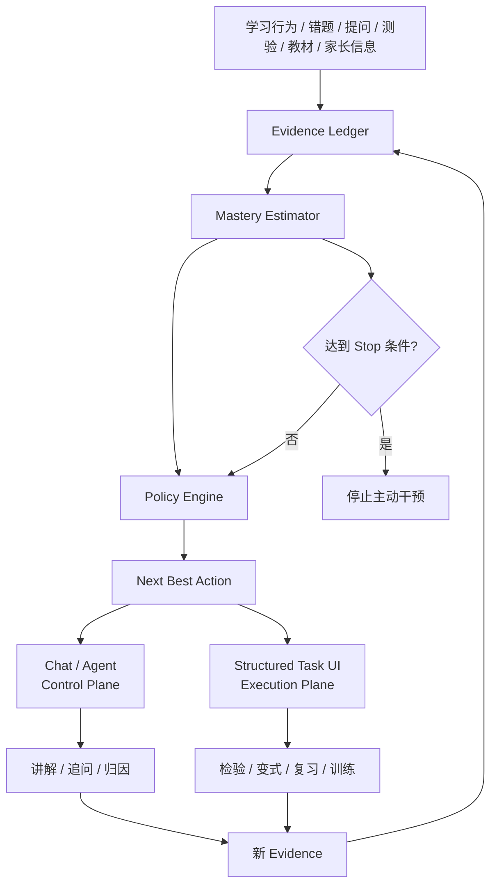
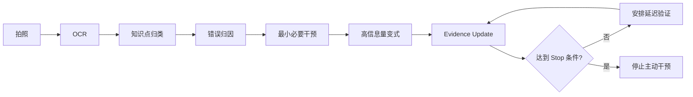

# 产品设计（PRD）：呦鹿智伴 / DeerMind

**文档版本：v3.0**  
**上游文档：`doc/概念产品.md` v0.4.0**  
**文档定位：从产品概念到可开发、可测试、可验收的实现层设计**  
**适用阶段：MVP / 私人学习实验工具**  
**创建日期：2026-08-23**  
**作者：创始人 + 产品顾问**

> 本文档用于指导后续 UI/UX 原型、后端系统设计、数据库设计、Agent/LLM 编排、测试与验收。
>
> **最高优先级不是功能完整，而是验证：**
>
> `Evidence → Mastery → Policy → Action → Verification → Stop`
>
> 是否能够稳定帮助孩子以更少的有效时间达到稳定掌握。

---

# 1. 文档目标与版本继承

## 1.1 文档职责

《概念产品.md》回答“为什么做、核心思想是什么”；本 PRD 回答“具体做什么、如何交互、如何建模、如何开发、如何验收”。

因此本 PRD 以四层组织需求：

1. **领域模型层**：Student / Learning Space / Concept / Curriculum / Evidence。
2. **学习决策层**：Mastery Estimator / Policy Engine / Next Best Action / Stop Policy。
3. **交互实现层**：Chat Control Plane + Structured Task Execution Plane。
4. **运营治理层**：Evidence Debugger / Content / Rules / Data Governance。

## 1.2 冲突处理

若旧版产品设计与 v0.4.0 冲突，以 v0.4.0 为准。特别覆盖以下旧设计：

- UNKNOWN 不等于“已掌握”；
- 掌握度不是简单的离散状态机；
- Evidence Event 是学习事实层；
- LLM 不直接修改掌握状态；
- Policy / Next Best Action 才是行动决策核心；
- Attention Budget 约束 Agent 主动行为；
- Chat 是控制层，复杂任务进入结构化执行界面；
- 掌握即止由 Stop Policy 决定；
- 用户明确删除后数据立即停止业务使用，并按生命周期物理清理；
- 管理后台核心升级为 Evidence Debugger。

> **【补充 v0.4.1 · 契约化】文档分层契约**：PRD 负责**产品行为契约**（产品必须表现出的行为）、教育/内容规则、参数默认值与可验收标准；**算法与机制实现**（Mastery Estimator 的估计公式 estimate/confidence/stability、Evidence 更新函数、信息增益量化度量、阈值校准、数据结构与服务实现）归《系统设计.md》（待产出）。本文档内凡标注【算法留待系统设计】处，PRD 只定行为契约，不实现公式。

---

# 2. 产品定位与设计原则

## 2.1 一句话定义

呦鹿智伴是一款**为女儿量身打造、为减负而生的 AI 数学学习决策助手**：持续采集错题、测验、提问、对话、复习表现等学习证据，估计孩子对知识点的掌握程度与置信度，并决定现在是否需要干预、需要什么干预、做到什么程度可以停止。

## 2.2 产品本质

DeerMind 不是错题本、刷题系统、普通聊天机器人或“AI 家教的聊天包装”。

> **DeerMind 是一个证据驱动、以最小干预为目标的学习决策引擎。**

## 2.3 核心价值

传统学习系统更关心：

> “接下来应该多学什么？”

DeerMind 更关心：

> **“孩子现在还值得花时间学什么？”**

进一步：

> **“为了确认她真的会了，还缺哪一种最有价值的证据？”**

最终：

> **“证据足够后，立即停止。”**

## 2.4 产品愿景

让女儿拥有一位真正“懂她”的 AI 学伴：知道哪里可能不会、知道为什么、知道下一步做什么、知道什么时候够了，更知道什么时候应该闭嘴，把时间还给孩子。

## 2.5 设计红线

### 红线一：减负优先

不以使用时长、题量、会话长度、消息数量、主动触达次数为首要成功标准。

### 红线二：UNKNOWN 不等于掌握

没有证据不代表不会，也不代表会。没有高价值反证时保持静默，不要求孩子证明所有知识点。

### 红线三：掌握必须有证据

任何掌握结论都必须可以回答：

> “为什么系统认为孩子会了？”

### 红线四：LLM 不直接决定学习状态

LLM 负责理解、归因、生成和对话；结构化学习引擎负责 Evidence、Mastery、Policy、Review 与 Stop。

### 红线五：低风险技术优先

优先确定性计算、可解释规则、结构化 Teach-back；不把黑盒评分当作核心教育结论。

### 红线六：家长零强制投入

核心学习闭环不得依赖家长持续录入或每日操作。

### 红线七：孩子不是系统管理员

不能要求孩子为了帮助系统而反复录入、标记或维护学习状态。

---

# 3. 系统总体架构



核心链路：

```text
evidence_event
      ↓
mastery_snapshot
      ↓
learning_action
      ↓
problem_attempt / conversation
      ↓
新的 evidence_event
```

---

# 4. 核心领域模型

## 4.1 核心实体

| 实体 | 层级 | 作用 |
|---|---|---|
| Parent | 家庭 | 家长账号 |
| Student | 用户 | 学生账号 |
| Learning Space | 上下文 | 某学生某一课程/学期的完整学习容器 |
| Concept | 平台资产 | 版本无关知识点本体 |
| Curriculum | 平台资产 | 教材/课程组织方式 |
| Concept-Curriculum Mapping | 平台资产 | 教材节点 ↔ 知识点 |
| Evidence Event | 事实 | 一次学习证据 |
| Mastery Snapshot | 状态 | 当前掌握估计快照 |
| Learning Action | 决策 | 系统采取或计划采取的行动 |
| Problem | 内容资产 | 题目 |
| Problem Attempt | 学习记录 | 一次作答事实 |
| Review Schedule | 计划 | 延迟复习计划 |
| Conversation | 对话 | Chat 会话 |
| Memory | 记忆 | 偏好/稳定事实 |
| Parent Note | 背景 | 家长可选输入 |

## 4.2 数据边界

### 原始事实按学习空间隔离

- 会话；
- 错题；
- 作答；
- 进度；
- 空间教材；
- 家长材料。

### 派生认知按学生共享

- 掌握估计；
- Evidence 汇总；
- 学生级 Memory；
- 综合画像。

> **原始数据隔离 ≠ 派生认知隔离。**

---

# 5. Evidence Ledger：学习证据账本

## 5.1 产品定位

Evidence Ledger 是 DeerMind 的**事实层**。

它回答：

> “到底发生了什么？”

而不是：

> “系统认为孩子怎么样？”

## 5.2 MVP Event 类型

| Event | 含义 |
|---|---|
| `QuestionAsked` | 孩子主动提问 |
| `ProblemPresented` | 系统提供题目 |
| `ProblemAnswered` | 孩子作答 |
| `ProblemPassed` | 结构化判定通过 |
| `ProblemFailed` | 结构化判定失败 |
| `ErrorDetected` | 发现错误 |
| `ReasonAttributed` | 归因完成 |
| `HintUsed` | 使用提示 |
| `VariationPassed` | 变式通过 |
| `VariationFailed` | 变式失败 |
| `DelayedRecallPassed` | 延迟检索通过 |
| `DelayedRecallFailed` | 延迟检索失败 |
| `TeachBackCompleted` | Teach-back 完成 |
| `TeachBackGapDetected` | Teach-back 发现缺口 |
| `ReviewPassed` | 间隔复习通过 |
| `ReviewFailed` | 间隔复习失败 |
| `ParentSignalAdded` | 家长新增背景信号 |
| `LearningActionStarted` | 一次行动开始 |
| `LearningActionCompleted` | 一次行动完成 |
| `StopTriggered` | Stop Policy 触发 |
| `MasterySnapshotCreated` | 生成掌握快照 |

## 5.3 Event 最小结构

```json
{
  "id": "evt_xxx",
  "student_id": "stu_xxx",
  "space_id": "space_xxx",
  "concept_id": "kp_xxx",
  "event_type": "VariationPassed",
  "source": "student_app",
  "session_id": "sess_xxx",
  "action_id": "act_xxx",
  "payload": {},
  "evidence_strength": 0.70,
  "occurred_at": "2026-08-23T15:00:00+08:00"
}
```

`evidence_strength` 表示“该证据的信息价值”，不是孩子的掌握度。

## 5.4 Event 规则

1. Evidence 追加写入，不覆盖历史事实。
2. 技术纠错通过补偿事件或校正记录完成。
3. 每个重要 Evidence 都可追溯到原始来源。
4. 掌握状态变化必须关联 Evidence。
5. Evidence 不直接等同于学习结论。

> **【补充 v0.4.1 · 契约化】Evidence 产品规则**
> - 反证语义：`ProblemFailed / VariationFailed / ReviewFailed` 为反证事件；**单次错误不直接降级掌握**，须结合归因（`ReasonAttributed`）与近期证据整体判断（具体更新函数见系统设计）。
> - 证据强度：独立完成 > 使用提示后完成（`HintUsed` 降低该条证据强度）；"孩子自己说会了"为弱证据，不单独触发掌握判定。
> - 技术纠错：OCR 错、归因错等系统错误通过补偿/校正记录修正，**不改写历史 Evidence**（遵守追加写入原则）。
> - 验收契约：① 每个重要学习行为必须产生一条 Evidence；② 每条 Evidence 可溯源到原始来源；③ 无 Evidence 不得改变掌握结论。
> - 【算法留待系统设计】evidence_strength → estimate/confidence/stability 的合成与更新函数。

---

# 6. Mastery Estimator：掌握度估计器

## 6.1 定义

> **掌握度是系统根据当前证据，对孩子在独立、迁移和延迟条件下能够正确调用该知识的概率估计。**

不是客观真值。

## 6.2 核心属性

```text
mastery_estimate
confidence
stability
last_positive_evidence_at
last_negative_evidence_at
evidence_count
next_review_at
status
```

## 6.3 证据权重原则

| 证据 | 默认信息价值 |
|---|---:|
| “我会了” | 低 |
| 单道题正确 | 低～中 |
| 独立变式正确 | 中 |
| 跨题型迁移成功 | 中～高 |
| 延迟独立检索成功 | 高 |
| 多次间隔成功 | 很高 |
| 一次错误 | 高价值反证，但必须结合归因 |

> 系统不怀疑孩子，但也不把任何单一输入视为充分证据。

## 6.4 对外状态

```text
UNKNOWN
LEARNING
SHORT_TERM_MASTERED
STABLE_MASTERED
```

### UNKNOWN

证据不足。默认：

- 不自动干预；
- 不进入今日任务；
- 不主动提醒；
- 等待高价值反证。

### LEARNING

出现明确学习需求或反证，需要干预。

### SHORT_TERM_MASTERED

即时理解和变式已通过，但长期稳定性证据不足。

### STABLE_MASTERED

已获得足够的延迟、独立、迁移证据，系统允许停止主动干预。

## 6.5 进入追踪的触发条件

- 错题；
- 摸底失败；
- 检验失败；
- 主动求助；
- 前置依赖薄弱；
- 高可靠家长信号。

## 6.6 Stable Mastered MVP 判定

```text
即时变式成功
+
至少一次延迟独立检索成功
+
至少一次高价值迁移成功
+
近期无强反证
```

具体阈值通过真实使用数据校准，不在 MVP 中固化成不可调常数。

## 6.7 False Stop

Stable Mastered 后仍允许被强证据推翻：

```text
STABLE_MASTERED
      ↓
高价值延迟迁移失败
      ↓
Strong Negative Evidence
      ↓
LEARNING
```

> **【补充 v0.4.1 · 契约化】Mastery Estimator 行为契约**
> - 单次做对不得直接进入 SHORT_TERM_MASTERED；单次做错不得直接回退全部进度。
> - 可解释性：系统必须能对任意一次状态变化回答"由哪些 Evidence 触发、证据强度、为何这样判定"。
> - 对外只暴露四态（UNKNOWN / LEARNING / SHORT_TERM_MASTERED / STABLE_MASTERED）；**学生端不暴露 estimate/confidence/stability 数值**。
> - 学生端状态展示：仅轻量展示"学习中 / 短期已会（待验证）/ 已稳定掌握"；UNKNOWN 不展示、不推送。
> - 【算法留待系统设计】estimate/confidence/stability 的具体计算公式、权重合成与阈值校准流程。

---

# 7. Policy Engine 与 Next Best Action

## 7.1 Action 集合

```text
DO_NOTHING
OBSERVE
ASK
EXPLAIN
PRACTICE
VERIFY
REVIEW
TEACH_BACK
READ_TRAINING
END_SESSION
```

## 7.2 决策顺序

```text
1. 是否存在安全/范围硬约束？
2. 是否存在明确高价值学习目标？
3. 当前证据是否已足够？
4. 还缺哪类证据？
5. 哪个动作能最低成本获得该证据？
6. Attention Budget 是否允许？
7. 无高价值动作 → DO_NOTHING / END_SESSION
```

## 7.3 信息增益原则

每次行动必须尽量回答一个明确问题：

- 她是不是真的懂？
- 她只会原题还是会变式？
- 是概念问题还是审题问题？
- 现在会还是延迟后仍会？
- 还缺什么证据？

题目价值不是“难度”，而是：

> **能否显著减少系统的不确定性。**

---

# 8. Stop Policy 与 Attention Budget

## 8.1 Stop Policy

核心判断：

```text
继续学习的预期收益
        <
继续占用时间与注意力的成本
        ↓
STOP
```

## 8.2 Stop 条件

任一满足即可考虑结束：

1. 已达到 STABLE_MASTERED；
2. 当前没有明显高价值知识缺口；
3. 下一动作信息增益过低；
4. 孩子明确要求结束；
5. 当前疲劳信号明显；
6. Attention Budget 已消耗；
7. 当日目标已完成且边际收益过低。

## 8.3 Attention Budget

MVP 配置：

```text
daily_proactive_action_limit
concept_proactive_reminder_limit
same_day_reengagement_limit
quiet_hours
child_ended_cooldown
```

原则：

- 每日主动触达有上限；
- 同一知识点短期不重复提醒；
- 孩子明确结束后进入冷却期；
- STABLE_MASTERED 默认静默；
- 无高价值动作就不说话。

> **AI 的安静也是一种成功。**

> **【补充 v0.4.1 · 契约化】Attention Budget MVP 默认值（产品参数）**
> | 配置键 | MVP 默认值 | 说明 |
> |---|---|---|
> | `daily_proactive_action_limit` | 3 次/日 | 全局每日主动干预上限 |
> | `concept_proactive_reminder_limit` | 1 次/知识点/日 | 同一知识点不重复提醒 |
> | `same_day_reengagement_limit` | 1 次/日 | 孩子主动结束后当日最多再打扰 1 次 |
> | `quiet_hours` | 21:00–次日 07:00 | 安静时段不主动打扰 |
> | `child_ended_cooldown` | 当日不再主动 | 孩子明确结束后进入冷却期 |
> - **Stop 行为契约**：触发 Stop 后 ① 不再出题/练习；② 明确告知"这个已经会了，不用再花时间"或"今天没有需要你继续处理的数学问题"；③ STABLE_MASTERED 默认静默，除非强反证推翻（§6.7）。
> - 以上默认值可在管理后台按真实使用数据调整。
> - 【算法留待系统设计】信息增益的量化度量、"预期收益 vs 成本"的具体计算与阈值。

---

# 9. Chat Control Plane / Structured Execution Plane

## 9.1 Chat 的职责

Chat 是孩子与学习引擎的自然语言控制层，负责：

- 意图理解；
- 提问；
- 讲解；
- 追问；
- 技能启动；
- 状态反馈。

## 9.2 Structured UI 的职责

复杂任务进入结构化 UI：

- 多步数学题；
- OCR 确认；
- 选择/判断/填空；
- 变式验证；
- 复习队列；
- 读题圈选；
- Teach-back 要点核对。

## 9.3 标准链路

```text
Chat
 ↓
Intent Router
 ↓
Skill / Action
 ↓
Policy Check
 ↓
Structured UI / Chat
 ↓
Evidence Event
 ↓
Mastery Update
```

---

# 10. 学习技能

## 10.1 P0

| 技能 | 优先级 | 说明 |
|---|---:|---|
| 讲题 | P0 | 错题/求助后的最小干预 |
| 错题归因 | P0 | 找到下一步教学动作 |
| 变式验证 | P0 | 验证迁移 |
| 间隔复习 | P0 | 验证延迟保持 |
| 掌握/停止决策 | P0 | 系统核心 |

## 10.2 P1

| 技能 | 优先级 |
|---|---:|
| 讲知识点 | P1 |
| 检验 | P1 |
| 知识点复习 | P1 |
| 读题训练 | P1 |
| Teach-back | P1 |
| Agent 主动提醒 | P1 |

> **【补充 v0.4.1 · 契约化】技能 ↔ 意图 ↔ 页面 ↔ Action 总映射**
> | 技能 | 典型意图（Chat） | 执行形态 | 对应页面/卡片 | 主要 Action |
> |---|---|---|---|---|
> | 讲题 | "这题不会 / 帮我看看" | 重流程 | P-C3 讲题 | EXPLAIN → PRACTICE → VERIFY |
> | 错题归因 | "我为什么错" / 拍题 | 重流程 | P-C3（归因步） | ASK → 归因 → EXPLAIN |
> | 变式验证 | "再来一道" | 重流程 | P-C3（变式步） | PRACTICE / VERIFY |
> | 间隔复习 | 到期提醒 / "复习" | 结构化 | P-C5 复习 | REVIEW |
> | 检验 | "考考我" | 结构化 | P-C4 检验 | VERIFY |
> | 讲知识点 | "讲讲分数乘法" | Chat 卡片 | Chat 讲解卡 | EXPLAIN |
> | 读题训练 | "应用题读不懂" | 重流程 | P-C6 读题 | READ_TRAINING |
> | Teach-back | 系统触发 / 孩子愿意 | 结构化 | P-C7 Teach-back | TEACH_BACK |
> | 掌握/规划查询 | "今天学什么 / 我哪里弱" | Chat 卡片 | Chat 今日卡 | OBSERVE / DO_NOTHING |
> 说明：Chat 负责意图与引导（Control Plane），复杂执行进入结构化页（Execution Plane），两者共用同一套 Action 语义。

---

# 11. 错题闭环



## 11.1 归因标签

```text
概念不清
审题失误
数量关系不清
思路混乱
计算错误
表达错误
迁移失败
```

## 11.2 归因决策树

### Q1：知道考什么吗？

“这道题你觉得考的是什么？当时怎么想的？”

无法回答 → 概念/数量关系问题。

### Q2：能复述条件与问题吗？

无法复述 → 审题问题。

### Q3：换场景或数字还能做吗？

可以 → 多为程序性/计算性问题；不可以 → 思路或迁移问题。

归因默认 2–3 问，不追求一次绝对准确；后续 Evidence 可以修正。

---

# 12. 变式验证

## 12.1 设计目标

验证孩子是否掌握了核心结构，而不是记住原题。

## 12.2 约束

```text
核心知识点不变
解题逻辑不变
难度相近
至少改变两项：情境 / 数字 / 表述
```

## 12.3 自检

1. 是否仍考同一知识点；
2. 解题逻辑是否一致；
3. 难度是否相当；
4. 是否有两个以上表面变化；
5. 答案是否唯一；
6. 答案是否可确定性验证。

失败后最多重生成 2 次，仍失败则使用预置变式。

> **【补充 v0.4.1 · 契约化】迁移题型定义（产品/内容规则）**
> - **变式题（即时迁移）**：同知识点、换情境/数字/表述（§12 约束），产生 `VariationPassed` 即时迁移证据。
> - **迁移题（高价值迁移）**：同一核心能力在**不同情境/题型**中的应用（如"纯计算"→"应用题/实际问题"，或跨具体场景），产生"高价值迁移"证据，是 SHORT_TERM → STABLE 的关键证据之一。
> - **判定标准**：核心结构/解题逻辑不变 + 情境或题型显著不同 + 不提示为同题；MVP 由人工题库为题目打"迁移类型"标签（后台可维护）。
> - 【算法留待系统设计】迁移题的自动生成与相似度判定（MVP 不要求自动生成，人工预置即可）。

---

# 13. 间隔复习

## 13.1 MVP

默认：

```text
1 天 → 3 天 → 7 天 → 14 天
```

这只是 MVP 策略，不视为固定教育真理。

## 13.2 动态化方向

未来结合：

- 掌握估计；
- 稳定性；
- 历史失败；
- 迁移表现；
- 上次复习表现；
- 最近时间间隔。

目标：选择“最值得验证”的时间，而不是机械遵守固定周期。

---

# 14. Teach-back / 结构化自述

## 14.1 定位

> **Retrieval + Self-explanation + Teach-back 验证机制。**

不是对所有知识点强制使用。

## 14.2 使用条件

优先：

- 核心知识点；
- 前置关键知识点；
- 多次错误概念；
- 置信度不足。

## 14.3 执行

```text
孩子讲述
 ↓
结构化拆解
 ↓
要点核对
 ↓
缺失项
 ↓
局部追问
 ↓
Evidence Update
```

禁止直接让 LLM 输出“理解深度 8.5/10”作为掌握结论。

---

# 15. 数学答案可靠性

LLM 不独自决定数学是否正确。

```text
LLM 生成
  ↓
数值 / 符号验证
  ↓
教材范围验证
  ↓
适龄表达检查
  ↓
输出
```

优先验证：

- 四则运算；
- 分数；
- 方程；
- 几何；
- 多步推导；
- 变式答案。

---

# 16. 学习空间与课程模型

## 16.1 Learning Space

学习空间是完整学习上下文容器，包括：

- 学生；
- 学期/任务；
- 教材；
- Concept Set；
- 前置依赖；
- 进度；
- Evidence；
- 掌握估计；
- 会话；
- 错题；
- 复习；
- 家长材料。

## 16.2 Concept 与 Curriculum 解耦

```text
Canonical Concept
      │
      ├── Curriculum A
      ├── Curriculum B
      └── Other Materials
```

Concept 回答：

> “这个概念本身是什么？”

Curriculum 回答：

> “当前课程怎么教、在哪一章节出现？”

## 16.3 Knowledge Set

空间绑定教材后：

```text
教材
 ↓
Mapping
 ↓
Concept Set
```

得到本空间“能教什么”的范围护栏。

> Concept Set 不是“必须验证的全部知识点清单”。

---

# 17. 前置依赖知识图谱

MVP 只维护六年级数学当前核心章节的关键依赖。

例如：

```text
分数乘法
  ↑
分数意义
  ↑
整数乘法
```

发现目标知识点薄弱时：

```text
目标薄弱
 ↓
查 prerequisite
 ↓
前置是否有强反证？
 ↓
是 → 先补前置
否 → 处理目标
```

知识点粒度标准：必须能独立诊断、独立干预、独立验证，并能产生稳定 Evidence。

---

# 18. Memory 与 Learning State

## 18.1 Memory

记录：

- 偏好；
- 稳定事实；
- 表达习惯；
- 长期交互特征。

## 18.2 Learning State

记录：

- 掌握估计；
- Evidence；
- 错误历史；
- 复习状态；
- 知识点关系。

二者必须分离。Learning State 不依赖普通 LLM Memory 作为唯一真相来源。

## 18.3 Memory Scope

### Student Scope

跨空间共享的稳定偏好、习惯与特征。

### Space Scope

仅属于某一学习空间的上下文信息。

## 18.4 删除

用户明确删除后：

1. 立即从业务查询中消失；
2. 立即停止进入模型上下文；
3. 立即停止用于训练、挖掘、诊断；
4. 进入删除队列；
5. 按保留周期物理清理；
6. 备份按生命周期淘汰。

保留的是删除操作的审计记录，而不是继续业务使用已删除数据。

---

# 19. 账号与权限

## 19.1 层级

```text
Parent
  ↓ 1:N
Student
  ↓ 1:N
Learning Space
```

## 19.2 三端

- `app_student`：Flutter，Pad 优先；
- `app_parent`：Flutter，手机优先；
- `admin_web`：Vue3 + Vite，PC Web。

## 19.3 权限矩阵

| 数据域 | 学生端 | 家长端 | 管理员端 |
|---|---|---|---|
| 学习空间 | 使用 | 创建/编辑 | 查看/治理 |
| Conversation | 自己可见 | 受开关限制 | 调试 |
| Evidence | 不直接展示底层 | 查看摘要 | 全量 |
| Mastery | 不展示复杂模型 | 简化结果 | 全量 |
| Memory | 不可见 | 不可见 | 治理 |
| Parent Note | 不可见 | 写入 | 查看 |
| 学生账号 | 不管理 | 全权 | 只读/协助 |
| 规则 | 不可见 | 不可见 | 配置 |
| 成本 | 不可见 | 不可见 | 可见 |

---

# 20. 学生端产品设计

## 20.1 信息架构

学生端是**以小鹿对话为核心的个人学习空间**。Chat 是主交互方式（Learning Control Plane），但不是唯一的信息组织方式——信息组织由四个一级入口承担（Learning Information Plane）：

```text
登录
 ↓
Student Workspace（移动端底部 Tab / 平板桌面左 Rail）
 ├── 今日      今天最值得做什么 → 决策卡 + 对话
 ├── 错题      我哪里错过     → 错题 + 处理状态
 ├── 学习      我学到哪里     → 教材 + 大纲 + 进度 + 掌握
 └── 记录      我最近做了什么 → 每日记录 + 完整对话 + 我的学习

全屏重流程
 ├── 拍题/OCR
 ├── 讲题
 ├── 检验
 ├── 变式
 ├── 复习
 ├── 读题
 └── Teach-back
```

- 顶部常驻：学习空间切换器 + 设置入口（不占一级 Tab）。
- 小鹿 Agent 不是独立页面，而是贯穿所有页面的角色：结构化页面用于"查看与复习"，学习动作仍由对话 / Agent 驱动（**结构化内容 → Chat**）。
- 导航形态响应式：移动端底部 Tab，平板 / 桌面左侧 Rail。

## 20.2 P-C0 登录

- 用户名 + 密码；
- 记住登录态；
- 错误提示；
- 登出；
- 不绑定设备；
- 家长负责创建与重置密码。

验收：正确登录、错误拒绝、登录态恢复、多设备同档案。

## 20.3 P-C1 首页

### 布局

```text
顶部：今日学习决策
主体：大对话区
底部：语音、文字、快捷动作
```

### 今日卡只展示

- 当前真正值得做的动作；
- 必要的复习；
- 已无高价值任务时的结束提示。

### 不展示

- 复杂掌握图；
- 排行榜；
- 积分；
- 任务完成率；
- 打卡进度。

## 20.4 P-C2 拍题/OCR

```text
拍照 → 裁剪 → OCR → 快速确认 → Concept 归类 → 归因
```

OCR 低置信度必须允许手工修正。

## 20.5 P-C3 讲题

```text
求助/错题
→ 归因
→ 最小讲解
→ 高信息量练习
→ 变式
→ Evidence
→ Stop / Review
```

不再固定“3–5 道题后才能停止”。题量由 Policy Engine 决定。

## 20.6 P-C4 检验

- 结构化题目；
- 从较少题量开始；
- 证据足够可提前停止；
- 不足时再追加最有价值的一题。

## 20.7 P-C5 复习

```text
到期
→ 是否值得提醒
→ Review
→ Evidence
→ Keep / Regress / Stop
```

## 20.8 P-C6 读题训练

```text
圈关键信息
→ 复述
→ 数量关系
→ 重做
```

只在 Evidence 显示存在读题类问题时启动。

## 20.9 P-C7 Teach-back

```text
提示
→ 孩子愿意讲
→ 分步表达
→ 要点核对
→ 缺口处理
→ Evidence
```

不愿讲时允许直接改用客观检验。

> **【补充 v0.4.1 · 契约化】学生端展示与停止提示**
> - 今日决策卡只展示"当前值得做的动作 / 必要复习 / 已无高价值任务的结束提示"，不展示掌握数值、置信度、证据明细（与 §6 行为契约一致）。
> - 停止提示文案（产品契约）：达成 Stop 时明确告知"这个已经会了，不用再花时间练"或"今天没有需要你继续处理的数学问题，可以去玩啦"。
> - UNKNOWN 知识点在学生端不展示、不推送、不进今日卡（等反证触发）。

## 20.10 学习空间切换

孩子可能拥有多个学习空间（如"学校·六上数学""辅导班·思维拓展"）。顶部常驻空间切换器：

- 展示当前空间名；点击展开空间列表，选择后切换。
- 切换影响范围（按空间隔离）：学习页的教材 / 大纲 / 进度、错题集范围。
- 切换不影响范围（按学生共享）：掌握度（四态）与今日决策。

> 原始事实按学习空间隔离、派生认知按学生共享（见 §4.2）。

## 20.11 错题本（我的错题）

错题是孩子的"问题资产"，应是一级能力，而不是从对话里翻出来。

数据来源（自动入账，不要求孩子维护）：

- 拍照上传（P-C2）确认的题；
- 学习过程中做错的题（检验 / 练习 / 变式 / 迁移 / 复习失败，带归因）。

展示（我的错题）：

- 分类：全部 / 待处理 / 复习中 / 已掌握；
- 每题：题目 → 为什么错（归因）→ 现在掌握情况 → 是否需要行动。

重做闭环：

```text
重做通过 → 标记"已掌握" → 正证据入账
重做未过 → 保持待处理 → 讲解 / 复习
```

> 错题与知识点是两个层次：**错题是证据的原始对象，知识点是学习决策的抽象对象**。多道错题可收敛为一个核心问题（如 8 道分数乘法题 → 迁移能力不足）。MVP 先做"题级列表 + 关联知识点"，不做复杂聚合。

## 20.12 学习（教材 / 大纲 / 进度 / 掌握）

回答"我学到哪里、这些知识点怎么样"。

- **教材**：当前空间的教材章节结构（来自空间绑定教材的映射，见 §16）。
- **大纲**：章 → 节 → 知识点树；当前节高亮"学到第 X 单元 · 第 X 节"。
- **掌握**：知识点只展示四态徽章（未接触静默 / 学习中 / 短期掌握 / 稳定掌握），不展示任何数值。
- **内容可查阅**：点击知识点 → 查看教材内容摘要与"我的掌握" → "让小鹿讲讲" 进入 Chat。

> **进度与掌握是两个维度，必须视觉分开：**
> - 进度（Curriculum）：课本到哪了；
> - 掌握（Mastery）：你会不会。
> 未发生反证 ≠ 不会（UNKNOWN 默认静默）。

## 20.13 记录与自我认知

回答"我最近做了什么、我变成什么样"。

### 每日学习记录（结构化总结，非聊天复制）

Chat 是原始学习过程；每日学习记录是对这一天的结构化总结：

- 今天学了什么；
- 完成了什么（N 次复习 / N 次变式 / …）；
- 掌握变化；
- 小鹿为什么让你停止（Stop 原因）；
- 今天用了多久。

### 完整对话

按自然日组织（今天 / 昨天 / 更早），用于追溯原始过程；与"每日学习记录"分开——**记录负责理解，对话负责追溯**。

### 我的学习（定性自我认知）

只展示对孩子有意义的信息：

- 最近在学什么；
- 我比较拿手（已稳定掌握）；
- 正在变强（学习中 / 短期掌握）；
- 今天学了多久、解决过多少问题、稳定掌握几个知识点。

> 孩子需要认识自己，但不需要看到系统的精度：
> - 只露四态与定性描述，不展示 estimate/confidence/stability 数值、不画掌握条或雷达图；
> - 不展示完成率、打卡、连续天数、积分、排行榜（与 §20.3、§6.7 一致）。

> **【补充 v0.4.2 · Student IA】学生端信息面契约**
> - 学生端 IA = 今日 / 错题 / 学习 / 记录 四个一级入口；Chat 是主交互，不再承担全部信息组织。
> - 今日决策是结构化对象：在页面展示，不重复推入对话（除非孩子显式询问"今天学什么"）。
> - 错题自动入账、不要求孩子维护；错题=证据原始对象，知识点=决策抽象对象。
> - 学习页 Curriculum 与 Mastery 视觉分离；"未发生反证≠不会"。
> - 记录页"每日学习记录"与"完整对话"分离；"我的学习"只做定性表达。
> - 学习空间切换只影响教材 / 进度 / 错题范围，不影响掌握度（全局共享）。
> - 上述页面均不展示数值、完成率、打卡、积分、排行（与 §6.7、§20.3 一致）。
> - 【算法留待系统设计】错题聚合（多题 → 核心问题）、"今日最值得做"的 Next Best Action 计算。

---

# 21. 学生端 Chat 与 Agent

## 21.1 意图

建议 MVP 支持：

- 讲知识点；
- 讲题；
- 错题归因；
- 复习；
- 检验；
- 读题训练；
- Teach-back；
- 掌握/规划查询；
- 其他/闲聊。

## 21.2 闲聊边界

友好回应、简单拉回，不长时间扩展无关话题。

## 21.3 主动 Agent

每次主动行为必须经过：

```text
Trigger
 ↓
Policy
 ↓
Attention Budget
 ↓
Action Value
 ↓
是否值得打扰
```

允许主动：

- 到期复习；
- 高价值薄弱提示；
- 告知已掌握；
- 建议结束。

禁止为维持活跃而主动。

---

# 22. 会话恢复与防沉迷

## 22.1 会话恢复

- 轻技能可重启；
- 重流程保留 step；
- 插入新问题先处理；
- 处理完只询问一次是否继续原任务；
- 明确结束立即停止。

## 22.2 防沉迷

MVP：**只记录时长，不强制打断。**

记录：

- session minutes；
- daily minutes；
- weekly minutes。

不做锁定或强制休息。

---

# 23. 家长端产品设计

## 23.1 核心原则

> **默认零操作，可选增强。**

## 23.2 IA

```text
登录/注册

首页
 ├── 今日摘要
 ├── 周报
 └── 告警

学生
 ├── 学生账号
 └── 学生详情

空间
 ├── 学生选择
 ├── 空间列表
 └── 空间配置

设置
 ├── 功能开关
 ├── 数据导出
 └── 数据删除
```

## 23.3 日报

核心问题：

> “今天真正解决了什么？”

展示：

- 今日重点；
- 掌握变化摘要；
- Stable Mastered 数量；
- 重要异常；
- 本周使用时间。

## 23.4 周报

核心问题：

> “本周学习是否更高效？”

展示：

- 稳定掌握变化；
- 7/14/30 日保持情况；
- 薄弱点变化；
- Time-to-Stable-Mastery；
- 主要错误类型；
- 主动干预次数；
- Quiet Success；
- 主观负担反馈。

## 23.5 告警

仅用于高价值事件：

- 连续失败；
- 长时间无法稳定掌握；
- 强冲突证据；
- 疑似 False Stop；
- 系统异常。

## 23.6 学生账号

家长可：创建、改名、重置密码、换头像、删除。

## 23.7 学习空间

创建顺序：

```text
选择学生
→ 创建空间
→ 绑定教材
→ 确认学期/进度
→ 学生端独立运行
```

---

# 24. 管理员后台：Evidence Debugger

## 24.1 定位

管理员后台首先是开发、调试与治理工具，不只是运营看板。

核心问题：

> **“为什么系统会这样判断？”**

## 24.2 IA

```text
登录
 ↓
Dashboard
 ├── Evidence Debugger
 ├── Learning Decisions
 ├── 内容管理
 │   ├── Concept
 │   ├── Curriculum
 │   ├── Mapping
 │   ├── Problem
 │   └── Teach-back Checklist
 ├── 规则配置
 │   ├── Evidence Weight
 │   ├── Mastery Threshold
 │   ├── Stop Policy
 │   ├── Review Policy
 │   └── Attention Budget
 ├── 数据治理
 ├── 成本监控
 └── 操作日志
```

## 24.3 Evidence Debugger 页面

知识点详情必须展示：

- 当前状态；
- mastery estimate；
- confidence；
- stability；
- Evidence Timeline；
- 最近 Learning Action；
- Next Best Action；
- Stop 判断；
- Rule Version；
- Prompt Version。

## 24.4 Learning Decision Debugger

记录：

```text
当前状态
候选 Actions
各 Action 价值
Attention Budget
最终 Action
选择理由
Policy Version
```

## 24.5 内容管理

- Concept；
- Curriculum；
- Mapping；
- Problem；
- Variant Template；
- Teach-back Checklist。

## 24.6 规则配置

支持：

```text
draft → preview → publish → active → rollback
```

配置包括：

- Evidence Weight；
- Mastery Threshold；
- Stop Policy；
- Review Strategy；
- Attribution Decision Tree；
- Variant Self-check；
- Attention Budget；
- Alert Threshold；
- Prompt Version。

## 24.7 数据治理

允许修正：

- OCR；
- 系统归因；
- 学习状态计算；
- Learning Action；
- 违规生成内容。

不修改孩子实际作答事实。

任何修正必须审计。

---

# 25. 数据模型

## 25.1 账号

```text
parent
student
login_session
```

## 25.2 学习上下文

```text
learning_space
space_curriculum
space_progress
```

## 25.3 内容资产

```text
concept
curriculum
concept_curriculum_mapping
problem
teachback_checklist
```

## 25.4 学习事实

```text
conversation
chat_message
problem_attempt
evidence_event
```

## 25.5 学习决策

```text
mastery_snapshot
learning_action
review_schedule
```

## 25.6 记忆与报告

```text
memory
parent_note
daily_summary
weekly_report
usage_stat
```

## 25.7 系统

```text
sys_config
prompt_version
operation_log
admin_user
```

---

# 26. 核心字段建议

## 26.1 `evidence_event`

```text
id
student_id
space_id
concept_id
event_type
source
session_id
action_id
problem_id
attempt_id
payload_json
evidence_strength
occurred_at
created_at
```

## 26.2 `mastery_snapshot`

```text
id
student_id
concept_id
mastery_estimate
confidence
stability
status
evidence_count
last_positive_evidence_at
last_negative_evidence_at
next_review_at
created_at
```

## 26.3 `learning_action`

```text
id
student_id
space_id
concept_id
action_type
reason_code
candidate_actions_json
selected_reason
policy_version
attention_budget_snapshot
status
started_at
completed_at
```

## 26.4 `problem_attempt`

```text
id
problem_id
student_id
concept_id
session_id
action_id
answer
is_correct
hint_count
attempt_duration_ms
result_payload
created_at
```

---

# 27. API / 服务边界

按领域而不是按页面拆服务：

```text
Auth Service
Curriculum Service
Learning Space Service
Evidence Service
Mastery Service
Policy Service
Action Service
Conversation Service
Problem Service
Review Service
Memory Service
Reporting Service
Admin Service
Cost Service
```

核心接口方向：

```text
POST /evidence
GET  /mastery/{concept}
POST /learning-actions
POST /problem-attempts
POST /conversations
POST /reviews
```

核心约束：

> 页面层不能绕过 Evidence Service / Mastery Service / Policy Service 直接修改学习状态。

---

# 28. LLM 编排边界

## 28.1 LLM 负责

- Intent Routing；
- 问题理解；
- 归因辅助；
- 讲解生成；
- 追问生成；
- 变式草稿；
- 对话组织；
- 报告措辞。

## 28.2 Deterministic Engine 负责

- Evidence 写入；
- Evidence 权重；
- Mastery Update；
- Review Schedule；
- Stop；
- Attention Budget；
- 数学答案验证；
- 权限与数据生命周期。

原则：

> **LLM 负责理解和表达；结构化引擎负责事实、状态与决策。**

---

# 29. RAG 与知识库

## 29.1 MVP 不引入向量数据库

采用：

```text
Intent
 ↓
Concept ID
 ↓
Concept Anchor
 ↓
教材片段
 ↓
BM25 兜底
 ↓
LLM 生成
```

## 29.2 教材 chunk 元数据

```text
curriculum_id
concept_id
chapter
section
page
title
text
```

## 29.3 范围验证

生成内容必须验证：

- Concept 是否在 Learning Space Concept Set；
- 教材来源是否匹配；
- 超进度是否进行软提醒。

---

# 30. 非功能需求

## 30.1 性能基线

| 场景 | 目标 |
|---|---:|
| Chat 首字 | ≤ 3s |
| Intent Router | ≤ 500ms |
| OCR | ≤ 3s |
| 结构化判定 | ≤ 2s |
| 讲解首字 | ≤ 5s |
| 变式生成+验证 | ≤ 8s |
| TTS 首段 | ≤ 3s |

## 30.2 成本

- DeepSeek 优先；
- OCR/ASR/TTS 按量付费；
- 缓存与规则优先；
- 月度预算；
- 超限熔断；
- 熔断后优先降级为文字。

## 30.3 安全

- HTTPS/TLS；
- 强密码哈希；
- 登录失败限速；
- 管理员强密码；
- 操作日志；
- 最小化收集；
- 数据导出；
- 数据删除；
- 学生数据与家长输入隔离。

---

# 31. 核心用户旅程

## J1 冷启动

```text
学生登录
→ 学习空间已配置
→ AI 欢迎
→ 可选摸底
→ 只寻找高价值反证
→ 建立首批 Evidence
```

摸底不是全面考试，而是低成本暴露薄弱点。

## J2 主动求助

```text
“我不会分数乘法”
→ Intent
→ Concept
→ Policy
→ Explain
→ Verify
→ Evidence
→ Stop / Review
```

## J3 错题

```text
拍题
→ OCR
→ Concept
→ Attribution
→ 最小干预
→ Variation
→ Evidence
→ Delayed Review
→ Stable Mastered
→ Stop
```

## J4 复习

```text
到期
→ 判断是否值得提醒
→ Review
→ Evidence
→ 保持 / 回退 / Stop
```

## J5 没有任务

```text
Policy
→ 没有高价值动作
→ DO_NOTHING
```

首页可显示：

> “今天没有需要你继续处理的数学问题，可以去玩啦。”

## J6 家长查看

```text
打开家长端
→ 今日摘要
→ 看真正解决了什么
→ 退出
```

## J7 管理员调试

```text
发现异常
→ Evidence Debugger
→ Evidence Timeline
→ Decision Timeline
→ Rule/Prompt
→ 修正
→ 审计
```

---

# 32. 指标体系

## 32.1 Learning Quality

### Stable Mastery Rate

达到 STABLE_MASTERED 后后续验证仍正确的比例。

### Retention Rate

7/14/30 天后独立检索通过率。

### Recurrence Rate

稳定掌握后再次出现强反证的比例。

## 32.2 Efficiency

### Time-to-Stable-Mastery

从首次发现薄弱到 Stable Mastered 的有效学习时间。

### Evidence-to-Mastery

达到稳定掌握所需 Evidence 数量。

### Intervention Efficiency

每次干预产生的有效掌握提升或信息增益。

## 32.3 Burden

记录：

- 总学习时间；
- 题目数量；
- 对话轮数；
- 主动提醒数量；
- 主观负担。

## 32.4 Agent Quality

### False Intervention

本不需要干预，却被主动打扰的比例。

### False Stop

过早停止，之后很快出现强反证的比例。

### Action Precision

Next Best Action 被验证为值得执行的比例。

### Quiet Success

没有额外干预但状态稳定的比例。

---

# 33. 非核心 KPI

以下只观察，不作为成功指标：

- DAU；
- 使用时长；
- 会话长度；
- 消息数量；
- 每日题量；
- 登录次数；
- Agent 主动消息数；
- 家长打开次数；
- 打卡次数。

---

# 34. 埋点

## 34.1 学生端

```text
student_login
session_start
session_end
chat_message_sent
intent_route_result
skill_invoked
photo_capture
ocr_success
ocr_fail
problem_presented
problem_answered
problem_passed
problem_failed
reason_attributed
variation_pass
variation_fail
review_pass
review_fail
teachback_completed
teachback_gap
learning_action_started
learning_action_completed
next_best_action_selected
stop_triggered
student_logout
```

## 34.2 家长端

```text
parent_register
parent_login
parent_daily_view
parent_weekly_view
parent_alert_view
parent_space_create
parent_space_update
parent_student_create
parent_student_update
parent_student_reset_password
parent_student_delete
parent_toggle_changed
parent_data_export
parent_data_delete
```

## 34.3 管理员端

```text
admin_login
admin_dashboard_view
evidence_debug_view
learning_decision_view
admin_content_update
admin_rule_update
admin_rule_publish
admin_rule_rollback
admin_data_fix
admin_data_delete
cost_usage_query
circuit_breaker_triggered
```

---

# 35. MVP 里程碑

## Phase 0：学习决策原型

范围：Chat、拍题、讲题、Evidence、简单 Mastery、变式。

目标：验证 Evidence-first 闭环。

## Phase 1：掌握引擎

增加：Learning Space、Concept、Curriculum Mapping、Evidence Ledger、Mastery Estimator、Evidence Debugger。

目标：每一次状态变化都能解释。

## Phase 2：Next Best Action

增加：检验、变式选择、复习、错误归因、前置依赖、Stop Policy。

目标：系统开始自动决定下一步做什么。

## Phase 3：Agent 与减负

增加：主动提醒、Attention Budget、今日规划、掌握即止、Teach-back、时长记录。

目标：验证主动但不骚扰。

## Phase 4：家长端 + 完整后台

增加：家长 App、日报、周报、告警、内容管理、规则配置、数据治理、成本监控。

## Phase 5：真实学习验证

至少 6 周。重点观察：

1. 掌握判断可靠性；
2. False Stop；
3. False Intervention；
4. Time-to-Stable-Mastery；
5. 孩子是否感受到“省时间”；
6. 家长是否保持低投入。

---

# 36. MVP 不做什么

暂不做：

- 多学科；
- 商业化；
- 社交；
- 游戏化；
- 排行榜；
- 连续打卡奖励；
- 大规模题库运营；
- 向量数据库；
- 大规模自动生成内容；
- 复杂家庭协作；
- 高级 AI 主观理解评分。

原则：

> **不能直接帮助验证“更快达到稳定掌握”的能力，全部后置。**

---

# 37. 核心验收标准

## 37.1 Evidence

- 重要学习行为产生 Evidence；
- Evidence 可追溯来源；
- 不允许无证据修改掌握结论。

## 37.2 Mastery

- 一次做对不能直接 Stable；
- Stable 需要延迟/迁移等证据；
- 强反证能够让状态回退。

## 37.3 Policy

- 每个主动动作有 reason code；
- 每个行动可回溯 Policy Version；
- 无价值动作时系统允许 DO_NOTHING。

## 37.4 Stop

- 满足停止条件后不继续出题；
- Stable Mastered 默认不再主动任务；
- 孩子明确结束进入冷却。

## 37.5 Chat

- 自然语言正确进入技能；
- 复杂任务进入 Structured UI；
- 不把聊天变成答案机器。

## 37.6 家长端

- 家长零操作时学生端仍能独立运转；
- 开关关闭不影响学生核心学习；
- 删除后数据停止业务使用。

## 37.7 管理后台

- 任一知识点的掌握判断可解释；
- 任一主动行动可解释；
- Rule/Prompt 可追溯；
- 修改有审计；
- 可回滚。

---

# 38. 风险与应对

| 风险 | 表现 | 应对 |
|---|---|---|
| False Stop | 过早宣布掌握 | 增强延迟/迁移证据 |
| False Intervention | 会了还打扰 | Stop Policy + Attention Budget |
| 掌握漂移 | 历史状态不稳定 | Evidence-first |
| LLM 讲错 | 错误知识内化 | RAG + Answer Verification |
| 变式质量差 | 只是换数字 | 自检 + 预置兜底 |
| Agent 过度主动 | 变成新班主任 | 注意力预算 |
| 图谱过细 | 难维护 | 知识点粒度标准 |
| Memory 污染 | 错误偏好长期影响 | Memory / Learning State 分离 |
| 家长负担 | 持续要录入 | 所有增强功能可选 |
| 删除不彻底 | 删除后仍被使用 | 删除即停止业务使用 + 生命周期清理 |
| 成本失控 | LLM 调用过多 | 规则优先 + Cache + 熔断 |
| 后台误操作 | 状态异常 | Versioning + Audit + Rollback |

---

# 39. 开发团队决策检查表

开发任何新能力前必须回答：

### Q1：它产生什么 Evidence？

### Q2：这个 Evidence 如何改变 Mastery Estimate？

### Q3：它影响什么 Policy？

### Q4：为什么现在值得占用孩子注意力？

### Q5：什么时候可以停止？

若无法回答：

> **默认不进入 MVP。**

---

# 40. 最终系统抽象

```text
学习行为
   ↓
Evidence Ledger
   ↓
Mastery Estimator
   ↓
Policy Engine
   ↓
Next Best Action
   ↓
Chat / Structured UI
   ↓
Verification
   ↓
Evidence
   ↓
Stop / Continue
```

最终三个核心问题：

```text
为什么这样判断？
    ↓
Evidence

现在最值得做什么？
    ↓
Policy / Next Best Action

什么时候应该停止？
    ↓
Stop Policy
```

> **DeerMind 不是帮孩子学更多，而是帮孩子更早知道：什么值得学、为什么学、学到什么程度已经够了。**

> **“结束”是有效产品结果。**

> **“不干预”是有效系统决策。**

> **“不知道”可以保持 UNKNOWN，而不要求孩子证明。**

> **Evidence 是事实层，Mastery 是估计层，Policy 是行动层，Stop 是减负层。**

---

# 41. 版本演进记录

| 版本 | 日期 | 核心变化 |
|---|---|---|
| v1.0 | 2026-08-22 | 首版 PRD |
| v1.6 | 2026-08-23 | 对齐概念 v0.3：聊天、掌握度、6 技能、减负 |
| v2.0 | 2026-08-23 | 三端独立成章、逐页规格、权限、验收 |
| v2.8 | 2026-08-23 | 追踪集状态机 |
| v3.0 | 2026-08-23 | 对齐概念 v0.4：Evidence Ledger / Mastery Estimator / Policy Engine / Next Best Action / Attention Budget；重构数据模型、页面流程、指标与后台 Evidence Debugger |

---

# 42. v3.0 发布结论

v3.0 不再将“掌握度模块”视为单独功能，而把整个产品定义为：

> **一个 Evidence-first、Policy-driven、Stop-aware 的学习决策系统。**

后续原型、数据库、API、Agent、规则配置与测试均应围绕以下主链构建：

```text
Evidence
  ↓
Mastery
  ↓
Policy
  ↓
Action
  ↓
Verification
  ↓
Stop
```

> **如果这条链做准，DeerMind 才真正成立；如果这条链没做准，再多技能和页面都只是功能堆积。**
