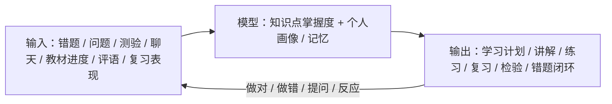

# 概念产品：呦鹿智伴 / DeerMind

**版本：v0.3.8**（定位重构：掌握度驱动的 AI 高效辅导助手）
**创建日期：2026年8月22日**（v0.3.8 更新：2026年8月23日）
**作者：创始人 + 产品顾问**

> **v0.3 主要修订说明（本次为定位重构）**
> 1. **定位升级**：从"数学错题闭环工具" → "**掌握度驱动的 AI 高效辅导助手**"——错题不是全部，只是最重要的"掌握度信号"之一
> 2. **确立核心闭环（学习引擎）**：输入（错题/测验/教材/评语/聊天）→ 掌握度模型 → 输出（计划/讲解/复习/检验）→ 反馈 → 再入输入，越用越懂
> 3. **聊天成为交互主通道**：互动为核心，聊天是核心中的核心；Agent 主动引导，固化功能并存
> 4. **能力集重构**：预置"讲知识点 / 讲题 / 复习 / 检验"4 项 + 错题闭环 + 读题训练，全部经聊天唤醒；系统主动能力（摸底 / 规划 / 提醒）
> 5. **引入科学教学策略**：遗忘曲线（间隔复习）+ **费曼学习法**（重要知识点让孩子讲一遍，结构化自述 + 要点核对）
> 6. **确立"减负"核心价值观**：掌握即止、能不用就不用；成功指标改为减负导向
> 7. 保留既有决策：**三端形态**（孩子端聊天优先 / 家长端功能可开关 / **管理员 Web 后台**）、学习空间与范围护栏、防沉迷

---

## 1. 产品概述

### 1.1 一句话定义

呦鹿智伴是一款**为女儿（六年级）量身打造、为减负而生的 AI 数学辅导助手**：通过持续聊天与多元输入（错题、测验、教材、评语、对话）建立孩子的**知识点掌握度模型**，据此精准安排讲解、练习、复习与检验——**一旦判定掌握就果断不再占用时间**，用最少时间帮她把不牢的知识点真正学牢。

### 1.2 产品定位（本阶段）

- **当前：私人工具。** 唯一用户是创始人的女儿，核心目标是把"掌握度驱动 + 聊天互动 + 减负"这一件事验证做透。
- **定位本质**：不是"错题工具"，不是"通用聊天机器人"，而是**懂孩子的 AI 辅导助手**——以掌握度模型为核心，以聊天为核心互动。
- **远期（非本阶段）：** 若验证有效，再评估产品化；商业化、监管、竞品策略均不在本阶段决策。

### 1.3 产品愿景（私人版）

让女儿拥有一位懂她、陪她、**帮她花最少时间把不牢的知识点学牢**的 AI 学伴——把时间还给孩子。

### 1.4 Slogan

"呦鹿智伴，知你所短，伴你所长。"

---

## 2. 核心模型：学习引擎（产品骨架）

产品不是"功能清单"，而是一个**学习闭环引擎**：**输入 → 模型 → 输出 → 反馈 → 再次成为输入**。

### 2.1 闭环结构



### 2.2 多元输入（错题不是全部）

| 输入 | 采集方式 | 作用 |
|---|---|---|
| 聊天提问 | 孩子自然提问（语音/文字） | 最主动的学习信号 |
| 错题（拍照） | 拍照 → OCR → 归因 | 最重要的客观薄弱信号 |
| 测验/考试 | 拍照成绩单（可选） | 整体水平校验 |
| 教材与进度 | 一次性配置 + Agent 询问 | 学习范围（护栏） |
| 老师评语/家长观察 | 家长录入（可选） | 补充背景信息 |
| 复习表现 | 状态机自动记录 | 掌握持久性验证 |

### 2.3 掌握度模型（核心资产）

- 知识图谱 + 掌握度状态机 + 记忆/画像，构成"懂孩子"的底座
- 所有输入都用于更新模型；所有输出都由模型驱动
- 模型越准 → 输出越省时 → 越懂孩子、越少占用孩子时间

### 2.4 反馈闭环

- 孩子对每个输出的反应（做对/做错/提问/讲解后反馈）再次作为输入
- **每转一圈，模型更准一层，输出的针对性更强**——"越用越懂，越懂越省时"

---

## 3. 目标用户（本阶段）

- **唯一核心用户：创始人女儿**（2026 秋季升入六年级，Pad 为主）
- **间接用户：创始人夫妇**——只承担一次性配置与低频查看，日常零投入
- **运营者：创始人本人（管理员）**——通过 Web 后台维护内容与配置、监控成本与数据质量（孩子/家长不可见）
- 本阶段不做其他用户假设；扩展用户（小学 4–6 年级、初中、英语、语文）写入"远期展望"

---

## 4. 核心交互原则

### 4.1 互动为核心，聊天是核心中的核心

- 整个 App 以"互动"为核心；**聊天是核心中的核心**
- 孩子端首页 = "今日任务引导 + 大对话区"：任务卡给结构，对话给自由
- 孩子随时可以插入提问；固化功能（错题 / 进度 / 复习 / 设置）依然存在

### 4.2 Agent 主动引导（不是被动问答）

- Agent 通过聊天**主动发起**：主动建议学什么、主动出题检验、到点提醒复习、发现薄弱主动讲解
- **掌握即止的主动提示**：模型若判定某知识点已掌握（含长期掌握），同样**主动提示"这个已经会了，不用再花时间"**——主动引导不只"多学"，更包括"少学"，把时间还给孩子
- **信任输入假设（软件有效运行的基础）**：产品**充分信任所有输入都是真实的**——孩子如实作答与反馈、错题真实、家长录入可靠；不设防作弊机制。信任是"掌握度模型准确、从而减负"的前提；若输入失真，模型也会通过归因对话、检验与间隔复习交叉验证，逐步自我修正
- 防止"孩子不问就没用"；引导孩子多与小鹿聊天

### 4.3 聊天边界（不是通用聊天）

- 允许：当前学习空间范围内的知识讲解、题目、方法、复习、检验，及基于教材范围的延伸
- 无关话题（闲聊/娱乐）：**友好拉回学习**——简单回应但引导回正题，不硬拒、不扩展话题
- 范围护栏仍有效：知识点存在性来自教材，讲解以教材为权威、可生成式展开

### 4.4 固化功能并存

- 今日任务、错题闭环、间隔复习、进度画像、家长报告等结构化功能保留
- 与聊天互为表里：结构化页面负责"高效与可视化"，聊天负责"自然与个性化"

---

## 5. 能力集（技能，经聊天唤醒）

### 5.1 孩子主动技能（MVP 预置 6 项）

| 技能 | 触发示例 | 说明 |
|---|---|---|
| 讲知识点 | "分数乘法我不太懂，讲讲" | 绑定教材 + 多角度 + TTS |
| 讲题 | "这题我不会" / 拍照问 | 先归因后讲解、引导式 |
| 复习 | "帮我复习下分数" | 走间隔复习计划 |
| 检验 | "考考我分数乘法" | 客观题检测（见 §5.3） |
| 错题闭环 | 拍照错题 | 归因 → 讲解 → 变式 → 复习 |
| 读题训练 | 应用题读不懂 | 圈信息 → 复述 → 数量关系 |

### 5.2 系统主动能力（Agent 发起，非孩子技能）

- **摸底**（冷启动）：首用建立初始画像
- **今日规划**：依据掌握度生成"今天该学什么"（最省时方案）
- **主动提醒**：间隔复习到点、异常薄弱提醒

### 5.3 科学教学策略（内置，不是"我觉得"）

- **遗忘曲线 → 间隔复习**（1/3/7/14 天）：已有
- **费曼学习法 → "讲给小鹿听"**：对**重要知识点/原理**，要求孩子用自己的话讲一遍
  - 落地方式：**结构化自述 + 要点核对**——孩子分步骤讲，Agent 按该知识点关键要点清单逐条核对，用客观要点比对替代自由文本深度评判（控制技术风险）
- 可扩展：主动回忆、分散练习、交错练习（作为"学习策略"能力）

---

## 6. 错题闭环（重点技能，非唯一主线）

错题闭环从"唯一主线"调整为 **"掌握度信号的重要来源 + 重点辅导技能"**：

```
拍照错题 → OCR 归类 → 归因对话（粗心/概念不清/审题失误/思路混乱）
  → 针对性处理（讲解 / 检查训练 / 读题训练）
  → 变式验收（三不变一变）→ 短期掌握
  → 间隔复习 → 长期掌握 → 错题画像沉淀
```

- **归因对话**：2–3 追问区分"粗心 vs 概念不清"（最核心创新）
- **读题训练**：应用题专项（圈信息 → 复述 → 数量关系）
- **检验**：客观题判定 + 重要知识点用费曼法（§5.3）

---

## 7. 教育模型

### 7.1 掌握度状态机

- **只作用于"被追踪的知识点"**（出现反证/介入证据才追踪：错题、摸底/检验暴露薄弱、主动要求、前置薄弱）
- **未追踪（状态机之外，默认）**：无记录、软件不介入，**逻辑上可视为已掌握（默认信任）**——孩子无需向软件"证明"自己会（减负；今日规划只从追踪集生成，未追踪不推送）

```
学习中 → 短期掌握 → 长期掌握
   ↑        │
   └────────┘（变式/复习未通过 → 回退学习中）
```

- **短期掌握**：变式/检验当天通过
- **长期掌握**：至少一次间隔复习通过（1/3/7/14 天后仍通过）——**只有长期掌握才算真正学会**
- **减负语义**：长期掌握的知识点不再占用时间（除非遗忘回退）；未追踪知识点默认信任、不推送

### 7.2 前置依赖知识图谱（MVP 简化版）

- **基础资产**：知识点库（版本无关、去年级化本体）+ 教材库（章节目录 + 原文，讲解权威来源）+ 映射（教材目录 ↔ 知识点，多对多，年级/册在映射）；学习空间绑定教材后经映射派生出**知识点集**（该空间"能教什么"= 范围护栏），追踪集 ⊆ 知识点集
- 只为女儿当前年级数学核心章节建立前置依赖（如 分数乘法 ← 分数意义 ← 整数乘法）
- 诊断到薄弱点先查前置；前置弱则先补前置，避免治标不治本

### 7.3 记忆 / 画像

- 全量对话持久化，定期提炼记忆（事实 / 偏好 / 状态）
- 记忆进入模型上下文，支撑"越用越懂"；**记忆为底层模型数据，孩子/家长端不可见**
- **记忆分域**：空间级记忆生命周期随学习空间；学生级记忆生命周期随学生账号
- **删除语义**：家长"删除全部数据"对记忆为**逻辑删除（软删，物理保留，供数据挖掘与诊断）**；彻底删除由管理员后台治理（满足监护人删除权）

### 7.4 学习空间与范围护栏

- 学习空间 = 按学期/任务隔离的**学习完整上下文容器**（教材、知识点范围、进度、聊天与考察记录、错题、材料录入、掌握度模型），系统在空间内辅导
- 知识点存在性来自教材；超进度软提醒 + 分支引导（提前学 / 先放着），不硬阻断

---

## 8. 设计红线

**红线〇（新增）：减负**
- **掌握即止**：模型判定已掌握就不再安排；"能不用就尽量不用"
- 产品成功 = 帮孩子用最少时间达到掌握，而不是占用更多时间

**红线一：家长零强制投入**（默认零录入，可选增强；任何"不录入就退化"的功能是设计缺陷）

**红线二：教育结论必须严谨**（禁止"一次做对 = 已掌握"；掌握度必须是状态机；讲解绑定教材来源）

**红线三：低风险技术优先**（费曼用"结构化自述 + 要点核对"，不赌 LLM 主观评判）

**红线四：产品自己跑 + 家长功能可开关**（周报 / 日报 / 告警 / 错题详情 / 录入等均为独立开关、默认克制、打开即用；任何功能不开都不影响孩子端独立运转）

---

## 9. 成功指标（减负导向）

### 9.1 核心指标（学习成效 + 效率）

| 指标 | 目标 | 度量方式 |
|---|---|---|
| 同知识点再犯率下降 | 间隔复习通过率 ≥ 80% | 状态机 |
| 掌握效率 | 单位时间内解决薄弱点数量 | 自动统计 |
| 薄弱点清零周期 | 从发现到长期掌握的周期持续缩短 | 状态机 |
| 讲解 / 练习有效性 | 讲解后首答正确率 ≥ 70% | 自动统计 |
| 读题训练有效性 | 训练后重做通过率 ≥ 80% | 自动统计 |

### 9.2 减负相关指标

- **孩子主观负担**：定期轻量问卷（累不累、愿不愿意继续用）达标
- **单次会话时长**：15–30 分钟以内（不追求更长）
- **家长耗时**：每周 ≤ 5 分钟查看

### 9.3 辅助指标

- 每周主动使用天数 ≥ 4 天（仅作参与度参考，使用由"需要"驱动，不与减负冲突）

> 注：与 v0.2 的差异——不再把"使用时长 / 留存"当作首要成功标准，改为"掌握质量 + 时间效率 + 主观负担"。

---

## 10. 交互设计

### 10.1 孩子端（聊天优先，Pad 为主）

- 首页 = "今日任务引导 + 大对话区"：任务卡 + 随时可问的小鹿
- 小鹿虚拟形象，鼓励式、不评判；25 分钟防沉迷 + 休息
- 可中断恢复；按需短时使用（减负）

### 10.2 家长端（功能可开关，默认克制）

- **不做参与度分档**：各项功能独立开关、想开就开——周报（默认开）、日报、异常告警、错题详情、家长录入；**想看就看、想录入就录入，全凭自愿、零强制**
- 打开即用、无 PIN；可选启动锁按需添加；数据可导出 / 删除

### 10.3 管理员端（Web 后台，创始人专用）

- 仅创始人本人使用，PC 浏览器访问，简单账号登录（独立于孩子/家长端，不接触日常学习界面）
- **职能四块**：① 数据看板（掌握度、会话、成本总览）；② 内容管理（知识点、教材映射、题库、费曼要点清单）；③ 规则配置（归因决策树、变式自检、系统提示词版本）；④ 数据治理（错题、记忆、对话记录查看与修正）
- 定位："**后台越透明、越可配置，前端越省时、越减负**"——内容与规则维护集中到后台，避免把复杂度塞给孩子/家长端

---

## 11. 技术架构（MVP 务实版）

- **前端（三端）**：`app_child`（Flutter 孩子端，聊天优先 / Pad 优先）+ `app_parent`（Flutter 家长端，手机优先）+ `admin_web`（管理员 Web 后台，Vue3/Vite，PC 浏览器访问）；Android 侧载 APK，不上应用商店
- **后端**：轻量云服务器（2C4G）；DeepSeek API
- **核心运行时**：
  - **意图路由 / 技能调度**：把聊天意图映射到 6 项技能，并注入上下文（学习空间、进度、掌握度、记忆）
  - **掌握度引擎**：状态机 / 知识图谱 / 记忆，作为中央模型
  - 轻量 RAG（教材，绑定讲解来源；**知识点锚定结构化查找 + BM25 兜底，语义层由 LLM 意图路由承担，不引入向量库**）+ OCR（错题拍照）
- **数据**：PostgreSQL/MySQL + 对象存储；MVP 不引入向量库
- **语音**：ASR（提问 / 费曼自述）+ TTS（讲解朗读），月度熔断

---

## 12. 里程碑（独立开发、业余时间）

| 阶段 | 周期 | 目标 |
|---|---|---|
| 0 对话原型 | 第 1–2 周 | 聊天界面 + 意图路由 + 讲知识点 / 讲题（文字）跑通 |
| 1 掌握度引擎 | 第 3–6 周 | 学习空间 + 掌握度状态机 + 知识点图谱（当前章节）+ 记忆框架 |
| 2 核心技能 | 第 7–10 周 | 复习 + 检验（客观题）+ 错题闭环（拍照→归因→变式）+ 读题训练 |
| 3 主动与减负 | 第 11–12 周 | Agent 主动规划 / 提醒 + 费曼（结构化自述 + 要点核对）+ 防沉迷 |
| 4 家长端 + 后台 | 第 13–14 周 | 独立家长端 App：日报 / 周报 / 录入 / 设置；管理员 Web 后台：数据 / 成本 / 内容管理 |
| 5 实学验证 | 第 15–20 周 | 女儿真实使用 ≥ 6 周，迭代掌握度准确率与讲解质量 |
| 6 扩展 | 之后 | 更多知识点 → 语音增强 → 英语 → 评估商业化 |

---

## 13. 风险与应对

| 风险 | 应对 |
|---|---|
| 孩子不知道问什么 / 不主动 | Agent 主动发起（建议 / 检验 / 提醒）；任务卡引导 |
| 聊天被当答案机器 | 先归因后讲解；限制直接给答案；引导先自己讲 |
| LLM 讲解错误被内化 | 讲解绑定教材来源；多角度；间隔复习暴露纠正 |
| 费曼自述评判不可靠 | 结构化自述 + 要点清单核对（客观比对） |
| 范围护栏失效（聊到教材外） | 意图路由校验 + 超进度软提醒 |
| 减负变成"少用导致低效" | 以"掌握质量 + 效率"为核心指标衡量，而非使用时长 |
| 成本失控 | 低成本模型 + 月度熔断 |
| 未成年人隐私 | 最小收集、加密、家长导出删除、监护人同意 |

---

## 14. 关键成功要素

1. **掌握度模型准**：归因 / 检验 / 复习共同校准，模型越准越省时
2. **聊天体验自然**：Agent 主动、有温度、边界清晰
3. **减负说到做到**：掌握即止，孩子和家长都感受得到"省时间"
4. **能力唤醒顺滑**：意图路由准，孩子想说就能说
5. **科学方法落地**：遗忘曲线 + 费曼结构化核对
6. **家长零负担**：默认零操作 + 功能按需开关

---

## 15. 远期展望（非本阶段决策）

- **商业化**：若验证有效，再评估订阅 / 免费+增值 / 机构版（本阶段不决策）
- **学科扩展**：英语语法纠错、语文
- **用户扩展**：小学 4–6 年级、初中
- **家庭模型**：一个家庭多家长、多孩子（当前 MVP 简化为"一个家长对应多个孩子"）
- **合规**：若走向商业化，需单独评估《未成年人网络保护条例》与学科培训监管

---

**版本说明**

- v0.1（2026-08-22）：初版概念
- v0.2（2026-08-22）：产品经理评审后重写——定位收敛为私人工具、MVP 聚焦数学错题闭环、"家长零录入"红线、教育模型严谨化、指标以学习成效为核心、里程碑务实化
- v0.2.1（2026-08-22）：前端定型——孩子端直接采用 Flutter 独立 App，不上应用商店（Android 侧载 APK / iOS TestFlight）；家长端网页为主
- v0.2.2（2026-08-22）：读题训练（应用题专项）纳入 MVP
- v0.2.3（2026-08-22）：家长参与度分档（低 / 中 / 高）
- v0.2.4（2026-08-22）：家长端定为微信小程序（后改为 App）
- v0.2.5（2026-08-22）：家长端改为 App 家长模式（后拆分）
- v0.2.6（2026-08-23）：独立双端——孩子端与家长端拆分为两个独立 App，均响应式
- v0.2.7（2026-08-23）：移除"家长模式/PIN"概念——家长端独立 App 打开即用
- v0.3.0（2026-08-23）：**定位重构**——错题闭环工具 → 掌握度驱动的 AI 高效辅导助手；确立"输入→模型→输出→反馈"学习引擎；聊天成为交互主通道（Agent 主动）；能力集重构（6 项技能经聊天唤醒）；引入费曼学习法；确立减负核心价值观与减负导向指标；里程碑重排为"对话 + 掌握度引擎"优先
- v0.3.1（2026-08-23）：§4.2 补充"掌握即止的主动提示 + 信任输入假设"（信任所有输入真实，是模型有效运行的基础）；移除家长参与度三档，改为功能独立开关、默认克制
- v0.3.2（2026-08-23）：确立**三端形态**——孩子端 / 家长端 / **管理员 Web 后台**（数据看板、成本监控、内容与规则管理、数据治理，创始人专用）
- v0.3.3（2026-08-23）：引入**家庭概念**——MVP 简化为"一个家长账号对应多个孩子"；多家长 / 多孩子家庭为远期扩展
- v0.3.4（2026-08-23）：**记忆可见性修正**——记忆定位为底层模型数据，孩子/家长端不可见，家长仅随"删除全部数据"整体清除，查看/修正/删除由管理员后台治理
- v0.3.5（2026-08-23）：§7.4 学习空间定义修正——学习空间为**学习完整上下文容器**（含教材/知识点/进度/聊天与考察记录/错题/材料录入/掌握度模型）
- v0.3.6（2026-08-23）：§7.1 掌握度状态机重构——去掉"未接触"态；状态机只作用于"被追踪的知识点"（追踪集），未追踪 = 默认信任（逻辑上视为已掌握）；进入追踪靠反证（错题/摸底或检验答错/主动要求/前置薄弱）；今日规划/提醒只从追踪集生成
- v0.3.7（2026-08-23）：§7.3 记忆细化——**记忆分域**（空间级记忆随学习空间、学生级记忆随学生账号）；家长删除 = **逻辑删除**（物理保留供数据挖掘与诊断），彻底删除由管理员后台治理
- v0.3.8（2026-08-23）：§7.2 补充**基础资产**——知识点库（去年级化）/ 教材库 / 映射（多对多）/ 知识点集（空间级派生 = 范围护栏，追踪集 ⊆ 知识点集）