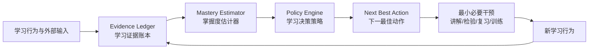
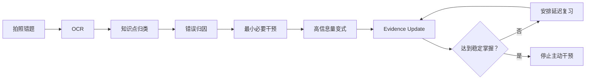
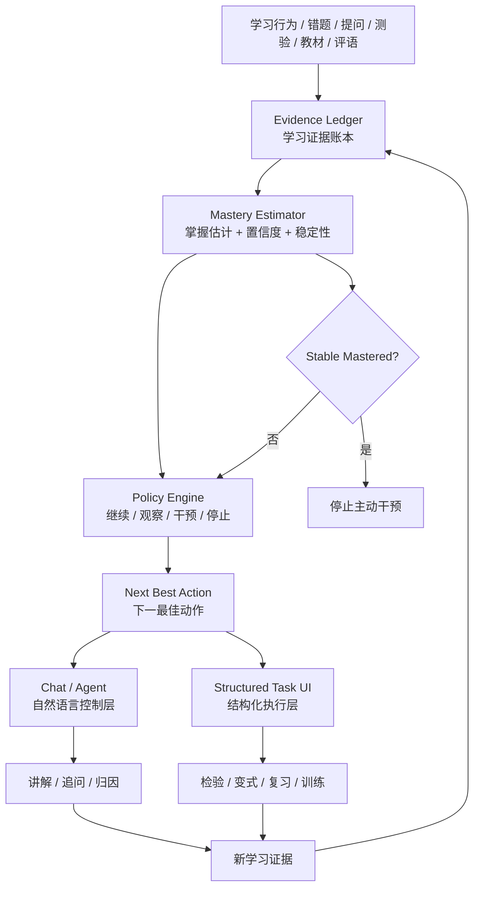

# 概念产品：呦鹿智伴 / DeerMind

**版本：v0.4.0**  
**版本主题：从“掌握度驱动的 AI 辅导”升级为“证据驱动的学习决策引擎”**  
**创建日期：2026-08-22**  
**v0.4.0 更新：2026-08-23**  
**作者：创始人 + 产品顾问**

> **v0.4.0 核心重构说明**
>
> 1. 产品核心从“掌握度状态机”升级为 **Evidence Ledger（学习证据账本） + Mastery Estimator（掌握度估计器） + Next Best Action（下一最佳动作） + Attention Budget（注意力预算）**。
> 2. **“未追踪 ≠ 已掌握”**：系统不要求孩子证明所有知识点，但也不把“没有证据”误当成“已经掌握”。未被证实薄弱的知识点默认保持静默，不主动干预。
> 3. “掌握度”从离散状态升级为**证据驱动的掌握估计**：系统记录证据、评估置信度、动态更新，而不是单纯根据一次对错切换状态。
> 4. **减负从产品口号升级为决策算法原则**：只有当继续学习的预期收益高于时间与注意力成本时，系统才主动介入。
> 5. **Agent 不以“多说、多练、多提醒”为成功**，而以“在正确时机采取最小必要干预”为成功；AI 的最优行为可能是“闭嘴、结束、不要再占用孩子时间”。
> 6. Chat 定位从“唯一交互载体”调整为 **Learning Engine 的自然语言控制层（Control Plane）**；复杂答题、OCR、检验、复习等使用结构化任务界面作为执行层（Execution Plane）。
> 7. 所有掌握度变化必须能够回答：**“为什么系统认为孩子会了？”**；所有主动行为必须能够回答：**“为什么现在值得打扰孩子？”**。
> 8. 家长零强制投入、学习空间、范围护栏、三端形态、未成年人最小收集与删除权等既有决策继续保留。

---

## 1. 产品概述

### 1.1 一句话定义

呦鹿智伴是一款**为女儿量身打造、为减负而生的 AI 数学学习决策助手**：持续采集错题、测验、提问、对话、复习表现等学习证据，估计孩子对知识点的掌握程度与置信度，并决定**现在是否需要干预、需要什么干预、做到什么程度可以停止**——帮助孩子用最少的有效时间把真正不牢的知识学牢。

### 1.2 产品定位

**当前：私人学习实验工具。**

唯一核心用户是创始人的女儿。产品的第一目标不是验证商业模式，也不是追求功能完整，而是验证一件事情：

> **DeerMind 能否比“自己刷题 + 普通 AI 问答 + 传统错题整理”更快地发现真正薄弱的知识点，并用更少时间把它稳定掌握？**

产品本质不是：

- 错题本；
- AI 聊天机器人；
- 刷题系统；
- 陪伴型 AI；
- 传统 AI 家教的聊天包装。

产品本质是：

> **一个证据驱动、以最小干预为目标的学习决策引擎。**

### 1.3 核心价值主张

传统学习软件回答：

> “接下来应该多学什么？”

DeerMind 更关注：

> **“孩子现在还值得花时间学什么？”**

进一步：

> **“为了确认她真的会了，还缺哪一种最有价值的证据？”**

最终：

> **“证据足够后，立即停止，不再占用时间。”**

### 1.4 产品愿景

让女儿拥有一位真正“懂她”的 AI 学伴：

- 知道她哪里可能不会；
- 知道为什么可能不会；
- 知道下一步最值得做什么；
- 知道什么时候已经够了；
- **更重要的是，知道什么时候应该闭嘴。**

把时间还给孩子。

### 1.5 Slogan

> **呦鹿智伴，知你所短，伴你所长。**

产品内核可进一步凝练为：

> **少学一点，但学得更牢。**

---

# 2. 产品核心：学习决策引擎

DeerMind 不是“功能集合”，而是一套连续运行的学习决策闭环：



整个系统始终回答三个问题：

### Q1：孩子现在对这个知识点“多大概率真的会”？

由 **Mastery Estimator** 回答。

### Q2：现在最有价值的下一步是什么？

由 **Policy Engine / Next Best Action** 回答。

### Q3：什么时候可以停止？

由 **Mastery Threshold + Attention Budget + Stop Policy** 回答。

---

# 3. 四个核心资产

v0.4.0 的核心资产不再只是“知识点 + 掌握度”，而是四层结构。

## 3.1 Evidence Ledger：学习证据账本

所有学习事件都留下结构化证据。

示例：

| 证据事件 | 示例 | 价值 |
|---|---|---|
| `QuestionAsked` | “分数乘法为什么这样算？” | 主动暴露认知缺口 |
| `ProblemAnswered` | 独立完成基础题 | 行为证据 |
| `ErrorDetected` | 计算结果错误 | 反证 |
| `ReasonAttributed` | 概念不清 / 审题失误 | 错误机制 |
| `HintUsed` | 使用一次提示后完成 | 降低证据强度 |
| `VariationPassed` | 变式题通过 | 迁移证据 |
| `DelayedRecallPassed` | 3 天后独立通过 | 保持证据 |
| `TeachBackCompleted` | “讲给小鹿听” | 自我解释证据 |
| `ReviewFailed` | 间隔复习失败 | 遗忘反证 |
| `MasteryChanged` | 掌握估计变化 | 模型事件 |

核心原则：

> **LLM 可以理解、归因、生成，但不能直接凭一句话修改掌握度。**

掌握度更新必须基于结构化 Evidence Event。

---

## 3.2 Mastery Estimator：掌握度估计器

“掌握度”不再被理解为一个客观真值，而是：

> **系统根据当前证据，对孩子在独立、迁移和延迟条件下能够正确调用该知识的概率估计。**

核心属性至少包括：

```text
mastery_estimate      掌握估计
confidence             估计置信度
stability              稳定性
last_evidence_at       最近有效证据时间
next_review_at         建议下次复习时间
state                  对外简化状态
```

### 掌握度不是二元值

不能使用：

```text
做对一次 = 掌握
做错一次 = 不会
```

而应该是：

```text
证据 → 权重 → 掌握估计 → 置信度 → 决策
```

### 证据权重原则

不同证据的信息量不同。

例如：

| 证据 | 默认信息价值 |
|---|---:|
| “我会了” | 低 |
| 单道题正确 | 低～中 |
| 独立变式题正确 | 中 |
| 跨题型迁移成功 | 中～高 |
| 延迟独立检索成功 | 高 |
| 多次间隔成功 | 很高 |
| 一次错误 | 高价值反证，但需结合错误归因 |

这意味着：

> **系统不怀疑孩子，但也不把任何单一输入视为充分证据。**

这是“信任输入”的正确工程实现。

---

## 3.3 Next Best Action：下一最佳动作

系统的最终输出不是一个掌握度数字，而是：

> **现在最值得做什么。**

可能的动作：

```text
DO_NOTHING       不干预
OBSERVE          保持观察
EXPLAIN          讲解
ASK              追问
PRACTICE         给一题高信息量练习
VERIFY           检验
REVIEW           间隔复习
TEACH_BACK       结构化自述
READ_TRAINING    读题训练
END_SESSION      结束当前学习
```

决策目标不是“最大化练习量”，而是：

> **用最小时间获得最大的信息增益或学习收益。**

---

## 3.4 Attention Budget：注意力预算

孩子的时间和注意力是有限资源。

因此主动 Agent 必须受到预算约束。

### 基本原则

- 每日主动干预有上限；
- 一个知识点短时间内主动提醒有上限；
- 孩子主动结束后，不重复打扰；
- 已长期掌握的知识点默认静默；
- 当前不存在高价值动作时，系统保持安静；
- 只有在“值得占用注意力”时才主动出现。

因此：

> **AI 的安静也是一种成功。**

---

# 4. 学习闭环

## 4.1 输入层：多元学习证据

| 输入 | 采集方式 | 主要作用 |
|---|---|---|
| 聊天提问 | 文字 / 语音 | 主动暴露问题与学习意图 |
| 错题 | 拍照 → OCR | 发现客观薄弱信号 |
| 测验 / 考试 | 拍照 / 手工录入 | 全局水平校验 |
| 教材与进度 | 配置 + Agent 询问 | 范围护栏与课程上下文 |
| 老师评语 | 家长可选录入 | 背景补充 |
| 家长观察 | 家长可选录入 | 行为与学习习惯补充 |
| 复习表现 | 自动记录 | 记忆保持验证 |
| 变式表现 | 自动记录 | 迁移验证 |
| Teach-back | 结构化自述 | 概念表达验证 |

错题仍然重要，但不再是唯一入口。

---

# 5. 学习状态模型

## 5.1 三层分离

DeerMind 必须严格区分：

### Layer A：Status

知识点当前处于什么阶段。

```text
UNKNOWN
LEARNING
SHORT_TERM_MASTERED
STABLE_MASTERED
```

### Layer B：Evidence

为什么认为它处于这个阶段。

### Layer C：Policy

基于当前证据，系统应该做什么。

因此：

> **状态是模型输出，证据是事实层，策略是行动层。**

三者不能混为一谈。

---

## 5.2 UNKNOWN 的正确语义

**UNKNOWN 不表示“不会”，也不表示“会”。**

它只表示：

> **目前证据不足，系统不知道。**

但是减负原则要求：

> 不知道 ≠ 必须立刻去验证。

因此对于没有反证的 UNKNOWN 知识点：

```text
不主动追踪
不主动练习
不主动提醒
不占今日任务
```

直到出现高价值触发：

- 错题；
- 摸底暴露薄弱；
- 检验失败；
- 孩子主动求助；
- 前置知识点薄弱；
- 老师 / 家长提供可靠背景信号。

这实现：

> **不强迫孩子证明自己会，但也不把未知伪装成已掌握。**

---

## 5.3 掌握阶段

### UNKNOWN

没有足够证据判断。

### LEARNING

存在反证或明显学习需求，需要干预。

### SHORT_TERM_MASTERED

即时理解与变式已经通过，但稳定性证据不足。

### STABLE_MASTERED

已获得足够的延迟、独立和迁移证据，系统允许停止主动干预。

### “长期掌握”的定义

不能简单定义成：

> 一次间隔复习通过。

更合理的 MVP 判定是：

```text
即时变式成功
+
至少一次延迟独立检索成功
+
至少一次高价值迁移 / 不同情境成功
+
近期没有强反证
```

具体阈值后续通过真实使用数据校准。

---

# 6. 掌握度决策模型

## 6.1 核心思想

系统不问：

> “这个知识点做了多少题？”

系统问：

> **“为了放心地停止，我还缺什么证据？”**

例如：

```text
知识点：分数乘法

已有证据：
✓ 基础题独立通过
✓ 同类变式通过
✓ 3天后延迟检索通过

证据缺口：
? 应用题迁移能力

Next Best Action：
→ 只给 1 道高信息量应用题
```

而不是再出 10 道普通题。

---

## 6.2 以“信息增益”替代“题量”

每一次干预都应尽量回答一个明确问题：

```text
她是不是真的懂？
还是只会这个题型？

她是概念问题？
还是审题问题？

她现在会？
还是几天后仍然会？
```

因此，题目的价值不再由“难不难”定义，而由：

> **它能否显著减少系统对当前掌握状态的不确定性。**

---

# 7. 减负引擎

## 7.1 掌握即止

核心算法原则：

```text
继续学习的预期收益
        <
继续占用时间与注意力的成本

            ↓

        STOP
```

因此：

- 不为了“完成今日任务”继续出题；
- 不为了“增加使用时长”延长会话；
- 不为了“保持活跃”发送无意义提醒；
- 不为了“完整”要求重复证明已掌握内容。

## 7.2 最小必要干预

每个知识点默认追求：

> **最少的解释 + 最少的练习 + 最少的验证，达到足够置信度。**

这比“更多内容、更完整教学”更符合产品定位。

## 7.3 退出优先

当系统判断达到停止条件，应明确告诉孩子：

> “这个已经会了，不用再花时间练。”

或者：

> “今天没有需要你继续处理的数学问题，可以结束了。”

“结束”本身就是一个有效产品结果。

---

# 8. Agent 设计

## 8.1 Agent 不是聊天机器人

Agent 的核心职责不是不断回答，而是：

> **理解当前学习状态，并决定是否应该采取行动。**

Agent 运行在以下上下文中：

```text
学习空间
+
教材范围
+
知识点图谱
+
Evidence Ledger
+
Mastery Estimate
+
记忆 / 画像
+
Attention Budget
```

---

## 8.2 Chat = Control Plane

Chat 是孩子与学习引擎之间最自然的控制层。

例如：

```text
“我不会这道题。”
→ 讲题技能

“帮我复习分数。”
→ 复习技能

“考考我分数乘法。”
→ 检验技能

“这个题我为什么错？”
→ 错题归因
```

但 Chat 不承担所有执行。

---

## 8.3 Structured UI = Execution Plane

复杂任务使用结构化界面：

```text
Chat
 ↓
启动“检验”
 ↓
结构化答题卡
 ↓
提交答案
 ↓
自动记录 Evidence
 ↓
回到 Chat
```

适用场景：

- 多步骤数学题；
- OCR 题目确认；
- 选择 / 填空 / 判断；
- 复习队列；
- 知识点状态展示；
- 学习报告。

---

# 9. 能力集

## 9.1 学生主动技能

MVP 核心技能：

| 技能 | 作用 | 优先级 |
|---|---|---:|
| 讲题 | 归因后进行针对性讲解 | P0 |
| 错题归因 | 判断概念 / 审题 / 计算 / 思路等问题 | P0 |
| 变式验证 | 验证是否真正理解 | P0 |
| 间隔复习 | 验证延迟保持 | P0 |
| 知识点复习 | 以当前掌握状态组织复习 | P1 |
| 检验 | 获取结构化证据 | P1 |
| 读题训练 | 应用题语义理解专项 | P1 |
| Teach-back | 高价值知识点自我解释 | P1 |

---

## 9.2 系统主动能力

- 冷启动摸底；
- 今日学习决策；
- 高价值提醒；
- 间隔复习提醒；
- 掌握即止提示；
- 异常薄弱发现。

但所有主动能力都必须经过：

```text
是否值得打扰？
↓
Attention Budget
↓
是否存在高价值动作？
↓
否则：保持安静
```

---

# 10. 讲题与错题闭环



## 10.1 错误归因

目标不是“给错题打标签”，而是：

> **找到下一步最合适的干预方式。**

MVP 归因标签：

```text
概念不清
审题失误
数量关系不清
思路混乱
计算错误
表达错误
迁移失败
```

归因采用 2～3 次针对性追问，不追求一次准确分类。

---

# 11. Teach-back / 结构化自述

产品保留“讲给小鹿听”，但不把它当作神奇的“费曼学习法判定器”。

它是一种：

> **Retrieval + Self-explanation + Teach-back 验证机制。**

## 11.1 使用场景

只对：

- 高价值核心概念；
- 前置依赖关键节点；
- 多次错误的概念；
- 系统置信度不足的知识点；

使用，不作为所有知识点的固定流程。

## 11.2 结构化实施

```text
孩子讲述
 ↓
结构化拆解
 ↓
关键要点核对
 ↓
缺失要点识别
 ↓
局部追问
 ↓
Evidence Update
```

不让 LLM 直接判断：

> “这段话听起来是不是理解得很深？”

而是让系统核对：

```text
□ 核心定义
□ 适用条件
□ 操作步骤
□ 原理解释
□ 常见边界
```

---

# 12. 学习空间与知识范围

## 12.1 学习空间

学习空间是一个完整的学习上下文容器，包括：

- 学生；
- 学期 / 任务；
- 教材；
- 知识点范围；
- 前置依赖；
- Evidence Ledger；
- 掌握估计；
- 对话记录；
- 错题；
- 检验记录；
- 复习记录；
- 学习材料。

## 12.2 知识点本体与教材解耦

基础资产采用：

```text
Canonical Concept
        │
        ├── 教材 A 映射
        ├── 教材 B 映射
        └── 其他课程材料
```

即：

> **知识点本体与教材呈现方式分离。**

知识点库负责：

> “这个概念本身是什么。”

教材库负责：

> “当前课程如何教它、在什么章节出现。”

---

# 13. 前置依赖知识图谱

MVP 仅维护当前六年级数学核心章节中的关键前置关系。

例如：

```text
分数乘法
    ↑
分数意义
    ↑
整数乘法基础
```

当发现：

> “分数乘法不会”

系统先判断：

> 前置知识是否薄弱？

如果是：

> 先补前置，而不是直接重复练目标知识点。

### 知识点粒度原则

只有同时满足以下条件，才适合作为独立知识点：

1. 可以独立诊断；
2. 可以独立干预；
3. 可以独立验证；
4. 能产生稳定的 Evidence Event。

避免知识图谱过度细化。

---

# 14. 学习记忆与画像

## 14.1 记忆与学习状态分离

必须严格区分：

### Memory

记录：

- 偏好；
- 交互习惯；
- 稳定事实；
- 语言表达偏好。

### Learning State

记录：

- 掌握估计；
- Evidence；
- 最近错误；
- 复习状态；
- 知识点关系。

学习状态不能依赖普通 LLM Memory 作为唯一来源。

## 14.2 记忆分域

### 空间级记忆

生命周期随学习空间。

### 学生级记忆

生命周期随学生账号。

---

# 15. 家长端

## 15.1 核心原则

> **默认零操作，可选增强，任何不开启的功能都不能影响学生端独立运行。**

## 15.2 功能

- 周报；
- 日报；
- 异常告警；
- 错题详情；
- 可选学习背景录入；
- 数据导出；
- 删除数据。

所有功能独立开关。

## 15.3 家长端不追求“数据很多”

报告重点回答：

```text
最近真正解决了什么？
还有哪些值得关注？
系统为什么认为已经掌握？
孩子花了多少时间？
```

而不是：

```text
今天做了多少题？
今天用了多少分钟？
今天登录几次？
```

---

# 16. 管理员后台

管理员后台是开发和调试核心，不只是运营后台。

## 16.1 四大模块

### ① Evidence Debugger

查看：

- 知识点当前掌握估计；
- 所有相关 Evidence Event；
- 状态变化原因；
- Next Best Action；
- 最近干预。

核心问题：

> **“为什么系统会这样判断？”**

### ② 内容管理

- 知识点；
- 教材；
- 教材映射；
- 题库；
- 变式模板；
- Teach-back 要点清单。

### ③ 规则配置

- 错误归因决策树；
- Evidence 权重；
- 掌握阈值；
- 复习策略；
- Attention Budget；
- Prompt 版本。

### ④ 数据治理

- 对话记录；
- 错题；
- 记忆；
- Evidence Event；
- 手动修正；
- 数据导出 / 删除；
- 成本监控。

---

# 17. Chat / Agent / Learning Engine 架构边界

推荐采用三层结构：

```text
┌───────────────────────────────────┐
│          Chat / Agent Layer       │
│ 理解意图 / 对话 / 引导 / 生成      │
└────────────────┬──────────────────┘
                 │
                 ▼
┌───────────────────────────────────┐
│          Learning Engine          │
│ Evidence / Mastery / Policy       │
└────────────────┬──────────────────┘
                 │
                 ▼
┌───────────────────────────────────┐
│       Structured Data Layer       │
│ Concept / Curriculum / Event      │
└───────────────────────────────────┘
```

### LLM 负责

- 意图识别；
- 语言理解；
- 错误归因辅助；
- 解释生成；
- 追问生成；
- 对话组织。

### 规则 / 结构化引擎负责

- Evidence 记录；
- 掌握估计更新；
- 掌握阈值；
- 复习时间；
- Next Best Action；
- Attention Budget。

原则：

> **让 LLM 负责“理解和表达”，让确定性系统负责“状态和决策”。**

---

# 18. 技术架构（MVP 务实版）

## 18.1 前端

- `app_student`：Flutter，Pad 优先；聊天 + 结构化任务；Android 侧载 APK；
- `app_parent`：Flutter，手机优先；
- `admin_web`：Vue3 / Vite，PC 浏览器访问。

## 18.2 后端

- 轻量云服务器；
- PostgreSQL 优先；
- 对象存储；
- DeepSeek API；
- OCR；
- ASR / TTS 按需接入。

## 18.3 检索

MVP 不引入向量数据库。

采用：

```text
结构化知识点查找
+
教材章节映射
+
BM25 兜底
+
LLM 意图路由
```

如未来出现真正的语义检索瓶颈，再引入向量能力。

## 18.4 Evidence-first 数据模型

建议核心表至少包括：

```text
student
learning_space
concept
curriculum
concept_curriculum_map
evidence_event
mastery_snapshot
learning_action
review_schedule
problem
problem_attempt
memory
conversation
```

核心链路：

```text
evidence_event
      ↓
mastery_snapshot
      ↓
learning_action
      ↓
problem_attempt / conversation
      ↓
新的 evidence_event
```

---

# 19. 数学答案可靠性

数学辅导不能仅依赖 LLM 生成。

推荐加入轻量 Answer Verification Layer：

```text
LLM 生成解法
      ↓
数值 / 符号验证
      ↓
教材范围验证
      ↓
表达适龄性检查
      ↓
输出
```

尤其对：

- 运算结果；
- 方程；
- 分数；
- 几何计算；
- 多步骤推导；

优先使用确定性计算 / 规则验证。

原则：

> **LLM 可以负责讲清楚，但不能独自决定数学是否正确。**

---

# 20. 设计红线

## 红线一：减负优先

- 掌握即止；
- 无高价值动作时保持安静；
- 不追求使用时长；
- 不用刷题量衡量成功。

## 红线二：未知不等于掌握

- UNKNOWN 不是不会；
- UNKNOWN 也不是会；
- 没有反证时默认静默；
- 不要求孩子证明全部知识点。

## 红线三：任何掌握结论都必须有证据

禁止：

> 一次做对 = 已掌握。

必须能够回答：

> 为什么认为她会了？

## 红线四：LLM 不直接掌握状态

LLM 输出必须转化为结构化 Evidence，由学习引擎决定是否更新掌握。

## 红线五：低风险技术优先

- Teach-back 使用结构化要点核对；
- 数学答案使用确定性验证；
- 不用复杂模型替代可解释规则。

## 红线六：家长零强制投入

没有任何核心能力依赖家长持续录入。

## 红线七：孩子不是系统的“训练数据管理员”

不能让孩子为了帮助系统工作而承担额外录入负担。

---

# 21. 核心指标

## 21.1 Learning Quality

### 稳定掌握率

达到 Stable Mastered 后，在后续延迟检索中维持正确的比例。

### 再犯率

同一知识点在获得稳定掌握后再次出现高价值反证的比例。

### 掌握保持率

7 / 14 / 30 天延迟后独立通过率。

---

## 21.2 Efficiency

### Time-to-Stable-Mastery

从首次发现薄弱，到达到稳定掌握所需的有效学习时间。

### Evidence-to-Mastery

达到稳定掌握平均需要多少有效 Evidence Event。

### Intervention Efficiency

每次干预产生的有效掌握提升 / 信息增益。

---

## 21.3 Burden

### 单次任务时间

不设“越久越好”，而观察：

> 是否在最短合理时间内完成目标。

### 单次掌握交互成本

包括：

- 对话轮数；
- 题目数量；
- 提醒次数；
- 总耗时。

### 主观负担

轻量问卷：

- 累不累？
- 愿不愿意继续？
- 有没有觉得浪费时间？

---

## 21.4 Agent 质量

### False Intervention

本不需要干预，却被系统主动打扰的比例。

### False Stop

系统过早停止、之后很快暴露遗忘 / 未掌握的比例。

### Action Precision

系统推荐的下一最佳动作，被人工 / 结果验证认为“确实值得做”的比例。

### Quiet Success

没有发起额外干预、但知识状态稳定维持的比例。

这是 DeerMind 独特的“反参与度指标”。

---

# 22. 不应该成为核心 KPI 的指标

以下数据可以观察，但不作为核心成功标准：

- 日活；
- 使用时长；
- 会话长度；
- 每日题量；
- 登录次数；
- 消息数量；
- Agent 主动消息数量；
- 家长查看次数。

因为这些指标与“减负”可能天然冲突。

---

# 23. MVP 范围重新定义

## Phase 0：学习决策原型

只做：

- 聊天；
- 拍题；
- 讲题；
- 结构化 Evidence Event；
- 简单掌握估计；
- 变式验证。

目标：

> 验证“证据驱动学习闭环”是否成立。

---

## Phase 1：掌握引擎

加入：

- Learning Space；
- Concept；
- 教材映射；
- Evidence Ledger；
- Mastery Estimator；
- 基础复习计划；
- 管理后台 Evidence Debugger。

目标：

> 能解释每一次掌握度变化为什么发生。

---

## Phase 2：Next Best Action

加入：

- 检验；
- 变式选择；
- 间隔复习；
- 错题归因；
- 前置依赖；
- Stop Policy。

目标：

> 系统开始真正自主决定“下一步做什么”和“什么时候停”。

---

## Phase 3：Agent 与减负

加入：

- 主动提醒；
- Attention Budget；
- 今日规划；
- 掌握即止主动提示；
- Teach-back；
- 防沉迷。

目标：

> 验证“主动但不打扰”的 Agent 模式。

---

## Phase 4：家长端与完整后台

加入：

- 家长 App；
- 周报；
- 日报；
- 告警；
- 内容管理；
- 规则配置；
- 数据治理；
- 成本监控。

目标：

> 产品稳定运行，而不是扩大功能。

---

## Phase 5：真实学习验证

女儿真实使用至少 6 周，重点观察：

1. 掌握度判断是否可靠；
2. False Stop 是否可接受；
3. False Intervention 是否足够低；
4. Time-to-Stable-Mastery 是否持续下降；
5. 孩子是否认为“确实省时间”；
6. 家长是否真的可以做到低投入。

---

# 24. MVP 不做什么

为了保护核心验证，明确暂不做：

- 多学科；
- 多孩子复杂家庭模型；
- 完整社交；
- 游戏化积分；
- 排行榜；
- 连续打卡奖励；
- 复杂徽章系统；
- 大规模题库运营；
- 向量数据库；
- 自动生成大量学习内容；
- 复杂家长控制体系；
- 商业化体系。

原则：

> **任何不能直接帮助验证“更快达到稳定掌握”的功能，都延后。**

---

# 25. 关键风险与应对

| 风险 | 表现 | 应对 |
|---|---|---|
| False Stop | 过早判断掌握 | 增强延迟 / 迁移证据 |
| False Intervention | 明明会了还反复打扰 | Attention Budget + Stop Policy |
| LLM 讲解错误 | 错误知识被内化 | 教材约束 + 数学验证 |
| 掌握度漂移 | 历史状态不稳定 | Evidence-first + 可解释日志 |
| Agent 过度主动 | 成为“新班主任” | 注意力预算 |
| 题目刷量化 | 为 KPI 增加题量 | 用 Time-to-Mastery 取代题量 |
| 知识图谱过细 | 模型复杂、难维护 | 知识点粒度标准 |
| Memory 污染 | 错误偏好长期影响 | Memory / Learning State 分离 |
| 家长负担上升 | 需要持续录入 | 所有增强功能保持可选 |
| 数据删除问题 | 删除后仍被使用 | 删除后立即停止业务使用，并按生命周期物理清理 |
| 成本失控 | 过多 LLM 调用 | 规则优先、分层模型、月度熔断 |

---

# 26. 关键成功要素

1. **Evidence 可靠**：系统知道自己为什么这样判断。
2. **Mastery 可靠**：不因一次对错轻率改变结论。
3. **Next Best Action 准**：每次只做真正有价值的一步。
4. **Stop 准**：孩子已经会了，系统知道什么时候退出。
5. **Agent 克制**：主动但不骚扰。
6. **Chat 自然**：孩子想说什么，就能自然进入正确技能。
7. **结构化任务可靠**：复杂学习行为不被迫塞进聊天。
8. **数学正确**：LLM 讲解有确定性验证护栏。
9. **家长零负担**：产品自己跑起来。
10. **后台可解释**：所有重要决策都可追溯、可调试。

---

# 27. 产品哲学

DeerMind 与传统学习软件最根本的区别，不是用了 AI，而是采用了不同的学习哲学：

### 传统系统

```text
学习 → 多练 → 多复习 → 多使用
```

### DeerMind

```text
发现需要
→ 获取最少必要证据
→ 采取最小必要干预
→ 再验证
→ 达到足够置信度
→ 停止
```

因此 DeerMind 不追求：

> **让孩子永远有任务。**

而追求：

> **让孩子尽可能少做不必要的任务。**

这是产品所有设计决策的最高层原则。

---

# 28. 产品最终抽象

DeerMind 最终不是一个“会聊天的 AI 家教”，而是一套：

> **Evidence → Mastery → Policy → Action → Verification → Stop**
>
> 的学习决策系统。

完整架构：



最终目标不是：

> “AI 帮孩子学得更多。”

而是：

> **“AI 帮孩子更早知道：什么值得学，为什么学，学到什么程度已经够了。”**

---

# 29. v0.4.0 版本结论

v0.4.0 不再把“掌握度”作为一个功能模块，而把它提升为整个系统的决策核心。

产品最重要的四个新概念是：

```text
Evidence Ledger
        ↓
Mastery Estimator
        ↓
Next Best Action
        ↓
Attention Budget
```

对应四个核心问题：

```text
我凭什么这么判断？
        ↓
她到底多大概率真的会？
        ↓
现在最值得做什么？
        ↓
什么时候应该停止？
```

如果这四个问题能够被稳定回答，DeerMind 的错题、讲题、复习、检验、读题、Teach-back、Agent、家长报告等能力都只是其上的具体实现。

**因此，下一阶段的核心不是继续增加“技能”，而是把 Evidence → Mastery → Action → Stop 这条链做准。**

---

# 30. 版本演进记录

- **v0.1（2026-08-22）**：初版概念。
- **v0.2（2026-08-22）**：定位收敛为私人工具；聚焦数学错题闭环；家长零录入；教育模型严谨化；学习成效优先。
- **v0.2.1（2026-08-22）**：学生端 Flutter 独立 App；不上应用商店。
- **v0.2.2（2026-08-22）**：读题训练纳入 MVP。
- **v0.2.3（2026-08-22）**：家长参与度分档。
- **v0.2.4（2026-08-22）**：家长端定为微信小程序。
- **v0.2.5（2026-08-22）**：家长端改为独立 App。
- **v0.2.6（2026-08-23）**：学生端 / 家长端双 App。
- **v0.2.7（2026-08-23）**：移除家长模式 / PIN。
- **v0.3.0（2026-08-23）**：定位重构——错题工具 → 掌握度驱动 AI 辅导；聊天成为主交互；引入 Agent 与费曼 / Teach-back；确立减负核心价值。
- **v0.3.1（2026-08-23）**：补充掌握即止主动提示与信任输入假设；取消家长参与度分档。
- **v0.3.2（2026-08-23）**：确立学生 / 家长 / 管理员 Web 三端形态。
- **v0.3.3（2026-08-23）**：引入家庭概念，MVP 简化为一个家长账号对应多个孩子。
- **v0.3.4（2026-08-23）**：记忆定位为底层模型数据，学生 / 家长端不可见。
- **v0.3.5（2026-08-23）**：学习空间升级为完整学习上下文容器。
- **v0.3.6（2026-08-23）**：掌握度状态机重构为“追踪集”，未追踪不主动介入。
- **v0.3.7（2026-08-23）**：记忆分域；家长删除语义细化。
- **v0.3.8（2026-08-23）**：补充知识点库 / 教材库 / 映射 / 知识点集基础资产。
- **v0.4.0（2026-08-23）**：**学习决策引擎重构**——引入 Evidence Ledger、Mastery Estimator、Next Best Action、Attention Budget；明确 UNKNOWN 不等于已掌握；掌握度由证据驱动；Chat 与结构化任务解耦；将“掌握即止”从价值观升级为决策原则。
